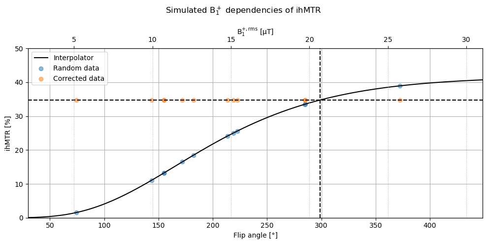
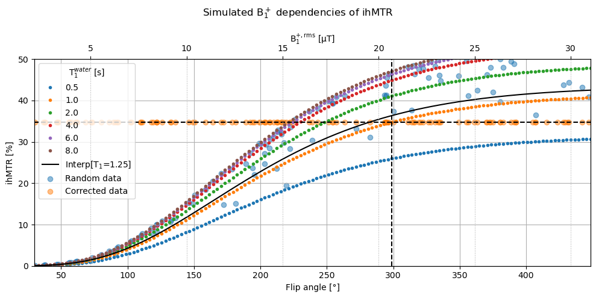
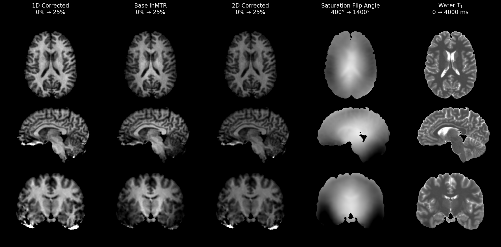
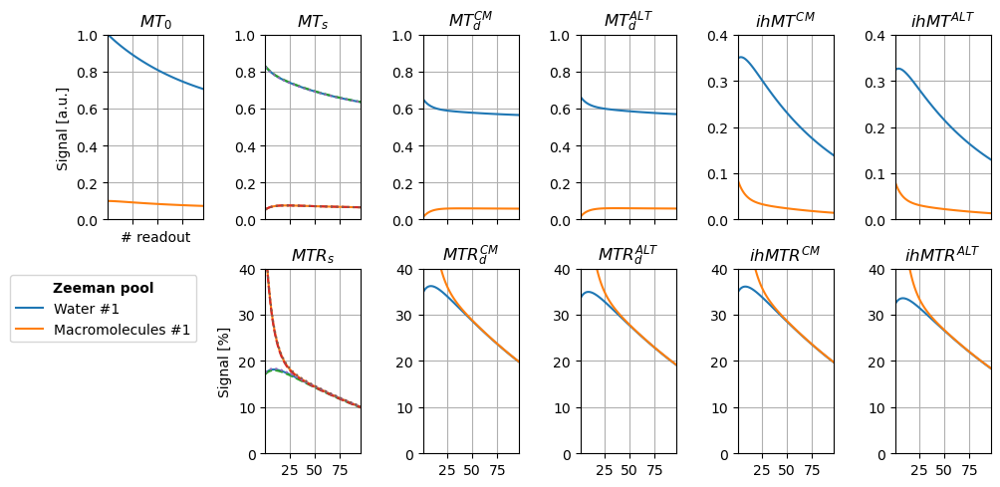
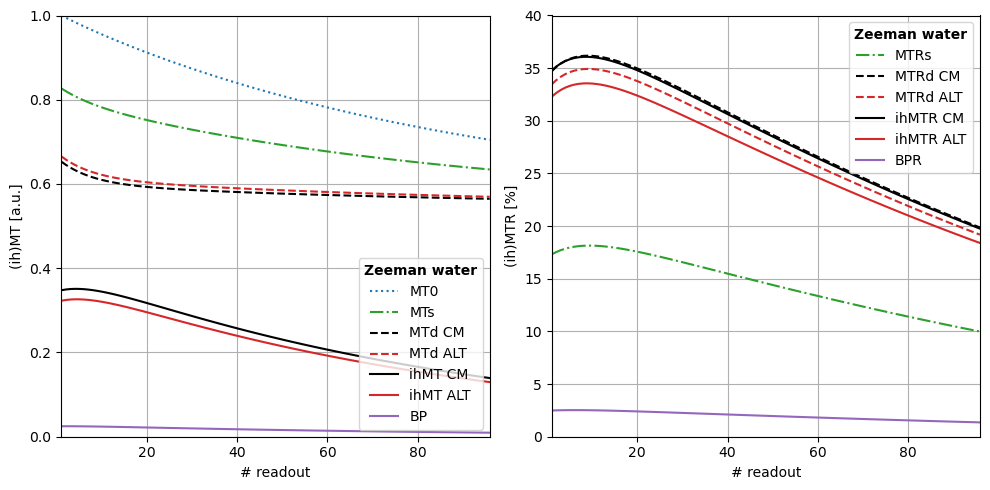

# **BrainHack 2026**

## Table of contents<a id='toc0_'></a>    

- [Setup](#toc2_)    
  - [Install](#toc2_1_)    
    - [For developers](#toc2_1_1_)    
    - [For users](#toc2_1_2_)    
    - [Optional](#toc2_1_3_)    
  - [Imports](#toc2_2_)    
  - [Overview](#toc2_3_)    
    - [Meta](#toc2_3_1_)    
      - [Signal](#toc2_3_1_1_)    
      - [CompositeDictionary](#toc2_3_1_2_)    
      - [Duration](#toc2_3_1_3_)    
      - [Frequency](#toc2_3_1_4_)    
      - [AngularFrequency](#toc2_3_1_5_)    
      - [Angle](#toc2_3_1_6_)    
    - [Pulse](#toc2_3_2_)    
    - [Sequence](#toc2_3_3_)    
    - [System](#toc2_3_4_)    
      - [Lineshapes](#toc2_3_4_1_)    
    - [Simulator](#toc2_3_5_)    
    - [Corrector](#toc2_3_6_)    
      - [InterpolantDictionary](#toc2_3_6_1_)    
    - [Trajector - WIP](#toc2_3_7_)    
- [Applications](#toc3_)    
  - [Simulating a single experiment](#toc3_1_)    
    - [Using the `brainhack.simulator.Simulator` class](#toc3_1_1_)    
    - [Using the `brainhack.run.SingleRun` function](#toc3_1_2_)    
      - [Hand parametrized](#toc3_1_2_1_)    
      - [Using a configuration object](#toc3_1_2_2_)    
      - [From the command line](#toc3_1_2_3_)    
    - [Example: Computing derivative maps: MT(s/d)R, ihMT, ihMTR, BP, BPR](#toc3_1_3_)    
      - [Manual Computation](#toc3_1_3_1_)    
      - [Using `brainhack.meta.CompositeSignal`](#toc3_1_3_2_)    
    - [Example: Computing steady-state signals at every readout](#toc3_1_4_)    
      - [Manual computation](#toc3_1_4_1_)    
      - [Using `brainhack.trajector.Trajector`](#toc3_1_4_2_)    
        - [Timing difference using `stable=True`](#toc3_1_4_2_1_)    
        - [Value difference using `stable=True`](#toc3_1_4_2_2_)    
    - [Example: Point Spread Function (PSF) - WIP](#toc3_1_5_)    
  - [Simulating many experiments](#toc3_2_)    
    - [Using the `brainhack.run.GridRuns` function](#toc3_2_1_)    
    - [Example: Computing derivative maps: MT(s/d)R, ihMT, ihMTR, BP, BPR](#toc3_2_2_)    
    - [Example: $\mathrm{B}_1^+$ correction](#toc3_2_3_)    
      - [Manual computation](#toc3_2_3_1_)    
      - [Using `brainhack.corrector.Corrector`](#toc3_2_3_2_)    
  - [Visualization](#toc3_3_)    
    - [Example: $\mathrm{B}_1^+$ correction](#toc3_3_1_)    
      - [1-Dim $\mathrm{B}_1^+$ correction](#toc3_3_1_1_)    
      - [N-Dim $\mathrm{B}_1^+$ correction](#toc3_3_1_2_)    
      - [Real-world data](#toc3_3_1_3_)    
    - [Example: Steady-state signal with respect to readout](#toc3_3_2_)    
    - [Exmple: PSF - WIP](#toc3_3_3_)    
  - [Advanced](#toc3_4_)    
    - [Sensivity analysis - WIP](#toc3_4_1_)    
      - [Using fixed parameter vectors](#toc3_4_1_1_)    
      - [Using distribution sampling](#toc3_4_1_2_)    
- [Additional Information](#toc4_)    
  - [Configuration files](#toc4_1_)    
    - [Default configurations](#toc4_1_1_)    
      - [3 Teslas](#toc4_1_1_1_)    
      - [7 Teslas](#toc4_1_1_2_)    
    - [Custom configurations](#toc4_1_2_)    
      - [In a live environment](#toc4_1_2_1_)    
      - [Stored on file](#toc4_1_2_2_)    
  - [Loggers](#toc4_2_)    
  - [The `brainhack.meta.CompositeDictionary` class](#toc4_3_)    
  - [Optimizing `brainhack.run.GridRuns` runtime](#toc4_4_)    
  - [Test suite](#toc4_5_)    
  - [Contributing new features - WIP](#toc4_6_)    
    - [Adding new modules](#toc4_6_1_)    
    - [Modifying existing modules](#toc4_6_2_)    
- [Notes](#toc5_)    
- [To do](#toc6_)    

<!-- vscode-jupyter-toc-config
	numbering=false
	anchor=true
	flat=false
	minLevel=1
	maxLevel=6
	/vscode-jupyter-toc-config -->
<!-- THIS CELL WILL BE REPLACED ON TOC UPDATE. DO NOT WRITE YOUR TEXT IN THIS CELL -->

# <a id='toc2_'></a>[Setup](#toc0_)

## <a id='toc2_1_'></a>[Install](#toc0_)

### <a id='toc2_1_1_'></a>[For developers](#toc0_)
- `NumPy`
- `SciPy`
- `PyYAML`
- `Coverage`

```bash
pip install numpy scipy pyyaml coverage
# or
conda install numpy scipy pyyaml coverage
```

Install `brainhack` in edit mode:
```bash
cd brainhack
pip install -e .
```

### <a id='toc2_1_2_'></a>[For users](#toc0_)
- `NumPy`
- `SciPy`
- `PyYAML`

```bash
pip install numpy scipy pyyaml
# or
conda install numpy scipy pyyaml
```

Install `brainhack` in normal mode:
```bash
cd brainhack
pip install .
```

### <a id='toc2_1_3_'></a>[Optional](#toc0_)
- `Matplotlib`
- `Jupyter`

```bash
pip install matplotlib jupyter
# or
conda install matplotlib jupyter
```

## <a id='toc2_2_'></a>[Imports](#toc0_)


```python
try:  # Basic import example
    from brainhack import (
        Tukey,
        Sequence,
        System,
        Simulator,
        Corrector,
        Trajector,
        Signal,               # Enum (flag)
        CompositeDictionary,  # Utility
        SingleRun,            # Utility
        GridRuns,             # Utility
        Duration,             # Utility
        Frequency,            # Utility
        AngularFrequency,     # Utility
        Angle,                # Utility
    )
    from brainhack.config import default

except ImportError as e:  # If the brainhack package is not installed
    %pip install -e .
    from os import _exit
    _exit(00)

# Additional imports for Applications & later sections
import matplotlib.pyplot as plt
import numpy as np
import scipy as sp
import yaml as ya
from copy import deepcopy
```

## <a id='toc2_3_'></a>[Overview](#toc0_)

The `brainhack` package aims to provide an interface for simulation and manipulation of (ih)MT signal for varying configurations of MT-preparation pulses, sequences, and biophysical systems. To provide ample space for new features, the package separates each part of the process into different modules:
- MT-preparation pulse classes (e.g., `Tukey`) are declared in the `brainhack.pulse` module,
- the sequence-specifying class `Sequence` is defined in the `brainhack.sequence` module,
- the biophysical system class `System` is in the `brainhack.system` module,
- the simulator class `Simulator` is in the `brainhack.simulator` module,
- the signal correction class `Corrector` is defined in the `brainhack.corrector` module,
- the signal encoding class `Trajector` is defined in the `brainhack.trajector` module,
- some utility features such as the `Signal`, `Angle`, and `Frequency` classes are defined in the `brainhack.meta` module,
- and some utility functions to simplify obtaining results from command line (`SingleRun`) and from batched experiments (`GridRuns`) are defined in the `brainhack.run` module.

To enhance the user experience, important classes can be directly imported from the `brainhack` namespace. E.g., one can import the `Tukey` class using `from brainhack.pulse import Tukey`, or they can import it using `from brainhack import Tukey` directly. <br>

Below is an object-by-object `Initialization` example of the various classes of the package, with further information on their interplay. The next section shows various example `Applications` of this package, like $\mathrm{B}_1^+$ correction, sensitivity analysis, and visualization. The third and final section contains `Additional Information`, such as defining configuration files for automated analyses and using loggers to manage the package output streams.

### <a id='toc2_3_1_'></a>[Meta](#toc0_)

#### <a id='toc2_3_1_1_'></a>[Signal](#toc0_)

`meta.Signal` is an enumerator of the various signals that are defined within the package. This flag enumerator is used in various location to homogeneize requesting specific signals without risks of case-sensitive or misspelling errors. The following signals are currently implemented in this package:

- **Native signals**
    - **MT0**: [$MT_0$], *blablabla. `unit: a.u.`*

    - **MTs_Positive**: [$MT{_\mathrm{s}^+}$], *blablabla. `unit: a.u.`*

    - **MTs_Negative**: [$MT{_\mathrm{s}^-}$], *blablabla. `unit: a.u.`*

    - **MTd_CM**: [$MT{_\mathrm{d}^\mathrm{CM}}$], *blablabla. `unit: a.u.`*

    - **MTd_ALT**: [$MT{_\mathrm{d}^\mathrm{ALT}}$], *blablabla. `unit: a.u.`*

- **Composite signals**
    - **MTs**: [$MT{_\mathrm{s}}$], *blablabla. `unit: a.u.`*
        - $MT{_\mathrm{s}} = \frac{1}{2} (MT{_\mathrm{s}^+} + MT{_\mathrm{s}^-})$

    - **ihMT_CM**: [$ihMT{^\mathrm{CM}}$], *blablabla. `unit: a.u.`*
        - $ihMT{^\mathrm{CM}} = 2 \times (MT{_\mathrm{s}} - MT{_\mathrm{d}^\mathrm{CM}})$

    - **ihMT_ALT**: [$ihMT{^\mathrm{ALT}}$], *blablabla. `unit: a.u.`*
        - $ihMT{^\mathrm{ALT}} = 2 \times (MT{_\mathrm{s}} - MT{_\mathrm{d}^\mathrm{ALT}})$

    - **BP**: [$BP$], *blablabla. `unit: a.u.`*
        - $BP = 2 \times (MT{_\mathrm{d}^\mathrm{ALT}} - MT{_\mathrm{d}^\mathrm{CM}})$

    - **MTsR_Positive**: [$MTR{_\mathrm{s}^+}$], *blablabla. `unit: % of MT0`*
        - $MTR{_\mathrm{s}^+} = 100 \times (1 - MT{_\mathrm{s}^+} / MT_0)$

    - **MTsR_Negative**: [$MTR{_\mathrm{s}^-}$], *blablabla. `unit: % of MT0`*
        - $MTR{_\mathrm{s}^-} = 100 \times (1 - MT{_\mathrm{s}^-} / MT_0)$

    - **MTsR**: [$MTR{_\mathrm{s}}$], *blablabla. `unit: % of MT0`*
        - $MTR{_\mathrm{s}} = 100 \times (1 - MT{_\mathrm{s}} / MT_0)$

    - **MTdR_CM**: [$MTR{_\mathrm{d}^\mathrm{CM}}$], *blablabla. `unit: % of MT0`*
        - $MTR{_\mathrm{d}^\mathrm{CM}} = 100 \times (1 - MT{_\mathrm{d}^\mathrm{CM}} / MT_0)$

    - **MTdR_ALT**: [$MTR{_\mathrm{d}^\mathrm{ALT}}$], *blablabla. `unit: % of MT0`*
        - $MTR{_\mathrm{d}^\mathrm{ALT}} = 100 \times (1 - MT{_\mathrm{d}^\mathrm{ALT}} / MT_0)$

    - **ihMTR_CM**: [$ihMTR{^\mathrm{CM}}$], *blablabla. `unit: % of MT0`*
        - $ihMTR{^\mathrm{CM}} = 100 \times ihMT{^\mathrm{CM}} / MT_0$

    - **ihMTR_ALT**: [$ihMTR{^\mathrm{ALT}}$], *blablabla. `unit: % of MT0`*
        - $ihMTR{^\mathrm{ALT}} = 100 \times ihMT{^\mathrm{ALT}} / MT_0$

    - **BPR**: [$BPR$], *blablabla. `unit: % of MT0`*
        - $BPR = 100 \times BP / MT_0$


```python
print("Possible `Signal.flag` flags:")
print(*[value for value in Signal.values()], sep='\n')
```

    Possible `Signal.flag` flags:
    Signal.MT0
    Signal.MTs_Positive
    Signal.MTs_Negative
    Signal.MTd_CM
    Signal.MTd_ALT
    Signal.MTs
    Signal.ihMT_CM
    Signal.ihMT_ALT
    Signal.BP
    Signal.MTsR_Positive
    Signal.MTsR_Negative
    Signal.MTsR
    Signal.MTdR_CM
    Signal.MTdR_ALT
    Signal.ihMTR_CM
    Signal.ihMTR_ALT
    Signal.BPR
    Signal.ALL


#### <a id='toc2_3_1_2_'></a>[CompositeDictionary](#toc0_)

`meta.CompositeDictionary` subclasses the standard python dictionary (`dict`). It is used to homogeneize & simplify requesting & computing signals. Any signal can be requested from a `CompositeDictionary` object by using the appropriate `Signal` flag. If a signal does not yet exist in the `CompositeDictionary` object, the object will try to auto-compute it if possible, otherwise, it will return the standard `KeyError`. The lazy evaluation of composite signals allows for great savings of RAM space and CPU time. Nevertheless, if all possible composite signals are necessary at once, `Signal.ALL` can be used to compute them all and return the filled `CompositeDictionary` object.


```python
data = CompositeDictionary({
    Signal.MTd_CM      : [1],
    Signal.MTd_ALT     : [2],
    Signal.MTs_Negative: [3],
    Signal.MTs_Positive: [4],
    Signal.MT0         : [5],
})
print('Initial content of `data` (type: `CompositeDictionary`)')
[print(f'{str(key).replace('Signal.', '').rjust(13)}: {val}') for key, val in data.items()]

data[Signal.ALL]
print()

print('Post calling `data[Signal.ALL]`')
[print(f'{str(key).replace('Signal.', '').rjust(13)}: {val}') for key, val in data.items()]

print(end='')
```

    Initial content of `data` (type: `CompositeDictionary`)
           MTd_CM: [1]
          MTd_ALT: [2]
     MTs_Negative: [3]
     MTs_Positive: [4]
              MT0: [5]
    
    Post calling `data[Signal.ALL]`
           MTd_CM: [1]
          MTd_ALT: [2]
     MTs_Negative: [3]
     MTs_Positive: [4]
              MT0: [5]
              MTs: [3.5]
          ihMT_CM: [5.]
         ihMT_ALT: [3.]
               BP: [2]
    MTsR_Positive: [20.]
    MTsR_Negative: [40.]
             MTsR: [30.]
          MTdR_CM: [80.]
         MTdR_ALT: [60.]
         ihMTR_CM: [100.]
        ihMTR_ALT: [60.]
              BPR: [40.]


#### <a id='toc2_3_1_3_'></a>[Duration](#toc0_)

`meta.Duration` subclasses the standard python `float`. It is an optional class meant to remove potential doubt when submitting and manipulating time quantities around and within this package.


```python
print('a =', a := Duration.from_seconds(1.5, 'Example'))
print('b =', b := Duration.from_milli(1, 'Example milli'))
print('c =', c := Duration.from_micro(1, 'Example micro'))

print()

print('repr(a) =', repr(a))
print('repr(b) =', repr(b))
print('repr(c) =', repr(c))

print()

print('a.label =', a.label)
print('b.label =', b.label)
print('c.label =', c.label)

print()

print("Arithmetic")
print('b + c =', b + c)
print('b * c =', b * c)
print('2 * (1 + a) =', 2 * (1 + a))

print()

print("Comparison")
print("Duration(5) == Duration.from_seconds(5, 'label') ?", Duration(5) == Duration.from_seconds(5, 'label'))
print("Duration(3) == Duration.from_milli(3) ?", Duration(3) == Duration.from_milli(3))
print("Duration(.003) == Duration.from_milli(3) ?", Duration(.003) == Duration.from_milli(3))
```

    a = 1.5 s
    b = 0.001 s
    c = 1e-06 s
    
    repr(a) = Duration(value=1.5, unit=s, label='Example')
    repr(b) = Duration(value=0.001, unit=s, label='Example milli')
    repr(c) = Duration(value=1e-06, unit=s, label='Example micro')
    
    a.label = Example
    b.label = Example milli
    c.label = Example micro
    
    Arithmetic
    b + c = 0.001001
    b * c = 1e-09
    2 * (1 + a) = 5.0
    
    Comparison
    Duration(5) == Duration.from_seconds(5, 'label') ? True
    Duration(3) == Duration.from_milli(3) ? False
    Duration(.003) == Duration.from_milli(3) ? True


#### <a id='toc2_3_1_4_'></a>[Frequency](#toc0_)

`meta.Frequency` subclasses the standard python `float`. It is an optional class meant to remove potential doubt when submitting and manipulating rate quantities around and within this package.


```python
print('a =', a := Frequency.from_hertz(1.5, 'Example'))
print('b =', b := Frequency.from_milli(1, 'Example milli'))
print('c =', c := Frequency.from_micro(1, 'Example micro'))

print()

print('repr(a) =', repr(a))
print('repr(b) =', repr(b))
print('repr(c) =', repr(c))

print()

print('a.label =', a.label)
print('b.label =', b.label)
print('c.label =', c.label)

print()

print("Arithmetic")
print('b + c =', b + c)
print('b * c =', b * c)
print('2 * (1 + a) =', 2 * (1 + a))

print()

print("Comparison")
print("Frequency(5) == Frequency.from_hertz(5, 'label') ?", Frequency(5) == Frequency.from_hertz(5, 'label'))
print("Frequency(3) == Frequency.from_milli(3) ?", Frequency(3) == Frequency.from_milli(3))
print("Frequency(.003) == Frequency.from_milli(3) ?", Frequency(.003) == Frequency.from_milli(3))
```

    a = 1.5 Hz
    b = 0.001 Hz
    c = 1e-06 Hz
    
    repr(a) = Frequency(value=1.5, unit=Hz, label='Example')
    repr(b) = Frequency(value=0.001, unit=Hz, label='Example milli')
    repr(c) = Frequency(value=1e-06, unit=Hz, label='Example micro')
    
    a.label = Example
    b.label = Example milli
    c.label = Example micro
    
    Arithmetic
    b + c = 0.001001
    b * c = 1e-09
    2 * (1 + a) = 5.0
    
    Comparison
    Frequency(5) == Frequency.from_hertz(5, 'label') ? True
    Frequency(3) == Frequency.from_milli(3) ? False
    Frequency(.003) == Frequency.from_milli(3) ? True


#### <a id='toc2_3_1_5_'></a>[AngularFrequency](#toc0_)

`meta.AngularFrequency` subclasses the standard python `float`. It is an optional class meant to remove potential doubt when submitting and manipulating angular frequency quantities around and within this package.


```python
print('a =', a := AngularFrequency.from_radHertz(1.5, 'Example'))
print('b =', b := AngularFrequency.from_milli(1, 'Example milli'))
print('c =', c := AngularFrequency.from_micro(1, 'Example micro'))

print()

print('repr(a) =', repr(a))
print('repr(b) =', repr(b))
print('repr(c) =', repr(c))

print()

print('a.label =', a.label)
print('b.label =', b.label)
print('c.label =', c.label)

print()

print("Arithmetic")
print('b + c =', b + c)
print('b * c =', b * c)
print('2 * (1 + a) =', 2 * (1 + a))

print()

print("Comparison")
print("AngularFrequency(5) == AngularFrequency.from_radHertz(5, 'label') ?", AngularFrequency(5) == AngularFrequency.from_radHertz(5, 'label'))
print("AngularFrequency(3) == AngularFrequency.from_milli(3) ?", AngularFrequency(3) == AngularFrequency.from_milli(3))
print("AngularFrequency(.003) == AngularFrequency.from_milli(3) ?", AngularFrequency(.003) == AngularFrequency.from_milli(3))
```

    a = 1.5 rad • Hz
    b = 0.001 rad • Hz
    c = 1e-06 rad • Hz
    
    repr(a) = AngularFrequency(value=1.5, unit=rad • Hz, label='Example')
    repr(b) = AngularFrequency(value=0.001, unit=rad • Hz, label='Example milli')
    repr(c) = AngularFrequency(value=1e-06, unit=rad • Hz, label='Example micro')
    
    a.label = Example
    b.label = Example milli
    c.label = Example micro
    
    Arithmetic
    b + c = 0.001001
    b * c = 1e-09
    2 * (1 + a) = 5.0
    
    Comparison
    AngularFrequency(5) == AngularFrequency.from_radHertz(5, 'label') ? True
    AngularFrequency(3) == AngularFrequency.from_milli(3) ? False
    AngularFrequency(.003) == AngularFrequency.from_milli(3) ? True


#### <a id='toc2_3_1_6_'></a>[Angle](#toc0_)

`meta.Angle` subclasses the standard python `float`. It is an optional class meant to remove potential doubt when submitting and manipulating angular quantities around and within this package.


```python
print('a =', a := Angle.from_radians(np.pi / 4, 'Example'))
print("a' =", a := Angle.from_degrees(45, 'Example'))
print('b =', b := Angle.from_milli(1, 'Example milli'))
print('c =', c := Angle.from_micro(1, 'Example micro'))

print()

print('repr(a) =', repr(a))
print('repr(b) =', repr(b))
print('repr(c) =', repr(c))

print()

print('a.label =', a.label)
print('b.label =', b.label)
print('c.label =', c.label)

print()

print("Value explicitely in radians")
print('a.rad =', a.rad)
print('b.rad =', b.rad)
print('c.rad =', c.rad)

print()

print("Value explicitely in degrees")
print('a.deg =', a.deg)
print('b.deg =', b.deg)
print('c.deg =', c.deg)

print()

print("Arithmetic")
print('b + c =', b + c)
print('b * c =', b * c)
print('2 * (1 + a) =', 2 * (1 + a))

print()

print("Trigonometry")
print('cos(a) =', a.cos)
print('sin(a) =', a.sin)
print('tan(a) =', a.tan)
print('1/cos(a) =', a.sec)
print('1/sin(a) =', a.csc)
print('1/tan(a) =', a.cot)

print()

print("Comparison")
print("Angle(5) == Angle.from_degrees(5, 'label') ?", Angle(5) == Angle.from_degrees(5, 'label'))
print("Angle(3) == Angle.from_milli(3) ?", Angle(3) == Angle.from_milli(3))
print("Angle(.003) == Angle.from_milli(3) ?", Angle(.003) == Angle.from_milli(3))
```

    a = 45.0 °
    a' = 45.0 °
    b = 0.001 °
    c = 1e-06 °
    
    repr(a) = Angle(value=45.0, unit=°, label='Example')
    repr(b) = Angle(value=0.001, unit=°, label='Example milli')
    repr(c) = Angle(value=1e-06, unit=°, label='Example micro')
    
    a.label = Example
    b.label = Example milli
    c.label = Example micro
    
    Value explicitely in radians
    a.rad = 0.7853981633974483
    b.rad = 1.7453292519943296e-05
    c.rad = 1.7453292519943295e-08
    
    Value explicitely in degrees
    a.deg = 45.0
    b.deg = 0.001
    c.deg = 1e-06
    
    Arithmetic
    b + c = 0.001001
    b * c = 1e-09
    2 * (1 + a) = 92.0
    
    Trigonometry
    cos(a) = 0.707106781186548
    sin(a) = 0.707106781186548
    tan(a) = 1.0
    1/cos(a) = 1.414213562373094
    1/sin(a) = 1.414213562373094
    1/tan(a) = 1.0
    
    Comparison
    Angle(5) == Angle.from_degrees(5, 'label') ? True
    Angle(3) == Angle.from_milli(3) ? False
    Angle(.003) == Angle.from_milli(3) ? True


### <a id='toc2_3_2_'></a>[Pulse](#toc0_)

`Pulse` objects define the off-resonance saturation pulses used during MT preparation. Currently, a single pulse class is available (`Tukey`).

**Class `Tukey`**, subclass of `meta._Event` & `pulse._Pulse`: Tukey-shaped MT pulse
- **Input parameters**, e.g., `tukeyObject = Tukey(**inputs)`
    - `float` **duration**: [$pw$], *pulse duration. `unit: s`*

    - `float` **shape**: [$r$], *tukey shape factor. `unit: ∅`*

    - `float` **flipAngle**: [$FA_\mathrm{sat}$], *MT-preparation pulse flip angle. `unit: °`*

    - `float` **offset**: [$\Delta f$], *offset frequency from the gyromagnetic factor. `unit: Hz`*

- **Accessible methods**, e.g., `tukeyObject.method(*args, **kwargs)`
    - **copy**:
        - **inputs**:

        - **outputs**:
            - `Tukey` **newObj**: *fully independent copy of the current `Tukey` object*

    - **value**: $\mathbb{R} \to \mathbb{R}$
        - **inputs**:
            - `float` **t**: [$t$], *time at which to sample the pulse shape. `unit: s`*

        - **outputs**:
            - `float` **value**: [$w(t)$], *normalized amplitude of the pulse shape at time $t$. `unit: ∅`*

- **Accessible attributes**, e.g., `tukeyObject.attribute`
    - **Each input parameter**

    - `float` **gyromagneticFactor**: [$\gamma$], *gyromagnetic factor. `unit: rad•Hz/T`*
        - *default value: 267513000 rad•Hz/T*

    - `float` **amplitudeIntegral**: [$AI$], *the normalized integral of the amplitude of the pulse shape. `unit: ∅`*
        - $AI = \frac{1}{pw} \int_0^{pw} w(t) dt = 1 - r/2$

    - `float` **powerIntegral**: [$PI$], *the normalized integral of the squared amplitude of the pulse shape. `unit: ∅`*
        - $PI = \frac{1}{pw} \int_0^{pw} [w(t)]^2 dt = 1 - 5r/8$

    - `float` **b1peak**: [$B_1^\mathrm{peak}$], *peak pulse amplitude. `unit: T`* 
        - $B_1^\mathrm{peak} = (\pi/180) \times FA_\mathrm{sat} \times (\gamma \times AI \times pw)^{-1}$

    - `float` **b1**: [$B_1$], *average pulse amplitude. `unit: T`*
        - $B_1 = AI \times B_1^{peak}$

    - `float` **b1RMS**: [$B_1^\mathrm{rms}$], *pulse root mean squared amplitude. `unit: T`*
        - $B_1^\mathrm{rms} = \sqrt{PI} \times B_1^{peak}$

    - `float` **omegaRMS**: [$\omega^\mathrm{rms}$], *pulse $B_1^\mathrm{rms}$ as angular frequency. `unit: rad•Hz`*
        - $\omega^\mathrm{rms} = \gamma B_1^\mathrm{rms}$


```python
pulse = Tukey(
    shape     = .3,
    duration  = Duration.from_milli(1),   # in s
    flipAngle = Angle.from_degrees(299),  # in degree
    offset    = Frequency.from_kilo(7),   # in Hz
)
```

### <a id='toc2_3_3_'></a>[Sequence](#toc0_)

`Sequence` objects define the mri sequence plan.

**Class `Sequence`**, subclass of `meta._Event`:
- **Input parameters**, e.g., `sequenceObject = Sequence(**inputs)`
    - `Signal` **signal**: [$S$], *logical flag specifying intended signal processing. `unit: a.u. or %`*

    - `Pulse` **pulse**: *off-resonance saturation pulse to use during MT preparation.*

    - `int` **N_pulsePerOffset**: [$N_\mathrm{switch}$], *number of consecutive pulses with the same offset within a single burst. `unit: ∅`*

    - `int` **N_pulse**: [$N_\mathrm{pulse}$], *total number of pulses within a single burst. `unit: ∅`*

    - `int` **N_burst**: [$N_\mathrm{burst}$], *number of bursts within a preparation module. `unit: ∅`*

    - `int` **N_adc**: [$N_\mathrm{ADC}$], *total number of adc events within a readout module. `unit: ∅`*

    - `int` **N_dummyADC**: [$N^\mathrm{dummy}_\mathrm{ADC}$], *number of dummy ADC events within a readout module. `unit: ∅`*

    - `float` **dt_interPulse**: [$dt$], *delay separating 2 pulses within a burst. `unit: s`*

    - `float` **TR_burst**: [$TR_\mathrm{burst}$], *delay separating 2 bursts within a preparation module. `unit: s`*

    - `float` **dt_lastBurst**: [$dt^\mathrm{last}_\mathrm{burst}$], *delay separating the beginning of the last burst and the beginning of the readout module. `unit: s`*

    - `float` **es**: [$ES$], *delay between 2 adc events, "echo spacing". `unit: s`*

    - `float` **tr**: [$TR$], *delay between 2 preparation modules. `unit: s`*

    - `float` **readout_flipAngle**: [$FA_\mathrm{read}$], *readout pulse flip angle. `unit: °`*

- **Accessible methods**, e.g., `sequenceObject.method(*args, **kwargs)`
    - **copy**:
        - **inputs**:

        - **outputs**:
            - `Sequence` **newObj**: *fully independent copy of the current `Sequence` object*

- **Accessible attributes**, e.g., `sequenceObject.attribute`
    - **Each input parameter**

    - `float` **duration_preparation**: [$dt_\mathrm{prep}$], *duration of the preparation module. `unit: s`*
        - $dt_\mathrm{prep} = (N_\mathrm{burst} - 1) \times TR_\mathrm{burst} + N_\mathrm{pulse} \times dt + dt^\mathrm{last}_\mathrm{burst}$

    - `float` **duration_readout**: [$dt_\mathrm{read}$], *duration of the readout module. `unit: s`*
        - $dt_\mathrm{read} = N_\mathrm{ADC} \times ES$

    - `float` **duration_recovery**: [$dt_\mathrm{recov}$], *duration of the recovery module. `unit: s`*
        - $dt_\mathrm{recov} = TR - dt_\mathrm{prep} - dt_\mathrm{read}$


```python
sequence = Sequence(
    signal            = Signal.ALL,
    pulse             = pulse,
    N_pulsePerOffset  = 1,
    N_pulse           = 6,
    N_burst           = 10,
    N_adc             = 96,
    N_dummyADC        = 0,
    dt_interPulse     = Duration.from_milli(1.5),   # in s
    TR_burst          = Duration.from_milli(100),   # in s
    dt_lastBurst      = Duration.from_milli(9),     # in s
    es                = Duration.from_milli(6),     # in s
    tr                = Duration.from_seconds(20),  # in s
    readout_flipAngle = Angle.from_degrees(6),      # in degrees
)
```

### <a id='toc2_3_4_'></a>[System](#toc0_)

`System` objects define the biophysical model used to simulate the mri signal generated by sequences. Current implementation allows for `N_poolFree` Zeeman free pools and `N_poolBound` (Zeeman + Dipolar) bound pools. Current implementation fixes the free pool absorption lineshape to a Lorentzian distribution (Cauchy), and the bound pool absorption lineshape to a smoothed SuperLorentzian distribution (see Pampel 2015, on orientation dependence of MT signal). A future update will leave the choice of absorption lineshape free.

**Class `System`**, subclass of `meta._Event`:
- **Input parameters**, e.g., `systemObject = System(**inputs)`

    - `Pulse` **pulse**: *off-resonance saturation pulse to use during MT preparation.*

    - `float` or `NDArray[float]` **poolFree_M0**: [$M_0^\mathrm{A}$], *free pool initial magnetizations. `unit: T`*

    - `float` or `NDArray[float]` **poolFree_T1**: [$T_1^\mathrm{A}$], *free pool Zeeman compartment longitudinal relaxation times. `unit: s`*

    - `float` or `NDArray[float]` **poolFree_T2**: [$T_2^\mathrm{A}$], *free pool Zeeman compartment transverse relaxation times. `unit: s`*

    - `float` or `NDArray[float]` **poolFreeBound_exchangeRate**: [$R_\mathrm{AB}$], *exchange rate between free and bound pools' Zeeman compartments. `unit: Hz`*

    - `float` or `NDArray[float]` **poolBound_M0**: [$M_0^\mathrm{B}$], *bound pool initial magnetizations. `unit: T`*

    - `float` or `NDArray[float]` **poolBound_T1**: [$T_1^\mathrm{B}$], *bound pool Zeeman compartment longitudinal relaxation times. `unit: s`*

    - `float` or `NDArray[float]` **poolBound_T2**: [$T_2^\mathrm{B}$], *bound pool Zeeman compartment transverse relaxation times. `unit: s`*

    - `float` or `NDArray[float]` **poolBound_T1D**: [$T_{1\mathrm{D}}^\mathrm{B}$], *bound pool dipolar compartment dipolar relaxation times. `unit: s`*

    - `float` or `NDArray[float]` **poolBound_lineshapeAsymmetry**: [$\delta f^\mathrm{B}$], *bound pool lineshape frequency offsets w.r.t. water resonance. `unit: Hz`*

- **Accessible methods**, e.g., `systemObject.method(*args, **kwargs)`
    - **copy**:
        - **inputs**:

        - **outputs**:
            - `System` **newObj**: *fully independent copy of the current `System` object*

    - **Lorentzian**: $\mathbb{R}^{(n+1)} \to \mathbb{R}^n = \mathbf{\vec{T}_2} / ( 1 + (2\pi \mathbf{\vec{T}_2} \Delta f)^2)$
        - **inputs**:
            - `NDArray[float]` **T2**: [$\mathbf{\vec{T}_2}$], *transverse relaxation time of the pools modeled by the given lineshape. `unit: s`*

            - `float` **offset**: [$\Delta f_\mathrm{eff}$], *effective frequency offset of the pool modeled by the given lineshape. `unit: Hz`*
                - $\Delta f_\mathrm{eff} = \Delta f_\mathrm{pulse} - \delta f^\mathrm{B}$

        - **outputs**:
            - `NDArray[float]` **value**: [$\mathbf{\vec{g}}(\mathbf{\vec{T}_2}, \Delta f_\mathrm{eff})$], *lineshape value for each element of $\mathbf{\vec{T}_2}$. `unit: s / rad^2`*

    - **Gaussian**: *(see: **Lorentzian**)* $\mathbb{R}^{(n+1)} \to \mathbb{R}^n = \sqrt{2 \pi} \times \mathbf{\vec{T}_2} \exp( -(2\pi \mathbf{\vec{T}_2} \Delta f)^2 / 2)$

    - **SuperLorentzian**: *(see: **Lorentzian**)* $\mathbb{R}^{(n+1)} \to \mathbb{R}^n$
    
    - **PampelSuperLorentzian**: *(see: **Lorentzian**)* $\mathbb{R}^{(n+1)} \to \mathbb{R}^n$
    
    - **Cylindrical**: *(see: **Lorentzian**)* $\mathbb{R}^{(n+1)} \to \mathbb{R}^n$
    
    - **DispersedCylindrical**: *(see: **Lorentzian**)* $\mathbb{R}^{(n+1)} \to \mathbb{R}^n$

- **Accessible attributes**, e.g., `systemObject.attribute`
    - **Each input parameter**

    - `int` **N_poolFree**: [$N_\mathrm{pools}$], *number of free pools within the system. `unit: ∅`*

    - `int` **N_poolBound**: [$N_\mathrm{pools}$], *number of bound pools within the system. `unit: ∅`*

    - `int` **N_pools**: [$N_\mathrm{pools}$], *number of pools within the system. `unit: ∅`*

    - `NDArray[float]` **poolBound_omegaLocalField**: [$\omega_\mathrm{loc}$], *square root of the 2nd moment of the bound pool absorption lineshape, interpreted as the local dipolar field amplitude as an angular frequency. `unit: rad•Hz`*
        - $\omega_\mathrm{loc}(T_2) = \sqrt{\int_{-\infty}^{\infty} \nu^2 g(T_2, \nu) d\nu}$, in particular:

            - **Gaussian**: $\omega_\mathrm{loc}(T_2) = (T_2^\mathrm{B})^{-1}$
            
            - **Lorentz**: $\omega_\mathrm{loc}(T_2) = \mathrm{undefined}$
            
            - **SuperLorentz**: $\omega_\mathrm{loc}(T_2) = (\sqrt{15} T_2^\mathrm{B})^{-1}$

    - `NDArray[float]` **poolFree_Rrf**: [$\mathbf{\hat{R}_\mathrm{RF}^\mathrm{A}}$], *exchange matrix of the system containing the elements specifying the Zeeman-Zeeman interactions. `unit: Hz`*
        - $\mathbf{\hat{R}_\mathrm{RF}^\mathrm{A}} = -\frac{1}{2} (\omega^\mathrm{rms}_\mathrm{pulse})^2 g_\mathrm{Lorentz}(T_2^\mathrm{A}, \Delta f) \begin{bmatrix} 1 & \\\ & \mathbf{\hat{0}_2} \end{bmatrix}$

    - `NDArray[float]` **poolBound_Rrf_singleSat_Positive**: [$\mathbf{\hat{R}_\mathrm{RF}^{\mathrm{B},+}}$], *exchange matrix of the system containing the elements specifying the Zeeman-Dipolar interactions for a single-sided positive off-resonance RF saturation. `unit: Hz`*
        - $\mathbf{\hat{R}_\mathrm{RF}^{\mathrm{B},+}} = -\frac{1}{2}(\omega_\mathrm{pulse}^\mathrm{rms})^2 g_\mathrm{SuperLorentz}(T_2^\mathrm{B}, +|\Delta f| - \delta f^\mathrm{B}) \begin{bmatrix}\mathbf{\hat{0}_1} &  & \\\ & 1 & -2\pi|\Delta f| \\\ & -2\pi|\Delta f| / (\omega_\mathrm{loc})^2 & (2\pi|\Delta f| / \omega_\mathrm{loc})^2 \end{bmatrix}$

    - `NDArray[float]` **poolBound_Rrf_singleSat_Negative**: [$\mathbf{\hat{R}_\mathrm{RF}^{\mathrm{B},-}}$], *exchange matrix of the system containing the elements specifying the Zeeman-Dipolar interactions for a single-sided negative off-resonance RF saturation. `unit: Hz`*
        - $\mathbf{\hat{R}_\mathrm{RF}^{\mathrm{B},-}} = -\frac{1}{2}(\omega_\mathrm{pulse}^\mathrm{rms})^2 g_\mathrm{SuperLorentz}(T_2^\mathrm{B}, -|\Delta f| - \delta f^\mathrm{B}) \begin{bmatrix} \mathbf{\hat{0}_1} &  & \\\ & 1 & 2\pi|\Delta f| \\\ & 2\pi|\Delta f| / (\omega_\mathrm{loc})^2 & (2\pi|\Delta f| / \omega_\mathrm{loc})^2 \end{bmatrix}$

    - `NDArray[float]` **poolBound_Rrf_dualSat**: [$\mathbf{\hat{R}_\mathrm{RF}^{\mathrm{B},\pm}}$], *exchange matrix of the system containing the elements specifying the Zeeman-Dipolar interactions for a dual-sided off-resonance RF saturation. `unit: Hz`*
        - $\mathbf{\hat{R}_\mathrm{RF}^{\mathrm{B},\pm}} = \frac{1}{2} \left( R_\mathrm{RF}^{\mathrm{B},+} + R_\mathrm{RF}^{\mathrm{B},-} \right)$

    - `NDArray[float]` **relaxation**: [$\mathbf{\hat{R}}_\mathrm{relax}$], *relaxation and exchanges matrix of the system when not under RF saturation. `unit: T`*
        - $\mathbf{\hat{R}}_\mathrm{relax} = blablabla$

    - `NDArray[float]` **magnetization_recovery**: [$\mathbf{\vec{V}}_\mathrm{equil}$], *vector of relaxation rates toward thermodynamic equilibrium under no RF saturation. `unit: T•Hz`*
        - $\mathbf{\vec{V}}_\mathrm{equil} = \begin{bmatrix} \mathbf{\vec{M}_0^{A}} / \mathbf{\vec{T}_1^{A}} \\\ \mathbf{\vec{M}_0^{B}} / \mathbf{\vec{T}_1^{B}}  \\\ \mathbf{\vec{0}} \end{bmatrix}$


```python
system = System(
    pulse                        = pulse,
    poolFree_M0                  = 1,
    poolFree_T1                  = Duration.from_milli(1000),     # in s
    poolFree_T2                  = Duration.from_milli(100),      # in s
    poolFreeBound_exchangeRate   = Frequency.from_hertz(20),      # in s^-1
    poolBound_M0                 = 0.1,
    poolBound_T1                 = Duration.from_milli(1000),     # in s 
    poolBound_T1D                = Duration.from_milli(10),       # in s
    poolBound_T2                 = Duration.from_micro(10),       # in s
    poolBound_lineshapeAsymmetry = Frequency.from_hertz(-593.83)  # in s^-1
)

# system = System(
#     pulse                        = pulse,
#     poolFree_M0                  = [1, .8],
#     poolFree_T1                  = [2,  1],                 # in s
#     poolFree_T2                  = [100e-2, 100e-2],        # in s
#     poolFreeBound_exchangeRate   = [[20, 20], [10, 10]],    # in s^-1
#     poolBound_M0                 = [0.06, 0.04],
#     poolBound_T1                 = [1000, 1000],            # in s 
#     poolBound_T1D                = [20, 1],                 # in s
#     poolBound_T2                 = [10e-6, 10e-6],          # in s
#     poolBound_lineshapeAsymmetry = [-593.83, 593.83],       # in s^-1
# )

# print(sp.integrate.quad_vec(lambda x: system.Lorentzian(system.poolFree_T2, x), -np.inf, np.inf))
# print('Gaussian Integrated =', sp.integrate.quad_vec(lambda x: system.Gaussian(system.poolFree_T2, x), -np.inf, np.inf))
```

### <a id='toc2_3_4_1_'></a>[Lineshapes](#toc0_)


```python
print("Lineshapes")
print('Lorentzian Integrated =', np.round(sp.integrate.quad(lambda x: system.Lorentzian(system.poolFree_T2, x)[0], -np.inf, np.inf)[0], 6))
print('Gaussian Integrated =', np.round(sp.integrate.quad(lambda x: system.Gaussian(system.poolFree_T2, x)[0], -np.inf, np.inf)[0], 6))
print('SuperLorentzian Integrated =', np.round(sp.integrate.quad(lambda x: system.SuperLorentzian(system.poolBound_T2, x)[0], -np.inf, np.inf, limit=100)[0], 6))
print('PampelSuperLorentzian Integrated =', np.round(sp.integrate.quad(lambda x: system.PampelSuperLorentzian(system.poolBound_T2, x)[0], -np.inf, np.inf, limit=100)[0], 6))

# Needs to be defined for Cylindrical lineshape but not currently implemented in initializer
# system.axonal_angle = 15
# print('Cylindrical Integrated =', np.round(sp.integrate.quad(lambda x: system.Cylindrical(system.poolBound_T2, x)[0], -np.inf, np.inf, limit=100)[0], 6))
```

    Lineshapes
    Lorentzian Integrated = 1.0
    Gaussian Integrated = 1.0
    SuperLorentzian Integrated = 1.0
    PampelSuperLorentzian Integrated = 1.0


### <a id='toc2_3_5_'></a>[Simulator](#toc0_)

`Simulator` objects groups and links the various objects needed to start one or many simulations, ensuring compatibility between RF pulse, system, and sequence. Additionally, it gives access to the various solver methods to compute the requested signal values.

**Class `Simulator`**, subclass of `meta._Event`:
- **Input parameters**, e.g., `simulatorObject = Simulator(**inputs)`
    - `System` **system**: *biophysical model.*

    - `Sequence` **sequence**: *mri sequence plan.*

    - `slice` **output_vectorSlice**: *subsection of the magnetization vector to output for each signal computation.*
        - `slice(None) == [:]`: *outputs all elements (compartments) of the magnetization vector.*
        - `slice(1) == [:1]`: *outputs up to the 1st element (compartment) included of the magnetization vector, i.e., only the free pool Zeeman compartment.*
        - `slice(1, None, 1) == array[1::1]`: *outputs from the 2nd up to the last element (compartment) included of the magnetization vector, i.e., each compartment of the (possibly multiple) bound pools.*
        - `slice(1, None, 2) == array[1::2]`: *outputs every other element (compartment) from the 2nd up to the last element included of the magnetization vector, i.e., each Zeeman compartment of the (possibly multiple) bound pools.*
        - `slice(start, stop, step) == [start:stop:step]`: *general slice constructor. `start` is included in the range but `stop` is not.* 

    - `bool` **export_readMatrix**: [$\mathbf{\hat{A}_\mathrm{read}}$] *Whether or not to export the readout evolution matrix, for use in computing the signal at each readout event. Note: the output matrix dimension has 1 additional column/row due the `SteadyState` solver requiring that additional degree of freedom for normalizing eigenvectors.*
        - $\mathbf{\hat{A}_\mathrm{read}} = \exp(\mathbf{\hat{a}_\mathrm{relax}} \times ES) \exp(\begin{bmatrix}\cos{[(\pi / 180) \times FA_\mathrm{read}]} & \\\ & \mathbf{\hat{\mathbb{1}}_{2+1}} \end{bmatrix})$

- **Accessible methods**, e.g., `simulatorObject.method(*args, **kwargs)`
    - **copy**:
        - **inputs**:

        - **outputs**:
            - `Simulator` **newObj**: *fully independent copy of the current `Simulator` object*

    - **SteadyState**:
        - **inputs**:

        - **outputs**:
            - `dict[str, NDArray[float]]` **signals**: *dictionary containing the different computed signal magnetization vectors. Available keys depend on `sequence.signal` flag.*
                - `Keys: {MT0, MTs_Positive, MTs_Negative, MTd_CM, MTd_ALT}`

- **Accessible attributes**, e.g., `simulatorObject.attribute`
    - **Each input parameter**

    - `Pulse` **pulse**: *off-resonance saturation pulse to use during MT preparation.*


```python
simulator = Simulator(
    system             = system,
    sequence           = sequence,
    output_vectorSlice = slice(1),
    export_readMatrix  = True,
)
```

### <a id='toc2_3_6_'></a>[Corrector](#toc0_)

`Corrector` objects define the biophysical system used to simulate the mri signal generated by sequences.

**Class `Corrector`**, subclass of `meta._Event`:
- **Input parameters**, e.g., `correctorObject = Corrector(**inputs)`

    - `Simulator` **simulator**: *simulator object*

    - `dict[str, NDArray[int64 | float64]]` **ranges**: *dictionary of parameters and associated range of values to build the corrector interpolants with*

- **Accessible methods**, e.g., `correctorObject.method(*args, **kwargs)`
    - `static` **Simple**: *alternative constructor which defines a 1D correction interpolant parametrized by the nominal MT-preparation RF pulse's flip angle (related to $B_1^+$ map)*
        - **inputs**:
            - `Simulator` **simulator**: *simulator object*

        - **outputs**:
            - `Corrector` **newObj**: *fully independent copy of the current `Corrector` object*

    - **copy**:
        - **inputs**:

        - **outputs**:
            - `Corrector` **newObj**: *fully independent copy of the current `Corrector` object*

    - **apply**: *helper method managing the signal simulation, creation of interpolants and correctors, and correction of signal maps*
        - **inputs**:
            - `dict[str, NDArray[int64 | float64]]` **parameter_maps**: *value map for each parameter specified in `ranges` during creation of the `Corrector` object*

            - `dict[Signal, NDArray[int64 | float64]]` **data_maps**: *value map for each signal desired to be $B_1^+$ corrected*

        - **outputs**:
            - `CompositeDictionary[Signal, NDArray[int64 | float64]]` **corrected_maps**: *corrected value map for each signal*

- **Accessible attributes**, e.g., `correctorObject.attribute`
    - **Each input parameter**

    - `dict[str, NDArray[int64 | float64]]` **mesh**: *N-dimensional sparse arrays for each interpolation parameter matching the shape of the interpolation range matrix*

    - `CompositeDictionary[str, NDArray[int64 | float64]]` **simulated**: *N-dimensional sparse arrays for requested each simulated and composite signal matching the shape of the interpolation range matrix*

    - `CompositeDictionary[str, float]` **nominals**: *requested simulated and composite signal value for nominal parameters, used for establishing baseline values and dimensionalizing corrected results*

    - `InterpolantDictionary[str, PchipInterpolator | RegularGridInterpolator]` **interpolants**: *interpolator objects for each requested simulated and composite signal*


```python
# 1D Corrector using `Corrector.Simple` for a typical B1+ correction
corrector = Corrector.Simple(simulator=simulator)

# # 2D Corrector
# corrector = Corrector(
#     simulator=simulator,
#     ranges={
#         'flipAngle': simulator.pulse.flipAngle * np.linspace(.1, 1.5, 141),
#         'poolFree_T1': simulator.system.poolFree_T1 * np.linspace(.1, 2., 191),
#     }
# )
```

### <a id='toc2_3_6_1_'></a>[InterpolantDictionary](#toc0_)

`corrector.InterpolantDictionary` subclasses the standard python `float`. It is used to homogeneize & simplify requesting & computing interpolators. Any interpolator can be requested from a `InterpolantDictionary` object by using the appropriate `Signal` flag. If a signal does not yet exist in the `InterpolantDictionary` object, the object will try to auto-compute it if possible, otherwise, it will return the standard `KeyError`. The lazy evaluation of interpolators allows for great savings of RAM space and CPU time. Nevertheless, if all possible interpolators are necessary at once, `Signal.ALL` can be used to compute them all and return the filled `InterpolantDictionary` object.


```python
interpolants = corrector.interpolants

print('Initial interpolants dictionary:', interpolants)

interpolants[Signal.ALL]

print('Post calling `corrector.interpolants[Signal.ALL]`')
[print(f'{str(key).replace('Signal.', '').rjust(13)}: {val}') for key, val in interpolants.items()]

print(end='')
```

    Initial interpolants dictionary: {}
    Post calling `corrector.interpolants[Signal.ALL]`
              MT0: <scipy.interpolate._cubic.PchipInterpolator object at 0x7fe1cb33e160>
     MTs_Positive: <scipy.interpolate._cubic.PchipInterpolator object at 0x7fe1cb33e2d0>
     MTs_Negative: <scipy.interpolate._cubic.PchipInterpolator object at 0x7fe1cb200cb0>
           MTd_CM: <scipy.interpolate._cubic.PchipInterpolator object at 0x7fe1cb200e10>
          MTd_ALT: <scipy.interpolate._cubic.PchipInterpolator object at 0x7fe1cb163b60>
              MTs: <scipy.interpolate._cubic.PchipInterpolator object at 0x7fe1cb163cb0>
          ihMT_CM: <scipy.interpolate._cubic.PchipInterpolator object at 0x7fe1cb1bbed0>
         ihMT_ALT: <scipy.interpolate._cubic.PchipInterpolator object at 0x7fe1cb2055b0>
               BP: <scipy.interpolate._cubic.PchipInterpolator object at 0x7fe1cb2056e0>
    MTsR_Positive: <scipy.interpolate._cubic.PchipInterpolator object at 0x7fe1cb059370>
    MTsR_Negative: <scipy.interpolate._cubic.PchipInterpolator object at 0x7fe1cb058b90>
             MTsR: <scipy.interpolate._cubic.PchipInterpolator object at 0x7fe1cb1bf240>
          MTdR_CM: <scipy.interpolate._cubic.PchipInterpolator object at 0x7fe1cb1be9c0>
         MTdR_ALT: <scipy.interpolate._cubic.PchipInterpolator object at 0x7fe1cb094850>
         ihMTR_CM: <scipy.interpolate._cubic.PchipInterpolator object at 0x7fe1cb2286e0>
        ihMTR_ALT: <scipy.interpolate._cubic.PchipInterpolator object at 0x7fe1cb228500>
              BPR: <scipy.interpolate._cubic.PchipInterpolator object at 0x7fe1cb19baf0>


### <a id='toc2_3_7_'></a>[Trajector - WIP](#toc0_)

`Trajector` objects define the biophysical system used to simulate the mri signal generated by sequences.

**Class `Trajector`**, subclass of `meta._Event`:
- **Input parameters**, e.g., `trajectorObject = Trajector(**inputs)`

    - `int` **N_readoutDirection**: *blablabla*

    - `tuple[int, int]` **N_inPlaneDirection**: *blablabla*

    - `tuple[tuple[int, int, int]]` **trajectory**: *blablabla*

    - `Simulator` **simulator**: *blablabla*

- **Accessible methods**, e.g., `trajectorObject.method(*args, **kwargs)`
    - `static` **CartesianSpiral_CentricOut**:
        - **inputs**:
            - `Simulator` **simulator**: *blablabla*

        - **outputs**:    
            - `Trajector` **trajectorObject**: *blablabla*

    - `static` **CentricOut_Linear**: *(see **CartesianSpiral_CentricOut**)*

    - `static` **Linear_Linear**: *(see **CartesianSpiral_CentricOut**)*

    - `static` **readouts**:
        - **inputs**:
            - `Simulator` **simulator**: *blablabla*

            - `bool` **stable**: *blablabla*
                - *default value: True*

        - **outputs**:    
            - `CompositeDictionary[str, NDArray[float64]]` **readoutVector**: *blablabla*

    - **copy**:
        - **inputs**:

        - **outputs**:
            - `Trajector` **newObj**: *fully independent copy of the current `Trajector` object*

    - **PointSpreadFunction**:
        - **inputs**:
        
        - **outputs**:
            - `NDArray[float64]` **value**:

    - **VectorialPointSpreadFunction**: *(see **PointSpreadFunction**)*

    - **LineSpreadFunction**: *(see **PointSpreadFunction**)*

    - **EdgeSpreadFunction**: *(see **PointSpreadFunction**)*

    - **VectorialOpticalTransferFunction**: *(see **PointSpreadFunction**)*

    - **OpticalTransferFunction**: *(see **PointSpreadFunction**)*

    - **ModulationTransferFunction**: *(see **PointSpreadFunction**)*

    - **PhaseTransferFunction**: *(see **PointSpreadFunction**)*

- **Accessible attributes**, e.g., `trajectorObject.attribute`
    - **Each input parameter**


```python
try:
    trajector = Trajector.CentricOut_Linear(simulator=simulator)
except NotImplementedError as e:
    print('`Trajector` module not yet implemented.')
```

    `Trajector` module not yet implemented.


# <a id='toc3_'></a>[Applications](#toc0_)

## <a id='toc3_1_'></a>[Simulating a single experiment](#toc0_)

### <a id='toc3_1_1_'></a>[Using the `brainhack.simulator.Simulator` class](#toc0_)


```python
simulator.SteadyState()
```


    {'MT0': array([1.]),
     'MTs_Positive': array([0.82861692]),
     'MTs_Negative': array([0.82504856]),
     'MTd_ALT': array([0.66539628]),
     'MTd_CM': array([0.65294455]),
     'readout': array([[9.77459365e-01, 1.11744793e-01, 0.00000000e+00, 5.98203595e-03],
            [1.11132643e-02, 8.82273171e-01, 0.00000000e+00, 5.98203595e-04],
            [0.00000000e+00, 0.00000000e+00, 5.48811636e-01, 0.00000000e+00],
            [0.00000000e+00, 0.00000000e+00, 0.00000000e+00, 1.00000000e+00]])}


### <a id='toc3_1_2_'></a>[Using the `brainhack.run.SingleRun` function](#toc0_)

#### <a id='toc3_1_2_1_'></a>[Hand parametrized](#toc0_)


```python
SingleRun(
    # Pulse
    pw=1e-3,        # in s
    r_tukey=.3,
    fa_sat=200,     # in degree
    offset=7000,    # in Hz
    # Sequence
    FLAG_Signal='ALL',
    N_altern=1,
    np=4,
    nb=10,
    turbo=80,
    N_dummyADC=3,
    dt=1.5e-3,      # in s
    btr=100e-3,     # in s
    btrlast=1e-3,   # in s
    es=6e-3,        # in s
    tr=3,          # in s
    fa_rage=5,      # in degree
    # System
    M0a=1,
    M0b=0.1,
    T1f=1,          # in s
    T2f=0.1,        # in s
    T1b=1,          # in s 
    T1D=0.01,       # in s
    T2b=1e-5,       # in s
    R=10,           # in s^-1
    # poolBound_lineshapeAsymmetry=0,  # in s^-1
    poolBound_lineshapeAsymmetry=-593.83,  # in s^-1
    # Simulator
    output_fullVector=True,
    export_read=True,
    # Output
    outputDir='./output/',
    filePrefix='',
    export=False,
)
```


    {'MT0': array([0.97320366, 0.09829085, 0.        , 1.        ]),
     'MTs_Positive': array([8.62708534e-01, 6.30690264e-02, 2.51624735e-07, 1.00000000e+00]),
     'MTs_Negative': array([ 8.55862142e-01,  6.09918784e-02, -2.62836135e-07,  1.00000000e+00]),
     'MTd_ALT': array([ 8.00473583e-01,  4.39187977e-02, -6.41579854e-08,  1.00000000e+00]),
     'MTd_CM': array([0.79543742, 0.04247663, 0.        , 1.        ]),
     'readout': array([[9.84485836e-01, 5.77155166e-02, 0.00000000e+00, 5.98203595e-03],
            [5.74958916e-03, 9.36302447e-01, 0.00000000e+00, 5.98203595e-04],
            [0.00000000e+00, 0.00000000e+00, 5.48811636e-01, 0.00000000e+00],
            [0.00000000e+00, 0.00000000e+00, 0.00000000e+00, 1.00000000e+00]])}


#### <a id='toc3_1_2_2_'></a>[Using a configuration object](#toc0_)


```python
SingleRun(**default['run'])
```


    {'MT0': array([0.97320366, 0.09829085, 0.        , 1.        ]),
     'MTs_Positive': array([8.62708534e-01, 6.30690264e-02, 2.51624735e-07, 1.00000000e+00]),
     'MTs_Negative': array([ 8.55862142e-01,  6.09918784e-02, -2.62836135e-07,  1.00000000e+00]),
     'MTd_ALT': array([ 8.00473583e-01,  4.39187977e-02, -6.41579854e-08,  1.00000000e+00]),
     'MTd_CM': array([0.79543742, 0.04247663, 0.        , 1.        ]),
     'readout': array([[9.84485836e-01, 5.77155166e-02, 0.00000000e+00, 5.98203595e-03],
            [5.74958916e-03, 9.36302447e-01, 0.00000000e+00, 5.98203595e-04],
            [0.00000000e+00, 0.00000000e+00, 5.48811636e-01, 0.00000000e+00],
            [0.00000000e+00, 0.00000000e+00, 0.00000000e+00, 1.00000000e+00]])}


#### <a id='toc3_1_2_3_'></a>[From the command line](#toc0_)


```python
!python brainhack/run.py ./brainhack/configs/default.yaml
```

    2026-06-16 05:17:45,103 - root - INFO - MT0: [0.9732036610707328, 0.09829085279876039, 0.0, 1.0]
    2026-06-16 05:17:45,105 - root - INFO - MTs_Positive: [0.8627085342188335, 0.06306902637436296, 2.516247349066977e-07, 1.0]
    2026-06-16 05:17:45,109 - root - INFO - MTs_Negative: [0.8558621416185663, 0.06099187840479833, -2.628361353597496e-07, 1.0]
    2026-06-16 05:17:45,109 - root - INFO - MTd_ALT: [0.8004735826952205, 0.04391879772742473, -6.415798544913084e-08, 1.0]
    2026-06-16 05:17:45,110 - root - INFO - MTd_CM: [0.7954374236676484, 0.04247663490130794, 0.0, 1.0]
    2026-06-16 05:17:45,111 - root - INFO - readout: [[0.984485836436591, 0.05771551658429958, 0.0, 0.005982035946064735], [0.005749589161890545, 0.9363024474696356, 0.0, 0.0005982035946064736], [0.0, 0.0, 0.5488116360940265, 0.0], [0.0, 0.0, 0.0, 1.0]]


### <a id='toc3_1_3_'></a>[Example: Computing derivative maps: MT(s/d)R, ihMT, ihMTR, BP, BPR](#toc0_)

#### <a id='toc3_1_3_1_'></a>[Manual Computation](#toc0_)


```python
data = SingleRun(**default['run'])

with np.errstate(divide='ignore', invalid='ignore'):
    data['MTs']           =.5 * (data['MTs_Positive'] + data['MTs_Negative'])
    data['ihMT_CM']       = 2 * (data['MTs'] - data['MTd_CM'])
    data['ihMT_ALT']      = 2 * (data['MTs'] - data['MTd_ALT'])
    data['BP']            = 2 * (data['MTd_ALT'] - data['MTd_CM'])
    data['MTsR_Positive'] = 100 * (1 - data['MTs_Positive'] / data['MT0'])
    data['MTsR_Negative'] = 100 * (1 - data['MTs_Negative'] / data['MT0'])
    data['MTsR']          = 100 * (1 - data['MTs'] / data['MT0'])
    data['MTdR_CM']       = 100 * (1 - data['MTd_CM'] / data['MT0'])
    data['MTdR_ALT']      = 100 * (1 - data['MTd_ALT'] / data['MT0'])
    data['ihMTR_CM']      = 100 * data['ihMT_CM'] / data['MT0']
    data['ihMTR_ALT']     = 100 * data['ihMT_ALT'] / data['MT0']
    data['BPR']           = 100 * data['BP'] / data['MT0']

print(CompositeDictionary(data))
```

    Shape: (4,)
              MT0 = [0.9732036610707328, 0.09829085279876039, 0.0, 1.0]
     MTs_Positive = [0.8627085342188335, 0.06306902637436296, 2.516247349066977e-07, 1.0]
     MTs_Negative = [0.8558621416185663, 0.06099187840479833, -2.628361353597496e-07, 1.0]
          MTd_ALT = [0.8004735826952205, 0.04391879772742473, -6.415798544913084e-08, 1.0]
           MTd_CM = [0.7954374236676484, 0.04247663490130794, 0.0, 1.0]
              MTs = [0.8592853379187, 0.062030452389580645, -5.605700226525966e-09, 1.0]
          ihMT_CM = [0.12769582850210326, 0.039107634976545416, -1.1211400453051932e-08, 0.0]
         ihMT_ALT = [0.11762351044695896, 0.036223309324311836, 1.1710457044520975e-07, 0.0]
               BP = [0.010072318055144303, 0.0028843256522335797, -1.2831597089826168e-07, 0.0]
    MTsR_Positive = [11.353751662866829, 35.834287140137256, -inf, 0.0]
    MTsR_Negative = [12.057241885328052, 37.9475539502415, inf, 0.0]
             MTsR = [11.705496774097435, 36.890920545189374, inf, 0.0]
          MTdR_CM = [18.266088025964, 56.7847529125888, nan, 0.0]
         MTdR_ALT = [17.748605485667014, 55.31751279303315, inf, 0.0]
         ihMTR_CM = [13.12118250373313, 39.78766473479883, -inf, 0.0]
        ihMTR_ALT = [12.086217423139148, 36.85318449568755, inf, 0.0]
              BPR = [1.034965080593983, 2.9344802391112794, -inf, 0.0]
    


#### <a id='toc3_1_3_2_'></a>[Using `brainhack.meta.CompositeSignal`](#toc0_)


```python
data = CompositeDictionary(SingleRun(**default['run']))[Signal.ALL]

print(data)
```

    Shape: (4,)
              MT0 = [0.9732036610707328, 0.09829085279876039, 0.0, 1.0]
     MTs_Positive = [0.8627085342188335, 0.06306902637436296, 2.516247349066977e-07, 1.0]
     MTs_Negative = [0.8558621416185663, 0.06099187840479833, -2.628361353597496e-07, 1.0]
          MTd_ALT = [0.8004735826952205, 0.04391879772742473, -6.415798544913084e-08, 1.0]
           MTd_CM = [0.7954374236676484, 0.04247663490130794, 0.0, 1.0]
              MTs = [0.8592853379187, 0.062030452389580645, -5.605700226525966e-09, 1.0]
          ihMT_CM = [0.12769582850210326, 0.039107634976545416, -1.1211400453051932e-08, 0.0]
         ihMT_ALT = [0.11762351044695896, 0.036223309324311836, 1.1710457044520975e-07, 0.0]
               BP = [0.010072318055144303, 0.0028843256522335797, -1.2831597089826168e-07, 0.0]
    MTsR_Positive = [11.353751662866827, 35.83428714013725, -inf, 0.0]
    MTsR_Negative = [12.057241885328054, 37.9475539502415, inf, 0.0]
             MTsR = [11.70549677409744, 36.890920545189374, inf, 0.0]
          MTdR_CM = [18.26608802596401, 56.784752912588786, nan, 0.0]
         MTdR_ALT = [17.748605485667014, 55.317512793033146, inf, 0.0]
         ihMTR_CM = [13.12118250373313, 39.78766473479883, -inf, 0.0]
        ihMTR_ALT = [12.086217423139148, 36.85318449568755, inf, 0.0]
              BPR = [1.034965080593983, 2.93448023911128, -inf, 0.0]
    


### <a id='toc3_1_4_'></a>[Example: Computing steady-state signals at every readout](#toc0_)

#### <a id='toc3_1_4_1_'></a>[Manual computation](#toc0_)


```python
#####
# 2 Ways to compute every readout:
# - Iterative propagation
# - Recomputing the matrix power of the propagator
#####

##### Necessary setup
# Keeping the previous flags state of simulator in memory
tmp = simulator.export_readMatrix, simulator.output_vectorSlice
# Making sure the correct flags are turned on
simulator.export_readMatrix, simulator.output_vectorSlice = True, slice(None)
# Simulating the data
data = simulator.SteadyState()
# Restoring simulator flags to their original value
simulator.export_readMatrix, simulator.output_vectorSlice = tmp

##### Recomputing the matrix power of the propagator
readouts = {key: [] for key in data if key != 'readout'}
for i in range(simulator.sequence.N_adc):
    propagator = np.linalg.matrix_power(data['readout'], i - simulator.sequence.N_dummyADC)
    [readouts[key].append(propagator @ data[key]) for key in data.keys() if key != 'readout']

print(CompositeDictionary(readouts).T[Signal.ALL])
```

    Shape: (4, 96)
              MT0 = [[0.9999999989204692, 0.9946158794866504, 0.989346281068416, 0.9841827413287039, 0.9791178232416089, 0.9741449832216156, 0.969258456302484, 0.9644531561604541, 0.9597245880616965, 0.955068773062306, 0.9504821820053664, 0.9459616780478972, 0.9415044666143932, 0.9371080518163928, 0.9327701985017501, 0.9284888992054809, 0.9242623453682204, 0.9200889022703547, 0.9159670872012595, 0.9118955504452637, 0.9078730587200576, 0.9038984807503924, 0.8999707747009421, 0.896088977227914, 0.8922521939400889, 0.8884595910870587, 0.8847103883159815, 0.8810038523587218, 0.8773392915290884, 0.8737160509254626, 0.8701335082476308, 0.8665910701484536, 0.8630881690512431, 0.8596242603726929, 0.8561988200989482, 0.8528113426692194, 0.8494613391272134, 0.8461483355058076, 0.8428718714148599, 0.8396314988059408, 0.836426780891166, 0.8332572911962584, 0.8301226127305351, 0.8270223372587608, 0.8239560646617439, 0.820923402374263, 0.8179239648903722, 0.8149573733274361, 0.8120232550413437, 0.8091212432863524, 0.8062509769138304, 0.803412100104933, 0.8006042621328707, 0.7978271171510025, 0.7950803240034596, 0.7923635460554461, 0.7896764510407182, 0.7870187109240774, 0.7843900017769799, 0.7817900036646241, 0.7792184005430758, 0.7766748801651879, 0.7741591339942199, 0.7716708571242168, 0.7692097482063147, 0.7667755093802624, 0.7643678462105196, 0.7619864676263994, 0.7596310858657684, 0.7573014164218949, 0.7549971779930802, 0.7527180924347614, 0.7504638847138045, 0.7482342828647555, 0.746029017947831, 0.7438478240084746, 0.7416904380383107, 0.7395565999373642, 0.7374460524774182, 0.7353585412664054, 0.7332938147137403, 0.731251623996511, 0.7292317230264562, 0.7272338684176685, 0.7252578194549657, 0.7233033380628859, 0.7213701887752578, 0.7194581387053153, 0.7175669575163177, 0.7156964173926532, 0.7138462930113911, 0.7120163615142684, 0.7102064024800838, 0.7084161978974883, 0.7066455321381468, 0.7048941919302667], [0.09999999989204687, 0.09993878492594421, 0.09982494146121187, 0.09966593798642406, 0.09946826970448946, 0.09923758450904013, 0.09897879266450507, 0.09869616229785896, 0.09839340253736184, 0.0980737358962003, 0.09773996129224682, 0.0973945089151946, 0.09703948799564527, 0.09667672839431389, 0.09630781681074793, 0.09593412830755195, 0.09555685375608153, 0.0951770237311855, 0.09479552931433263, 0.09441314020504088, 0.09403052048879774, 0.09364824236461972, 0.09326679809618676, 0.0928866104163454, 0.09250804158505041, 0.09213140127493481, 0.09175695343616584, 0.09138492227262715, 0.09101549744438753, 0.09064883859654577, 0.09028507930159463, 0.08992433049117413, 0.08956668344327043, 0.08921221238237213, 0.08886097674265583, 0.08851302313779658, 0.08816838707535855, 0.08782709444881247, 0.08748916283595091, 0.08715460262875137, 0.0868234180164961, 0.08649560784113729, 0.08617116634143895, 0.08585008380028958, 0.08553234710771623, 0.08521794025051119, 0.08490684473796982, 0.08459903997201003, 0.08429450356887373, 0.08399321163867923, 0.08369513902828243, 0.08340025953219889, 0.08310854607572396, 0.08281997087385248, 0.08253450556913483, 0.08225212135119855, 0.08197278906031358, 0.08169647927706973, 0.08142316239996891, 0.08115280871249991, 0.08088538844106222, 0.08062087180492704, 0.08035922905927131, 0.08010043053218525, 0.07984444665643853, 0.07959124799668747, 0.07934080527271835, 0.07909308937924417, 0.0788480714027056, 0.0786057226354683, 0.07836601458775821, 0.07812891899763184, 0.07789440783924068, 0.07766245332961452, 0.07743302793416024, 0.07720610437104605, 0.07698165561462052, 0.07675965489799477, 0.07654007571490115, 0.07632289182092564, 0.07610807723419963, 0.07589560623562477, 0.07568545336869585, 0.07547759343897738, 0.07527200151328296, 0.07506865291859968, 0.07486752324079467, 0.07466858832313573, 0.07447182426465393, 0.07427720741837253, 0.07408471438942327, 0.07389432203306823, 0.07370600745264336, 0.07351974799743713, 0.07333552126051676, 0.07315330507651185], [0.0, 0.0, 0.0, 0.0, 0.0, 0.0, 0.0, 0.0, 0.0, 0.0, 0.0, 0.0, 0.0, 0.0, 0.0, 0.0, 0.0, 0.0, 0.0, 0.0, 0.0, 0.0, 0.0, 0.0, 0.0, 0.0, 0.0, 0.0, 0.0, 0.0, 0.0, 0.0, 0.0, 0.0, 0.0, 0.0, 0.0, 0.0, 0.0, 0.0, 0.0, 0.0, 0.0, 0.0, 0.0, 0.0, 0.0, 0.0, 0.0, 0.0, 0.0, 0.0, 0.0, 0.0, 0.0, 0.0, 0.0, 0.0, 0.0, 0.0, 0.0, 0.0, 0.0, 0.0, 0.0, 0.0, 0.0, 0.0, 0.0, 0.0, 0.0, 0.0, 0.0, 0.0, 0.0, 0.0, 0.0, 0.0, 0.0, 0.0, 0.0, 0.0, 0.0, 0.0, 0.0, 0.0, 0.0, 0.0, 0.0, 0.0, 0.0, 0.0, 0.0, 0.0, 0.0, 0.0], [1.0, 1.0, 1.0, 1.0, 1.0, 1.0, 1.0, 1.0, 1.0, 1.0, 1.0, 1.0, 1.0, 1.0, 1.0, 1.0, 1.0, 1.0, 1.0, 1.0, 1.0, 1.0, 1.0, 1.0, 1.0, 1.0, 1.0, 1.0, 1.0, 1.0, 1.0, 1.0, 1.0, 1.0, 1.0, 1.0, 1.0, 1.0, 1.0, 1.0, 1.0, 1.0, 1.0, 1.0, 1.0, 1.0, 1.0, 1.0, 1.0, 1.0, 1.0, 1.0, 1.0, 1.0, 1.0, 1.0, 1.0, 1.0, 1.0, 1.0, 1.0, 1.0, 1.0, 1.0, 1.0, 1.0, 1.0, 1.0, 1.0, 1.0, 1.0, 1.0, 1.0, 1.0, 1.0, 1.0, 1.0, 1.0, 1.0, 1.0, 1.0, 1.0, 1.0, 1.0, 1.0, 1.0, 1.0, 1.0, 1.0, 1.0, 1.0, 1.0, 1.0, 1.0, 1.0, 1.0]]
     MTs_Positive = [[0.8286169162485969, 0.8219848769024879, 0.8158843577162456, 0.8102501667388816, 0.8050255059352268, 0.800160885829866, 0.7956131805407836, 0.7913448050429064, 0.7873229988507572, 0.7835192023546118, 0.7799085138251715, 0.7764692166520696, 0.7731823677312796, 0.7700314390916672, 0.7670020058740709, 0.7640814746671127, 0.7612588469795053, 0.7585245133038845, 0.7558700738150946, 0.7532881822577214, 0.7507724100233083, 0.7483171278057016, 0.7459174025607753, 0.7435689077909103, 0.7412678454306655, 0.7390108778330362, 0.7367950685497888, 0.7346178307683784, 0.7324768824150788, 0.7303702070620737, 0.7282960198877817, 0.7262527380368071, 0.7242389548104429, 0.7222534171922783, 0.7202950062775302, 0.7183627202305407, 0.7164556594434435, 0.7145730136113104, 0.712714050475911, 0.7108781060222782, 0.7090645759401923, 0.7072729081869973, 0.7055025965093177, 0.7037531747996819, 0.7020242121800788, 0.7003153087184572, 0.6986260916963212, 0.6969562123561748, 0.6953053430667708, 0.6936731748521598, 0.6920594152375021, 0.6904637863707088, 0.6888860233842579, 0.6873258729661502, 0.6857830921129825, 0.6842574470416093, 0.68274871223891, 0.6812566696318266, 0.6797811078621407, 0.6783218216524735, 0.6768786112517339, 0.6754512819497702, 0.6740396436522942, 0.6726435105083173, 0.6712627005833244, 0.6698970355723045, 0.6685463405475006, 0.6672104437364206, 0.6658891763262165, 0.6645823722910501, 0.663289868239493, 0.6620115032793987, 0.6607471188980079, 0.6594965588553447, 0.6582596690892047, 0.657036297630262, 0.6558262945260097, 0.6546295117724152, 0.6534458032523129, 0.6522750246796887, 0.6511170335491148, 0.6499716890896946, 0.6488388522229498, 0.6477183855241686, 0.6466101531867856, 0.6455140209894232, 0.6444298562652707, 0.6433575278735221, 0.6422969061726235, 0.6412478629951217, 0.6402102716239204, 0.6391840067697889, 0.6381689445499752, 0.6371649624678069, 0.6361719393931631, 0.6351897555437329], [0.05426182065535948, 0.057680590992801636, 0.06062317673317027, 0.06315154450311074, 0.06531964129942872, 0.0671744318984859, 0.06875680207282839, 0.07010234497332464, 0.07124204578974026, 0.07220287784777044, 0.07300832159851776, 0.07367881647453407, 0.07423215429635985, 0.07468382179019964, 0.07504729879937896, 0.075334317920741, 0.07555509055579766, 0.07571850372100077, 0.07583229139954095, 0.07590318372781527, 0.07593703688372613, 0.07593894617309654, 0.07591334448758519, 0.07586408802634927, 0.07579453092893577, 0.07570759025377374, 0.07560580255110004, 0.07549137311761028, 0.0753662188794816, 0.07523200572796238, 0.07509018102511168, 0.07494200190444888, 0.07478855991046025, 0.0746308024505464, 0.07446955147173634, 0.07430551972115718, 0.07413932490281244, 0.07397150200279204, 0.07380251401983717, 0.0736327613075361, 0.07346258970774487, 0.07329229763159525, 0.07312214222422678, 0.07295234473176962, 0.07278309517377299, 0.07261455641092596, 0.07244686768629449, 0.07228014770818075, 0.07211449733390074, 0.07195000190610576, 0.07178673328659602, 0.07162475162675967, 0.07146410690870897, 0.07130484028677778, 0.07114698525520757, 0.07099056866450788, 0.07083561160606908, 0.07068213018207202, 0.07053013617553541, 0.07037963763342073, 0.07023063937404446, 0.07008314342859125, 0.06993714942525546, 0.06979265492343487, 0.06964965570444044, 0.06950814602434971, 0.06936811883390323, 0.06922956596971011, 0.06909247832047646, 0.0689568459714904, 0.06882265833017853, 0.06868990423518542, 0.06855857205110968, 0.06842864975075465, 0.06830012498651117, 0.06817298515228103, 0.06804721743716667, 0.06792280887199502, 0.0677997463696047, 0.06767801675970564, 0.06755760681901568, 0.06743850329728722, 0.06732069293975809, 0.0672041625064914, 0.06708889878900887, 0.06697488862457018, 0.06686211890840513, 0.06675057660416514, 0.06664024875282719, 0.06653112248025214, 0.06642318500357358, 0.06631642363657086, 0.06621082579415954, 0.06610637899611545, 0.0660030708701338, 0.06590088915431085], [1.0491997709711667e-06, 5.758130428961639e-07, 3.160128981561236e-07, 1.7343155566387717e-07, 9.518125581422467e-08, 5.223658072888872e-08, 2.8668043333779113e-08, 1.5733355765625765e-08, 8.634648718982461e-09, 4.738795690561955e-09, 2.600706216052629e-09, 1.427297833431748e-09, 7.833176591591371e-10, 4.29893846104469e-10, 2.359307450273473e-10, 1.2948153818334106e-10, 7.106097481437059e-11, 3.8999089850311134e-11, 2.14031543069272e-11, 1.1746300132757625e-11, 6.446506193910193e-12, 3.5379176113701292e-12, 1.941650352661911e-12, 1.0656003067669269e-12, 5.848138477790537e-13, 3.2095264461006546e-13, 1.7614254599715465e-13, 9.666907885446578e-14, 5.3053115325821824e-14, 2.911616702184935e-14, 1.5979291260048083e-14, 8.769620980049965e-15, 4.812870037985722e-15, 2.6413590798548636e-15, 1.4496085981269602e-15, 7.955620664340253e-16, 4.36613719294002e-16, 2.396186896268393e-16, 1.315055250928124e-16, 7.217176238159044e-17, 3.960870299242996e-17, 2.1737717092837854e-17, 1.1929912082669429e-17, 6.547274568547705e-18, 3.593220467921478e-18, 1.9720012038465296e-18, 1.0822572070624039e-18, 5.939553484824695e-19, 3.2596960656746173e-19, 1.7889591309721481e-19, 9.818015875741725e-20, 5.388241355962942e-20, 2.9571295542355185e-20, 1.6229071088019945e-20, 8.906703056102489e-21, 4.888102276423272e-21, 2.6826474077187917e-21, 1.472268112893549e-21, 8.079978718061737e-22, 4.434386339864377e-22, 2.433642822253971e-22, 1.3356114989496858e-22, 7.329991319245724e-23, 4.0227845284702564e-23, 2.2077509587234988e-23, 1.211639415745199e-23, 6.649618101111331e-24, 3.649387789471363e-24, 2.0028264834813415e-24, 1.099174479211841e-24, 6.0323974428905e-25, 3.3106499102021574e-25, 1.816923193752588e-25, 9.971485906205416e-26, 5.472467494473122e-26, 3.0033538391131726e-26, 1.648275534212976e-26, 9.045927926651787e-27, 4.964510505414413e-27, 2.7245811328824662e-27, 1.4952818292081425e-27, 8.206280671093897e-28, 4.503702321349826e-28, 2.4716842394604637e-28, 1.356489071366117e-28, 7.444569866001052e-29, 4.085666568176326e-29, 2.2422613538155155e-29, 1.2305791221379e-29, 6.753561413636517e-30, 3.706433088879344e-30, 2.0341336075809095e-30, 1.1163561932103233e-30, 6.126692688594567e-31, 3.3624002382728947e-31, 1.8453243759694919e-31], [1.0, 1.0, 1.0, 1.0, 1.0, 1.0, 1.0, 1.0, 1.0, 1.0, 1.0, 1.0, 1.0, 1.0, 1.0, 1.0, 1.0, 1.0, 1.0, 1.0, 1.0, 1.0, 1.0, 1.0, 1.0, 1.0, 1.0, 1.0, 1.0, 1.0, 1.0, 1.0, 1.0, 1.0, 1.0, 1.0, 1.0, 1.0, 1.0, 1.0, 1.0, 1.0, 1.0, 1.0, 1.0, 1.0, 1.0, 1.0, 1.0, 1.0, 1.0, 1.0, 1.0, 1.0, 1.0, 1.0, 1.0, 1.0, 1.0, 1.0, 1.0, 1.0, 1.0, 1.0, 1.0, 1.0, 1.0, 1.0, 1.0, 1.0, 1.0, 1.0, 1.0, 1.0, 1.0, 1.0, 1.0, 1.0, 1.0, 1.0, 1.0, 1.0, 1.0, 1.0, 1.0, 1.0, 1.0, 1.0, 1.0, 1.0, 1.0, 1.0, 1.0, 1.0, 1.0, 1.0]]
     MTs_Negative = [[0.8250485625348865, 0.8184037865264239, 0.8122973549761843, 0.8066631366876248, 0.8014435164911513, 0.7965882940858494, 0.792053725315068, 0.7878016874516216, 0.7837989524516134, 0.7800165542108358, 0.7764292376642529, 0.7730149791419487, 0.7697545687643264, 0.766631246851632, 0.7636303873609139, 0.7607392222673164, 0.7579466015934638, 0.755242784475793, 0.7526192572531332, 0.7500685750821765, 0.7475842240365903, 0.7451605010401964, 0.7427924093273577, 0.7404755674221268, 0.7382061298874938, 0.7359807183222811, 0.7337963612801521, 0.7316504419566756, 0.7295406526396561, 0.7274649550479244, 0.7254215457969304, 0.7234088263280122, 0.7214253767239822, 0.7194699329083709, 0.717541366790663, 0.7156386689765023, 0.7137609337111065, 0.7119073457670586, 0.7100771690249962, 0.7082697365282535, 0.7064844418208301, 0.704720731402718, 0.7029780981580847, 0.7012560756305092, 0.6995542330357275, 0.6978721709165292, 0.6962095173567654, 0.6945659246821844, 0.692941066585147, 0.6913346356184311, 0.6897463410104032, 0.6881759067600279, 0.6866230699755413, 0.6850875794253011, 0.6835691942733986, 0.6820676829761619, 0.6805828223187653, 0.679114396573856, 0.6776621967664345, 0.6762260200312828, 0.6748056690509878, 0.6734009515641686, 0.6720116799348483, 0.670637670775095, 0.6692787446140589, 0.6679347256074408, 0.6666054412821774, 0.665290722311823, 0.6639904023186758, 0.6627043176992193, 0.6614323074698834, 0.6601742131305248, 0.658929878543358, 0.6576991498253624, 0.6564818752524443, 0.6552779051738611, 0.6540870919355991, 0.6529092898115734, 0.6517443549416573, 0.6505921452756844, 0.6494525205226689, 0.6483253421045962, 0.6472104731142083, 0.6461077782762947, 0.6450171239120527, 0.643938377906144, 0.6428714096761168, 0.6418160901439114, 0.6407722917091965, 0.6397398882243245, 0.6387187549707101, 0.6377087686364745, 0.6367098072952052, 0.6357217503857122, 0.6347444786926637, 0.6337778743280147], [0.05342804918948724, 0.05690532073962101, 0.05989937898452567, 0.062473093858600906, 0.0646811988847651, 0.06657134368923669, 0.06818501036962486, 0.069558311327353, 0.07072268389739472, 0.07170549512493131, 0.0725305683117242, 0.0732186414515498, 0.07378776636507298, 0.07425365620488505, 0.0746299880091987, 0.07492866611880686, 0.07516005151977484, 0.07533316151948785, 0.07545584359353524, 0.07553492674452293, 0.07557635328172353, 0.0755852935541971, 0.07556624584241126, 0.07552312332816102, 0.07545932981425721, 0.07537782564924139, 0.0752811851241434, 0.07517164644440474, 0.07505115523739839, 0.07492140243174075, 0.0747838572364268, 0.07463979585364625, 0.07449032647714697, 0.07433641105662601, 0.07417888424647699, 0.07401846990311042, 0.07385579544795072, 0.07369140437219521, 0.07352576712370827, 0.07335929058532993, 0.07319232632680799, 0.07302517778899287, 0.07285810653841393, 0.07269133771249024, 0.07252506476007294, 0.0723594535684739, 0.07219464605634429, 0.07203076330150002, 0.07186790826385378, 0.07170616815583125, 0.07154561650587347, 0.07138631495472932, 0.07122831481910527, 0.071071658452769, 0.07091638043130982, 0.0707625085833694, 0.07061006488820563, 0.07045906625688275, 0.07030952521214393, 0.07016145048007502, 0.07001484750497275, 0.06986971889735347, 0.06972606482375411, 0.06958388334585758, 0.06944317071550016, 0.06930392163127054, 0.06916612946167158, 0.06902978643917254, 0.06889488382891984, 0.06876141207538722, 0.06862936092982105, 0.06849871956096798, 0.06836947665124982, 0.06824162048027045, 0.06811513899729618, 0.067990019884138, 0.06786625060967999, 0.06774381847713662, 0.06762271066498227, 0.06750291426237312, 0.06738441629977712, 0.06726720377543327, 0.06715126367818249, 0.06703658300714174, 0.0669231487886315, 0.06681094809071449, 0.06669996803565678, 0.06659019581058193, 0.06648161867655412, 0.06637422397629596, 0.06626799914071894, 0.06616293169442293, 0.06605900926029958, 0.06595621956335779, 0.0658545504338739, 0.0657539898099557], [-1.0568565057663241e-06, -5.800151480462323e-07, -3.1831906235857175e-07, -1.7469720541292422e-07, -9.587585912372118e-08, -5.261778710760982e-08, -2.8877253830174522e-08, -1.5848172920440574e-08, -8.697661709568037e-09, -4.773377953020402e-09, -2.619685364092282e-09, -1.437713810719061e-09, -7.890340686957055e-10, -4.3303107817481663e-10, -2.3765249449268145e-10, -1.304264543243551e-10, -7.157955578769216e-11, -3.9283693122726976e-11, -2.155934789449945e-11, -1.183202099110055e-11, -6.493550798424758e-12, -3.5637362377431634e-12, -1.955819915243396e-12, -1.0733767275900085e-12, -5.890816380139248e-13, -3.232948575513712e-13, -1.7742797971355326e-13, -9.737453983545293e-14, -5.3440280520997875e-14, -2.9328647786052577e-14, -1.6095903175888966e-14, -8.83361895637066e-15, -4.847992872076989e-15, -2.660634899896751e-15, -1.4601873924612025e-15, -8.013678318605029e-16, -4.3979999091648536e-16, -2.4136735256901433e-16, -1.3246521166308448e-16, -7.269844953835893e-17, -3.989775503264579e-17, -2.1896352215945017e-17, -1.2016972884123848e-17, -6.595054549433562e-18, -3.619442677403986e-18, -1.9863922575346254e-18, -1.0901551847820847e-18, -5.982898505566417e-19, -3.2834843174244116e-19, -1.8020144003347693e-19, -9.889664713127209e-20, -5.427563071632705e-20, -2.9787097693462643e-20, -1.634750581964184e-20, -8.971701414934258e-21, -4.923774132077162e-21, -2.702224537182713e-21, -1.4830122693446685e-21, -8.138943898865626e-22, -4.46674711721394e-22, -2.451402793416459e-22, -1.3453583777803535e-22, -7.383483324424413e-23, -4.0521415633503235e-23, -2.2238624410668978e-23, -1.2204815847299799e-23, -6.698144953382905e-24, -3.6760198906610184e-24, -2.0174424905078584e-24, -1.1071959139412254e-24, -6.076420010067049e-25, -3.3348100073193783e-25, -1.8301825361796806e-25, -1.0044254720314853e-25, -5.512403866401144e-26, -3.0252713847306495e-26, -1.660304138282469e-26, -9.111942305444845e-27, -5.0007399646455626e-27, -2.744464281677915e-27, -1.5061939326292739e-27, -8.266167564411679e-28, -4.536568945252147e-28, -2.4897218250971833e-28, -1.366388308250591e-28, -7.498898029907558e-29, -4.11548249669584e-29, -2.2586246823279725e-29, -1.2395595072307656e-29, -6.802846811992218e-30, -3.733481488986482e-30, -2.0489780842974333e-30, -1.1245030147640785e-30, -6.171403393253392e-31, -3.386937993247621e-31, -1.8587909814232456e-31], [1.0, 1.0, 1.0, 1.0, 1.0, 1.0, 1.0, 1.0, 1.0, 1.0, 1.0, 1.0, 1.0, 1.0, 1.0, 1.0, 1.0, 1.0, 1.0, 1.0, 1.0, 1.0, 1.0, 1.0, 1.0, 1.0, 1.0, 1.0, 1.0, 1.0, 1.0, 1.0, 1.0, 1.0, 1.0, 1.0, 1.0, 1.0, 1.0, 1.0, 1.0, 1.0, 1.0, 1.0, 1.0, 1.0, 1.0, 1.0, 1.0, 1.0, 1.0, 1.0, 1.0, 1.0, 1.0, 1.0, 1.0, 1.0, 1.0, 1.0, 1.0, 1.0, 1.0, 1.0, 1.0, 1.0, 1.0, 1.0, 1.0, 1.0, 1.0, 1.0, 1.0, 1.0, 1.0, 1.0, 1.0, 1.0, 1.0, 1.0, 1.0, 1.0, 1.0, 1.0, 1.0, 1.0, 1.0, 1.0, 1.0, 1.0, 1.0, 1.0, 1.0, 1.0, 1.0, 1.0]]
          MTd_ALT = [[0.6653962783143559, 0.6578583432575811, 0.6512094289959742, 0.6453354768038946, 0.6401371715749437, 0.6355280347986318, 0.631432764215506, 0.6277857882420882, 0.624530007384466, 0.6216156984529531, 0.618999560518986, 0.616643884279449, 0.6145158288652872, 0.612586792196152, 0.6108318627806048, 0.6092293424266467, 0.6077603306901007, 0.6064083630748688, 0.6051590960320941, 0.6040000327046486, 0.6029202841464195, 0.6019103614276219, 0.6009619946309434, 0.6000679752601139, 0.5992220190324379, 0.5984186464185705, 0.597653078633879, 0.5969211470826953, 0.5962192145152873, 0.595544106382486, 0.5948930510688766, 0.5942636278560933, 0.5936537216163129, 0.5930614833653879, 0.5924852959176574, 0.591923743982537, 0.591375588128331, 0.5908397421130427, 0.5903152531466586, 0.5898012847057207, 0.5892971015700487, 0.5888020567941812, 0.5883155803632781, 0.587837169315609, 0.5873663791419225, 0.5869028162965414, 0.5864461316763833, 0.5859960149427148, 0.5855521895766327, 0.5851144085733767, 0.5846824506928392, 0.5842561171943432, 0.5838352289930465, 0.5834196241834495, 0.5830091558825201, 0.5826036903511076, 0.5822031053576515, 0.5818072887528523, 0.581416137228023, 0.5810295552333704, 0.5806474540355239, 0.5802697508963104, 0.5798963683570949, 0.5795272336150423, 0.5791622779794146, 0.5788014363975611, 0.5784446470415888, 0.5780918509478743, 0.5777429917025882, 0.5773980151672864, 0.5770568692393909, 0.5767195036430575, 0.5763858697465007, 0.5760559204023665, 0.5757296098081702, 0.5754068933842198, 0.5750877276667589, 0.5747720702143764, 0.5744598795259648, 0.5741511149687456, 0.5738457367150603, 0.5735437056868053, 0.5732449835065199, 0.5729495324542797, 0.5726573154296468, 0.5723682959180283, 0.5720824379608787, 0.5717997061292565, 0.5715200655003024, 0.5712434816362726, 0.5709699205657943, 0.5706993487670696, 0.5704317331527737, 0.57016704105644, 0.5699052402201372, 0.569646298783286], [0.013230893295916906, 0.019666190506290964, 0.025260109517896725, 0.03012158304112081, 0.034345451919019096, 0.03801428796790943, 0.0411999810274674, 0.04396512072059532, 0.04636419947802588, 0.04844465994765044, 0.05024780691791644, 0.05180960128084181, 0.05316135129320746, 0.05433031442074468, 0.05534022133169948, 0.056211732110007025, 0.05696283345569163, 0.05760918450598823, 0.058164417923263705, 0.05864040203612432, 0.059047469071607975, 0.05939461386469087, 0.05968966686396558, 0.05993944475836546, 0.0601498816197273, 0.06032614308153299, 0.06047272574815705, 0.0605935437451031, 0.06069200407358555, 0.060771072217651836, 0.060833329264712174, 0.06088102163724593, 0.06091610439145445, 0.06094027891499747, 0.06095502574831112, 0.0609616331602891, 0.06096122202751514, 0.060954767495194934, 0.060943117836086996, 0.06092701086988056, 0.06090708825858624, 0.06088390795268465, 0.06085795502723966, 0.060829651116240537, 0.060799362626497294, 0.06076740788895933, 0.06073406338490565, 0.06069956916667617, 0.06066413357713368, 0.06062793735856877, 0.06059113723002606, 0.060553869001814226, 0.060516250287067294, 0.06047838286248078, 0.06044035472360397, 0.060402241874199195, 0.060364109884068345, 0.0603260152452968, 0.06028800655299108, 0.06025012553321312, 0.06021240793787785, 0.06017488432382316, 0.060137580731036186, 0.0601005192730806, 0.060063718651083245, 0.06002719460116828, 0.05999096028394854, 0.05995502662356991, 0.05991940260283493, 0.059884095520087444, 0.05984911121280562, 0.059814454252210054, 0.05978012811263736, 0.05974613531894357, 0.05971247757478046, 0.059679155874219125, 0.059646170598875975, 0.05961352160241663, 0.05958120828407168, 0.05954922965258552, 0.059517584381837185, 0.059486270859210384, 0.059455287227651754, 0.05942463142223406, 0.05939430120193594, 0.059364294177257346, 0.05933460783421021, 0.05930523955515349, 0.059276186636881494, 0.05924744630632145, 0.05921901573414984, 0.059190892046597623, 0.05916307233567887, 0.059135553668047444, 0.059108333092659636, 0.05908140764739784], [-1.5797910996786274e-07, -8.670077381014088e-08, -4.758239352536154e-08, -2.6113771239923483e-08, -1.4331541518767544e-08, -7.865316748664286e-09, -4.316577353232196e-09, -2.368987879553784e-09, -1.3001281140648309e-09, -7.135254374117608e-10, -3.9159106270065444e-10, -2.149097318005447e-10, -1.1794496152198537e-10, -6.47295673019278e-11, -3.5524339734629404e-11, -1.9496171010921993e-11, -1.0699725510073031e-11, -5.872133862940173e-12, -3.2226953926833324e-12, -1.768652731091221e-12, -9.706571990323413e-13, -5.327079654873844e-13, -2.923563300994517e-13, -1.6044855584432535e-13, -8.805603444184797e-14, -4.832617632998254e-14, -2.6521967897826135e-14, -1.4555564594439212e-14, -7.98826321934647e-15, -4.3840518069592705e-15, -2.4060186448982912e-15, -1.3204510289793635e-15, -7.246788895962054e-16, -3.977122070420959e-16, -2.1826908704133888e-16, -1.1978861476790667e-16, -6.574138565621193e-17, -3.607963742107403e-17, -1.9800924842738905e-17, -1.0866977959118392e-17, -5.9639239531414906e-18, -3.273070862263936e-18, -1.796299374970757e-18, -9.858299988923784e-19, -5.410349746026986e-19, -2.9692628959579705e-19, -1.6295660279239812e-19, -8.943247979082042e-20, -4.9081585553946113e-20, -2.6936545269950104e-20, -1.4783089480322128e-20, -8.113131524219979e-21, -4.45258098565319e-21, -2.443628255577481e-21, -1.3410916209490693e-21, -7.3600668664504865e-22, -4.0392903387381264e-22, -2.216809539461666e-22, -1.2166108702608024e-22, -6.676902021976085e-23, -3.6643615227202086e-23, -2.011044242524076e-23, -1.1036844809971105e-23, -6.057148857476106e-24, -3.324233774536526e-24, -1.824378176562412e-24, -1.001239971933454e-24, -5.494921471195361e-25, -3.0156768428149215e-25, -1.6550385420361257e-25, -9.083044100535184e-26, -4.98488029352891e-26, -2.7357603096244726e-26, -1.5014170914861072e-26, -8.239951704380253e-27, -4.522181376216689e-27, -2.4818257597954175e-27, -1.3620548557336235e-27, -7.475115538249833e-28, -4.102430388538769e-28, -2.251461533495815e-28, -1.2356282878006045e-28, -6.781271822319103e-29, -3.721640883605268e-29, -2.0424798222858256e-29, -1.1209366929577205e-29, -6.151831004199541e-30, -3.376196438388708e-30, -1.852895891126932e-30, -1.0168908255212707e-30, -5.58081517683334e-31, -3.062816307936279e-31, -1.680909229013975e-31, -9.225025441007082e-32, -5.062801305288116e-32, -2.7785242675741434e-32], [1.0, 1.0, 1.0, 1.0, 1.0, 1.0, 1.0, 1.0, 1.0, 1.0, 1.0, 1.0, 1.0, 1.0, 1.0, 1.0, 1.0, 1.0, 1.0, 1.0, 1.0, 1.0, 1.0, 1.0, 1.0, 1.0, 1.0, 1.0, 1.0, 1.0, 1.0, 1.0, 1.0, 1.0, 1.0, 1.0, 1.0, 1.0, 1.0, 1.0, 1.0, 1.0, 1.0, 1.0, 1.0, 1.0, 1.0, 1.0, 1.0, 1.0, 1.0, 1.0, 1.0, 1.0, 1.0, 1.0, 1.0, 1.0, 1.0, 1.0, 1.0, 1.0, 1.0, 1.0, 1.0, 1.0, 1.0, 1.0, 1.0, 1.0, 1.0, 1.0, 1.0, 1.0, 1.0, 1.0, 1.0, 1.0, 1.0, 1.0, 1.0, 1.0, 1.0, 1.0, 1.0, 1.0, 1.0, 1.0, 1.0, 1.0, 1.0, 1.0, 1.0, 1.0, 1.0, 1.0]]
           MTd_CM = [[0.6529445530719404, 0.6454060586115481, 0.6387742426090053, 0.6329325703328723, 0.6277795730451283, 0.6232268992548258, 0.6191976180474611, 0.6156247418832612, 0.6124499404753729, 0.6096224210311615, 0.607097953337012, 0.604838020950675, 0.6028090821887311, 0.6009819267068434, 0.5993311153075539, 0.5978344922098922, 0.5964727604076252, 0.5952291119554438, 0.5940889060779804, 0.5930393889156351, 0.5920694495213579, 0.5911694074192182, 0.5903308276421513, 0.5895463596943692, 0.5888095973437093, 0.5881149565495147, 0.5874575691801569, 0.5868331904777753, 0.5862381184919883, 0.5856691239343654, 0.5851233891057013, 0.5845984547225114, 0.5840921736209601, 0.5836026704486187, 0.5831283065695065, 0.5826676495080766, 0.5822194463450207, 0.5817826005537231, 0.5813561518323108, 0.5809392585438176, 0.5805311824271004, 0.5801312752847897, 0.5797389673925379, 0.5793537574069278, 0.5789752035781807, 0.5786029160988997, 0.5782365504418998, 0.577875801559194, 0.577520398830744, 0.5771701016660045, 0.5768246956738179, 0.5764839893271576, 0.5761478110587082, 0.5758160067315632, 0.5754884374365226, 0.5751649775737493, 0.5748455131820093, 0.5745299404834749, 0.5742181646162127, 0.573910098530086, 0.5736056620249393, 0.5733047809126655, 0.5730073862871348, 0.5727134138880458, 0.5724228035465451, 0.5721354987020546, 0.5718514459810917, 0.571570594830076, 0.5712928971951404, 0.5710183072428741, 0.5707467811167057, 0.5704782767243256, 0.5702127535521316, 0.5699501725032152, 0.5696904957558404, 0.5694336866397761, 0.5691797095281733, 0.5689285297429834, 0.5686801134721695, 0.5684344276971918, 0.5681914401294399, 0.5679511191544646, 0.5677134337829984, 0.5674783536078959, 0.5672458487662311, 0.5670158899058904, 0.5667884481560814, 0.566563495101259, 0.5663410027580276, 0.5661209435546422, 0.5659032903127726, 0.5656880162312478, 0.5654750948715194, 0.5652645001446391, 0.5650562062995435, 0.5648501879124936], [0.010714183693309178, 0.0173073858305626, 0.02304061390592982, 0.028025186096066874, 0.03235802036041266, 0.03612349716546541, 0.03939508125950372, 0.04223673366536315, 0.04470414102724764, 0.04684578593742747, 0.048703878812594664, 0.050315169228879866, 0.05171165230794655, 0.05292118372964871, 0.05396801519070492, 0.05487326059995648, 0.05565530196965961, 0.056330142803326655, 0.056911715771610215, 0.05741215058922134, 0.05784200724100909, 0.05821047903940081, 0.05852556941561636, 0.058794245842278665, 0.05902257384555027, 0.05921583368228128, 0.05937862192450686, 0.05951493990357886, 0.05962827071368133, 0.05972164625461195, 0.05979770560228357, 0.05985874582873435, 0.05990676624832813, 0.05994350694048932, 0.05997048228932229, 0.05998901018469818, 0.06000023744601335, 0.0600051619572297, 0.060004651938604554, 0.05999946272548893, 0.05999025137666411, 0.05997758939297339, 0.059961973790689294, 0.059943836742437445, 0.0599235539709687, 0.05990145205710387, 0.0598778148023067, 0.05985288876817284, 0.05982688809930427, 0.059799998722266004, 0.059772382001331816, 0.0597441779212856, 0.05971550785845611, 0.05968647699324882, 0.059657176410549476, 0.05962768492837432, 0.05959807068992039, 0.05956839254962082, 0.05953870127985258, 0.05950904062149592, 0.05947944819854484, 0.05944995631435423, 0.05942059264483547, 0.059391380841930574, 0.059362341058971715, 0.05933349040803085, 0.05930484335805725, 0.05927641208146309, 0.05924820675582572, 0.0592202358265133, 0.05919250623528874, 0.059165023619293544, 0.05913779248424347, 0.05911081635517226, 0.05908409790762838, 0.05905763908185342, 0.05903144118214462, 0.05900550496331776, 0.058979830705940275, 0.05895441828178717, 0.05892926721078521, 0.058904376710546824, 0.05887974573945268, 0.05885537303411807, 0.05883125714196996, 0.05880739644956748, 0.05878378920721729, 0.058760433550363124, 0.058737327518167556, 0.058714469069649465, 0.05869185609769387, 0.058669486441209784, 0.05864735789567612, 0.058625468222284496, 0.058603815155860946, 0.05858239641172487], [0.0, 0.0, 0.0, 0.0, 0.0, 0.0, 0.0, 0.0, 0.0, 0.0, 0.0, 0.0, 0.0, 0.0, 0.0, 0.0, 0.0, 0.0, 0.0, 0.0, 0.0, 0.0, 0.0, 0.0, 0.0, 0.0, 0.0, 0.0, 0.0, 0.0, 0.0, 0.0, 0.0, 0.0, 0.0, 0.0, 0.0, 0.0, 0.0, 0.0, 0.0, 0.0, 0.0, 0.0, 0.0, 0.0, 0.0, 0.0, 0.0, 0.0, 0.0, 0.0, 0.0, 0.0, 0.0, 0.0, 0.0, 0.0, 0.0, 0.0, 0.0, 0.0, 0.0, 0.0, 0.0, 0.0, 0.0, 0.0, 0.0, 0.0, 0.0, 0.0, 0.0, 0.0, 0.0, 0.0, 0.0, 0.0, 0.0, 0.0, 0.0, 0.0, 0.0, 0.0, 0.0, 0.0, 0.0, 0.0, 0.0, 0.0, 0.0, 0.0, 0.0, 0.0, 0.0, 0.0], [1.0, 1.0, 1.0, 1.0, 1.0, 1.0, 1.0, 1.0, 1.0, 1.0, 1.0, 1.0, 1.0, 1.0, 1.0, 1.0, 1.0, 1.0, 1.0, 1.0, 1.0, 1.0, 1.0, 1.0, 1.0, 1.0, 1.0, 1.0, 1.0, 1.0, 1.0, 1.0, 1.0, 1.0, 1.0, 1.0, 1.0, 1.0, 1.0, 1.0, 1.0, 1.0, 1.0, 1.0, 1.0, 1.0, 1.0, 1.0, 1.0, 1.0, 1.0, 1.0, 1.0, 1.0, 1.0, 1.0, 1.0, 1.0, 1.0, 1.0, 1.0, 1.0, 1.0, 1.0, 1.0, 1.0, 1.0, 1.0, 1.0, 1.0, 1.0, 1.0, 1.0, 1.0, 1.0, 1.0, 1.0, 1.0, 1.0, 1.0, 1.0, 1.0, 1.0, 1.0, 1.0, 1.0, 1.0, 1.0, 1.0, 1.0, 1.0, 1.0, 1.0, 1.0, 1.0, 1.0]]
              MTs = [[0.8268327393917416, 0.8201943317144559, 0.8140908563462149, 0.8084566517132532, 0.8032345112131891, 0.7983745899578577, 0.7938334529279258, 0.789573246247264, 0.7855609756511852, 0.7817678782827238, 0.7781688757447122, 0.7747420978970092, 0.771468468247803, 0.7683313429716496, 0.7653161966174924, 0.7624103484672146, 0.7596027242864846, 0.7568836488898387, 0.754244665534114, 0.751678378669949, 0.7491783170299493, 0.746738814422949, 0.7443549059440665, 0.7420222376065186, 0.7397369876590796, 0.7374957980776586, 0.7352957149149705, 0.733134136362527, 0.7310087675273674, 0.728917581054999, 0.726858782842356, 0.7248307821824096, 0.7228321657672125, 0.7208616750503246, 0.7189181865340966, 0.7170006946035214, 0.715108296577275, 0.7132401796891845, 0.7113956097504536, 0.7095739212752659, 0.7077745088805112, 0.7059968197948576, 0.7042403473337011, 0.7025046252150955, 0.7007892226079031, 0.6990937398174932, 0.6974178045265433, 0.6957610685191795, 0.6941232048259589, 0.6925039052352955, 0.6909028781239527, 0.6893198465653684, 0.6877545466798995, 0.6862067261957256, 0.6846761431931905, 0.6831625650088856, 0.6816657672788377, 0.6801855331028412, 0.6787216523142876, 0.6772739208418781, 0.6758421401513608, 0.6744261167569694, 0.6730256617935713, 0.6716405906417061, 0.6702707225986917, 0.6689158805898727, 0.667575890914839, 0.6662505830241218, 0.6649397893224461, 0.6636433449951347, 0.6623610878546882, 0.6610928582049618, 0.6598384987206829, 0.6585978543403536, 0.6573707721708245, 0.6561571014020615, 0.6549566932308044, 0.6537694007919943, 0.6525950790969851, 0.6514335849776866, 0.6502847770358918, 0.6491485155971455, 0.648024662668579, 0.6469130819002317, 0.6458136385494191, 0.6447261994477836, 0.6436506329706937, 0.6425868090087168, 0.64153459894091, 0.6404938756097232, 0.6394645132973152, 0.6384463877031317, 0.6374393759225903, 0.6364433564267595, 0.6354582090429134, 0.6344838149358738], [0.05384493492242336, 0.057292955866211324, 0.06026127785884797, 0.06281231918085582, 0.06500042009209692, 0.0668728877938613, 0.06847090622122662, 0.06983032815033882, 0.07098236484356749, 0.07195418648635088, 0.07276944495512098, 0.07344872896304194, 0.07400996033071641, 0.07446873899754235, 0.07483864340428883, 0.07513149201977393, 0.07535757103778626, 0.07552583262024432, 0.0756440674965381, 0.07571905523616909, 0.07575669508272484, 0.07576211986364682, 0.07573979516499822, 0.07569360567725514, 0.07562693037159648, 0.07554270795150757, 0.07544349383762172, 0.07533150978100751, 0.07520868705844, 0.07507670407985156, 0.07493701913076925, 0.07479089887904757, 0.07463944319380361, 0.0744836067535862, 0.07432421785910667, 0.0741619948121338, 0.07399756017538159, 0.07383145318749362, 0.07366414057177273, 0.07349602594643301, 0.07332745801727643, 0.07315873771029406, 0.07299012438132035, 0.07282184122212992, 0.07265407996692297, 0.07248700498969993, 0.07232075687131939, 0.07215545550484039, 0.07199120279887726, 0.0718280850309685, 0.07166617489623475, 0.0715055332907445, 0.07134621086390712, 0.07118824936977339, 0.0710316828432587, 0.07087653862393864, 0.07072283824713735, 0.07057059821947739, 0.07041983069383967, 0.07027054405674787, 0.07012274343950861, 0.06997643116297236, 0.06983160712450479, 0.06968826913464622, 0.06954641320997029, 0.06940603382781013, 0.0692671241477874, 0.06912967620444133, 0.06899368107469815, 0.06885912902343881, 0.06872600962999979, 0.0685943118980767, 0.06846402435117975, 0.06833513511551255, 0.06820763199190367, 0.06808150251820952, 0.06795673402342334, 0.06783331367456583, 0.06771122851729348, 0.06759046551103938, 0.0674710115593964, 0.06735285353636025, 0.0672359783089703, 0.06712037275681657, 0.06700602378882017, 0.06689291835764233, 0.06678104347203095, 0.06667038620737353, 0.06656093371469066, 0.06645267322827406, 0.06634559207214627, 0.0662396776654969, 0.06613491752722955, 0.06603129927973661, 0.06592881065200384, 0.06582743948213327], [-3.828367397578691e-09, -2.101052575034207e-09, -1.1530821012240802e-09, -6.328248745235206e-10, -3.473016547482524e-10, -1.9060318936055225e-10, -1.0460524819770481e-10, -5.7408577407404195e-11, -3.1506495292787844e-11, -1.7291131229223392e-11, -9.489574019826547e-12, -5.207988643656508e-12, -2.8582047682842163e-12, -1.5686160351738166e-12, -8.608747326670701e-13, -4.724580705070238e-13, -2.5929048666078375e-13, -1.423016362079213e-13, -7.809679378612514e-14, -4.286042917146206e-14, -2.3522302257282187e-14, -1.2909313186517095e-14, -7.084781290742623e-15, -3.888210411540786e-15, -2.1338951174355634e-15, -1.1711064706528684e-15, -6.42716858199306e-16, -3.5273049049357333e-16, -1.9358259758802525e-16, -1.0624038210161445e-16, -5.830595792044185e-17, -3.1998988160347094e-17, -1.7561417045633448e-17, -9.637910020943741e-18, -5.289397167121152e-18, -2.9028827132388466e-18, -1.5931358112416728e-18, -8.743314710875245e-19, -4.798432851360408e-19, -2.633435783842459e-19, -1.4452602010791416e-19, -7.931756155358149e-20, -4.353040072720949e-20, -2.388999044292875e-20, -1.3111104741254341e-20, -7.195526844047913e-21, -3.948988859840431e-21, -2.167251037086099e-21, -1.1894125874897144e-21, -6.527634681310572e-22, -3.5824418692741756e-22, -1.9660857834881126e-22, -1.0790107555372901e-22, -5.921736581094754e-23, -3.249917941588484e-23, -1.783592782694499e-23, -9.788564731960675e-24, -5.3720782255596945e-24, -2.9482590401944568e-24, -1.6180388674781395e-24, -8.879985581244018e-25, -4.873439415333859e-25, -2.6746002589344807e-25, -1.4678517440033577e-25, -8.055741171699471e-26, -4.421084492390441e-26, -2.4263426135787118e-26, -1.3316050594827875e-26, -7.308003513258467e-27, -4.010717364692213e-27, -2.2011283588274616e-27, -1.208004855861043e-27, -6.629671213546355e-28, -3.6384407054718584e-28, -1.996818596401114e-28, -1.095877280873847e-28, -6.014302034746591e-29, -3.3007189396528866e-29, -1.81147296155747e-29, -9.941574397724428e-30, -5.456051710565663e-30, -2.9943446658890942e-30, -1.643331195116057e-30, -9.01879281835981e-31, -4.949618442237094e-31, -2.7164081953253036e-31, -1.4907964259757076e-31, -8.181664256228535e-32, -4.4901925464327913e-32, -2.4642699177850373e-32, -1.3524200053568878e-32, -7.422238358261922e-33, -4.073410776877585e-33, -2.2355352329412292e-33, -1.226887748736322e-33, -6.733302726876884e-34], [1.0, 1.0, 1.0, 1.0, 1.0, 1.0, 1.0, 1.0, 1.0, 1.0, 1.0, 1.0, 1.0, 1.0, 1.0, 1.0, 1.0, 1.0, 1.0, 1.0, 1.0, 1.0, 1.0, 1.0, 1.0, 1.0, 1.0, 1.0, 1.0, 1.0, 1.0, 1.0, 1.0, 1.0, 1.0, 1.0, 1.0, 1.0, 1.0, 1.0, 1.0, 1.0, 1.0, 1.0, 1.0, 1.0, 1.0, 1.0, 1.0, 1.0, 1.0, 1.0, 1.0, 1.0, 1.0, 1.0, 1.0, 1.0, 1.0, 1.0, 1.0, 1.0, 1.0, 1.0, 1.0, 1.0, 1.0, 1.0, 1.0, 1.0, 1.0, 1.0, 1.0, 1.0, 1.0, 1.0, 1.0, 1.0, 1.0, 1.0, 1.0, 1.0, 1.0, 1.0, 1.0, 1.0, 1.0, 1.0, 1.0, 1.0, 1.0, 1.0, 1.0, 1.0, 1.0, 1.0]]
          ihMT_CM = [[0.34777637263960237, 0.3495765462058156, 0.3506332274744193, 0.3510481627607618, 0.3509098763361216, 0.35029538140606387, 0.3492716697609295, 0.34789700872800555, 0.34622207035162456, 0.34429091450312455, 0.34214184481540033, 0.3398081538926685, 0.3373187721181439, 0.3346988325296125, 0.331970162619877, 0.3291517125146448, 0.3262599277577187, 0.3233090738687898, 0.32031151891226717, 0.3172779795086278, 0.31421773501718286, 0.3111388140074616, 0.30804815660383045, 0.3049517558242989, 0.30185478063074056, 0.2987616830562878, 0.29567629146962715, 0.29260189176950346, 0.28954129807075835, 0.2864969142412672, 0.28347078747330956, 0.28046465491979644, 0.27747998429250487, 0.27451800920341185, 0.27157975992918004, 0.2686660901908897, 0.26577770046450877, 0.2629151582709228, 0.2600789158362855, 0.2572693254628966, 0.2544866529068215, 0.25173108902013586, 0.24900275988232634, 0.24630173561633528, 0.24362803805944488, 0.24098164743718709, 0.23836250816928706, 0.23577053391997094, 0.23320561199042977, 0.23066760713858203, 0.22815636490026958, 0.22567171447642154, 0.22321347124238278, 0.2207814389283249, 0.21837541151333584, 0.21599517487027264, 0.21364050819365676, 0.2113111852387326, 0.20900697539614987, 0.20672764462358417, 0.2044729562528429, 0.20224267168860788, 0.200036551012873, 0.19785435350732072, 0.19569583810429325, 0.19356076377563625, 0.19144888986749464, 0.18935997638809154, 0.1872937842546114, 0.18525007550452122, 0.18322861347596486, 0.18122916296127234, 0.17925149033710253, 0.17729536367427667, 0.1753605528299682, 0.1734468295245708, 0.1715539674052622, 0.1696817420980219, 0.1678299312496312, 0.16599831456098957, 0.16418667381290386, 0.16239479288536174, 0.16062245777116124, 0.15886945658467155, 0.15713557956637603, 0.15542061908378657, 0.15372436962922453, 0.1520466278149155, 0.15038719236576492, 0.148745864110162, 0.1471224459690852, 0.14551674294376782, 0.14392856210214178, 0.1423577125642408, 0.14080400548673988, 0.13926725404676032], [0.08626150245822836, 0.07997114007129745, 0.0744413279058363, 0.0695742661695779, 0.06528479946336851, 0.061498781256791785, 0.05815164992344579, 0.05518718896995134, 0.0525564476326397, 0.05021680109784682, 0.04813113228505264, 0.04626711946832415, 0.04459661604553973, 0.04309511053578727, 0.04174125642716783, 0.04051646283963489, 0.0394045381362533, 0.03839137963383532, 0.037464703449855766, 0.0366138092938955, 0.0358293756834315, 0.035103281648492024, 0.034428451498763724, 0.033798719669952945, 0.03320871305209243, 0.03265374853845257, 0.032129743826229726, 0.031633139754857306, 0.03116083268951733, 0.030710115650479222, 0.03027862705697136, 0.02986430610062643, 0.029465353890950965, 0.029080199626193765, 0.02870747113956877, 0.028345969254871234, 0.027994645458736478, 0.027652582460527847, 0.02731897726633635, 0.026993126441888157, 0.026674413281224635, 0.026362296634641347, 0.02605630118126212, 0.025756008959384957, 0.02546105199190854, 0.02517110586519211, 0.02488588413802538, 0.024605133473335095, 0.024328629399145985, 0.024056172617405003, 0.023787585789805873, 0.02352271073891779, 0.023261406010902014, 0.023003544753049138, 0.022749012865418444, 0.022497707391128635, 0.02224953511443392, 0.022004411339713148, 0.021762258827974182, 0.021523006870503902, 0.021286590481927548, 0.02105294969723627, 0.02082202895933863, 0.020593776585431295, 0.020368144301997154, 0.020145086839558568, 0.019924561579460306, 0.01970652824595648, 0.019490948637744865, 0.019277786393851026, 0.01906700678942211, 0.018858576557566314, 0.018652463733872554, 0.018448637520680572, 0.018247068168550595, 0.018047726872712194, 0.01785058568255743, 0.017655617422496134, 0.017462795622706417, 0.017272094458504417, 0.017083488697222385, 0.016896953651626856, 0.016712465139035237, 0.016529999445396987, 0.016349533293700425, 0.0161710438161497, 0.015994508529627333, 0.01581990531402082, 0.0156472123930462, 0.015476408317249182, 0.015307471948904805, 0.015140382448574241, 0.014975119263106865, 0.014811662114904228, 0.014649990992285797, 0.014490086140816788], [-7.656734795157382e-09, -4.202105150068414e-09, -2.3061642024481605e-09, -1.2656497490470412e-09, -6.946033094965048e-10, -3.812063787211045e-10, -2.0921049639540962e-10, -1.1481715481480839e-10, -6.301299058557569e-11, -3.4582262458446785e-11, -1.8979148039653095e-11, -1.0415977287313016e-11, -5.716409536568433e-12, -3.1372320703476333e-12, -1.7217494653341402e-12, -9.449161410140476e-13, -5.185809733215675e-13, -2.846032724158426e-13, -1.5619358757225028e-13, -8.572085834292412e-14, -4.7044604514564374e-14, -2.581862637303419e-14, -1.4169562581485246e-14, -7.776420823081572e-15, -4.267790234871127e-15, -2.342212941305737e-15, -1.285433716398612e-15, -7.054609809871467e-16, -3.871651951760505e-16, -2.124807642032289e-16, -1.166119158408837e-16, -6.399797632069419e-17, -3.5122834091266897e-17, -1.9275820041887482e-17, -1.0578794334242305e-17, -5.805765426477693e-18, -3.1862716224833457e-18, -1.748662942175049e-18, -9.596865702720815e-19, -5.266871567684918e-19, -2.890520402158283e-19, -1.5863512310716298e-19, -8.706080145441898e-20, -4.77799808858575e-20, -2.6222209482508682e-20, -1.4391053688095826e-20, -7.897977719680862e-21, -4.334502074172198e-21, -2.378825174979429e-21, -1.3055269362621145e-21, -7.164883738548351e-22, -3.9321715669762253e-22, -2.1580215110745803e-22, -1.1843473162189508e-22, -6.499835883176968e-23, -3.567185565388998e-23, -1.957712946392135e-23, -1.0744156451119389e-23, -5.8965180803889135e-24, -3.236077734956279e-24, -1.7759971162488036e-24, -9.746878830667718e-25, -5.3492005178689615e-25, -2.9357034880067154e-25, -1.6111482343398941e-25, -8.842168984780882e-26, -4.8526852271574235e-26, -2.663210118965575e-26, -1.4616007026516934e-26, -8.021434729384426e-27, -4.402256717654923e-27, -2.416009711722086e-27, -1.325934242709271e-27, -7.276881410943717e-28, -3.993637192802228e-28, -2.191754561747694e-28, -1.2028604069493182e-28, -6.601437879305773e-29, -3.62294592311494e-29, -1.9883148795448855e-29, -1.0912103421131326e-29, -5.9886893317781884e-30, -3.286662390232114e-30, -1.803758563671962e-30, -9.899236884474188e-31, -5.432816390650607e-31, -2.981592851951415e-31, -1.636332851245707e-31, -8.980385092865583e-32, -4.9285398355700747e-32, -2.7048400107137756e-32, -1.4844476716523844e-32, -8.14682155375517e-33, -4.4710704658824585e-33, -2.453775497472644e-33, -1.3466605453753769e-33], [0.0, 0.0, 0.0, 0.0, 0.0, 0.0, 0.0, 0.0, 0.0, 0.0, 0.0, 0.0, 0.0, 0.0, 0.0, 0.0, 0.0, 0.0, 0.0, 0.0, 0.0, 0.0, 0.0, 0.0, 0.0, 0.0, 0.0, 0.0, 0.0, 0.0, 0.0, 0.0, 0.0, 0.0, 0.0, 0.0, 0.0, 0.0, 0.0, 0.0, 0.0, 0.0, 0.0, 0.0, 0.0, 0.0, 0.0, 0.0, 0.0, 0.0, 0.0, 0.0, 0.0, 0.0, 0.0, 0.0, 0.0, 0.0, 0.0, 0.0, 0.0, 0.0, 0.0, 0.0, 0.0, 0.0, 0.0, 0.0, 0.0, 0.0, 0.0, 0.0, 0.0, 0.0, 0.0, 0.0, 0.0, 0.0, 0.0, 0.0, 0.0, 0.0, 0.0, 0.0, 0.0, 0.0, 0.0, 0.0, 0.0, 0.0, 0.0, 0.0, 0.0, 0.0, 0.0, 0.0]]
         ihMT_ALT = [[0.3228729221547715, 0.3246719769137496, 0.3257628547004814, 0.32624234981871725, 0.32619467927649093, 0.3256931103184517, 0.3248013774248397, 0.3235749160103516, 0.3220619365334385, 0.3203043596595414, 0.3183386304514524, 0.3161964272351203, 0.3139052787650316, 0.3114891015509953, 0.3089686676737753, 0.30636201208113567, 0.3036847871927677, 0.3009505716299399, 0.2981711390040398, 0.29535669193060077, 0.2925160657670596, 0.2896569059906542, 0.2867858226262463, 0.28390852469280947, 0.2810299372532834, 0.27815430331817637, 0.27528527256218305, 0.27242597855966344, 0.26957910602416035, 0.2667469493450261, 0.26393146354695896, 0.26113430865263254, 0.25835688830179926, 0.25560038336987345, 0.2528657812328783, 0.2501539012419689, 0.24746541689788804, 0.24480087515228366, 0.24216071320759003, 0.23954527313909035, 0.23695481462092505, 0.23438952600135288, 0.23184953394084595, 0.22933491179897292, 0.22684568693196128, 0.22438184704190367, 0.22194334570032015, 0.21953010715292942, 0.21714203049865244, 0.21477899332383754, 0.21244085486222697, 0.2101274587420503, 0.20783863537370606, 0.2055742040245523, 0.20333397462134073, 0.20111774931555604, 0.19892532384237227, 0.19675648869997797, 0.19461103017252923, 0.19248873121701537, 0.19038937223167385, 0.18831273172131802, 0.1862585868729527, 0.18422671405332758, 0.18221688923855428, 0.18022888838462325, 0.17826248774650044, 0.17631746415249494, 0.17439359523971576, 0.17249065965569654, 0.1706084372305945, 0.16874670912380862, 0.1669052579483643, 0.16508386787597407, 0.16328232472530857, 0.16150041603568344, 0.1597379311280911, 0.15799466115523586, 0.15627039914204066, 0.1545649400178819, 0.15287808064166297, 0.15120961982068026, 0.14955935832411837, 0.14792709889190392, 0.14631264623954454, 0.1447158070595107, 0.14313639001963008, 0.14157420575892066, 0.1400290668812152, 0.13850078794690113, 0.13698918546304184, 0.13549407787212409, 0.13401528553963304, 0.13255263074063905, 0.13110593764555234, 0.12967503230517563], [0.0812280832530129, 0.07525353071984073, 0.07000233668190248, 0.06538147227947003, 0.06130993634615564, 0.05771719965190375, 0.05454185038751844, 0.051730414859487, 0.04923633073108322, 0.04701905307740088, 0.04504327607440908, 0.04327825536440026, 0.0416972180750179, 0.040276849153595334, 0.038996844145178705, 0.037839519819533804, 0.03678947516418926, 0.03583329622851217, 0.034959299146548786, 0.03415730640008954, 0.03341845202223373, 0.0327350119979119, 0.03210025660206528, 0.03150832183777935, 0.03095409750373837, 0.03043312973994916, 0.02994153617892935, 0.029475932071808833, 0.029033365969708902, 0.028611263724399455, 0.02820737973211415, 0.02781975448360327, 0.027446677604698322, 0.027086655677177468, 0.02673838422159111, 0.026400723303689394, 0.0260726762957329, 0.02575337138459738, 0.025442045471371466, 0.025138030153104896, 0.024840739517380375, 0.024549659515218827, 0.024264338708161387, 0.023984380211778775, 0.02370943468085135, 0.02343919420148119, 0.02317338697282749, 0.022911772676328435, 0.022654138443487154, 0.022400295344799467, 0.02215007533241739, 0.021903328577860537, 0.02165992115367965, 0.02141973301458522, 0.021182656239309455, 0.02094859349947889, 0.020717456726138006, 0.020489165948361185, 0.020263648281697175, 0.020040837047069507, 0.019820671003261528, 0.019603093678298406, 0.0193880527869372, 0.019175499723131248, 0.018965389117774095, 0.018757678453283702, 0.01855232772767773, 0.018349299161742827, 0.01814855694372644, 0.017950067006702736, 0.017753796834388352, 0.017559715291733294, 0.01736779247708478, 0.017177999593137955, 0.01699030883424643, 0.016804693287980788, 0.016621126849094725, 0.016439584144298386, 0.01626004046644361, 0.016082471716907715, 0.015906854355118433, 0.015733165354299736, 0.015561382162637083, 0.015391482669165013, 0.015223445173768474, 0.015057248360769965, 0.014892871275641484, 0.01473029330444009, 0.014569494155618326, 0.014410453843905213, 0.014253152675992864, 0.014097571237798562, 0.013943690383101365, 0.013791491223378333, 0.013640955118688416, 0.013492063669470852], [3.083014851405681e-07, 1.6919944247021334e-07, 9.285862284827493e-08, 5.0961892730799925e-08, 2.7968479728038582e-08, 1.5349427118607467e-08, 8.423944210068982e-09, 4.623158604292759e-09, 2.537243237544086e-09, 1.3924686123650749e-09, 7.642029773616558e-10, 4.1940348631377636e-10, 2.301735135074023e-10, 1.2632190253350796e-10, 6.932693000392467e-11, 3.804742588082994e-11, 2.0880870046824495e-11, 1.1459664453464504e-11, 6.2891971977944145e-12, 3.451584603839518e-12, 1.894269793550118e-12, 1.0395973046017346e-12, 5.705430976174181e-13, 3.1312069086556913e-13, 1.7184427864882482e-13, 9.431013971865934e-14, 5.175850207925366e-14, 2.8405668207891278e-14, 1.5589361243516888e-14, 8.555622849715312e-15, 4.695425373955699e-15, 2.5769040816380328e-15, 1.4142349451011438e-15, 7.761485940423043e-16, 4.2595937974843545e-16, 2.3377146410933564e-16, 1.282964996899405e-16, 7.041061189997301e-17, 3.864216311520573e-17, 2.1207268761468293e-17, 1.1638795866067153e-17, 6.387506601420709e-18, 3.505537948487095e-18, 1.9238800168988993e-18, 1.0558477397228884e-18, 5.794615255034983e-19, 3.180152278651154e-19, 1.7453045750746864e-19, 9.57843459329128e-20, 5.256756360363809e-20, 2.884969058678942e-20, 1.5833045891742335e-20, 8.689359820198922e-21, 4.7688217795330666e-21, 2.617184883066369e-21, 1.4363415176362073e-21, 7.882809382837039e-22, 4.326177514412138e-22, 2.3742565597177158e-22, 1.3030196270456542e-22, 7.151123333815537e-23, 3.924619696741475e-23, 2.1538769568155314e-23, 1.182072736615154e-23, 6.487352725639062e-24, 3.5603346632770154e-24, 1.953953091595334e-24, 1.0723521930494164e-24, 5.885193615364674e-25, 3.229862736778407e-25, 1.7725862529304875e-25, 9.728159615885611e-26, 5.338927194978018e-26, 2.930065368862777e-26, 1.6080539689480283e-26, 8.825187296258608e-27, 4.843365478895903e-27, 2.6580953326741892e-27, 1.4587936484188172e-27, 8.00602928912305e-28, 4.393802032780317e-28, 2.411369682283427e-28, 1.3233877405614995e-28, 7.26290591084334e-29, 3.9859672757269094e-29, 2.187545222008935e-29, 1.200550272320394e-29, 6.588759591652845e-30, 3.615987931325208e-30, 1.9844962526868408e-30, 1.0891146352595302e-30, 5.977187848707319e-31, 3.2803502424903982e-31, 1.8002943835425918e-31, 9.880225060828968e-32, 5.422382480610749e-32], [0.0, 0.0, 0.0, 0.0, 0.0, 0.0, 0.0, 0.0, 0.0, 0.0, 0.0, 0.0, 0.0, 0.0, 0.0, 0.0, 0.0, 0.0, 0.0, 0.0, 0.0, 0.0, 0.0, 0.0, 0.0, 0.0, 0.0, 0.0, 0.0, 0.0, 0.0, 0.0, 0.0, 0.0, 0.0, 0.0, 0.0, 0.0, 0.0, 0.0, 0.0, 0.0, 0.0, 0.0, 0.0, 0.0, 0.0, 0.0, 0.0, 0.0, 0.0, 0.0, 0.0, 0.0, 0.0, 0.0, 0.0, 0.0, 0.0, 0.0, 0.0, 0.0, 0.0, 0.0, 0.0, 0.0, 0.0, 0.0, 0.0, 0.0, 0.0, 0.0, 0.0, 0.0, 0.0, 0.0, 0.0, 0.0, 0.0, 0.0, 0.0, 0.0, 0.0, 0.0, 0.0, 0.0, 0.0, 0.0, 0.0, 0.0, 0.0, 0.0, 0.0, 0.0, 0.0, 0.0]]
               BP = [[0.02490345048483089, 0.02490456929206597, 0.024870372773937888, 0.024805812942044536, 0.024715197059630656, 0.02460227108761215, 0.02447029233608977, 0.024322092717653954, 0.024160133818186047, 0.02398655484358314, 0.023803214363947944, 0.023611726657548182, 0.02341349335311227, 0.023209730978617227, 0.023001494946101708, 0.02278970043350914, 0.022575140564951024, 0.022358502238849942, 0.02214037990822737, 0.021921287578027027, 0.02170166925012329, 0.021481908016807383, 0.021262333977584147, 0.021043231131489426, 0.02082484337745716, 0.020607379738111442, 0.020391018907444103, 0.020175913209840024, 0.019962192046597993, 0.019749964896241146, 0.019539323926350605, 0.0193303462671639, 0.019123095990705608, 0.0189176258335384, 0.01871397869630176, 0.018512188948920816, 0.018312283566620735, 0.018114283118639163, 0.01791820262869548, 0.01772405232380625, 0.01753183828589644, 0.01734156301878298, 0.017153225941480388, 0.016966823817362364, 0.016782351127483608, 0.016599800395283415, 0.016419162468966908, 0.016240426767041516, 0.016063581491777335, 0.01588861381474449, 0.015715510038042613, 0.015544255734371237, 0.015374835868676717, 0.015207234903772626, 0.015041436891995108, 0.014877425554716606, 0.014715184351284494, 0.01455469653875463, 0.014395945223620643, 0.014238913406568798, 0.014083584021169049, 0.013929939967289862, 0.013777964139920273, 0.013627639453993146, 0.013478948865738971, 0.013331875391012993, 0.0131864021209942, 0.013042512235596604, 0.012900189014895647, 0.012759415848824673, 0.012620176245370374, 0.012482453837463714, 0.01234623238873822, 0.012211495798302607, 0.012078228104659638, 0.011946413488887364, 0.011816036277171094, 0.011687080942786032, 0.011559532107590531, 0.011433374543107666, 0.011308593171240888, 0.011185173064681475, 0.011063099447042868, 0.010942357692767635, 0.010822933326831485, 0.010704812024275867, 0.010587979609594456, 0.010472422055994857, 0.01035812548454973, 0.010245076163260869, 0.010133260506043351, 0.010022665071643733, 0.009913276562508733, 0.009805081823601736, 0.009698067841187541, 0.009592221741584694], [0.0050334192052154565, 0.004717609351456729, 0.004438991223933812, 0.00419279389010787, 0.0039748631172128734, 0.0037815816048880346, 0.003609799535927355, 0.003456774110464342, 0.00332011690155648, 0.003197748020445937, 0.003087856210643558, 0.002988864103923891, 0.0028993979705218276, 0.0028182613821919333, 0.002744412281989128, 0.0026769430201010885, 0.0026150629720640417, 0.0025580834053231527, 0.0025054043033069795, 0.002456502893805959, 0.0024109236611977725, 0.0023682696505801237, 0.0023281948966984434, 0.0022903978321735935, 0.002254615548354058, 0.00222061879850341, 0.0021882076473003775, 0.002157207683048473, 0.0021274667198084296, 0.0020988519260797672, 0.002071247324857209, 0.0020445516170231604, 0.0020186762862526436, 0.0019935439490162965, 0.001969086917977661, 0.0019452459511818398, 0.0019219691630035785, 0.0018992110759304681, 0.001876931794964884, 0.0018550962887832617, 0.0018336737638442596, 0.0018126371194225194, 0.0017919624731007333, 0.0017716287476061826, 0.0017516173110571909, 0.0017319116637109222, 0.0017124971651978904, 0.00169336079700666, 0.0016744909556588305, 0.0016558772726055354, 0.001637510457388483, 0.0016193821610572534, 0.0016014848572223628, 0.0015838117384639194, 0.001566356626108989, 0.0015491138916497449, 0.0015320783882959155, 0.0015152453913519631, 0.0014986105462770072, 0.0014821698234343955, 0.0014659194786660196, 0.0014498560189378645, 0.00143397617240143, 0.001418276862300047, 0.001402755184223059, 0.001387408386274866, 0.0013722338517825755, 0.0013572290842136514, 0.0013423916940184244, 0.0013277193871482906, 0.0013132099550337561, 0.0012988612658330206, 0.0012846712567877727, 0.0012706379275426172, 0.0012567593343041639, 0.0012430335847314067, 0.0012294588334627043, 0.0012160332781977479, 0.001202755156262808, 0.001189622741596702, 0.0011766343421039521, 0.0011637882973271202, 0.0011510829763981545, 0.0011385167762319737, 0.0011260881199319506, 0.0011137954553797347, 0.0011016372539858488, 0.0010896120095807288, 0.0010777182374278743, 0.001065954473343969, 0.001054319272911941, 0.0010428112107756793, 0.0010314288800055, 0.0010201708915258956, 0.0010090358735973803, 0.0009980224713459357], [-3.159582199357255e-07, -1.7340154762028176e-07, -9.516478705072309e-08, -5.2227542479846966e-08, -2.8663083037535087e-08, -1.573063349732857e-08, -8.633154706464392e-09, -4.737975759107568e-09, -2.6002562281296617e-09, -1.4270508748235217e-09, -7.831821254013089e-10, -4.298194636010894e-10, -2.3588992304397074e-10, -1.294591346038556e-10, -7.104867946925881e-11, -3.8992342021843986e-11, -2.1399451020146063e-11, -1.1744267725880347e-11, -6.445390785366665e-12, -3.537305462182442e-12, -1.9413143980646826e-12, -1.0654159309747688e-12, -5.847126601989034e-13, -3.208971116886507e-13, -1.7611206888369595e-13, -9.665235265996508e-14, -5.304393579565227e-14, -2.9111129188878425e-14, -1.597652643869294e-14, -8.768103613918541e-15, -4.8120372897965824e-15, -2.640902057958727e-15, -1.4493577791924107e-15, -7.954244140841918e-16, -4.3653817408267775e-16, -2.3957722953581333e-16, -1.3148277131242386e-16, -7.215927484214806e-17, -3.960184968547781e-17, -2.1733955918236784e-17, -1.1927847906282981e-17, -6.546141724527872e-18, -3.592598749941514e-18, -1.971659997784757e-18, -1.0820699492053971e-18, -5.938525791915941e-19, -3.2591320558479625e-19, -1.7886495958164084e-19, -9.816317110789223e-20, -5.387309053990021e-20, -2.9566178960644256e-20, -1.6226263048439957e-20, -8.90516197130638e-21, -4.887256511154962e-21, -2.6821832418981386e-21, -1.4720133732900973e-21, -8.078580677476253e-22, -4.433619078923332e-22, -2.433221740521605e-22, -1.335380404395217e-22, -7.328723045440417e-23, -4.022088485048152e-23, -2.207368961994221e-23, -1.2114297714952212e-23, -6.648467549073051e-24, -3.648756353124824e-24, -2.002479943866908e-24, -1.0989842942390722e-24, -6.031353685629843e-25, -3.3100770840722513e-25, -1.8166088201070368e-25, -9.96976058705782e-26, -5.471520619248945e-26, -3.0028341829722143e-26, -1.6479903408760505e-26, -9.044362752433378e-27, -4.963651519590835e-27, -2.724109711467247e-27, -1.4950231076499666e-27, -8.204860777077539e-28, -4.50292306699163e-28, -2.471256575601209e-28, -1.3562543644638206e-28, -7.443281767210536e-29, -4.084959644571651e-29, -2.241873385915441e-29, -1.2303662008399082e-29, -6.752392876777416e-30, -3.705791782253864e-30, -2.0337816510425415e-30, -1.116163035366668e-30, -6.125632615872558e-31, -3.36181845802795e-31, -1.8450050882014164e-31, -1.0125602610576233e-31, -5.557048535148287e-32], [0.0, 0.0, 0.0, 0.0, 0.0, 0.0, 0.0, 0.0, 0.0, 0.0, 0.0, 0.0, 0.0, 0.0, 0.0, 0.0, 0.0, 0.0, 0.0, 0.0, 0.0, 0.0, 0.0, 0.0, 0.0, 0.0, 0.0, 0.0, 0.0, 0.0, 0.0, 0.0, 0.0, 0.0, 0.0, 0.0, 0.0, 0.0, 0.0, 0.0, 0.0, 0.0, 0.0, 0.0, 0.0, 0.0, 0.0, 0.0, 0.0, 0.0, 0.0, 0.0, 0.0, 0.0, 0.0, 0.0, 0.0, 0.0, 0.0, 0.0, 0.0, 0.0, 0.0, 0.0, 0.0, 0.0, 0.0, 0.0, 0.0, 0.0, 0.0, 0.0, 0.0, 0.0, 0.0, 0.0, 0.0, 0.0, 0.0, 0.0, 0.0, 0.0, 0.0, 0.0, 0.0, 0.0, 0.0, 0.0, 0.0, 0.0, 0.0, 0.0, 0.0, 0.0, 0.0, 0.0]]
    MTsR_Positive = [[17.138308285688552, 17.35655001539513, 17.532983816833593, 17.672792590835627, 17.78052785618864, 17.860185125253437, 17.915270651764075, 17.948860451315483, 17.963652422319342, 17.96201232269823, 17.946014287223306, 17.917476503445172, 17.877992601393814, 17.828959254045657, 17.771600432125965, 17.70698870810989, 17.636063960149272, 17.559649786863403, 17.478467908202006, 17.393150795625317, 17.304252746329283, 17.212259590870346, 17.117597201015585, 17.020638944676065, 16.92171221711351, 16.821104161998775, 16.719066682120115, 16.615820827391673, 16.5115606371092, 16.40645650398126, 16.30065811917723, 16.19429705034989, 16.08748899819024, 15.980335771451706, 15.872927015446251, 15.765341724685229, 15.657649566539177, 15.549912039458718, 15.442183486377772, 15.334511981359185, 15.22694010529844, 15.119505624534384, 15.012242084491945, 14.905179328972608, 14.798343954385643, 14.691759707054857, 14.585447830721122, 14.47942737047309, 14.373715438559728, 14.26832744685889, 14.163277310178415, 14.058577624045256, 13.9542398201812, 13.850274302463703, 13.746690565820316, 13.643497300199115, 13.540702481489419, 13.438313451032215, 13.33633698515473, 13.23477935598379, 13.133646384635725, 13.032943487742102, 12.932675718151941, 12.83284780054342, 12.73346416258876, 12.634528962232878, 12.536046111577036, 12.438019297797737, 12.34045200147547, 12.243347512662083, 12.146708944974066, 12.05053924796212, 11.95484121797692, 11.859617507722547, 11.7648706346653, 11.670602988444529, 11.576816837412949, 11.483514334418999, 11.390697521928573, 11.298368336571386, 11.20652861318699, 11.115180088434826, 11.024324404026203, 10.933963109626802, 10.844097665473512, 10.754729444743631, 10.66585973570885, 10.577489743703282, 10.48962059293018, 10.402253328129603, 10.315388916125627, 10.229028247270122, 10.143172136797062, 10.057821326100154, 9.972976483944763, 9.888638207623288], [45.738179286063186, 42.2840781629038, 39.27051111096709, 36.63678305850803, 34.33117767757797, 32.309485130236524, 30.533804038321662, 28.971559439403464, 27.59469237514344, 26.378987006073856, 25.30350878672887, 24.350132984715557, 23.503147193345583, 22.748914831304702, 22.075589204921428, 21.47286971824117, 20.931793392172963, 20.44455609910925, 20.004358910124807, 19.605275745544304, 19.242139159728637, 18.91044161039561, 18.606249986951227, 18.326131520674636, 18.067089487294467, 17.8265073513316, 17.602100200833235, 17.391872488113407, 17.194081232669177, 17.00720396121089, 16.829910760475542, 16.661039904206703, 16.49957658884435, 16.34463437508802, 16.195438986223962, 16.05131416031429, 15.911669293162078, 15.775988643340327, 15.64382190029329, 15.514775942257074, 15.388507633058992, 15.264717526226278, 15.143144361662209, 15.023560254785039, 14.905766490760882, 14.789589847555177, 14.6748793811947, 14.561503615058797, 14.449348082370733, 14.338313177475314, 14.228312277087326, 14.119270097586408, 14.011121258703312, 13.903809027672821, 13.797284221189798, 13.69150424535107, 13.586432256257666, 13.48203642612684, 13.378289301666399, 13.275167243126859, 13.172649933901752, 13.07071995181748, 12.969362394366343, 12.868564551108875, 12.768315617321633, 12.66860644371026, 12.569429317658148, 12.470777772049544, 12.372646418203175, 12.275030799887531, 12.17792726576971, 12.08133285798121, 11.985245214776384, 11.88966248551256, 11.794583256403968, 11.70000648569524, 11.605931447071924, 11.512357680272217, 11.41928494799599, 11.326713198319638, 11.234642531925303, 11.143073173540131, 11.052005447056615, 10.961439753872043, 10.871376554043223, 10.781816349902982, 10.692759671829862, 10.604207065901136, 10.516159083192747, 10.428616270520138, 10.341579162439857, 10.255048274353484, 10.16902409657655, 10.083507089251867, 9.998497678001357, 9.913996250224955], [-inf, -inf, -inf, -inf, -inf, -inf, -inf, -inf, -inf, -inf, -inf, -inf, -inf, -inf, -inf, -inf, -inf, -inf, -inf, -inf, -inf, -inf, -inf, -inf, -inf, -inf, -inf, -inf, -inf, -inf, -inf, -inf, -inf, -inf, -inf, -inf, -inf, -inf, -inf, -inf, -inf, -inf, -inf, -inf, -inf, -inf, -inf, -inf, -inf, -inf, -inf, -inf, -inf, -inf, -inf, -inf, -inf, -inf, -inf, -inf, -inf, -inf, -inf, -inf, -inf, -inf, -inf, -inf, -inf, -inf, -inf, -inf, -inf, -inf, -inf, -inf, -inf, -inf, -inf, -inf, -inf, -inf, -inf, -inf, -inf, -inf, -inf, -inf, -inf, -inf, -inf, -inf, -inf, -inf, -inf, -inf], [0.0, 0.0, 0.0, 0.0, 0.0, 0.0, 0.0, 0.0, 0.0, 0.0, 0.0, 0.0, 0.0, 0.0, 0.0, 0.0, 0.0, 0.0, 0.0, 0.0, 0.0, 0.0, 0.0, 0.0, 0.0, 0.0, 0.0, 0.0, 0.0, 0.0, 0.0, 0.0, 0.0, 0.0, 0.0, 0.0, 0.0, 0.0, 0.0, 0.0, 0.0, 0.0, 0.0, 0.0, 0.0, 0.0, 0.0, 0.0, 0.0, 0.0, 0.0, 0.0, 0.0, 0.0, 0.0, 0.0, 0.0, 0.0, 0.0, 0.0, 0.0, 0.0, 0.0, 0.0, 0.0, 0.0, 0.0, 0.0, 0.0, 0.0, 0.0, 0.0, 0.0, 0.0, 0.0, 0.0, 0.0, 0.0, 0.0, 0.0, 0.0, 0.0, 0.0, 0.0, 0.0, 0.0, 0.0, 0.0, 0.0, 0.0, 0.0, 0.0, 0.0, 0.0, 0.0, 0.0]]
    MTsR_Negative = [[17.495143657444814, 17.71659759254746, 17.895546734256982, 18.037260478822986, 18.1463663037226, 18.226926401505935, 18.282505541753494, 18.316231076695587, 18.330845932101255, 18.328755351322783, 18.312068088839865, 18.282632681573773, 18.242069362418604, 18.19179812128668, 18.133063364643803, 18.06695557498965, 17.994430326867572, 17.916324975531992, 17.833373298077348, 17.74621833433332, 17.65542364583949, 17.561483185414346, 17.464829946929584, 17.365843544597922, 17.264856853121813, 17.162161824176493, 17.05801458069115, 16.952639878041452, 16.846235010384476, 16.73897323079109, 16.631006745405884, 16.522469334459373, 16.41347864644986, 16.30413820609921, 16.19453917166821, 16.08476187281697, 15.974877156332212, 15.864947563656543, 15.755028361185197, 15.645168441691368, 15.535411112959537, 15.425794787706948, 15.316353587120346, 15.207117868800864, 15.098114688564948, 14.989368204371658, 14.880900029615887, 14.772729542123017, 14.66487415439029, 14.557349549928432, 14.450169889949649, 14.34334799411836, 14.23689549861686, 14.130822994371044, 14.025140147924958, 13.919855807143122, 13.81497809364555, 13.710514483642399, 13.606471878626863, 13.502856667201215, 13.399674779152747, 13.2969317327547, 13.19463267614617, 13.092782423537656, 12.991385486894885, 12.890446103672332, 12.789968261095169, 12.689955717427026, 12.590412020604575, 12.491340524573289, 12.392744403616078, 12.294626664929993, 12.196990159673547, 12.099837592680501, 12.003171531009897, 11.906994411481193, 11.811308547325055, 11.716116134063213, 11.621419254716997, 11.52721988443075, 11.433519894586993, 11.340321056478146, 11.247625044593974, 11.15543343957421, 11.063747730870958, 10.972569319159092, 10.881899518528243, 10.791739558485347, 10.702090585793854, 10.612953666171094, 10.5243297858636, 10.436219853117066, 10.348624699555515, 10.261545081482637, 10.174981681116279, 10.088935107765423], [46.57195075283551, 43.05982328903787, 39.99557815137787, 37.31750774561451, 34.973033031612346, 32.917206702897616, 31.111495165694436, 29.522780108277885, 28.122534566745998, 26.88613881210432, 25.79230915095762, 24.822618577702073, 23.96109265499807, 23.193867398958915, 22.508898570660975, 21.89571381876155, 21.3452007203707, 20.849425033234837, 20.401474479528346, 19.99532418847562, 19.625720575770643, 19.288080965891993, 18.978406694653316, 18.69320778350729, 18.429437569618088, 18.184435918539947, 17.955879848914577, 17.741740568376926, 17.54024606275837, 17.349848501428355, 17.169195824025863, 16.997106960977618, 16.832550214581175, 16.674624391094582, 16.52254232889949, 16.375616514782365, 16.233246520858643, 16.094908029612483, 15.96014324474119, 15.828552511661059, 15.699786994216538, 15.573542273828494, 15.449552754426264, 15.327586771388752, 15.207442315668487, 15.088943295552326, 14.971936268337984, 14.856287582776687, 14.741880880604114, 14.628614912005276, 14.51640162555124, 14.40516449811679, 14.29483707463018, 14.185361691297814, 14.076688359262192, 13.96877378854586, 13.861580534666842, 13.755076252522244, 13.64923304407202, 13.544026888045224, 13.43943714136995, 13.335446103321004, 13.232038634510033, 13.129201823830414, 13.026924697335389, 12.925197963782495, 12.824013792238844, 12.723365617720418, 12.623247971343815, 12.523656331910828, 12.424586996233629, 12.326036965845844, 12.2280038480407, 12.13048576943639, 12.033481300494756, 11.93698938961657, 11.841009305610868, 11.74554058748599, 11.65058300064213, 11.556136498662283, 11.462201189997316, 11.368777308931229, 11.275865190289238, 11.183465247418198, 11.091577953029685, 11.000203822545473, 10.909343399632405, 10.81899724365185, 10.729165918783792, 10.639849984615552, 10.55104998801248, 10.462766456109364, 10.374999890283078, 10.2877507609833, 10.201019503314754, 10.114806513276648], [inf, inf, inf, inf, inf, inf, inf, inf, inf, inf, inf, inf, inf, inf, inf, inf, inf, inf, inf, inf, inf, inf, inf, inf, inf, inf, inf, inf, inf, inf, inf, inf, inf, inf, inf, inf, inf, inf, inf, inf, inf, inf, inf, inf, inf, inf, inf, inf, inf, inf, inf, inf, inf, inf, inf, inf, inf, inf, inf, inf, inf, inf, inf, inf, inf, inf, inf, inf, inf, inf, inf, inf, inf, inf, inf, inf, inf, inf, inf, inf, inf, inf, inf, inf, inf, inf, inf, inf, inf, inf, inf, inf, inf, inf, inf, inf], [0.0, 0.0, 0.0, 0.0, 0.0, 0.0, 0.0, 0.0, 0.0, 0.0, 0.0, 0.0, 0.0, 0.0, 0.0, 0.0, 0.0, 0.0, 0.0, 0.0, 0.0, 0.0, 0.0, 0.0, 0.0, 0.0, 0.0, 0.0, 0.0, 0.0, 0.0, 0.0, 0.0, 0.0, 0.0, 0.0, 0.0, 0.0, 0.0, 0.0, 0.0, 0.0, 0.0, 0.0, 0.0, 0.0, 0.0, 0.0, 0.0, 0.0, 0.0, 0.0, 0.0, 0.0, 0.0, 0.0, 0.0, 0.0, 0.0, 0.0, 0.0, 0.0, 0.0, 0.0, 0.0, 0.0, 0.0, 0.0, 0.0, 0.0, 0.0, 0.0, 0.0, 0.0, 0.0, 0.0, 0.0, 0.0, 0.0, 0.0, 0.0, 0.0, 0.0, 0.0, 0.0, 0.0, 0.0, 0.0, 0.0, 0.0, 0.0, 0.0, 0.0, 0.0, 0.0, 0.0]]
             MTsR = [[17.316725971566697, 17.536573803971294, 17.714265275545287, 17.855026534829307, 17.96344707995563, 18.043555763379686, 18.09888809675877, 18.132545764005542, 18.1472491772103, 18.1453838370105, 18.129041188031593, 18.100054592509466, 18.06003098190621, 18.01037868766616, 17.952331898384898, 17.886972141549762, 17.81524714350843, 17.737987381197698, 17.655920603139677, 17.569684564979312, 17.479838196084387, 17.386871388142353, 17.2912135739726, 17.19324124463698, 17.093284535117675, 16.991632993087634, 16.88854063140562, 16.784230352716563, 16.678897823746837, 16.572714867386182, 16.465832432291563, 16.35838319240463, 16.25048382232005, 16.14223698877545, 16.033733093557245, 15.925051798751113, 15.816263361435702, 15.707429801557623, 15.598605923781491, 15.489840211525276, 15.381175609128988, 15.272650206120659, 15.164297835806153, 15.056148598886736, 14.948229321475296, 14.84056395571325, 14.73317393016849, 14.626078456298046, 14.519294796475009, 14.412838498393668, 14.306723600064018, 14.200962809081801, 14.095567659399052, 13.990548648417388, 13.88591535687263, 13.781676553671119, 13.677840287567477, 13.574413967337335, 13.47140443189079, 13.36881801159251, 13.266660581894243, 13.164937610248401, 13.063654197149049, 12.962815112040516, 12.862424824741808, 12.762487532952605, 12.663007186336088, 12.563987507612381, 12.465432011040008, 12.3673440186177, 12.269726674295072, 12.17258295644605, 12.075915688825233, 11.979727550201517, 11.884021082837592, 11.788798699962868, 11.694062692369016, 11.599815234241106, 11.50605838832277, 11.412794110501054, 11.320024253886984, 11.227750572456472, 11.135974724310088, 11.044698274600506, 10.95392269817225, 10.863649381951376, 10.77387962711856, 10.684614651094293, 10.595855589362017, 10.507603497150328, 10.419859350994614, 10.332624050193601, 10.245898418176296, 10.159683203791388, 10.073979082530528, 9.988786657694362], [46.15506501944935, 42.67195072597084, 39.63304463117248, 36.977145402061275, 34.652105354595164, 32.61334591656707, 30.822649602008056, 29.247169773840668, 27.858613470944718, 26.632562909089074, 25.547908968843245, 24.586375781208815, 23.732119924171826, 22.97139111513181, 22.2922438877912, 21.684291768501367, 21.138497056271817, 20.646990566172036, 20.202916694826584, 19.800299967009977, 19.43392986774964, 19.099261288143794, 18.79232834080227, 18.509669652090963, 18.248263528456278, 18.005471634935788, 17.778990024873906, 17.566806528245166, 17.367163647713767, 17.178526231319623, 16.999553292250695, 16.829073432592153, 16.666063401712762, 16.50962938309131, 16.35899065756172, 16.213465337548328, 16.07245790701036, 15.935448336476412, 15.801982572517218, 15.671664226959066, 15.544147313637765, 15.419129900027372, 15.296348558044244, 15.175573513086903, 15.056604403214678, 14.939266571553745, 14.823407824766349, 14.70889559891775, 14.59561448148743, 14.483464044740288, 14.372356951319276, 14.262217297851592, 14.15297916666674, 14.044585359485325, 13.936986290225988, 13.830139016948465, 13.724006395462254, 13.618556339324542, 13.51376117286921, 13.409597065586041, 13.30604353763583, 13.203083027569221, 13.100700514438188, 12.998883187469644, 12.897620157328518, 12.79690220374637, 12.696721554948496, 12.597071694884988, 12.497947194773502, 12.399343565899187, 12.301257131001663, 12.203684911913541, 12.106624531408542, 12.010074127474482, 11.914032278449355, 11.818497937655891, 11.723470376341382, 11.62894913387909, 11.53493397431906, 11.441424848490954, 11.34842186096131, 11.255925241235673, 11.163935318672927, 11.072452500645127, 10.981477253536468, 10.891010086224242, 10.801051535731133, 10.7116021547765, 10.62266250098827, 10.534233127567845, 10.446314575226168, 10.358907365231403, 10.272011993429814, 10.185628925117584, 10.09975859065807, 10.014401381750815], [inf, inf, inf, inf, inf, inf, inf, inf, inf, inf, inf, inf, inf, inf, inf, inf, inf, inf, inf, inf, inf, inf, inf, inf, inf, inf, inf, inf, inf, inf, inf, inf, inf, inf, inf, inf, inf, inf, inf, inf, inf, inf, inf, inf, inf, inf, inf, inf, inf, inf, inf, inf, inf, inf, inf, inf, inf, inf, inf, inf, inf, inf, inf, inf, inf, inf, inf, inf, inf, inf, inf, inf, inf, inf, inf, inf, inf, inf, inf, inf, inf, inf, inf, inf, inf, inf, inf, inf, inf, inf, inf, inf, inf, inf, inf, inf], [0.0, 0.0, 0.0, 0.0, 0.0, 0.0, 0.0, 0.0, 0.0, 0.0, 0.0, 0.0, 0.0, 0.0, 0.0, 0.0, 0.0, 0.0, 0.0, 0.0, 0.0, 0.0, 0.0, 0.0, 0.0, 0.0, 0.0, 0.0, 0.0, 0.0, 0.0, 0.0, 0.0, 0.0, 0.0, 0.0, 0.0, 0.0, 0.0, 0.0, 0.0, 0.0, 0.0, 0.0, 0.0, 0.0, 0.0, 0.0, 0.0, 0.0, 0.0, 0.0, 0.0, 0.0, 0.0, 0.0, 0.0, 0.0, 0.0, 0.0, 0.0, 0.0, 0.0, 0.0, 0.0, 0.0, 0.0, 0.0, 0.0, 0.0, 0.0, 0.0, 0.0, 0.0, 0.0, 0.0, 0.0, 0.0, 0.0, 0.0, 0.0, 0.0, 0.0, 0.0, 0.0, 0.0, 0.0, 0.0, 0.0, 0.0, 0.0, 0.0, 0.0, 0.0, 0.0, 0.0]]
          MTdR_CM = [[34.70554462231857, 35.11001865919731, 35.43471534363283, 35.68952758931978, 35.8831431577141, 36.02318854081259, 36.1163563731423, 36.16851809225238, 36.184823428114434, 36.16978816337121, 36.127371472011, 36.06104401619851, 35.973847861136036, 35.86844915674746, 35.74718443296949, 35.612101262441996, 35.46499396012999, 35.307434913442265, 35.140802068203016, 34.96630303480879, 34.78499622446421, 34.59780937695069, 34.405555798373925, 34.20894858921781, 34.00861310930601, 33.80509789646851, 33.598884229407105, 33.39039450206262, 33.179999556357345, 32.96802510220458, 32.75475733786115, 32.5404478697934, 32.32531801901209, 32.10956259010234, 31.89335316975604, 31.676841013349843, 31.460159570860853, 31.243426697052215, 31.026746585286332, 30.810211459433745, 30.593903054063276, 30.377893909343484, 30.162248503797088, 29.94702424516761, 29.73227233713419, 29.51803853739915, 29.304363820737066, 29.09128495889891, 28.8788350277801, 28.667043850962045, 28.45593838759875, 28.2455430716237, 28.03588010838132, 27.82696973402321, 27.618830442341775, 27.411479183129686, 27.204931535641236, 26.999201860284742, 26.794303431282643, 26.59024855269388, 26.387048659892372, 26.184714408333704, 25.98325575121187, 25.78268200740729, 25.58300192095176, 25.384223713081738, 25.186355127817038, 24.989403471884756, 24.79337564970433, 24.59827819406084, 24.40411729301367, 24.210898813519705, 24.01862832218943, 23.82731110354179, 23.636952176077656, 23.44755630645112, 23.25912802198303, 23.071671621730104, 22.88519118629584, 22.699690586546197, 22.515173491372266, 22.33164337462388, 22.14910352132307, 21.96755703325151, 21.787006833994752, 21.60745567351543, 21.428906132318176, 21.251360625260887, 21.074821405060476, 20.899290565534486, 20.72477004461487, 20.55126162716533, 20.378766947630155, 20.207287492537546, 20.03682460287928, 19.86737947638349], [89.28581629512452, 82.68201295084029, 76.91898079911971, 71.88087860078706, 67.46900247029009, 63.59897578706714, 60.198462520111896, 57.20529280774335, 54.56591613419139, 52.234117004568574, 50.16994260211757, 48.33880288601142, 46.71071192145289, 45.25964561626465, 43.9629959666139, 42.80110575035386, 41.75687061471764, 40.81539788171624, 39.963713285574286, 39.190508371465, 38.485922506512075, 37.841354445545136, 37.24929920371182, 36.703206652987575, 36.19735880876273, 35.72676322856333, 35.28706032528008, 34.874442716021676, 34.4855849959887, 34.11758255346507, 33.76789823429063, 33.43431582778439, 33.11489948573147, 32.80795830556731, 32.512015411445816, 32.225780955071855, 31.948128534175808, 31.678074592115763, 31.414760418821217, 31.157436422415913, 30.905448383446256, 30.658225440612412, 30.41526958901784, 30.176146499888162, 29.940477495019252, 29.70793253038694, 29.47822406179968, 29.251101681561124, 29.026347429139236, 28.803771691082886, 28.58320961611234, 28.364517980642773, 28.14757244814919, 27.93226517290077, 27.718502704813815, 27.506204157608096, 27.29529960720309, 27.085728691444032, 26.877439385877608, 26.67038693347186, 26.46453290895053, 26.259844400837864, 26.056293296432614, 25.8538556567852, 25.652511170374765, 25.452242675601383, 25.253035743450596, 25.054878312771322, 24.857760371558484, 24.66167367846056, 24.466611519459136, 24.272568495300845, 24.079540335818848, 23.887523737764894, 23.696516223198174, 23.506516015848476, 23.317521933195152, 23.129533292287917, 22.942549827582894, 22.75657161928514, 22.57159903087792, 22.387632654685092, 22.204673264458705, 22.02272177410923, 21.841779201808208, 21.661846638789456, 21.482925222259112, 21.305016111900343, 21.128120469521434, 20.952239441454296, 20.777374143359012, 20.60352564713324, 20.43069496966382, 20.258883063189828, 20.088090807076924, 19.91831900082589], [nan, nan, nan, nan, nan, nan, nan, nan, nan, nan, nan, nan, nan, nan, nan, nan, nan, nan, nan, nan, nan, nan, nan, nan, nan, nan, nan, nan, nan, nan, nan, nan, nan, nan, nan, nan, nan, nan, nan, nan, nan, nan, nan, nan, nan, nan, nan, nan, nan, nan, nan, nan, nan, nan, nan, nan, nan, nan, nan, nan, nan, nan, nan, nan, nan, nan, nan, nan, nan, nan, nan, nan, nan, nan, nan, nan, nan, nan, nan, nan, nan, nan, nan, nan, nan, nan, nan, nan, nan, nan, nan, nan, nan, nan, nan, nan], [0.0, 0.0, 0.0, 0.0, 0.0, 0.0, 0.0, 0.0, 0.0, 0.0, 0.0, 0.0, 0.0, 0.0, 0.0, 0.0, 0.0, 0.0, 0.0, 0.0, 0.0, 0.0, 0.0, 0.0, 0.0, 0.0, 0.0, 0.0, 0.0, 0.0, 0.0, 0.0, 0.0, 0.0, 0.0, 0.0, 0.0, 0.0, 0.0, 0.0, 0.0, 0.0, 0.0, 0.0, 0.0, 0.0, 0.0, 0.0, 0.0, 0.0, 0.0, 0.0, 0.0, 0.0, 0.0, 0.0, 0.0, 0.0, 0.0, 0.0, 0.0, 0.0, 0.0, 0.0, 0.0, 0.0, 0.0, 0.0, 0.0, 0.0, 0.0, 0.0, 0.0, 0.0, 0.0, 0.0, 0.0, 0.0, 0.0, 0.0, 0.0, 0.0, 0.0, 0.0, 0.0, 0.0, 0.0, 0.0, 0.0, 0.0, 0.0, 0.0, 0.0, 0.0, 0.0, 0.0]]
         MTdR_ALT = [[33.46037209673284, 33.85804944144664, 34.1778059454856, 34.429303654252834, 34.62102758423771, 34.76042624611547, 34.854036081945736, 34.90759149554333, 34.92612201946443, 34.914038026830085, 34.87520626499328, 34.81301636320342, 34.73043934936837, 34.63007910253492, 34.51421756808425, 34.38485447182282, 34.243742186860075, 34.092416332972505, 33.93222262153985, 33.764340399541894, 33.589803292937034, 33.40951730243732, 33.22427666269036, 33.03477773865187, 32.841631199993074, 32.64537268528038, 32.446472141974866, 32.245342005650556, 32.04234436187686, 31.837797216650614, 31.631979985814283, 31.425138300318338, 31.21748821225394, 31.009219876104453, 30.800500770465234, 30.591478517409115, 30.382283349593635, 30.173030268995035, 29.9638209357082, 29.754745320478023, 29.545883150443174, 29.337305173906998, 29.12907426673722, 28.92124640018217, 28.713871487425465, 28.506994124042578, 28.3006542356311, 28.09488764423125, 27.88972656370295, 27.68520003295704, 27.48133429482614, 27.278153127388308, 27.075678133705537, 26.87392899519267, 26.672923693181062, 26.472678702669697, 26.27320916175688, 26.074529019808978, 25.876651167038602, 25.679587547831673, 25.483349259868362, 25.287946640826718, 25.09338934423468, 24.899686405838295, 24.706846301683427, 24.51487699895752, 24.323786000506942, 24.133580383830164, 23.944266835246523, 23.75585167985264, 23.5683409078014, 23.38174019737116, 23.196054935233803, 23.011290234279528, 22.827450949310077, 22.644541690873567, 22.46256683747974, 22.28153054640363, 22.10143676325997, 21.922289230507175, 21.744091495020257, 21.56684691485323, 21.39055866529783, 21.21522974433026, 21.040862977526913, 20.867461022519834, 20.69502637305264, 20.523561362690856, 20.353068168233506, 20.183548812866178, 20.01500516909134, 19.847438961466466, 19.68085176917704, 19.515245028467533, 19.350620034950893, 19.186977945813524], [86.76910668979993, 80.32176344663002, 74.6955929568846, 69.77745491621842, 65.47094664353156, 61.69365855086237, 58.374940814728504, 55.45407268429416, 52.87875174311559, 50.60383954484664, 48.59031428539933, 46.804391892406834, 45.21678505188205, 43.8020759255025, 42.53818312541841, 41.40590725982337, 40.38854230059208, 39.471542345453564, 38.6422351940288, 37.889575636640664, 37.2039325480044, 36.57690484628877, 36.00116216876324, 35.47030676466818, 34.97875364226961, 34.5216264522992, 34.09466696142309, 33.69415628068779, 33.31684627591065, 32.959899808393615, 32.6208386421191, 32.29749801337552, 31.987986995144936, 31.690653905317845, 31.404056107959775, 31.12693364299129, 30.858186193866885, 30.596852966915932, 30.342095111413784, 30.09318035742912, 29.849469590089, 29.610405115011773, 29.375500401027296, 29.144331113587853, 28.9165272760154, 28.691766416409237, 28.46976757605769, 28.25028607090708, 28.033108911345096, 27.81805079751308, 27.604950617799958, 27.393668387283867, 27.184082570848744, 26.976087742654926, 26.769592539721145, 26.56451787268216, 26.360795361429126, 26.158365967395014, 25.95717879779366, 25.757190060221745, 25.558362148743214, 25.360662844946248, 25.164064619534926, 24.96854402183078, 24.77408114614343, 24.580659165356266, 24.38826392328454, 24.196883578423623, 24.00650829263168, 23.817129959102147, 23.62874196468985, 23.441338982274814, 23.254916789389767, 23.0694721098117, 22.885002475232156, 22.701506104483514, 22.518981798115746, 22.33742884639527, 22.156846949039334, 21.977236145212785, 21.79859675249739, 21.620929313707734, 21.444234550568254, 21.26851332339038, 21.093766595996726, 20.919995405234303, 20.7472008345011, 20.575383990783152, 20.404545984761967, 20.23468791360814, 20.065810846124734, 19.89791580994641, 19.731003780537733, 19.565075671765243, 19.400132327847686, 19.23617451651168], [inf, inf, inf, inf, inf, inf, inf, inf, inf, inf, inf, inf, inf, inf, inf, inf, inf, inf, inf, inf, inf, inf, inf, inf, inf, inf, inf, inf, inf, inf, inf, inf, inf, inf, inf, inf, inf, inf, inf, inf, inf, inf, inf, inf, inf, inf, inf, inf, inf, inf, inf, inf, inf, inf, inf, inf, inf, inf, inf, inf, inf, inf, inf, inf, inf, inf, inf, inf, inf, inf, inf, inf, inf, inf, inf, inf, inf, inf, inf, inf, inf, inf, inf, inf, inf, inf, inf, inf, inf, inf, inf, inf, inf, inf, inf, inf], [0.0, 0.0, 0.0, 0.0, 0.0, 0.0, 0.0, 0.0, 0.0, 0.0, 0.0, 0.0, 0.0, 0.0, 0.0, 0.0, 0.0, 0.0, 0.0, 0.0, 0.0, 0.0, 0.0, 0.0, 0.0, 0.0, 0.0, 0.0, 0.0, 0.0, 0.0, 0.0, 0.0, 0.0, 0.0, 0.0, 0.0, 0.0, 0.0, 0.0, 0.0, 0.0, 0.0, 0.0, 0.0, 0.0, 0.0, 0.0, 0.0, 0.0, 0.0, 0.0, 0.0, 0.0, 0.0, 0.0, 0.0, 0.0, 0.0, 0.0, 0.0, 0.0, 0.0, 0.0, 0.0, 0.0, 0.0, 0.0, 0.0, 0.0, 0.0, 0.0, 0.0, 0.0, 0.0, 0.0, 0.0, 0.0, 0.0, 0.0, 0.0, 0.0, 0.0, 0.0, 0.0, 0.0, 0.0, 0.0, 0.0, 0.0, 0.0, 0.0, 0.0, 0.0, 0.0, 0.0]]
         ihMTR_CM = [[34.77763730150377, 35.14688971045204, 35.440900136175074, 35.66900210898094, 35.839392155516954, 35.95926555486582, 36.03493655276706, 36.07194465649367, 36.07514850180826, 36.048808652721384, 35.99666056795882, 35.92197884737809, 35.827633758459655, 35.71614093816259, 35.5897050691692, 35.450258241784454, 35.299493633243145, 35.13889506448913, 34.96976293012668, 34.79323693965895, 34.61031605675963, 34.4218759776167, 34.22868444880269, 34.03141468916167, 33.830657148376694, 33.62692980676176, 33.420687196002945, 33.21232829869212, 33.002203465221015, 32.79062046963683, 32.57784981113919, 32.36412935477753, 32.14966839338408, 31.934651202653786, 31.719240152397592, 31.503578429197493, 31.287792418850326, 31.07199379098918, 30.85628132300967, 30.640742495816937, 30.42545488986857, 30.210487406445655, 29.995901335981895, 29.781751292561736, 29.56808603131779, 29.35494916337181, 29.142379781137134, 28.93041300520172, 28.719080462610183, 28.508410705136747, 28.298429575069427, 28.08916052508379, 27.88062489796458, 27.672842171211666, 27.46583017093825, 27.25960525891713, 27.054182496147504, 26.84957578589482, 26.645797998783692, 26.442861082202725, 26.24077615599626, 26.0395535961706, 25.839203108125638, 25.639733790733512, 25.44115419241988, 25.243472360258288, 25.046695882961885, 24.850831928544746, 24.65588727732864, 24.46186835088631, 24.268781237437185, 24.076631714147297, 23.885425266728394, 23.695167106680554, 23.50586218648012, 23.31751521297651, 23.130130659228055, 22.94371277497799, 22.758265595946142, 22.573792952090262, 22.390298474970535, 22.207785604334816, 22.026257594025974, 21.845717517302, 21.66616827164498, 21.487612583128143, 21.31005301039924, 21.133491948333173, 20.95793163139693, 20.783374136768302, 20.6098213872405, 20.437275153943457, 20.26573705890773, 20.095208577492286, 19.9256910406975, 19.757185637378278], [86.26150255135036, 80.02012444973889, 74.57187233589445, 69.80746639745158, 65.63379423138986, 61.97125974100014, 58.75162583620768, 55.916246067805346, 53.41460532649332, 51.20310819095898, 49.24406726654865, 47.50485420960522, 45.95718399456213, 44.57650900226568, 43.341504157645396, 42.233627963705, 41.236747116891635, 40.33681463108841, 39.521593181495405, 38.78041680891007, 38.10398527752487, 37.48418631480267, 36.913941725819086, 36.387074001793195, 35.8981905606129, 35.442583187255096, 35.01614060081232, 34.61527237555302, 34.23684269654988, 33.8781126442909, 33.536689884079856, 33.21048479038445, 32.89767216803743, 32.59665784495202, 32.306049507768186, 32.02463123504706, 31.75134125433091, 31.485252511278702, 31.225555692607998, 30.971544390913685, 30.722602139616992, 30.47819108117007, 30.237842061947205, 30.001145973602505, 29.767746183609162, 29.537331917666386, 29.30963247406668, 29.084412165286757, 28.861465895303624, 28.640615292685194, 28.421705329586135, 28.204601365582345, 27.989186562964885, 27.775359626830905, 27.563032829175658, 27.35213028131925, 27.14258642348165, 26.934344704239003, 26.727356426016797, 26.521579735771645, 26.31697874262938, 26.113522746537264, 25.911185563988834, 25.709944938631114, 25.50978202609248, 25.31068094371003, 25.112628377004192, 24.915613235772682, 24.71962635356995, 24.524660225122776, 24.33070877691491, 24.137767166774616, 23.945831608820637, 23.75489922058086, 23.564967889497638, 23.376036156385165, 23.18810311370753, 23.001168316817637, 22.815231706527676, 22.630293541588376, 22.446354339833217, 22.263414826898853, 22.081475891571596, 21.900538546928196, 21.720603896543505, 21.54167310513043, 21.36374737305596, 21.1868279142477, 21.01091593706633, 20.836012627772917, 20.662119136265687, 20.48923656380366, 20.317365952467966, 20.14650827614447, 19.976664432837723, 19.807835238150137], [-inf, -inf, -inf, -inf, -inf, -inf, -inf, -inf, -inf, -inf, -inf, -inf, -inf, -inf, -inf, -inf, -inf, -inf, -inf, -inf, -inf, -inf, -inf, -inf, -inf, -inf, -inf, -inf, -inf, -inf, -inf, -inf, -inf, -inf, -inf, -inf, -inf, -inf, -inf, -inf, -inf, -inf, -inf, -inf, -inf, -inf, -inf, -inf, -inf, -inf, -inf, -inf, -inf, -inf, -inf, -inf, -inf, -inf, -inf, -inf, -inf, -inf, -inf, -inf, -inf, -inf, -inf, -inf, -inf, -inf, -inf, -inf, -inf, -inf, -inf, -inf, -inf, -inf, -inf, -inf, -inf, -inf, -inf, -inf, -inf, -inf, -inf, -inf, -inf, -inf, -inf, -inf, -inf, -inf, -inf, -inf], [0.0, 0.0, 0.0, 0.0, 0.0, 0.0, 0.0, 0.0, 0.0, 0.0, 0.0, 0.0, 0.0, 0.0, 0.0, 0.0, 0.0, 0.0, 0.0, 0.0, 0.0, 0.0, 0.0, 0.0, 0.0, 0.0, 0.0, 0.0, 0.0, 0.0, 0.0, 0.0, 0.0, 0.0, 0.0, 0.0, 0.0, 0.0, 0.0, 0.0, 0.0, 0.0, 0.0, 0.0, 0.0, 0.0, 0.0, 0.0, 0.0, 0.0, 0.0, 0.0, 0.0, 0.0, 0.0, 0.0, 0.0, 0.0, 0.0, 0.0, 0.0, 0.0, 0.0, 0.0, 0.0, 0.0, 0.0, 0.0, 0.0, 0.0, 0.0, 0.0, 0.0, 0.0, 0.0, 0.0, 0.0, 0.0, 0.0, 0.0, 0.0, 0.0, 0.0, 0.0, 0.0, 0.0, 0.0, 0.0, 0.0, 0.0, 0.0, 0.0, 0.0, 0.0, 0.0, 0.0]]
        ihMTR_ALT = [[32.28729225033228, 32.6429512749507, 32.92708133988063, 33.14855423884706, 33.31516100856418, 33.43374096547161, 33.51029597037392, 33.55009146307559, 33.557745684508255, 33.53730837963913, 33.4923301539234, 33.425923541387924, 33.340816734924324, 33.239400829737534, 33.12377133939872, 32.99576466054611, 32.85699008670331, 32.70885790354963, 32.55260403680035, 32.38931166912514, 32.21993019370529, 32.04529182858995, 31.866126177435536, 31.68307298802977, 31.49669332975083, 31.30747938438547, 31.115863021138466, 30.922223305867988, 30.726893076260037, 30.530164698528868, 30.33229510704544, 30.13351021582743, 29.93400877986779, 29.733965774658, 29.533535353815992, 29.332853437316007, 29.132039976315877, 28.931200934874788, 28.730430023853415, 28.529810217905496, 28.329415082628387, 28.129309935572678, 27.929552861862142, 27.730195602590847, 27.531284331900334, 27.33286033665866, 27.134960610925198, 26.93761837586638, 26.740863534455894, 26.54472306912675, 26.349221389524217, 26.15438063661298, 25.960220948613003, 25.766760693550584, 25.574016672616835, 25.382004297997163, 25.190737748378808, 25.000230104943313, 24.81049347029561, 24.621539072478352, 24.433377355948224, 24.246018061156622, 24.059470294171245, 23.873742587595526, 23.6888429538832, 23.504778932009863, 23.32155762834168, 23.139185752435576, 22.957669648413017, 22.777015322469897, 22.597228467012652, 22.418314481850192, 22.240278492817147, 22.06312536815601, 21.886859732944963, 21.711485981821394, 21.537008290221493, 21.363430624325037, 21.190756749874378, 21.018990240012208, 20.848134482266534, 20.67819268479351, 20.509167881975486, 20.341062939459484, 20.17388055870933, 20.007623281136954, 19.842293491868162, 19.67789342319309, 19.51442515774298, 19.351890631431694, 19.190291636193432, 19.02962982254571, 18.869906702001494, 18.71112364935226, 18.553281904840738, 18.396382576238338], [81.22808334070115, 75.29962544131837, 70.12509665142422, 65.6006190283143, 61.63768257787281, 58.1606252685906, 55.10458242544089, 52.41380582090698, 50.04027654434173, 47.94255327151512, 46.08481063311217, 44.436032222396044, 42.96933025542045, 41.661369620741375, 40.491878475254424, 39.443230982644025, 38.50009048864051, 37.649103558563056, 36.878636998404424, 36.17855133926138, 35.540005360509525, 34.95528711628995, 34.41766765592193, 33.9212742251544, 33.46098022762666, 33.032309634726865, 32.63135387309835, 32.254699504885245, 31.899365256393754, 31.562747154147992, 31.242570699736817, 30.936849161566702, 30.643847186864352, 30.362049044453077, 30.090130900796094, 29.826936610885944, 29.571456573713068, 29.32280926087906, 29.080225077793134, 28.843032260940088, 28.610644552902464, 28.382550429968788, 28.158303685966104, 27.9375152010019, 27.719845745601454, 27.504999689710978, 27.29271950258268, 27.082780943978673, 26.874988859715327, 26.66917350554558, 26.465187332961346, 26.26290217886453, 26.062206808363985, 25.863004766339216, 25.665212498990325, 25.46875771146738, 25.27357793193374, 25.079619256140955, 24.886835249848893, 24.69518598927141, 24.50463722221476, 24.31515963475402, 24.12672821019347, 23.939321668722265, 23.752921977629807, 23.567513923219778, 23.383084736672092, 23.199623767077306, 23.017122195716365, 22.835572786405944, 22.654969667376356, 22.47530814072257, 22.296584515962454, 22.118795964674447, 21.94194039356559, 21.766016333655227, 21.591022843548725, 21.41695942503233, 21.24382594944054, 21.07162259344364, 20.900349783072155, 20.730008144944126, 20.56059846379067, 20.392121645490487, 20.224578684920516, 20.057970638020127, 19.892298597539934, 19.7275636720133, 19.563766967547412, 19.40090957208062, 19.238992541797153, 19.078016889430014, 18.917983574215828, 18.758893493295297, 18.600747474379233, 18.44354626952173], [inf, inf, inf, inf, inf, inf, inf, inf, inf, inf, inf, inf, inf, inf, inf, inf, inf, inf, inf, inf, inf, inf, inf, inf, inf, inf, inf, inf, inf, inf, inf, inf, inf, inf, inf, inf, inf, inf, inf, inf, inf, inf, inf, inf, inf, inf, inf, inf, inf, inf, inf, inf, inf, inf, inf, inf, inf, inf, inf, inf, inf, inf, inf, inf, inf, inf, inf, inf, inf, inf, inf, inf, inf, inf, inf, inf, inf, inf, inf, inf, inf, inf, inf, inf, inf, inf, inf, inf, inf, inf, inf, inf, inf, inf, inf, inf], [0.0, 0.0, 0.0, 0.0, 0.0, 0.0, 0.0, 0.0, 0.0, 0.0, 0.0, 0.0, 0.0, 0.0, 0.0, 0.0, 0.0, 0.0, 0.0, 0.0, 0.0, 0.0, 0.0, 0.0, 0.0, 0.0, 0.0, 0.0, 0.0, 0.0, 0.0, 0.0, 0.0, 0.0, 0.0, 0.0, 0.0, 0.0, 0.0, 0.0, 0.0, 0.0, 0.0, 0.0, 0.0, 0.0, 0.0, 0.0, 0.0, 0.0, 0.0, 0.0, 0.0, 0.0, 0.0, 0.0, 0.0, 0.0, 0.0, 0.0, 0.0, 0.0, 0.0, 0.0, 0.0, 0.0, 0.0, 0.0, 0.0, 0.0, 0.0, 0.0, 0.0, 0.0, 0.0, 0.0, 0.0, 0.0, 0.0, 0.0, 0.0, 0.0, 0.0, 0.0, 0.0, 0.0, 0.0, 0.0, 0.0, 0.0, 0.0, 0.0, 0.0, 0.0, 0.0, 0.0]]
              BPR = [[2.4903450511714937, 2.503938435501344, 2.5138187962944425, 2.5204478701338786, 2.5242311469527694, 2.5255245893942253, 2.524640582393138, 2.5218531934180883, 2.5174028173000087, 2.511500273082253, 2.504330414035426, 2.4960553059901693, 2.4868170235353335, 2.476740108425053, 2.4659337297704793, 2.4544935812383497, 2.4425035465398333, 2.4300371609395004, 2.4171588933263286, 2.403925270533804, 2.3903858630543406, 2.3765841490267445, 2.3625582713671522, 2.3483417011318983, 2.333963818625865, 2.3194504223762897, 2.3048241748644736, 2.2901049928241313, 2.2753103889609783, 2.260455771107956, 2.245554704093745, 2.2306191389501007, 2.215659613516291, 2.200685427995785, 2.1857047985816007, 2.1707249918814875, 2.155752442534448, 2.1407928561143916, 2.12585129915626, 2.1109322779114446, 2.0960398072401802, 2.081177470872978, 2.066348474119747, 2.0515556899708915, 2.036801699417458, 2.0220888267131514, 2.0074191702119397, 1.9927946293353413, 1.9782169281542887, 1.9636876360099997, 1.949208185545211, 1.9347798884708127, 1.9204039493515788, 1.9060814776610802, 1.8918134983214172, 1.8776009609199702, 1.8634447477686953, 1.8493456809515043, 1.8353045284880798, 1.8213220097243752, 1.8073988000480357, 1.7935355350139763, 1.7797328139543909, 1.7659912031379836, 1.7523112385366826, 1.738693428248423, 1.7251382546202036, 1.71164617610917, 1.6982176289156221, 1.6848530284164112, 1.671552770424533, 1.658317232297107, 1.645146773911253, 1.6320417385245438, 1.6190024535351593, 1.6060292311551159, 1.5931223690065635, 1.5802821506529525, 1.567508846071761, 1.5548027120780512, 1.5421639927039996, 1.5295929195413098, 1.517089712050487, 1.5046545778425116, 1.4922877129356515, 1.4799893019911878, 1.4677595185310783, 1.4555985251400823, 1.4435064736539491, 1.4314835053366073, 1.419529751047072, 1.407645331397751, 1.3958303569062416, 1.3840849281400232, 1.3724091358567596, 1.3608030611399373], [5.033419210649191, 4.720499008420537, 4.446775684470231, 4.206847369137276, 3.9961116535170507, 3.8106344724095416, 3.64704341076679, 3.5024402468983644, 3.374328782151597, 3.260554919443859, 3.1592566334364824, 3.0688219872091738, 2.9878537391416784, 2.9151393815243045, 2.849625682390977, 2.7903969810609714, 2.7366566282511275, 2.68771107252535, 2.6429561830909827, 2.601865469648686, 2.563979917015344, 2.5288991985127267, 2.496274069897155, 2.465799776638796, 2.437210332986242, 2.4102735525282295, 2.3847867277139776, 2.360572870667779, 2.3374774401561216, 2.31536549014291, 2.2941191843430393, 2.273635628817752, 2.253824981173082, 2.234608800498944, 2.2159186069721, 2.197694624161116, 2.1798846806178376, 2.162443250399647, 2.1453306148148648, 2.1285121299735987, 2.11195758671453, 2.0956406512012853, 2.0795383759811017, 2.0636307726006047, 2.0479004380077046, 2.0323322279554077, 2.0169129714839964, 2.001631221308086, 1.9864770355882928, 1.9714417871396133, 1.9565179966247885, 1.9416991867178157, 1.9269797546009015, 1.9123548604916893, 1.8978203301853358, 1.8833725698518677, 1.8690084915479082, 1.8547254480980513, 1.8405211761679001, 1.826393746500234, 1.8123415204146216, 1.7983631117832424, 1.7844573537953663, 1.770623269908852, 1.7568600484626729, 1.743167020490254, 1.7295436403320996, 1.7159894686953765, 1.7025041578535824, 1.6890874387168344, 1.6757391095385583, 1.6624590260520438, 1.6492470928581822, 1.6361032559064073, 1.6230274959320476, 1.610019822729938, 1.5970802701588078, 1.5842088917853054, 1.571405757087134, 1.558670948144735, 1.5460045567610585, 1.533406681954729, 1.520877427780927, 1.5084169014377085, 1.4960252116229884, 1.4837024671103038, 1.4714487755160253, 1.459264242234398, 1.447148969518912, 1.4351030556922961, 1.4231265944685363, 1.4112196743736467, 1.3993823782521397, 1.3876147828491718, 1.3759169584584885, 1.364288968628407], [-inf, -inf, -inf, -inf, -inf, -inf, -inf, -inf, -inf, -inf, -inf, -inf, -inf, -inf, -inf, -inf, -inf, -inf, -inf, -inf, -inf, -inf, -inf, -inf, -inf, -inf, -inf, -inf, -inf, -inf, -inf, -inf, -inf, -inf, -inf, -inf, -inf, -inf, -inf, -inf, -inf, -inf, -inf, -inf, -inf, -inf, -inf, -inf, -inf, -inf, -inf, -inf, -inf, -inf, -inf, -inf, -inf, -inf, -inf, -inf, -inf, -inf, -inf, -inf, -inf, -inf, -inf, -inf, -inf, -inf, -inf, -inf, -inf, -inf, -inf, -inf, -inf, -inf, -inf, -inf, -inf, -inf, -inf, -inf, -inf, -inf, -inf, -inf, -inf, -inf, -inf, -inf, -inf, -inf, -inf, -inf], [0.0, 0.0, 0.0, 0.0, 0.0, 0.0, 0.0, 0.0, 0.0, 0.0, 0.0, 0.0, 0.0, 0.0, 0.0, 0.0, 0.0, 0.0, 0.0, 0.0, 0.0, 0.0, 0.0, 0.0, 0.0, 0.0, 0.0, 0.0, 0.0, 0.0, 0.0, 0.0, 0.0, 0.0, 0.0, 0.0, 0.0, 0.0, 0.0, 0.0, 0.0, 0.0, 0.0, 0.0, 0.0, 0.0, 0.0, 0.0, 0.0, 0.0, 0.0, 0.0, 0.0, 0.0, 0.0, 0.0, 0.0, 0.0, 0.0, 0.0, 0.0, 0.0, 0.0, 0.0, 0.0, 0.0, 0.0, 0.0, 0.0, 0.0, 0.0, 0.0, 0.0, 0.0, 0.0, 0.0, 0.0, 0.0, 0.0, 0.0, 0.0, 0.0, 0.0, 0.0, 0.0, 0.0, 0.0, 0.0, 0.0, 0.0, 0.0, 0.0, 0.0, 0.0, 0.0, 0.0]]
    


#### <a id='toc3_1_4_2_'></a>[Using `brainhack.trajector.Trajector`](#toc0_)


```python
##### Recomputing the matrix power of the propagator
readouts = Trajector.readouts(simulator=simulator, stable=True)

print(readouts[Signal.ALL])
```

    Shape: (4, 96)
              MT0 = [[0.9999999989204692, 0.9946158794866504, 0.989346281068416, 0.9841827413287039, 0.9791178232416089, 0.9741449832216156, 0.969258456302484, 0.9644531561604541, 0.9597245880616965, 0.955068773062306, 0.9504821820053664, 0.9459616780478972, 0.9415044666143932, 0.9371080518163928, 0.9327701985017501, 0.9284888992054809, 0.9242623453682204, 0.9200889022703547, 0.9159670872012595, 0.9118955504452637, 0.9078730587200576, 0.9038984807503924, 0.8999707747009421, 0.896088977227914, 0.8922521939400889, 0.8884595910870587, 0.8847103883159815, 0.8810038523587218, 0.8773392915290884, 0.8737160509254626, 0.8701335082476308, 0.8665910701484536, 0.8630881690512431, 0.8596242603726929, 0.8561988200989482, 0.8528113426692194, 0.8494613391272134, 0.8461483355058076, 0.8428718714148599, 0.8396314988059408, 0.836426780891166, 0.8332572911962584, 0.8301226127305351, 0.8270223372587608, 0.8239560646617439, 0.820923402374263, 0.8179239648903722, 0.8149573733274361, 0.8120232550413437, 0.8091212432863524, 0.8062509769138304, 0.803412100104933, 0.8006042621328707, 0.7978271171510025, 0.7950803240034596, 0.7923635460554461, 0.7896764510407182, 0.7870187109240774, 0.7843900017769799, 0.7817900036646241, 0.7792184005430758, 0.7766748801651879, 0.7741591339942199, 0.7716708571242168, 0.7692097482063147, 0.7667755093802624, 0.7643678462105196, 0.7619864676263994, 0.7596310858657684, 0.7573014164218949, 0.7549971779930802, 0.7527180924347614, 0.7504638847138045, 0.7482342828647555, 0.746029017947831, 0.7438478240084746, 0.7416904380383107, 0.7395565999373642, 0.7374460524774182, 0.7353585412664054, 0.7332938147137403, 0.731251623996511, 0.7292317230264562, 0.7272338684176685, 0.7252578194549657, 0.7233033380628859, 0.7213701887752578, 0.7194581387053153, 0.7175669575163177, 0.7156964173926532, 0.7138462930113911, 0.7120163615142684, 0.7102064024800838, 0.7084161978974883, 0.7066455321381468, 0.7048941919302667], [0.09999999989204687, 0.09993878492594421, 0.09982494146121187, 0.09966593798642406, 0.09946826970448946, 0.09923758450904013, 0.09897879266450507, 0.09869616229785896, 0.09839340253736184, 0.0980737358962003, 0.09773996129224682, 0.0973945089151946, 0.09703948799564527, 0.09667672839431389, 0.09630781681074793, 0.09593412830755195, 0.09555685375608153, 0.0951770237311855, 0.09479552931433263, 0.09441314020504088, 0.09403052048879774, 0.09364824236461972, 0.09326679809618676, 0.0928866104163454, 0.09250804158505041, 0.09213140127493481, 0.09175695343616584, 0.09138492227262715, 0.09101549744438753, 0.09064883859654577, 0.09028507930159463, 0.08992433049117413, 0.08956668344327043, 0.08921221238237213, 0.08886097674265583, 0.08851302313779658, 0.08816838707535855, 0.08782709444881247, 0.08748916283595091, 0.08715460262875137, 0.0868234180164961, 0.08649560784113729, 0.08617116634143895, 0.08585008380028958, 0.08553234710771623, 0.08521794025051119, 0.08490684473796982, 0.08459903997201003, 0.08429450356887373, 0.08399321163867923, 0.08369513902828243, 0.08340025953219889, 0.08310854607572396, 0.08281997087385248, 0.08253450556913483, 0.08225212135119855, 0.08197278906031358, 0.08169647927706973, 0.08142316239996891, 0.08115280871249991, 0.08088538844106222, 0.08062087180492704, 0.08035922905927131, 0.08010043053218525, 0.07984444665643853, 0.07959124799668747, 0.07934080527271835, 0.07909308937924417, 0.0788480714027056, 0.0786057226354683, 0.07836601458775821, 0.07812891899763184, 0.07789440783924068, 0.07766245332961452, 0.07743302793416024, 0.07720610437104605, 0.07698165561462052, 0.07675965489799477, 0.07654007571490115, 0.07632289182092564, 0.07610807723419963, 0.07589560623562477, 0.07568545336869585, 0.07547759343897738, 0.07527200151328296, 0.07506865291859968, 0.07486752324079467, 0.07466858832313573, 0.07447182426465393, 0.07427720741837253, 0.07408471438942327, 0.07389432203306823, 0.07370600745264336, 0.07351974799743713, 0.07333552126051676, 0.07315330507651185], [0.0, 0.0, 0.0, 0.0, 0.0, 0.0, 0.0, 0.0, 0.0, 0.0, 0.0, 0.0, 0.0, 0.0, 0.0, 0.0, 0.0, 0.0, 0.0, 0.0, 0.0, 0.0, 0.0, 0.0, 0.0, 0.0, 0.0, 0.0, 0.0, 0.0, 0.0, 0.0, 0.0, 0.0, 0.0, 0.0, 0.0, 0.0, 0.0, 0.0, 0.0, 0.0, 0.0, 0.0, 0.0, 0.0, 0.0, 0.0, 0.0, 0.0, 0.0, 0.0, 0.0, 0.0, 0.0, 0.0, 0.0, 0.0, 0.0, 0.0, 0.0, 0.0, 0.0, 0.0, 0.0, 0.0, 0.0, 0.0, 0.0, 0.0, 0.0, 0.0, 0.0, 0.0, 0.0, 0.0, 0.0, 0.0, 0.0, 0.0, 0.0, 0.0, 0.0, 0.0, 0.0, 0.0, 0.0, 0.0, 0.0, 0.0, 0.0, 0.0, 0.0, 0.0, 0.0, 0.0], [1.0, 1.0, 1.0, 1.0, 1.0, 1.0, 1.0, 1.0, 1.0, 1.0, 1.0, 1.0, 1.0, 1.0, 1.0, 1.0, 1.0, 1.0, 1.0, 1.0, 1.0, 1.0, 1.0, 1.0, 1.0, 1.0, 1.0, 1.0, 1.0, 1.0, 1.0, 1.0, 1.0, 1.0, 1.0, 1.0, 1.0, 1.0, 1.0, 1.0, 1.0, 1.0, 1.0, 1.0, 1.0, 1.0, 1.0, 1.0, 1.0, 1.0, 1.0, 1.0, 1.0, 1.0, 1.0, 1.0, 1.0, 1.0, 1.0, 1.0, 1.0, 1.0, 1.0, 1.0, 1.0, 1.0, 1.0, 1.0, 1.0, 1.0, 1.0, 1.0, 1.0, 1.0, 1.0, 1.0, 1.0, 1.0, 1.0, 1.0, 1.0, 1.0, 1.0, 1.0, 1.0, 1.0, 1.0, 1.0, 1.0, 1.0, 1.0, 1.0, 1.0, 1.0, 1.0, 1.0]]
     MTs_Positive = [[0.8286169162485969, 0.8219848769024879, 0.8158843577162456, 0.8102501667388816, 0.8050255059352268, 0.800160885829866, 0.7956131805407836, 0.7913448050429064, 0.7873229988507572, 0.7835192023546118, 0.7799085138251715, 0.7764692166520696, 0.7731823677312796, 0.7700314390916672, 0.7670020058740709, 0.7640814746671127, 0.7612588469795053, 0.7585245133038845, 0.7558700738150946, 0.7532881822577214, 0.7507724100233083, 0.7483171278057016, 0.7459174025607753, 0.7435689077909103, 0.7412678454306655, 0.7390108778330362, 0.7367950685497888, 0.7346178307683784, 0.7324768824150788, 0.7303702070620737, 0.7282960198877817, 0.7262527380368071, 0.7242389548104429, 0.7222534171922783, 0.7202950062775302, 0.7183627202305407, 0.7164556594434435, 0.7145730136113104, 0.712714050475911, 0.7108781060222782, 0.7090645759401923, 0.7072729081869973, 0.7055025965093177, 0.7037531747996819, 0.7020242121800788, 0.7003153087184572, 0.6986260916963212, 0.6969562123561748, 0.6953053430667708, 0.6936731748521598, 0.6920594152375021, 0.6904637863707088, 0.6888860233842579, 0.6873258729661502, 0.6857830921129825, 0.6842574470416093, 0.68274871223891, 0.6812566696318266, 0.6797811078621407, 0.6783218216524735, 0.6768786112517339, 0.6754512819497702, 0.6740396436522942, 0.6726435105083173, 0.6712627005833244, 0.6698970355723045, 0.6685463405475006, 0.6672104437364206, 0.6658891763262165, 0.6645823722910501, 0.663289868239493, 0.6620115032793987, 0.6607471188980079, 0.6594965588553447, 0.6582596690892047, 0.657036297630262, 0.6558262945260097, 0.6546295117724152, 0.6534458032523129, 0.6522750246796887, 0.6511170335491148, 0.6499716890896946, 0.6488388522229498, 0.6477183855241686, 0.6466101531867856, 0.6455140209894232, 0.6444298562652707, 0.6433575278735221, 0.6422969061726235, 0.6412478629951217, 0.6402102716239204, 0.6391840067697889, 0.6381689445499752, 0.6371649624678069, 0.6361719393931631, 0.6351897555437329], [0.05426182065535948, 0.057680590992801636, 0.06062317673317027, 0.06315154450311074, 0.06531964129942872, 0.0671744318984859, 0.06875680207282839, 0.07010234497332464, 0.07124204578974026, 0.07220287784777044, 0.07300832159851776, 0.07367881647453407, 0.07423215429635985, 0.07468382179019964, 0.07504729879937896, 0.075334317920741, 0.07555509055579766, 0.07571850372100077, 0.07583229139954095, 0.07590318372781527, 0.07593703688372613, 0.07593894617309654, 0.07591334448758519, 0.07586408802634927, 0.07579453092893577, 0.07570759025377374, 0.07560580255110004, 0.07549137311761028, 0.0753662188794816, 0.07523200572796238, 0.07509018102511168, 0.07494200190444888, 0.07478855991046025, 0.0746308024505464, 0.07446955147173634, 0.07430551972115718, 0.07413932490281244, 0.07397150200279204, 0.07380251401983717, 0.0736327613075361, 0.07346258970774487, 0.07329229763159525, 0.07312214222422678, 0.07295234473176962, 0.07278309517377299, 0.07261455641092596, 0.07244686768629449, 0.07228014770818075, 0.07211449733390074, 0.07195000190610576, 0.07178673328659602, 0.07162475162675967, 0.07146410690870897, 0.07130484028677778, 0.07114698525520757, 0.07099056866450788, 0.07083561160606908, 0.07068213018207202, 0.07053013617553541, 0.07037963763342073, 0.07023063937404446, 0.07008314342859125, 0.06993714942525546, 0.06979265492343487, 0.06964965570444044, 0.06950814602434971, 0.06936811883390323, 0.06922956596971011, 0.06909247832047646, 0.0689568459714904, 0.06882265833017853, 0.06868990423518542, 0.06855857205110968, 0.06842864975075465, 0.06830012498651117, 0.06817298515228103, 0.06804721743716667, 0.06792280887199502, 0.0677997463696047, 0.06767801675970564, 0.06755760681901568, 0.06743850329728722, 0.06732069293975809, 0.0672041625064914, 0.06708889878900887, 0.06697488862457018, 0.06686211890840513, 0.06675057660416514, 0.06664024875282719, 0.06653112248025214, 0.06642318500357358, 0.06631642363657086, 0.06621082579415954, 0.06610637899611545, 0.0660030708701338, 0.06590088915431085], [1.0491997709711667e-06, 5.758130428961639e-07, 3.160128981561236e-07, 1.7343155566387717e-07, 9.518125581422467e-08, 5.223658072888872e-08, 2.8668043333779113e-08, 1.5733355765625765e-08, 8.634648718982461e-09, 4.738795690561955e-09, 2.600706216052629e-09, 1.427297833431748e-09, 7.833176591591371e-10, 4.29893846104469e-10, 2.359307450273473e-10, 1.2948153818334106e-10, 7.106097481437059e-11, 3.8999089850311134e-11, 2.14031543069272e-11, 1.1746300132757625e-11, 6.446506193910193e-12, 3.5379176113701292e-12, 1.941650352661911e-12, 1.0656003067669269e-12, 5.848138477790537e-13, 3.2095264461006546e-13, 1.7614254599715465e-13, 9.666907885446578e-14, 5.3053115325821824e-14, 2.911616702184935e-14, 1.5979291260048083e-14, 8.769620980049965e-15, 4.812870037985722e-15, 2.6413590798548636e-15, 1.4496085981269602e-15, 7.955620664340253e-16, 4.36613719294002e-16, 2.396186896268393e-16, 1.315055250928124e-16, 7.217176238159044e-17, 3.960870299242996e-17, 2.1737717092837854e-17, 1.1929912082669429e-17, 6.547274568547705e-18, 3.593220467921478e-18, 1.9720012038465296e-18, 1.0822572070624039e-18, 5.939553484824695e-19, 3.2596960656746173e-19, 1.7889591309721481e-19, 9.818015875741725e-20, 5.388241355962942e-20, 2.9571295542355185e-20, 1.6229071088019945e-20, 8.906703056102489e-21, 4.888102276423272e-21, 2.6826474077187917e-21, 1.472268112893549e-21, 8.079978718061737e-22, 4.434386339864377e-22, 2.433642822253971e-22, 1.3356114989496858e-22, 7.329991319245724e-23, 4.0227845284702564e-23, 2.2077509587234988e-23, 1.211639415745199e-23, 6.649618101111331e-24, 3.649387789471363e-24, 2.0028264834813415e-24, 1.099174479211841e-24, 6.0323974428905e-25, 3.3106499102021574e-25, 1.816923193752588e-25, 9.971485906205416e-26, 5.472467494473122e-26, 3.0033538391131726e-26, 1.648275534212976e-26, 9.045927926651787e-27, 4.964510505414413e-27, 2.7245811328824662e-27, 1.4952818292081425e-27, 8.206280671093897e-28, 4.503702321349826e-28, 2.4716842394604637e-28, 1.356489071366117e-28, 7.444569866001052e-29, 4.085666568176326e-29, 2.2422613538155155e-29, 1.2305791221379e-29, 6.753561413636517e-30, 3.706433088879344e-30, 2.0341336075809095e-30, 1.1163561932103233e-30, 6.126692688594567e-31, 3.3624002382728947e-31, 1.8453243759694919e-31], [1.0, 1.0, 1.0, 1.0, 1.0, 1.0, 1.0, 1.0, 1.0, 1.0, 1.0, 1.0, 1.0, 1.0, 1.0, 1.0, 1.0, 1.0, 1.0, 1.0, 1.0, 1.0, 1.0, 1.0, 1.0, 1.0, 1.0, 1.0, 1.0, 1.0, 1.0, 1.0, 1.0, 1.0, 1.0, 1.0, 1.0, 1.0, 1.0, 1.0, 1.0, 1.0, 1.0, 1.0, 1.0, 1.0, 1.0, 1.0, 1.0, 1.0, 1.0, 1.0, 1.0, 1.0, 1.0, 1.0, 1.0, 1.0, 1.0, 1.0, 1.0, 1.0, 1.0, 1.0, 1.0, 1.0, 1.0, 1.0, 1.0, 1.0, 1.0, 1.0, 1.0, 1.0, 1.0, 1.0, 1.0, 1.0, 1.0, 1.0, 1.0, 1.0, 1.0, 1.0, 1.0, 1.0, 1.0, 1.0, 1.0, 1.0, 1.0, 1.0, 1.0, 1.0, 1.0, 1.0]]
     MTs_Negative = [[0.8250485625348865, 0.8184037865264239, 0.8122973549761843, 0.8066631366876248, 0.8014435164911513, 0.7965882940858494, 0.792053725315068, 0.7878016874516216, 0.7837989524516134, 0.7800165542108358, 0.7764292376642529, 0.7730149791419487, 0.7697545687643264, 0.766631246851632, 0.7636303873609139, 0.7607392222673164, 0.7579466015934638, 0.755242784475793, 0.7526192572531332, 0.7500685750821765, 0.7475842240365903, 0.7451605010401964, 0.7427924093273577, 0.7404755674221268, 0.7382061298874938, 0.7359807183222811, 0.7337963612801521, 0.7316504419566756, 0.7295406526396561, 0.7274649550479244, 0.7254215457969304, 0.7234088263280122, 0.7214253767239822, 0.7194699329083709, 0.717541366790663, 0.7156386689765023, 0.7137609337111065, 0.7119073457670586, 0.7100771690249962, 0.7082697365282535, 0.7064844418208301, 0.704720731402718, 0.7029780981580847, 0.7012560756305092, 0.6995542330357275, 0.6978721709165292, 0.6962095173567654, 0.6945659246821844, 0.692941066585147, 0.6913346356184311, 0.6897463410104032, 0.6881759067600279, 0.6866230699755413, 0.6850875794253011, 0.6835691942733986, 0.6820676829761619, 0.6805828223187653, 0.679114396573856, 0.6776621967664345, 0.6762260200312828, 0.6748056690509878, 0.6734009515641686, 0.6720116799348483, 0.670637670775095, 0.6692787446140589, 0.6679347256074408, 0.6666054412821774, 0.665290722311823, 0.6639904023186758, 0.6627043176992193, 0.6614323074698834, 0.6601742131305248, 0.658929878543358, 0.6576991498253624, 0.6564818752524443, 0.6552779051738611, 0.6540870919355991, 0.6529092898115734, 0.6517443549416573, 0.6505921452756844, 0.6494525205226689, 0.6483253421045962, 0.6472104731142083, 0.6461077782762947, 0.6450171239120527, 0.643938377906144, 0.6428714096761168, 0.6418160901439114, 0.6407722917091965, 0.6397398882243245, 0.6387187549707101, 0.6377087686364745, 0.6367098072952052, 0.6357217503857122, 0.6347444786926637, 0.6337778743280147], [0.05342804918948724, 0.05690532073962101, 0.05989937898452567, 0.062473093858600906, 0.0646811988847651, 0.06657134368923669, 0.06818501036962486, 0.069558311327353, 0.07072268389739472, 0.07170549512493131, 0.0725305683117242, 0.0732186414515498, 0.07378776636507298, 0.07425365620488505, 0.0746299880091987, 0.07492866611880686, 0.07516005151977484, 0.07533316151948785, 0.07545584359353524, 0.07553492674452293, 0.07557635328172353, 0.0755852935541971, 0.07556624584241126, 0.07552312332816102, 0.07545932981425721, 0.07537782564924139, 0.0752811851241434, 0.07517164644440474, 0.07505115523739839, 0.07492140243174075, 0.0747838572364268, 0.07463979585364625, 0.07449032647714697, 0.07433641105662601, 0.07417888424647699, 0.07401846990311042, 0.07385579544795072, 0.07369140437219521, 0.07352576712370827, 0.07335929058532993, 0.07319232632680799, 0.07302517778899287, 0.07285810653841393, 0.07269133771249024, 0.07252506476007294, 0.0723594535684739, 0.07219464605634429, 0.07203076330150002, 0.07186790826385378, 0.07170616815583125, 0.07154561650587347, 0.07138631495472932, 0.07122831481910527, 0.071071658452769, 0.07091638043130982, 0.0707625085833694, 0.07061006488820563, 0.07045906625688275, 0.07030952521214393, 0.07016145048007502, 0.07001484750497275, 0.06986971889735347, 0.06972606482375411, 0.06958388334585758, 0.06944317071550016, 0.06930392163127054, 0.06916612946167158, 0.06902978643917254, 0.06889488382891984, 0.06876141207538722, 0.06862936092982105, 0.06849871956096798, 0.06836947665124982, 0.06824162048027045, 0.06811513899729618, 0.067990019884138, 0.06786625060967999, 0.06774381847713662, 0.06762271066498227, 0.06750291426237312, 0.06738441629977712, 0.06726720377543327, 0.06715126367818249, 0.06703658300714174, 0.0669231487886315, 0.06681094809071449, 0.06669996803565678, 0.06659019581058193, 0.06648161867655412, 0.06637422397629596, 0.06626799914071894, 0.06616293169442293, 0.06605900926029958, 0.06595621956335779, 0.0658545504338739, 0.0657539898099557], [-1.0568565057663241e-06, -5.800151480462323e-07, -3.1831906235857175e-07, -1.7469720541292422e-07, -9.587585912372118e-08, -5.261778710760982e-08, -2.8877253830174522e-08, -1.5848172920440574e-08, -8.697661709568037e-09, -4.773377953020402e-09, -2.619685364092282e-09, -1.437713810719061e-09, -7.890340686957055e-10, -4.3303107817481663e-10, -2.3765249449268145e-10, -1.304264543243551e-10, -7.157955578769216e-11, -3.9283693122726976e-11, -2.155934789449945e-11, -1.183202099110055e-11, -6.493550798424758e-12, -3.5637362377431634e-12, -1.955819915243396e-12, -1.0733767275900085e-12, -5.890816380139248e-13, -3.232948575513712e-13, -1.7742797971355326e-13, -9.737453983545293e-14, -5.3440280520997875e-14, -2.9328647786052577e-14, -1.6095903175888966e-14, -8.83361895637066e-15, -4.847992872076989e-15, -2.660634899896751e-15, -1.4601873924612025e-15, -8.013678318605029e-16, -4.3979999091648536e-16, -2.4136735256901433e-16, -1.3246521166308448e-16, -7.269844953835893e-17, -3.989775503264579e-17, -2.1896352215945017e-17, -1.2016972884123848e-17, -6.595054549433562e-18, -3.619442677403986e-18, -1.9863922575346254e-18, -1.0901551847820847e-18, -5.982898505566417e-19, -3.2834843174244116e-19, -1.8020144003347693e-19, -9.889664713127209e-20, -5.427563071632705e-20, -2.9787097693462643e-20, -1.634750581964184e-20, -8.971701414934258e-21, -4.923774132077162e-21, -2.702224537182713e-21, -1.4830122693446685e-21, -8.138943898865626e-22, -4.46674711721394e-22, -2.451402793416459e-22, -1.3453583777803535e-22, -7.383483324424413e-23, -4.0521415633503235e-23, -2.2238624410668978e-23, -1.2204815847299799e-23, -6.698144953382905e-24, -3.6760198906610184e-24, -2.0174424905078584e-24, -1.1071959139412254e-24, -6.076420010067049e-25, -3.3348100073193783e-25, -1.8301825361796806e-25, -1.0044254720314853e-25, -5.512403866401144e-26, -3.0252713847306495e-26, -1.660304138282469e-26, -9.111942305444845e-27, -5.0007399646455626e-27, -2.744464281677915e-27, -1.5061939326292739e-27, -8.266167564411679e-28, -4.536568945252147e-28, -2.4897218250971833e-28, -1.366388308250591e-28, -7.498898029907558e-29, -4.11548249669584e-29, -2.2586246823279725e-29, -1.2395595072307656e-29, -6.802846811992218e-30, -3.733481488986482e-30, -2.0489780842974333e-30, -1.1245030147640785e-30, -6.171403393253392e-31, -3.386937993247621e-31, -1.8587909814232456e-31], [1.0, 1.0, 1.0, 1.0, 1.0, 1.0, 1.0, 1.0, 1.0, 1.0, 1.0, 1.0, 1.0, 1.0, 1.0, 1.0, 1.0, 1.0, 1.0, 1.0, 1.0, 1.0, 1.0, 1.0, 1.0, 1.0, 1.0, 1.0, 1.0, 1.0, 1.0, 1.0, 1.0, 1.0, 1.0, 1.0, 1.0, 1.0, 1.0, 1.0, 1.0, 1.0, 1.0, 1.0, 1.0, 1.0, 1.0, 1.0, 1.0, 1.0, 1.0, 1.0, 1.0, 1.0, 1.0, 1.0, 1.0, 1.0, 1.0, 1.0, 1.0, 1.0, 1.0, 1.0, 1.0, 1.0, 1.0, 1.0, 1.0, 1.0, 1.0, 1.0, 1.0, 1.0, 1.0, 1.0, 1.0, 1.0, 1.0, 1.0, 1.0, 1.0, 1.0, 1.0, 1.0, 1.0, 1.0, 1.0, 1.0, 1.0, 1.0, 1.0, 1.0, 1.0, 1.0, 1.0]]
          MTd_ALT = [[0.6653962783143559, 0.6578583432575811, 0.6512094289959742, 0.6453354768038946, 0.6401371715749437, 0.6355280347986318, 0.631432764215506, 0.6277857882420882, 0.624530007384466, 0.6216156984529531, 0.618999560518986, 0.616643884279449, 0.6145158288652872, 0.612586792196152, 0.6108318627806048, 0.6092293424266467, 0.6077603306901007, 0.6064083630748688, 0.6051590960320941, 0.6040000327046486, 0.6029202841464195, 0.6019103614276219, 0.6009619946309434, 0.6000679752601139, 0.5992220190324379, 0.5984186464185705, 0.597653078633879, 0.5969211470826953, 0.5962192145152873, 0.595544106382486, 0.5948930510688766, 0.5942636278560933, 0.5936537216163129, 0.5930614833653879, 0.5924852959176574, 0.591923743982537, 0.591375588128331, 0.5908397421130427, 0.5903152531466586, 0.5898012847057207, 0.5892971015700487, 0.5888020567941812, 0.5883155803632781, 0.587837169315609, 0.5873663791419225, 0.5869028162965414, 0.5864461316763833, 0.5859960149427148, 0.5855521895766327, 0.5851144085733767, 0.5846824506928392, 0.5842561171943432, 0.5838352289930465, 0.5834196241834495, 0.5830091558825201, 0.5826036903511076, 0.5822031053576515, 0.5818072887528523, 0.581416137228023, 0.5810295552333704, 0.5806474540355239, 0.5802697508963104, 0.5798963683570949, 0.5795272336150423, 0.5791622779794146, 0.5788014363975611, 0.5784446470415888, 0.5780918509478743, 0.5777429917025882, 0.5773980151672864, 0.5770568692393909, 0.5767195036430575, 0.5763858697465007, 0.5760559204023665, 0.5757296098081702, 0.5754068933842198, 0.5750877276667589, 0.5747720702143764, 0.5744598795259648, 0.5741511149687456, 0.5738457367150603, 0.5735437056868053, 0.5732449835065199, 0.5729495324542797, 0.5726573154296468, 0.5723682959180283, 0.5720824379608787, 0.5717997061292565, 0.5715200655003024, 0.5712434816362726, 0.5709699205657943, 0.5706993487670696, 0.5704317331527737, 0.57016704105644, 0.5699052402201372, 0.569646298783286], [0.013230893295916906, 0.019666190506290964, 0.025260109517896725, 0.03012158304112081, 0.034345451919019096, 0.03801428796790943, 0.0411999810274674, 0.04396512072059532, 0.04636419947802588, 0.04844465994765044, 0.05024780691791644, 0.05180960128084181, 0.05316135129320746, 0.05433031442074468, 0.05534022133169948, 0.056211732110007025, 0.05696283345569163, 0.05760918450598823, 0.058164417923263705, 0.05864040203612432, 0.059047469071607975, 0.05939461386469087, 0.05968966686396558, 0.05993944475836546, 0.0601498816197273, 0.06032614308153299, 0.06047272574815705, 0.0605935437451031, 0.06069200407358555, 0.060771072217651836, 0.060833329264712174, 0.06088102163724593, 0.06091610439145445, 0.06094027891499747, 0.06095502574831112, 0.0609616331602891, 0.06096122202751514, 0.060954767495194934, 0.060943117836086996, 0.06092701086988056, 0.06090708825858624, 0.06088390795268465, 0.06085795502723966, 0.060829651116240537, 0.060799362626497294, 0.06076740788895933, 0.06073406338490565, 0.06069956916667617, 0.06066413357713368, 0.06062793735856877, 0.06059113723002606, 0.060553869001814226, 0.060516250287067294, 0.06047838286248078, 0.06044035472360397, 0.060402241874199195, 0.060364109884068345, 0.0603260152452968, 0.06028800655299108, 0.06025012553321312, 0.06021240793787785, 0.06017488432382316, 0.060137580731036186, 0.0601005192730806, 0.060063718651083245, 0.06002719460116828, 0.05999096028394854, 0.05995502662356991, 0.05991940260283493, 0.059884095520087444, 0.05984911121280562, 0.059814454252210054, 0.05978012811263736, 0.05974613531894357, 0.05971247757478046, 0.059679155874219125, 0.059646170598875975, 0.05961352160241663, 0.05958120828407168, 0.05954922965258552, 0.059517584381837185, 0.059486270859210384, 0.059455287227651754, 0.05942463142223406, 0.05939430120193594, 0.059364294177257346, 0.05933460783421021, 0.05930523955515349, 0.059276186636881494, 0.05924744630632145, 0.05921901573414984, 0.059190892046597623, 0.05916307233567887, 0.059135553668047444, 0.059108333092659636, 0.05908140764739784], [-1.5797910996786274e-07, -8.670077381014088e-08, -4.758239352536154e-08, -2.6113771239923483e-08, -1.4331541518767544e-08, -7.865316748664286e-09, -4.316577353232196e-09, -2.368987879553784e-09, -1.3001281140648309e-09, -7.135254374117608e-10, -3.9159106270065444e-10, -2.149097318005447e-10, -1.1794496152198537e-10, -6.47295673019278e-11, -3.5524339734629404e-11, -1.9496171010921993e-11, -1.0699725510073031e-11, -5.872133862940173e-12, -3.2226953926833324e-12, -1.768652731091221e-12, -9.706571990323413e-13, -5.327079654873844e-13, -2.923563300994517e-13, -1.6044855584432535e-13, -8.805603444184797e-14, -4.832617632998254e-14, -2.6521967897826135e-14, -1.4555564594439212e-14, -7.98826321934647e-15, -4.3840518069592705e-15, -2.4060186448982912e-15, -1.3204510289793635e-15, -7.246788895962054e-16, -3.977122070420959e-16, -2.1826908704133888e-16, -1.1978861476790667e-16, -6.574138565621193e-17, -3.607963742107403e-17, -1.9800924842738905e-17, -1.0866977959118392e-17, -5.9639239531414906e-18, -3.273070862263936e-18, -1.796299374970757e-18, -9.858299988923784e-19, -5.410349746026986e-19, -2.9692628959579705e-19, -1.6295660279239812e-19, -8.943247979082042e-20, -4.9081585553946113e-20, -2.6936545269950104e-20, -1.4783089480322128e-20, -8.113131524219979e-21, -4.45258098565319e-21, -2.443628255577481e-21, -1.3410916209490693e-21, -7.3600668664504865e-22, -4.0392903387381264e-22, -2.216809539461666e-22, -1.2166108702608024e-22, -6.676902021976085e-23, -3.6643615227202086e-23, -2.011044242524076e-23, -1.1036844809971105e-23, -6.057148857476106e-24, -3.324233774536526e-24, -1.824378176562412e-24, -1.001239971933454e-24, -5.494921471195361e-25, -3.0156768428149215e-25, -1.6550385420361257e-25, -9.083044100535184e-26, -4.98488029352891e-26, -2.7357603096244726e-26, -1.5014170914861072e-26, -8.239951704380253e-27, -4.522181376216689e-27, -2.4818257597954175e-27, -1.3620548557336235e-27, -7.475115538249833e-28, -4.102430388538769e-28, -2.251461533495815e-28, -1.2356282878006045e-28, -6.781271822319103e-29, -3.721640883605268e-29, -2.0424798222858256e-29, -1.1209366929577205e-29, -6.151831004199541e-30, -3.376196438388708e-30, -1.852895891126932e-30, -1.0168908255212707e-30, -5.58081517683334e-31, -3.062816307936279e-31, -1.680909229013975e-31, -9.225025441007082e-32, -5.062801305288116e-32, -2.7785242675741434e-32], [1.0, 1.0, 1.0, 1.0, 1.0, 1.0, 1.0, 1.0, 1.0, 1.0, 1.0, 1.0, 1.0, 1.0, 1.0, 1.0, 1.0, 1.0, 1.0, 1.0, 1.0, 1.0, 1.0, 1.0, 1.0, 1.0, 1.0, 1.0, 1.0, 1.0, 1.0, 1.0, 1.0, 1.0, 1.0, 1.0, 1.0, 1.0, 1.0, 1.0, 1.0, 1.0, 1.0, 1.0, 1.0, 1.0, 1.0, 1.0, 1.0, 1.0, 1.0, 1.0, 1.0, 1.0, 1.0, 1.0, 1.0, 1.0, 1.0, 1.0, 1.0, 1.0, 1.0, 1.0, 1.0, 1.0, 1.0, 1.0, 1.0, 1.0, 1.0, 1.0, 1.0, 1.0, 1.0, 1.0, 1.0, 1.0, 1.0, 1.0, 1.0, 1.0, 1.0, 1.0, 1.0, 1.0, 1.0, 1.0, 1.0, 1.0, 1.0, 1.0, 1.0, 1.0, 1.0, 1.0]]
           MTd_CM = [[0.6529445530719404, 0.6454060586115481, 0.6387742426090053, 0.6329325703328723, 0.6277795730451283, 0.6232268992548258, 0.6191976180474611, 0.6156247418832612, 0.6124499404753729, 0.6096224210311615, 0.607097953337012, 0.604838020950675, 0.6028090821887311, 0.6009819267068434, 0.5993311153075539, 0.5978344922098922, 0.5964727604076252, 0.5952291119554438, 0.5940889060779804, 0.5930393889156351, 0.5920694495213579, 0.5911694074192182, 0.5903308276421513, 0.5895463596943692, 0.5888095973437093, 0.5881149565495147, 0.5874575691801569, 0.5868331904777753, 0.5862381184919883, 0.5856691239343654, 0.5851233891057013, 0.5845984547225114, 0.5840921736209601, 0.5836026704486187, 0.5831283065695065, 0.5826676495080766, 0.5822194463450207, 0.5817826005537231, 0.5813561518323108, 0.5809392585438176, 0.5805311824271004, 0.5801312752847897, 0.5797389673925379, 0.5793537574069278, 0.5789752035781807, 0.5786029160988997, 0.5782365504418998, 0.577875801559194, 0.577520398830744, 0.5771701016660045, 0.5768246956738179, 0.5764839893271576, 0.5761478110587082, 0.5758160067315632, 0.5754884374365226, 0.5751649775737493, 0.5748455131820093, 0.5745299404834749, 0.5742181646162127, 0.573910098530086, 0.5736056620249393, 0.5733047809126655, 0.5730073862871348, 0.5727134138880458, 0.5724228035465451, 0.5721354987020546, 0.5718514459810917, 0.571570594830076, 0.5712928971951404, 0.5710183072428741, 0.5707467811167057, 0.5704782767243256, 0.5702127535521316, 0.5699501725032152, 0.5696904957558404, 0.5694336866397761, 0.5691797095281733, 0.5689285297429834, 0.5686801134721695, 0.5684344276971918, 0.5681914401294399, 0.5679511191544646, 0.5677134337829984, 0.5674783536078959, 0.5672458487662311, 0.5670158899058904, 0.5667884481560814, 0.566563495101259, 0.5663410027580276, 0.5661209435546422, 0.5659032903127726, 0.5656880162312478, 0.5654750948715194, 0.5652645001446391, 0.5650562062995435, 0.5648501879124936], [0.010714183693309178, 0.0173073858305626, 0.02304061390592982, 0.028025186096066874, 0.03235802036041266, 0.03612349716546541, 0.03939508125950372, 0.04223673366536315, 0.04470414102724764, 0.04684578593742747, 0.048703878812594664, 0.050315169228879866, 0.05171165230794655, 0.05292118372964871, 0.05396801519070492, 0.05487326059995648, 0.05565530196965961, 0.056330142803326655, 0.056911715771610215, 0.05741215058922134, 0.05784200724100909, 0.05821047903940081, 0.05852556941561636, 0.058794245842278665, 0.05902257384555027, 0.05921583368228128, 0.05937862192450686, 0.05951493990357886, 0.05962827071368133, 0.05972164625461195, 0.05979770560228357, 0.05985874582873435, 0.05990676624832813, 0.05994350694048932, 0.05997048228932229, 0.05998901018469818, 0.06000023744601335, 0.0600051619572297, 0.060004651938604554, 0.05999946272548893, 0.05999025137666411, 0.05997758939297339, 0.059961973790689294, 0.059943836742437445, 0.0599235539709687, 0.05990145205710387, 0.0598778148023067, 0.05985288876817284, 0.05982688809930427, 0.059799998722266004, 0.059772382001331816, 0.0597441779212856, 0.05971550785845611, 0.05968647699324882, 0.059657176410549476, 0.05962768492837432, 0.05959807068992039, 0.05956839254962082, 0.05953870127985258, 0.05950904062149592, 0.05947944819854484, 0.05944995631435423, 0.05942059264483547, 0.059391380841930574, 0.059362341058971715, 0.05933349040803085, 0.05930484335805725, 0.05927641208146309, 0.05924820675582572, 0.0592202358265133, 0.05919250623528874, 0.059165023619293544, 0.05913779248424347, 0.05911081635517226, 0.05908409790762838, 0.05905763908185342, 0.05903144118214462, 0.05900550496331776, 0.058979830705940275, 0.05895441828178717, 0.05892926721078521, 0.058904376710546824, 0.05887974573945268, 0.05885537303411807, 0.05883125714196996, 0.05880739644956748, 0.05878378920721729, 0.058760433550363124, 0.058737327518167556, 0.058714469069649465, 0.05869185609769387, 0.058669486441209784, 0.05864735789567612, 0.058625468222284496, 0.058603815155860946, 0.05858239641172487], [0.0, 0.0, 0.0, 0.0, 0.0, 0.0, 0.0, 0.0, 0.0, 0.0, 0.0, 0.0, 0.0, 0.0, 0.0, 0.0, 0.0, 0.0, 0.0, 0.0, 0.0, 0.0, 0.0, 0.0, 0.0, 0.0, 0.0, 0.0, 0.0, 0.0, 0.0, 0.0, 0.0, 0.0, 0.0, 0.0, 0.0, 0.0, 0.0, 0.0, 0.0, 0.0, 0.0, 0.0, 0.0, 0.0, 0.0, 0.0, 0.0, 0.0, 0.0, 0.0, 0.0, 0.0, 0.0, 0.0, 0.0, 0.0, 0.0, 0.0, 0.0, 0.0, 0.0, 0.0, 0.0, 0.0, 0.0, 0.0, 0.0, 0.0, 0.0, 0.0, 0.0, 0.0, 0.0, 0.0, 0.0, 0.0, 0.0, 0.0, 0.0, 0.0, 0.0, 0.0, 0.0, 0.0, 0.0, 0.0, 0.0, 0.0, 0.0, 0.0, 0.0, 0.0, 0.0, 0.0], [1.0, 1.0, 1.0, 1.0, 1.0, 1.0, 1.0, 1.0, 1.0, 1.0, 1.0, 1.0, 1.0, 1.0, 1.0, 1.0, 1.0, 1.0, 1.0, 1.0, 1.0, 1.0, 1.0, 1.0, 1.0, 1.0, 1.0, 1.0, 1.0, 1.0, 1.0, 1.0, 1.0, 1.0, 1.0, 1.0, 1.0, 1.0, 1.0, 1.0, 1.0, 1.0, 1.0, 1.0, 1.0, 1.0, 1.0, 1.0, 1.0, 1.0, 1.0, 1.0, 1.0, 1.0, 1.0, 1.0, 1.0, 1.0, 1.0, 1.0, 1.0, 1.0, 1.0, 1.0, 1.0, 1.0, 1.0, 1.0, 1.0, 1.0, 1.0, 1.0, 1.0, 1.0, 1.0, 1.0, 1.0, 1.0, 1.0, 1.0, 1.0, 1.0, 1.0, 1.0, 1.0, 1.0, 1.0, 1.0, 1.0, 1.0, 1.0, 1.0, 1.0, 1.0, 1.0, 1.0]]
              MTs = [[0.8268327393917416, 0.8201943317144559, 0.8140908563462149, 0.8084566517132532, 0.8032345112131891, 0.7983745899578577, 0.7938334529279258, 0.789573246247264, 0.7855609756511852, 0.7817678782827238, 0.7781688757447122, 0.7747420978970092, 0.771468468247803, 0.7683313429716496, 0.7653161966174924, 0.7624103484672146, 0.7596027242864846, 0.7568836488898387, 0.754244665534114, 0.751678378669949, 0.7491783170299493, 0.746738814422949, 0.7443549059440665, 0.7420222376065186, 0.7397369876590796, 0.7374957980776586, 0.7352957149149705, 0.733134136362527, 0.7310087675273674, 0.728917581054999, 0.726858782842356, 0.7248307821824096, 0.7228321657672125, 0.7208616750503246, 0.7189181865340966, 0.7170006946035214, 0.715108296577275, 0.7132401796891845, 0.7113956097504536, 0.7095739212752659, 0.7077745088805112, 0.7059968197948576, 0.7042403473337011, 0.7025046252150955, 0.7007892226079031, 0.6990937398174932, 0.6974178045265433, 0.6957610685191795, 0.6941232048259589, 0.6925039052352955, 0.6909028781239527, 0.6893198465653684, 0.6877545466798995, 0.6862067261957256, 0.6846761431931905, 0.6831625650088856, 0.6816657672788377, 0.6801855331028412, 0.6787216523142876, 0.6772739208418781, 0.6758421401513608, 0.6744261167569694, 0.6730256617935713, 0.6716405906417061, 0.6702707225986917, 0.6689158805898727, 0.667575890914839, 0.6662505830241218, 0.6649397893224461, 0.6636433449951347, 0.6623610878546882, 0.6610928582049618, 0.6598384987206829, 0.6585978543403536, 0.6573707721708245, 0.6561571014020615, 0.6549566932308044, 0.6537694007919943, 0.6525950790969851, 0.6514335849776866, 0.6502847770358918, 0.6491485155971455, 0.648024662668579, 0.6469130819002317, 0.6458136385494191, 0.6447261994477836, 0.6436506329706937, 0.6425868090087168, 0.64153459894091, 0.6404938756097232, 0.6394645132973152, 0.6384463877031317, 0.6374393759225903, 0.6364433564267595, 0.6354582090429134, 0.6344838149358738], [0.05384493492242336, 0.057292955866211324, 0.06026127785884797, 0.06281231918085582, 0.06500042009209692, 0.0668728877938613, 0.06847090622122662, 0.06983032815033882, 0.07098236484356749, 0.07195418648635088, 0.07276944495512098, 0.07344872896304194, 0.07400996033071641, 0.07446873899754235, 0.07483864340428883, 0.07513149201977393, 0.07535757103778626, 0.07552583262024432, 0.0756440674965381, 0.07571905523616909, 0.07575669508272484, 0.07576211986364682, 0.07573979516499822, 0.07569360567725514, 0.07562693037159648, 0.07554270795150757, 0.07544349383762172, 0.07533150978100751, 0.07520868705844, 0.07507670407985156, 0.07493701913076925, 0.07479089887904757, 0.07463944319380361, 0.0744836067535862, 0.07432421785910667, 0.0741619948121338, 0.07399756017538159, 0.07383145318749362, 0.07366414057177273, 0.07349602594643301, 0.07332745801727643, 0.07315873771029406, 0.07299012438132035, 0.07282184122212992, 0.07265407996692297, 0.07248700498969993, 0.07232075687131939, 0.07215545550484039, 0.07199120279887726, 0.0718280850309685, 0.07166617489623475, 0.0715055332907445, 0.07134621086390712, 0.07118824936977339, 0.0710316828432587, 0.07087653862393864, 0.07072283824713735, 0.07057059821947739, 0.07041983069383967, 0.07027054405674787, 0.07012274343950861, 0.06997643116297236, 0.06983160712450479, 0.06968826913464622, 0.06954641320997029, 0.06940603382781013, 0.0692671241477874, 0.06912967620444133, 0.06899368107469815, 0.06885912902343881, 0.06872600962999979, 0.0685943118980767, 0.06846402435117975, 0.06833513511551255, 0.06820763199190367, 0.06808150251820952, 0.06795673402342334, 0.06783331367456583, 0.06771122851729348, 0.06759046551103938, 0.0674710115593964, 0.06735285353636025, 0.0672359783089703, 0.06712037275681657, 0.06700602378882017, 0.06689291835764233, 0.06678104347203095, 0.06667038620737353, 0.06656093371469066, 0.06645267322827406, 0.06634559207214627, 0.0662396776654969, 0.06613491752722955, 0.06603129927973661, 0.06592881065200384, 0.06582743948213327], [-3.828367397578691e-09, -2.101052575034207e-09, -1.1530821012240802e-09, -6.328248745235206e-10, -3.473016547482524e-10, -1.9060318936055225e-10, -1.0460524819770481e-10, -5.7408577407404195e-11, -3.1506495292787844e-11, -1.7291131229223392e-11, -9.489574019826547e-12, -5.207988643656508e-12, -2.8582047682842163e-12, -1.5686160351738166e-12, -8.608747326670701e-13, -4.724580705070238e-13, -2.5929048666078375e-13, -1.423016362079213e-13, -7.809679378612514e-14, -4.286042917146206e-14, -2.3522302257282187e-14, -1.2909313186517095e-14, -7.084781290742623e-15, -3.888210411540786e-15, -2.1338951174355634e-15, -1.1711064706528684e-15, -6.42716858199306e-16, -3.5273049049357333e-16, -1.9358259758802525e-16, -1.0624038210161445e-16, -5.830595792044185e-17, -3.1998988160347094e-17, -1.7561417045633448e-17, -9.637910020943741e-18, -5.289397167121152e-18, -2.9028827132388466e-18, -1.5931358112416728e-18, -8.743314710875245e-19, -4.798432851360408e-19, -2.633435783842459e-19, -1.4452602010791416e-19, -7.931756155358149e-20, -4.353040072720949e-20, -2.388999044292875e-20, -1.3111104741254341e-20, -7.195526844047913e-21, -3.948988859840431e-21, -2.167251037086099e-21, -1.1894125874897144e-21, -6.527634681310572e-22, -3.5824418692741756e-22, -1.9660857834881126e-22, -1.0790107555372901e-22, -5.921736581094754e-23, -3.249917941588484e-23, -1.783592782694499e-23, -9.788564731960675e-24, -5.3720782255596945e-24, -2.9482590401944568e-24, -1.6180388674781395e-24, -8.879985581244018e-25, -4.873439415333859e-25, -2.6746002589344807e-25, -1.4678517440033577e-25, -8.055741171699471e-26, -4.421084492390441e-26, -2.4263426135787118e-26, -1.3316050594827875e-26, -7.308003513258467e-27, -4.010717364692213e-27, -2.2011283588274616e-27, -1.208004855861043e-27, -6.629671213546355e-28, -3.6384407054718584e-28, -1.996818596401114e-28, -1.095877280873847e-28, -6.014302034746591e-29, -3.3007189396528866e-29, -1.81147296155747e-29, -9.941574397724428e-30, -5.456051710565663e-30, -2.9943446658890942e-30, -1.643331195116057e-30, -9.01879281835981e-31, -4.949618442237094e-31, -2.7164081953253036e-31, -1.4907964259757076e-31, -8.181664256228535e-32, -4.4901925464327913e-32, -2.4642699177850373e-32, -1.3524200053568878e-32, -7.422238358261922e-33, -4.073410776877585e-33, -2.2355352329412292e-33, -1.226887748736322e-33, -6.733302726876884e-34], [1.0, 1.0, 1.0, 1.0, 1.0, 1.0, 1.0, 1.0, 1.0, 1.0, 1.0, 1.0, 1.0, 1.0, 1.0, 1.0, 1.0, 1.0, 1.0, 1.0, 1.0, 1.0, 1.0, 1.0, 1.0, 1.0, 1.0, 1.0, 1.0, 1.0, 1.0, 1.0, 1.0, 1.0, 1.0, 1.0, 1.0, 1.0, 1.0, 1.0, 1.0, 1.0, 1.0, 1.0, 1.0, 1.0, 1.0, 1.0, 1.0, 1.0, 1.0, 1.0, 1.0, 1.0, 1.0, 1.0, 1.0, 1.0, 1.0, 1.0, 1.0, 1.0, 1.0, 1.0, 1.0, 1.0, 1.0, 1.0, 1.0, 1.0, 1.0, 1.0, 1.0, 1.0, 1.0, 1.0, 1.0, 1.0, 1.0, 1.0, 1.0, 1.0, 1.0, 1.0, 1.0, 1.0, 1.0, 1.0, 1.0, 1.0, 1.0, 1.0, 1.0, 1.0, 1.0, 1.0]]
          ihMT_CM = [[0.34777637263960237, 0.3495765462058156, 0.3506332274744193, 0.3510481627607618, 0.3509098763361216, 0.35029538140606387, 0.3492716697609295, 0.34789700872800555, 0.34622207035162456, 0.34429091450312455, 0.34214184481540033, 0.3398081538926685, 0.3373187721181439, 0.3346988325296125, 0.331970162619877, 0.3291517125146448, 0.3262599277577187, 0.3233090738687898, 0.32031151891226717, 0.3172779795086278, 0.31421773501718286, 0.3111388140074616, 0.30804815660383045, 0.3049517558242989, 0.30185478063074056, 0.2987616830562878, 0.29567629146962715, 0.29260189176950346, 0.28954129807075835, 0.2864969142412672, 0.28347078747330956, 0.28046465491979644, 0.27747998429250487, 0.27451800920341185, 0.27157975992918004, 0.2686660901908897, 0.26577770046450877, 0.2629151582709228, 0.2600789158362855, 0.2572693254628966, 0.2544866529068215, 0.25173108902013586, 0.24900275988232634, 0.24630173561633528, 0.24362803805944488, 0.24098164743718709, 0.23836250816928706, 0.23577053391997094, 0.23320561199042977, 0.23066760713858203, 0.22815636490026958, 0.22567171447642154, 0.22321347124238278, 0.2207814389283249, 0.21837541151333584, 0.21599517487027264, 0.21364050819365676, 0.2113111852387326, 0.20900697539614987, 0.20672764462358417, 0.2044729562528429, 0.20224267168860788, 0.200036551012873, 0.19785435350732072, 0.19569583810429325, 0.19356076377563625, 0.19144888986749464, 0.18935997638809154, 0.1872937842546114, 0.18525007550452122, 0.18322861347596486, 0.18122916296127234, 0.17925149033710253, 0.17729536367427667, 0.1753605528299682, 0.1734468295245708, 0.1715539674052622, 0.1696817420980219, 0.1678299312496312, 0.16599831456098957, 0.16418667381290386, 0.16239479288536174, 0.16062245777116124, 0.15886945658467155, 0.15713557956637603, 0.15542061908378657, 0.15372436962922453, 0.1520466278149155, 0.15038719236576492, 0.148745864110162, 0.1471224459690852, 0.14551674294376782, 0.14392856210214178, 0.1423577125642408, 0.14080400548673988, 0.13926725404676032], [0.08626150245822836, 0.07997114007129745, 0.0744413279058363, 0.0695742661695779, 0.06528479946336851, 0.061498781256791785, 0.05815164992344579, 0.05518718896995134, 0.0525564476326397, 0.05021680109784682, 0.04813113228505264, 0.04626711946832415, 0.04459661604553973, 0.04309511053578727, 0.04174125642716783, 0.04051646283963489, 0.0394045381362533, 0.03839137963383532, 0.037464703449855766, 0.0366138092938955, 0.0358293756834315, 0.035103281648492024, 0.034428451498763724, 0.033798719669952945, 0.03320871305209243, 0.03265374853845257, 0.032129743826229726, 0.031633139754857306, 0.03116083268951733, 0.030710115650479222, 0.03027862705697136, 0.02986430610062643, 0.029465353890950965, 0.029080199626193765, 0.02870747113956877, 0.028345969254871234, 0.027994645458736478, 0.027652582460527847, 0.02731897726633635, 0.026993126441888157, 0.026674413281224635, 0.026362296634641347, 0.02605630118126212, 0.025756008959384957, 0.02546105199190854, 0.02517110586519211, 0.02488588413802538, 0.024605133473335095, 0.024328629399145985, 0.024056172617405003, 0.023787585789805873, 0.02352271073891779, 0.023261406010902014, 0.023003544753049138, 0.022749012865418444, 0.022497707391128635, 0.02224953511443392, 0.022004411339713148, 0.021762258827974182, 0.021523006870503902, 0.021286590481927548, 0.02105294969723627, 0.02082202895933863, 0.020593776585431295, 0.020368144301997154, 0.020145086839558568, 0.019924561579460306, 0.01970652824595648, 0.019490948637744865, 0.019277786393851026, 0.01906700678942211, 0.018858576557566314, 0.018652463733872554, 0.018448637520680572, 0.018247068168550595, 0.018047726872712194, 0.01785058568255743, 0.017655617422496134, 0.017462795622706417, 0.017272094458504417, 0.017083488697222385, 0.016896953651626856, 0.016712465139035237, 0.016529999445396987, 0.016349533293700425, 0.0161710438161497, 0.015994508529627333, 0.01581990531402082, 0.0156472123930462, 0.015476408317249182, 0.015307471948904805, 0.015140382448574241, 0.014975119263106865, 0.014811662114904228, 0.014649990992285797, 0.014490086140816788], [-7.656734795157382e-09, -4.202105150068414e-09, -2.3061642024481605e-09, -1.2656497490470412e-09, -6.946033094965048e-10, -3.812063787211045e-10, -2.0921049639540962e-10, -1.1481715481480839e-10, -6.301299058557569e-11, -3.4582262458446785e-11, -1.8979148039653095e-11, -1.0415977287313016e-11, -5.716409536568433e-12, -3.1372320703476333e-12, -1.7217494653341402e-12, -9.449161410140476e-13, -5.185809733215675e-13, -2.846032724158426e-13, -1.5619358757225028e-13, -8.572085834292412e-14, -4.7044604514564374e-14, -2.581862637303419e-14, -1.4169562581485246e-14, -7.776420823081572e-15, -4.267790234871127e-15, -2.342212941305737e-15, -1.285433716398612e-15, -7.054609809871467e-16, -3.871651951760505e-16, -2.124807642032289e-16, -1.166119158408837e-16, -6.399797632069419e-17, -3.5122834091266897e-17, -1.9275820041887482e-17, -1.0578794334242305e-17, -5.805765426477693e-18, -3.1862716224833457e-18, -1.748662942175049e-18, -9.596865702720815e-19, -5.266871567684918e-19, -2.890520402158283e-19, -1.5863512310716298e-19, -8.706080145441898e-20, -4.77799808858575e-20, -2.6222209482508682e-20, -1.4391053688095826e-20, -7.897977719680862e-21, -4.334502074172198e-21, -2.378825174979429e-21, -1.3055269362621145e-21, -7.164883738548351e-22, -3.9321715669762253e-22, -2.1580215110745803e-22, -1.1843473162189508e-22, -6.499835883176968e-23, -3.567185565388998e-23, -1.957712946392135e-23, -1.0744156451119389e-23, -5.8965180803889135e-24, -3.236077734956279e-24, -1.7759971162488036e-24, -9.746878830667718e-25, -5.3492005178689615e-25, -2.9357034880067154e-25, -1.6111482343398941e-25, -8.842168984780882e-26, -4.8526852271574235e-26, -2.663210118965575e-26, -1.4616007026516934e-26, -8.021434729384426e-27, -4.402256717654923e-27, -2.416009711722086e-27, -1.325934242709271e-27, -7.276881410943717e-28, -3.993637192802228e-28, -2.191754561747694e-28, -1.2028604069493182e-28, -6.601437879305773e-29, -3.62294592311494e-29, -1.9883148795448855e-29, -1.0912103421131326e-29, -5.9886893317781884e-30, -3.286662390232114e-30, -1.803758563671962e-30, -9.899236884474188e-31, -5.432816390650607e-31, -2.981592851951415e-31, -1.636332851245707e-31, -8.980385092865583e-32, -4.9285398355700747e-32, -2.7048400107137756e-32, -1.4844476716523844e-32, -8.14682155375517e-33, -4.4710704658824585e-33, -2.453775497472644e-33, -1.3466605453753769e-33], [0.0, 0.0, 0.0, 0.0, 0.0, 0.0, 0.0, 0.0, 0.0, 0.0, 0.0, 0.0, 0.0, 0.0, 0.0, 0.0, 0.0, 0.0, 0.0, 0.0, 0.0, 0.0, 0.0, 0.0, 0.0, 0.0, 0.0, 0.0, 0.0, 0.0, 0.0, 0.0, 0.0, 0.0, 0.0, 0.0, 0.0, 0.0, 0.0, 0.0, 0.0, 0.0, 0.0, 0.0, 0.0, 0.0, 0.0, 0.0, 0.0, 0.0, 0.0, 0.0, 0.0, 0.0, 0.0, 0.0, 0.0, 0.0, 0.0, 0.0, 0.0, 0.0, 0.0, 0.0, 0.0, 0.0, 0.0, 0.0, 0.0, 0.0, 0.0, 0.0, 0.0, 0.0, 0.0, 0.0, 0.0, 0.0, 0.0, 0.0, 0.0, 0.0, 0.0, 0.0, 0.0, 0.0, 0.0, 0.0, 0.0, 0.0, 0.0, 0.0, 0.0, 0.0, 0.0, 0.0]]
         ihMT_ALT = [[0.3228729221547715, 0.3246719769137496, 0.3257628547004814, 0.32624234981871725, 0.32619467927649093, 0.3256931103184517, 0.3248013774248397, 0.3235749160103516, 0.3220619365334385, 0.3203043596595414, 0.3183386304514524, 0.3161964272351203, 0.3139052787650316, 0.3114891015509953, 0.3089686676737753, 0.30636201208113567, 0.3036847871927677, 0.3009505716299399, 0.2981711390040398, 0.29535669193060077, 0.2925160657670596, 0.2896569059906542, 0.2867858226262463, 0.28390852469280947, 0.2810299372532834, 0.27815430331817637, 0.27528527256218305, 0.27242597855966344, 0.26957910602416035, 0.2667469493450261, 0.26393146354695896, 0.26113430865263254, 0.25835688830179926, 0.25560038336987345, 0.2528657812328783, 0.2501539012419689, 0.24746541689788804, 0.24480087515228366, 0.24216071320759003, 0.23954527313909035, 0.23695481462092505, 0.23438952600135288, 0.23184953394084595, 0.22933491179897292, 0.22684568693196128, 0.22438184704190367, 0.22194334570032015, 0.21953010715292942, 0.21714203049865244, 0.21477899332383754, 0.21244085486222697, 0.2101274587420503, 0.20783863537370606, 0.2055742040245523, 0.20333397462134073, 0.20111774931555604, 0.19892532384237227, 0.19675648869997797, 0.19461103017252923, 0.19248873121701537, 0.19038937223167385, 0.18831273172131802, 0.1862585868729527, 0.18422671405332758, 0.18221688923855428, 0.18022888838462325, 0.17826248774650044, 0.17631746415249494, 0.17439359523971576, 0.17249065965569654, 0.1706084372305945, 0.16874670912380862, 0.1669052579483643, 0.16508386787597407, 0.16328232472530857, 0.16150041603568344, 0.1597379311280911, 0.15799466115523586, 0.15627039914204066, 0.1545649400178819, 0.15287808064166297, 0.15120961982068026, 0.14955935832411837, 0.14792709889190392, 0.14631264623954454, 0.1447158070595107, 0.14313639001963008, 0.14157420575892066, 0.1400290668812152, 0.13850078794690113, 0.13698918546304184, 0.13549407787212409, 0.13401528553963304, 0.13255263074063905, 0.13110593764555234, 0.12967503230517563], [0.0812280832530129, 0.07525353071984073, 0.07000233668190248, 0.06538147227947003, 0.06130993634615564, 0.05771719965190375, 0.05454185038751844, 0.051730414859487, 0.04923633073108322, 0.04701905307740088, 0.04504327607440908, 0.04327825536440026, 0.0416972180750179, 0.040276849153595334, 0.038996844145178705, 0.037839519819533804, 0.03678947516418926, 0.03583329622851217, 0.034959299146548786, 0.03415730640008954, 0.03341845202223373, 0.0327350119979119, 0.03210025660206528, 0.03150832183777935, 0.03095409750373837, 0.03043312973994916, 0.02994153617892935, 0.029475932071808833, 0.029033365969708902, 0.028611263724399455, 0.02820737973211415, 0.02781975448360327, 0.027446677604698322, 0.027086655677177468, 0.02673838422159111, 0.026400723303689394, 0.0260726762957329, 0.02575337138459738, 0.025442045471371466, 0.025138030153104896, 0.024840739517380375, 0.024549659515218827, 0.024264338708161387, 0.023984380211778775, 0.02370943468085135, 0.02343919420148119, 0.02317338697282749, 0.022911772676328435, 0.022654138443487154, 0.022400295344799467, 0.02215007533241739, 0.021903328577860537, 0.02165992115367965, 0.02141973301458522, 0.021182656239309455, 0.02094859349947889, 0.020717456726138006, 0.020489165948361185, 0.020263648281697175, 0.020040837047069507, 0.019820671003261528, 0.019603093678298406, 0.0193880527869372, 0.019175499723131248, 0.018965389117774095, 0.018757678453283702, 0.01855232772767773, 0.018349299161742827, 0.01814855694372644, 0.017950067006702736, 0.017753796834388352, 0.017559715291733294, 0.01736779247708478, 0.017177999593137955, 0.01699030883424643, 0.016804693287980788, 0.016621126849094725, 0.016439584144298386, 0.01626004046644361, 0.016082471716907715, 0.015906854355118433, 0.015733165354299736, 0.015561382162637083, 0.015391482669165013, 0.015223445173768474, 0.015057248360769965, 0.014892871275641484, 0.01473029330444009, 0.014569494155618326, 0.014410453843905213, 0.014253152675992864, 0.014097571237798562, 0.013943690383101365, 0.013791491223378333, 0.013640955118688416, 0.013492063669470852], [3.083014851405681e-07, 1.6919944247021334e-07, 9.285862284827493e-08, 5.0961892730799925e-08, 2.7968479728038582e-08, 1.5349427118607467e-08, 8.423944210068982e-09, 4.623158604292759e-09, 2.537243237544086e-09, 1.3924686123650749e-09, 7.642029773616558e-10, 4.1940348631377636e-10, 2.301735135074023e-10, 1.2632190253350796e-10, 6.932693000392467e-11, 3.804742588082994e-11, 2.0880870046824495e-11, 1.1459664453464504e-11, 6.2891971977944145e-12, 3.451584603839518e-12, 1.894269793550118e-12, 1.0395973046017346e-12, 5.705430976174181e-13, 3.1312069086556913e-13, 1.7184427864882482e-13, 9.431013971865934e-14, 5.175850207925366e-14, 2.8405668207891278e-14, 1.5589361243516888e-14, 8.555622849715312e-15, 4.695425373955699e-15, 2.5769040816380328e-15, 1.4142349451011438e-15, 7.761485940423043e-16, 4.2595937974843545e-16, 2.3377146410933564e-16, 1.282964996899405e-16, 7.041061189997301e-17, 3.864216311520573e-17, 2.1207268761468293e-17, 1.1638795866067153e-17, 6.387506601420709e-18, 3.505537948487095e-18, 1.9238800168988993e-18, 1.0558477397228884e-18, 5.794615255034983e-19, 3.180152278651154e-19, 1.7453045750746864e-19, 9.57843459329128e-20, 5.256756360363809e-20, 2.884969058678942e-20, 1.5833045891742335e-20, 8.689359820198922e-21, 4.7688217795330666e-21, 2.617184883066369e-21, 1.4363415176362073e-21, 7.882809382837039e-22, 4.326177514412138e-22, 2.3742565597177158e-22, 1.3030196270456542e-22, 7.151123333815537e-23, 3.924619696741475e-23, 2.1538769568155314e-23, 1.182072736615154e-23, 6.487352725639062e-24, 3.5603346632770154e-24, 1.953953091595334e-24, 1.0723521930494164e-24, 5.885193615364674e-25, 3.229862736778407e-25, 1.7725862529304875e-25, 9.728159615885611e-26, 5.338927194978018e-26, 2.930065368862777e-26, 1.6080539689480283e-26, 8.825187296258608e-27, 4.843365478895903e-27, 2.6580953326741892e-27, 1.4587936484188172e-27, 8.00602928912305e-28, 4.393802032780317e-28, 2.411369682283427e-28, 1.3233877405614995e-28, 7.26290591084334e-29, 3.9859672757269094e-29, 2.187545222008935e-29, 1.200550272320394e-29, 6.588759591652845e-30, 3.615987931325208e-30, 1.9844962526868408e-30, 1.0891146352595302e-30, 5.977187848707319e-31, 3.2803502424903982e-31, 1.8002943835425918e-31, 9.880225060828968e-32, 5.422382480610749e-32], [0.0, 0.0, 0.0, 0.0, 0.0, 0.0, 0.0, 0.0, 0.0, 0.0, 0.0, 0.0, 0.0, 0.0, 0.0, 0.0, 0.0, 0.0, 0.0, 0.0, 0.0, 0.0, 0.0, 0.0, 0.0, 0.0, 0.0, 0.0, 0.0, 0.0, 0.0, 0.0, 0.0, 0.0, 0.0, 0.0, 0.0, 0.0, 0.0, 0.0, 0.0, 0.0, 0.0, 0.0, 0.0, 0.0, 0.0, 0.0, 0.0, 0.0, 0.0, 0.0, 0.0, 0.0, 0.0, 0.0, 0.0, 0.0, 0.0, 0.0, 0.0, 0.0, 0.0, 0.0, 0.0, 0.0, 0.0, 0.0, 0.0, 0.0, 0.0, 0.0, 0.0, 0.0, 0.0, 0.0, 0.0, 0.0, 0.0, 0.0, 0.0, 0.0, 0.0, 0.0, 0.0, 0.0, 0.0, 0.0, 0.0, 0.0, 0.0, 0.0, 0.0, 0.0, 0.0, 0.0]]
               BP = [[0.02490345048483089, 0.02490456929206597, 0.024870372773937888, 0.024805812942044536, 0.024715197059630656, 0.02460227108761215, 0.02447029233608977, 0.024322092717653954, 0.024160133818186047, 0.02398655484358314, 0.023803214363947944, 0.023611726657548182, 0.02341349335311227, 0.023209730978617227, 0.023001494946101708, 0.02278970043350914, 0.022575140564951024, 0.022358502238849942, 0.02214037990822737, 0.021921287578027027, 0.02170166925012329, 0.021481908016807383, 0.021262333977584147, 0.021043231131489426, 0.02082484337745716, 0.020607379738111442, 0.020391018907444103, 0.020175913209840024, 0.019962192046597993, 0.019749964896241146, 0.019539323926350605, 0.0193303462671639, 0.019123095990705608, 0.0189176258335384, 0.01871397869630176, 0.018512188948920816, 0.018312283566620735, 0.018114283118639163, 0.01791820262869548, 0.01772405232380625, 0.01753183828589644, 0.01734156301878298, 0.017153225941480388, 0.016966823817362364, 0.016782351127483608, 0.016599800395283415, 0.016419162468966908, 0.016240426767041516, 0.016063581491777335, 0.01588861381474449, 0.015715510038042613, 0.015544255734371237, 0.015374835868676717, 0.015207234903772626, 0.015041436891995108, 0.014877425554716606, 0.014715184351284494, 0.01455469653875463, 0.014395945223620643, 0.014238913406568798, 0.014083584021169049, 0.013929939967289862, 0.013777964139920273, 0.013627639453993146, 0.013478948865738971, 0.013331875391012993, 0.0131864021209942, 0.013042512235596604, 0.012900189014895647, 0.012759415848824673, 0.012620176245370374, 0.012482453837463714, 0.01234623238873822, 0.012211495798302607, 0.012078228104659638, 0.011946413488887364, 0.011816036277171094, 0.011687080942786032, 0.011559532107590531, 0.011433374543107666, 0.011308593171240888, 0.011185173064681475, 0.011063099447042868, 0.010942357692767635, 0.010822933326831485, 0.010704812024275867, 0.010587979609594456, 0.010472422055994857, 0.01035812548454973, 0.010245076163260869, 0.010133260506043351, 0.010022665071643733, 0.009913276562508733, 0.009805081823601736, 0.009698067841187541, 0.009592221741584694], [0.0050334192052154565, 0.004717609351456729, 0.004438991223933812, 0.00419279389010787, 0.0039748631172128734, 0.0037815816048880346, 0.003609799535927355, 0.003456774110464342, 0.00332011690155648, 0.003197748020445937, 0.003087856210643558, 0.002988864103923891, 0.0028993979705218276, 0.0028182613821919333, 0.002744412281989128, 0.0026769430201010885, 0.0026150629720640417, 0.0025580834053231527, 0.0025054043033069795, 0.002456502893805959, 0.0024109236611977725, 0.0023682696505801237, 0.0023281948966984434, 0.0022903978321735935, 0.002254615548354058, 0.00222061879850341, 0.0021882076473003775, 0.002157207683048473, 0.0021274667198084296, 0.0020988519260797672, 0.002071247324857209, 0.0020445516170231604, 0.0020186762862526436, 0.0019935439490162965, 0.001969086917977661, 0.0019452459511818398, 0.0019219691630035785, 0.0018992110759304681, 0.001876931794964884, 0.0018550962887832617, 0.0018336737638442596, 0.0018126371194225194, 0.0017919624731007333, 0.0017716287476061826, 0.0017516173110571909, 0.0017319116637109222, 0.0017124971651978904, 0.00169336079700666, 0.0016744909556588305, 0.0016558772726055354, 0.001637510457388483, 0.0016193821610572534, 0.0016014848572223628, 0.0015838117384639194, 0.001566356626108989, 0.0015491138916497449, 0.0015320783882959155, 0.0015152453913519631, 0.0014986105462770072, 0.0014821698234343955, 0.0014659194786660196, 0.0014498560189378645, 0.00143397617240143, 0.001418276862300047, 0.001402755184223059, 0.001387408386274866, 0.0013722338517825755, 0.0013572290842136514, 0.0013423916940184244, 0.0013277193871482906, 0.0013132099550337561, 0.0012988612658330206, 0.0012846712567877727, 0.0012706379275426172, 0.0012567593343041639, 0.0012430335847314067, 0.0012294588334627043, 0.0012160332781977479, 0.001202755156262808, 0.001189622741596702, 0.0011766343421039521, 0.0011637882973271202, 0.0011510829763981545, 0.0011385167762319737, 0.0011260881199319506, 0.0011137954553797347, 0.0011016372539858488, 0.0010896120095807288, 0.0010777182374278743, 0.001065954473343969, 0.001054319272911941, 0.0010428112107756793, 0.0010314288800055, 0.0010201708915258956, 0.0010090358735973803, 0.0009980224713459357], [-3.159582199357255e-07, -1.7340154762028176e-07, -9.516478705072309e-08, -5.2227542479846966e-08, -2.8663083037535087e-08, -1.573063349732857e-08, -8.633154706464392e-09, -4.737975759107568e-09, -2.6002562281296617e-09, -1.4270508748235217e-09, -7.831821254013089e-10, -4.298194636010894e-10, -2.3588992304397074e-10, -1.294591346038556e-10, -7.104867946925881e-11, -3.8992342021843986e-11, -2.1399451020146063e-11, -1.1744267725880347e-11, -6.445390785366665e-12, -3.537305462182442e-12, -1.9413143980646826e-12, -1.0654159309747688e-12, -5.847126601989034e-13, -3.208971116886507e-13, -1.7611206888369595e-13, -9.665235265996508e-14, -5.304393579565227e-14, -2.9111129188878425e-14, -1.597652643869294e-14, -8.768103613918541e-15, -4.8120372897965824e-15, -2.640902057958727e-15, -1.4493577791924107e-15, -7.954244140841918e-16, -4.3653817408267775e-16, -2.3957722953581333e-16, -1.3148277131242386e-16, -7.215927484214806e-17, -3.960184968547781e-17, -2.1733955918236784e-17, -1.1927847906282981e-17, -6.546141724527872e-18, -3.592598749941514e-18, -1.971659997784757e-18, -1.0820699492053971e-18, -5.938525791915941e-19, -3.2591320558479625e-19, -1.7886495958164084e-19, -9.816317110789223e-20, -5.387309053990021e-20, -2.9566178960644256e-20, -1.6226263048439957e-20, -8.90516197130638e-21, -4.887256511154962e-21, -2.6821832418981386e-21, -1.4720133732900973e-21, -8.078580677476253e-22, -4.433619078923332e-22, -2.433221740521605e-22, -1.335380404395217e-22, -7.328723045440417e-23, -4.022088485048152e-23, -2.207368961994221e-23, -1.2114297714952212e-23, -6.648467549073051e-24, -3.648756353124824e-24, -2.002479943866908e-24, -1.0989842942390722e-24, -6.031353685629843e-25, -3.3100770840722513e-25, -1.8166088201070368e-25, -9.96976058705782e-26, -5.471520619248945e-26, -3.0028341829722143e-26, -1.6479903408760505e-26, -9.044362752433378e-27, -4.963651519590835e-27, -2.724109711467247e-27, -1.4950231076499666e-27, -8.204860777077539e-28, -4.50292306699163e-28, -2.471256575601209e-28, -1.3562543644638206e-28, -7.443281767210536e-29, -4.084959644571651e-29, -2.241873385915441e-29, -1.2303662008399082e-29, -6.752392876777416e-30, -3.705791782253864e-30, -2.0337816510425415e-30, -1.116163035366668e-30, -6.125632615872558e-31, -3.36181845802795e-31, -1.8450050882014164e-31, -1.0125602610576233e-31, -5.557048535148287e-32], [0.0, 0.0, 0.0, 0.0, 0.0, 0.0, 0.0, 0.0, 0.0, 0.0, 0.0, 0.0, 0.0, 0.0, 0.0, 0.0, 0.0, 0.0, 0.0, 0.0, 0.0, 0.0, 0.0, 0.0, 0.0, 0.0, 0.0, 0.0, 0.0, 0.0, 0.0, 0.0, 0.0, 0.0, 0.0, 0.0, 0.0, 0.0, 0.0, 0.0, 0.0, 0.0, 0.0, 0.0, 0.0, 0.0, 0.0, 0.0, 0.0, 0.0, 0.0, 0.0, 0.0, 0.0, 0.0, 0.0, 0.0, 0.0, 0.0, 0.0, 0.0, 0.0, 0.0, 0.0, 0.0, 0.0, 0.0, 0.0, 0.0, 0.0, 0.0, 0.0, 0.0, 0.0, 0.0, 0.0, 0.0, 0.0, 0.0, 0.0, 0.0, 0.0, 0.0, 0.0, 0.0, 0.0, 0.0, 0.0, 0.0, 0.0, 0.0, 0.0, 0.0, 0.0, 0.0, 0.0]]
    MTsR_Positive = [[17.138308285688552, 17.35655001539513, 17.532983816833593, 17.672792590835627, 17.78052785618864, 17.860185125253437, 17.915270651764075, 17.948860451315483, 17.963652422319342, 17.96201232269823, 17.946014287223306, 17.917476503445172, 17.877992601393814, 17.828959254045657, 17.771600432125965, 17.70698870810989, 17.636063960149272, 17.559649786863403, 17.478467908202006, 17.393150795625317, 17.304252746329283, 17.212259590870346, 17.117597201015585, 17.020638944676065, 16.92171221711351, 16.821104161998775, 16.719066682120115, 16.615820827391673, 16.5115606371092, 16.40645650398126, 16.30065811917723, 16.19429705034989, 16.08748899819024, 15.980335771451706, 15.872927015446251, 15.765341724685229, 15.657649566539177, 15.549912039458718, 15.442183486377772, 15.334511981359185, 15.22694010529844, 15.119505624534384, 15.012242084491945, 14.905179328972608, 14.798343954385643, 14.691759707054857, 14.585447830721122, 14.47942737047309, 14.373715438559728, 14.26832744685889, 14.163277310178415, 14.058577624045256, 13.9542398201812, 13.850274302463703, 13.746690565820316, 13.643497300199115, 13.540702481489419, 13.438313451032215, 13.33633698515473, 13.23477935598379, 13.133646384635725, 13.032943487742102, 12.932675718151941, 12.83284780054342, 12.73346416258876, 12.634528962232878, 12.536046111577036, 12.438019297797737, 12.34045200147547, 12.243347512662083, 12.146708944974066, 12.05053924796212, 11.95484121797692, 11.859617507722547, 11.7648706346653, 11.670602988444529, 11.576816837412949, 11.483514334418999, 11.390697521928573, 11.298368336571386, 11.20652861318699, 11.115180088434826, 11.024324404026203, 10.933963109626802, 10.844097665473512, 10.754729444743631, 10.66585973570885, 10.577489743703282, 10.48962059293018, 10.402253328129603, 10.315388916125627, 10.229028247270122, 10.143172136797062, 10.057821326100154, 9.972976483944763, 9.888638207623288], [45.738179286063186, 42.2840781629038, 39.27051111096709, 36.63678305850803, 34.33117767757797, 32.309485130236524, 30.533804038321662, 28.971559439403464, 27.59469237514344, 26.378987006073856, 25.30350878672887, 24.350132984715557, 23.503147193345583, 22.748914831304702, 22.075589204921428, 21.47286971824117, 20.931793392172963, 20.44455609910925, 20.004358910124807, 19.605275745544304, 19.242139159728637, 18.91044161039561, 18.606249986951227, 18.326131520674636, 18.067089487294467, 17.8265073513316, 17.602100200833235, 17.391872488113407, 17.194081232669177, 17.00720396121089, 16.829910760475542, 16.661039904206703, 16.49957658884435, 16.34463437508802, 16.195438986223962, 16.05131416031429, 15.911669293162078, 15.775988643340327, 15.64382190029329, 15.514775942257074, 15.388507633058992, 15.264717526226278, 15.143144361662209, 15.023560254785039, 14.905766490760882, 14.789589847555177, 14.6748793811947, 14.561503615058797, 14.449348082370733, 14.338313177475314, 14.228312277087326, 14.119270097586408, 14.011121258703312, 13.903809027672821, 13.797284221189798, 13.69150424535107, 13.586432256257666, 13.48203642612684, 13.378289301666399, 13.275167243126859, 13.172649933901752, 13.07071995181748, 12.969362394366343, 12.868564551108875, 12.768315617321633, 12.66860644371026, 12.569429317658148, 12.470777772049544, 12.372646418203175, 12.275030799887531, 12.17792726576971, 12.08133285798121, 11.985245214776384, 11.88966248551256, 11.794583256403968, 11.70000648569524, 11.605931447071924, 11.512357680272217, 11.41928494799599, 11.326713198319638, 11.234642531925303, 11.143073173540131, 11.052005447056615, 10.961439753872043, 10.871376554043223, 10.781816349902982, 10.692759671829862, 10.604207065901136, 10.516159083192747, 10.428616270520138, 10.341579162439857, 10.255048274353484, 10.16902409657655, 10.083507089251867, 9.998497678001357, 9.913996250224955], [-inf, -inf, -inf, -inf, -inf, -inf, -inf, -inf, -inf, -inf, -inf, -inf, -inf, -inf, -inf, -inf, -inf, -inf, -inf, -inf, -inf, -inf, -inf, -inf, -inf, -inf, -inf, -inf, -inf, -inf, -inf, -inf, -inf, -inf, -inf, -inf, -inf, -inf, -inf, -inf, -inf, -inf, -inf, -inf, -inf, -inf, -inf, -inf, -inf, -inf, -inf, -inf, -inf, -inf, -inf, -inf, -inf, -inf, -inf, -inf, -inf, -inf, -inf, -inf, -inf, -inf, -inf, -inf, -inf, -inf, -inf, -inf, -inf, -inf, -inf, -inf, -inf, -inf, -inf, -inf, -inf, -inf, -inf, -inf, -inf, -inf, -inf, -inf, -inf, -inf, -inf, -inf, -inf, -inf, -inf, -inf], [0.0, 0.0, 0.0, 0.0, 0.0, 0.0, 0.0, 0.0, 0.0, 0.0, 0.0, 0.0, 0.0, 0.0, 0.0, 0.0, 0.0, 0.0, 0.0, 0.0, 0.0, 0.0, 0.0, 0.0, 0.0, 0.0, 0.0, 0.0, 0.0, 0.0, 0.0, 0.0, 0.0, 0.0, 0.0, 0.0, 0.0, 0.0, 0.0, 0.0, 0.0, 0.0, 0.0, 0.0, 0.0, 0.0, 0.0, 0.0, 0.0, 0.0, 0.0, 0.0, 0.0, 0.0, 0.0, 0.0, 0.0, 0.0, 0.0, 0.0, 0.0, 0.0, 0.0, 0.0, 0.0, 0.0, 0.0, 0.0, 0.0, 0.0, 0.0, 0.0, 0.0, 0.0, 0.0, 0.0, 0.0, 0.0, 0.0, 0.0, 0.0, 0.0, 0.0, 0.0, 0.0, 0.0, 0.0, 0.0, 0.0, 0.0, 0.0, 0.0, 0.0, 0.0, 0.0, 0.0]]
    MTsR_Negative = [[17.495143657444814, 17.71659759254746, 17.895546734256982, 18.037260478822986, 18.1463663037226, 18.226926401505935, 18.282505541753494, 18.316231076695587, 18.330845932101255, 18.328755351322783, 18.312068088839865, 18.282632681573773, 18.242069362418604, 18.19179812128668, 18.133063364643803, 18.06695557498965, 17.994430326867572, 17.916324975531992, 17.833373298077348, 17.74621833433332, 17.65542364583949, 17.561483185414346, 17.464829946929584, 17.365843544597922, 17.264856853121813, 17.162161824176493, 17.05801458069115, 16.952639878041452, 16.846235010384476, 16.73897323079109, 16.631006745405884, 16.522469334459373, 16.41347864644986, 16.30413820609921, 16.19453917166821, 16.08476187281697, 15.974877156332212, 15.864947563656543, 15.755028361185197, 15.645168441691368, 15.535411112959537, 15.425794787706948, 15.316353587120346, 15.207117868800864, 15.098114688564948, 14.989368204371658, 14.880900029615887, 14.772729542123017, 14.66487415439029, 14.557349549928432, 14.450169889949649, 14.34334799411836, 14.23689549861686, 14.130822994371044, 14.025140147924958, 13.919855807143122, 13.81497809364555, 13.710514483642399, 13.606471878626863, 13.502856667201215, 13.399674779152747, 13.2969317327547, 13.19463267614617, 13.092782423537656, 12.991385486894885, 12.890446103672332, 12.789968261095169, 12.689955717427026, 12.590412020604575, 12.491340524573289, 12.392744403616078, 12.294626664929993, 12.196990159673547, 12.099837592680501, 12.003171531009897, 11.906994411481193, 11.811308547325055, 11.716116134063213, 11.621419254716997, 11.52721988443075, 11.433519894586993, 11.340321056478146, 11.247625044593974, 11.15543343957421, 11.063747730870958, 10.972569319159092, 10.881899518528243, 10.791739558485347, 10.702090585793854, 10.612953666171094, 10.5243297858636, 10.436219853117066, 10.348624699555515, 10.261545081482637, 10.174981681116279, 10.088935107765423], [46.57195075283551, 43.05982328903787, 39.99557815137787, 37.31750774561451, 34.973033031612346, 32.917206702897616, 31.111495165694436, 29.522780108277885, 28.122534566745998, 26.88613881210432, 25.79230915095762, 24.822618577702073, 23.96109265499807, 23.193867398958915, 22.508898570660975, 21.89571381876155, 21.3452007203707, 20.849425033234837, 20.401474479528346, 19.99532418847562, 19.625720575770643, 19.288080965891993, 18.978406694653316, 18.69320778350729, 18.429437569618088, 18.184435918539947, 17.955879848914577, 17.741740568376926, 17.54024606275837, 17.349848501428355, 17.169195824025863, 16.997106960977618, 16.832550214581175, 16.674624391094582, 16.52254232889949, 16.375616514782365, 16.233246520858643, 16.094908029612483, 15.96014324474119, 15.828552511661059, 15.699786994216538, 15.573542273828494, 15.449552754426264, 15.327586771388752, 15.207442315668487, 15.088943295552326, 14.971936268337984, 14.856287582776687, 14.741880880604114, 14.628614912005276, 14.51640162555124, 14.40516449811679, 14.29483707463018, 14.185361691297814, 14.076688359262192, 13.96877378854586, 13.861580534666842, 13.755076252522244, 13.64923304407202, 13.544026888045224, 13.43943714136995, 13.335446103321004, 13.232038634510033, 13.129201823830414, 13.026924697335389, 12.925197963782495, 12.824013792238844, 12.723365617720418, 12.623247971343815, 12.523656331910828, 12.424586996233629, 12.326036965845844, 12.2280038480407, 12.13048576943639, 12.033481300494756, 11.93698938961657, 11.841009305610868, 11.74554058748599, 11.65058300064213, 11.556136498662283, 11.462201189997316, 11.368777308931229, 11.275865190289238, 11.183465247418198, 11.091577953029685, 11.000203822545473, 10.909343399632405, 10.81899724365185, 10.729165918783792, 10.639849984615552, 10.55104998801248, 10.462766456109364, 10.374999890283078, 10.2877507609833, 10.201019503314754, 10.114806513276648], [inf, inf, inf, inf, inf, inf, inf, inf, inf, inf, inf, inf, inf, inf, inf, inf, inf, inf, inf, inf, inf, inf, inf, inf, inf, inf, inf, inf, inf, inf, inf, inf, inf, inf, inf, inf, inf, inf, inf, inf, inf, inf, inf, inf, inf, inf, inf, inf, inf, inf, inf, inf, inf, inf, inf, inf, inf, inf, inf, inf, inf, inf, inf, inf, inf, inf, inf, inf, inf, inf, inf, inf, inf, inf, inf, inf, inf, inf, inf, inf, inf, inf, inf, inf, inf, inf, inf, inf, inf, inf, inf, inf, inf, inf, inf, inf], [0.0, 0.0, 0.0, 0.0, 0.0, 0.0, 0.0, 0.0, 0.0, 0.0, 0.0, 0.0, 0.0, 0.0, 0.0, 0.0, 0.0, 0.0, 0.0, 0.0, 0.0, 0.0, 0.0, 0.0, 0.0, 0.0, 0.0, 0.0, 0.0, 0.0, 0.0, 0.0, 0.0, 0.0, 0.0, 0.0, 0.0, 0.0, 0.0, 0.0, 0.0, 0.0, 0.0, 0.0, 0.0, 0.0, 0.0, 0.0, 0.0, 0.0, 0.0, 0.0, 0.0, 0.0, 0.0, 0.0, 0.0, 0.0, 0.0, 0.0, 0.0, 0.0, 0.0, 0.0, 0.0, 0.0, 0.0, 0.0, 0.0, 0.0, 0.0, 0.0, 0.0, 0.0, 0.0, 0.0, 0.0, 0.0, 0.0, 0.0, 0.0, 0.0, 0.0, 0.0, 0.0, 0.0, 0.0, 0.0, 0.0, 0.0, 0.0, 0.0, 0.0, 0.0, 0.0, 0.0]]
             MTsR = [[17.316725971566697, 17.536573803971294, 17.714265275545287, 17.855026534829307, 17.96344707995563, 18.043555763379686, 18.09888809675877, 18.132545764005542, 18.1472491772103, 18.1453838370105, 18.129041188031593, 18.100054592509466, 18.06003098190621, 18.01037868766616, 17.952331898384898, 17.886972141549762, 17.81524714350843, 17.737987381197698, 17.655920603139677, 17.569684564979312, 17.479838196084387, 17.386871388142353, 17.2912135739726, 17.19324124463698, 17.093284535117675, 16.991632993087634, 16.88854063140562, 16.784230352716563, 16.678897823746837, 16.572714867386182, 16.465832432291563, 16.35838319240463, 16.25048382232005, 16.14223698877545, 16.033733093557245, 15.925051798751113, 15.816263361435702, 15.707429801557623, 15.598605923781491, 15.489840211525276, 15.381175609128988, 15.272650206120659, 15.164297835806153, 15.056148598886736, 14.948229321475296, 14.84056395571325, 14.73317393016849, 14.626078456298046, 14.519294796475009, 14.412838498393668, 14.306723600064018, 14.200962809081801, 14.095567659399052, 13.990548648417388, 13.88591535687263, 13.781676553671119, 13.677840287567477, 13.574413967337335, 13.47140443189079, 13.36881801159251, 13.266660581894243, 13.164937610248401, 13.063654197149049, 12.962815112040516, 12.862424824741808, 12.762487532952605, 12.663007186336088, 12.563987507612381, 12.465432011040008, 12.3673440186177, 12.269726674295072, 12.17258295644605, 12.075915688825233, 11.979727550201517, 11.884021082837592, 11.788798699962868, 11.694062692369016, 11.599815234241106, 11.50605838832277, 11.412794110501054, 11.320024253886984, 11.227750572456472, 11.135974724310088, 11.044698274600506, 10.95392269817225, 10.863649381951376, 10.77387962711856, 10.684614651094293, 10.595855589362017, 10.507603497150328, 10.419859350994614, 10.332624050193601, 10.245898418176296, 10.159683203791388, 10.073979082530528, 9.988786657694362], [46.15506501944935, 42.67195072597084, 39.63304463117248, 36.977145402061275, 34.652105354595164, 32.61334591656707, 30.822649602008056, 29.247169773840668, 27.858613470944718, 26.632562909089074, 25.547908968843245, 24.586375781208815, 23.732119924171826, 22.97139111513181, 22.2922438877912, 21.684291768501367, 21.138497056271817, 20.646990566172036, 20.202916694826584, 19.800299967009977, 19.43392986774964, 19.099261288143794, 18.79232834080227, 18.509669652090963, 18.248263528456278, 18.005471634935788, 17.778990024873906, 17.566806528245166, 17.367163647713767, 17.178526231319623, 16.999553292250695, 16.829073432592153, 16.666063401712762, 16.50962938309131, 16.35899065756172, 16.213465337548328, 16.07245790701036, 15.935448336476412, 15.801982572517218, 15.671664226959066, 15.544147313637765, 15.419129900027372, 15.296348558044244, 15.175573513086903, 15.056604403214678, 14.939266571553745, 14.823407824766349, 14.70889559891775, 14.59561448148743, 14.483464044740288, 14.372356951319276, 14.262217297851592, 14.15297916666674, 14.044585359485325, 13.936986290225988, 13.830139016948465, 13.724006395462254, 13.618556339324542, 13.51376117286921, 13.409597065586041, 13.30604353763583, 13.203083027569221, 13.100700514438188, 12.998883187469644, 12.897620157328518, 12.79690220374637, 12.696721554948496, 12.597071694884988, 12.497947194773502, 12.399343565899187, 12.301257131001663, 12.203684911913541, 12.106624531408542, 12.010074127474482, 11.914032278449355, 11.818497937655891, 11.723470376341382, 11.62894913387909, 11.53493397431906, 11.441424848490954, 11.34842186096131, 11.255925241235673, 11.163935318672927, 11.072452500645127, 10.981477253536468, 10.891010086224242, 10.801051535731133, 10.7116021547765, 10.62266250098827, 10.534233127567845, 10.446314575226168, 10.358907365231403, 10.272011993429814, 10.185628925117584, 10.09975859065807, 10.014401381750815], [inf, inf, inf, inf, inf, inf, inf, inf, inf, inf, inf, inf, inf, inf, inf, inf, inf, inf, inf, inf, inf, inf, inf, inf, inf, inf, inf, inf, inf, inf, inf, inf, inf, inf, inf, inf, inf, inf, inf, inf, inf, inf, inf, inf, inf, inf, inf, inf, inf, inf, inf, inf, inf, inf, inf, inf, inf, inf, inf, inf, inf, inf, inf, inf, inf, inf, inf, inf, inf, inf, inf, inf, inf, inf, inf, inf, inf, inf, inf, inf, inf, inf, inf, inf, inf, inf, inf, inf, inf, inf, inf, inf, inf, inf, inf, inf], [0.0, 0.0, 0.0, 0.0, 0.0, 0.0, 0.0, 0.0, 0.0, 0.0, 0.0, 0.0, 0.0, 0.0, 0.0, 0.0, 0.0, 0.0, 0.0, 0.0, 0.0, 0.0, 0.0, 0.0, 0.0, 0.0, 0.0, 0.0, 0.0, 0.0, 0.0, 0.0, 0.0, 0.0, 0.0, 0.0, 0.0, 0.0, 0.0, 0.0, 0.0, 0.0, 0.0, 0.0, 0.0, 0.0, 0.0, 0.0, 0.0, 0.0, 0.0, 0.0, 0.0, 0.0, 0.0, 0.0, 0.0, 0.0, 0.0, 0.0, 0.0, 0.0, 0.0, 0.0, 0.0, 0.0, 0.0, 0.0, 0.0, 0.0, 0.0, 0.0, 0.0, 0.0, 0.0, 0.0, 0.0, 0.0, 0.0, 0.0, 0.0, 0.0, 0.0, 0.0, 0.0, 0.0, 0.0, 0.0, 0.0, 0.0, 0.0, 0.0, 0.0, 0.0, 0.0, 0.0]]
          MTdR_CM = [[34.70554462231857, 35.11001865919731, 35.43471534363283, 35.68952758931978, 35.8831431577141, 36.02318854081259, 36.1163563731423, 36.16851809225238, 36.184823428114434, 36.16978816337121, 36.127371472011, 36.06104401619851, 35.973847861136036, 35.86844915674746, 35.74718443296949, 35.612101262441996, 35.46499396012999, 35.307434913442265, 35.140802068203016, 34.96630303480879, 34.78499622446421, 34.59780937695069, 34.405555798373925, 34.20894858921781, 34.00861310930601, 33.80509789646851, 33.598884229407105, 33.39039450206262, 33.179999556357345, 32.96802510220458, 32.75475733786115, 32.5404478697934, 32.32531801901209, 32.10956259010234, 31.89335316975604, 31.676841013349843, 31.460159570860853, 31.243426697052215, 31.026746585286332, 30.810211459433745, 30.593903054063276, 30.377893909343484, 30.162248503797088, 29.94702424516761, 29.73227233713419, 29.51803853739915, 29.304363820737066, 29.09128495889891, 28.8788350277801, 28.667043850962045, 28.45593838759875, 28.2455430716237, 28.03588010838132, 27.82696973402321, 27.618830442341775, 27.411479183129686, 27.204931535641236, 26.999201860284742, 26.794303431282643, 26.59024855269388, 26.387048659892372, 26.184714408333704, 25.98325575121187, 25.78268200740729, 25.58300192095176, 25.384223713081738, 25.186355127817038, 24.989403471884756, 24.79337564970433, 24.59827819406084, 24.40411729301367, 24.210898813519705, 24.01862832218943, 23.82731110354179, 23.636952176077656, 23.44755630645112, 23.25912802198303, 23.071671621730104, 22.88519118629584, 22.699690586546197, 22.515173491372266, 22.33164337462388, 22.14910352132307, 21.96755703325151, 21.787006833994752, 21.60745567351543, 21.428906132318176, 21.251360625260887, 21.074821405060476, 20.899290565534486, 20.72477004461487, 20.55126162716533, 20.378766947630155, 20.207287492537546, 20.03682460287928, 19.86737947638349], [89.28581629512452, 82.68201295084029, 76.91898079911971, 71.88087860078706, 67.46900247029009, 63.59897578706714, 60.198462520111896, 57.20529280774335, 54.56591613419139, 52.234117004568574, 50.16994260211757, 48.33880288601142, 46.71071192145289, 45.25964561626465, 43.9629959666139, 42.80110575035386, 41.75687061471764, 40.81539788171624, 39.963713285574286, 39.190508371465, 38.485922506512075, 37.841354445545136, 37.24929920371182, 36.703206652987575, 36.19735880876273, 35.72676322856333, 35.28706032528008, 34.874442716021676, 34.4855849959887, 34.11758255346507, 33.76789823429063, 33.43431582778439, 33.11489948573147, 32.80795830556731, 32.512015411445816, 32.225780955071855, 31.948128534175808, 31.678074592115763, 31.414760418821217, 31.157436422415913, 30.905448383446256, 30.658225440612412, 30.41526958901784, 30.176146499888162, 29.940477495019252, 29.70793253038694, 29.47822406179968, 29.251101681561124, 29.026347429139236, 28.803771691082886, 28.58320961611234, 28.364517980642773, 28.14757244814919, 27.93226517290077, 27.718502704813815, 27.506204157608096, 27.29529960720309, 27.085728691444032, 26.877439385877608, 26.67038693347186, 26.46453290895053, 26.259844400837864, 26.056293296432614, 25.8538556567852, 25.652511170374765, 25.452242675601383, 25.253035743450596, 25.054878312771322, 24.857760371558484, 24.66167367846056, 24.466611519459136, 24.272568495300845, 24.079540335818848, 23.887523737764894, 23.696516223198174, 23.506516015848476, 23.317521933195152, 23.129533292287917, 22.942549827582894, 22.75657161928514, 22.57159903087792, 22.387632654685092, 22.204673264458705, 22.02272177410923, 21.841779201808208, 21.661846638789456, 21.482925222259112, 21.305016111900343, 21.128120469521434, 20.952239441454296, 20.777374143359012, 20.60352564713324, 20.43069496966382, 20.258883063189828, 20.088090807076924, 19.91831900082589], [nan, nan, nan, nan, nan, nan, nan, nan, nan, nan, nan, nan, nan, nan, nan, nan, nan, nan, nan, nan, nan, nan, nan, nan, nan, nan, nan, nan, nan, nan, nan, nan, nan, nan, nan, nan, nan, nan, nan, nan, nan, nan, nan, nan, nan, nan, nan, nan, nan, nan, nan, nan, nan, nan, nan, nan, nan, nan, nan, nan, nan, nan, nan, nan, nan, nan, nan, nan, nan, nan, nan, nan, nan, nan, nan, nan, nan, nan, nan, nan, nan, nan, nan, nan, nan, nan, nan, nan, nan, nan, nan, nan, nan, nan, nan, nan], [0.0, 0.0, 0.0, 0.0, 0.0, 0.0, 0.0, 0.0, 0.0, 0.0, 0.0, 0.0, 0.0, 0.0, 0.0, 0.0, 0.0, 0.0, 0.0, 0.0, 0.0, 0.0, 0.0, 0.0, 0.0, 0.0, 0.0, 0.0, 0.0, 0.0, 0.0, 0.0, 0.0, 0.0, 0.0, 0.0, 0.0, 0.0, 0.0, 0.0, 0.0, 0.0, 0.0, 0.0, 0.0, 0.0, 0.0, 0.0, 0.0, 0.0, 0.0, 0.0, 0.0, 0.0, 0.0, 0.0, 0.0, 0.0, 0.0, 0.0, 0.0, 0.0, 0.0, 0.0, 0.0, 0.0, 0.0, 0.0, 0.0, 0.0, 0.0, 0.0, 0.0, 0.0, 0.0, 0.0, 0.0, 0.0, 0.0, 0.0, 0.0, 0.0, 0.0, 0.0, 0.0, 0.0, 0.0, 0.0, 0.0, 0.0, 0.0, 0.0, 0.0, 0.0, 0.0, 0.0]]
         MTdR_ALT = [[33.46037209673284, 33.85804944144664, 34.1778059454856, 34.429303654252834, 34.62102758423771, 34.76042624611547, 34.854036081945736, 34.90759149554333, 34.92612201946443, 34.914038026830085, 34.87520626499328, 34.81301636320342, 34.73043934936837, 34.63007910253492, 34.51421756808425, 34.38485447182282, 34.243742186860075, 34.092416332972505, 33.93222262153985, 33.764340399541894, 33.589803292937034, 33.40951730243732, 33.22427666269036, 33.03477773865187, 32.841631199993074, 32.64537268528038, 32.446472141974866, 32.245342005650556, 32.04234436187686, 31.837797216650614, 31.631979985814283, 31.425138300318338, 31.21748821225394, 31.009219876104453, 30.800500770465234, 30.591478517409115, 30.382283349593635, 30.173030268995035, 29.9638209357082, 29.754745320478023, 29.545883150443174, 29.337305173906998, 29.12907426673722, 28.92124640018217, 28.713871487425465, 28.506994124042578, 28.3006542356311, 28.09488764423125, 27.88972656370295, 27.68520003295704, 27.48133429482614, 27.278153127388308, 27.075678133705537, 26.87392899519267, 26.672923693181062, 26.472678702669697, 26.27320916175688, 26.074529019808978, 25.876651167038602, 25.679587547831673, 25.483349259868362, 25.287946640826718, 25.09338934423468, 24.899686405838295, 24.706846301683427, 24.51487699895752, 24.323786000506942, 24.133580383830164, 23.944266835246523, 23.75585167985264, 23.5683409078014, 23.38174019737116, 23.196054935233803, 23.011290234279528, 22.827450949310077, 22.644541690873567, 22.46256683747974, 22.28153054640363, 22.10143676325997, 21.922289230507175, 21.744091495020257, 21.56684691485323, 21.39055866529783, 21.21522974433026, 21.040862977526913, 20.867461022519834, 20.69502637305264, 20.523561362690856, 20.353068168233506, 20.183548812866178, 20.01500516909134, 19.847438961466466, 19.68085176917704, 19.515245028467533, 19.350620034950893, 19.186977945813524], [86.76910668979993, 80.32176344663002, 74.6955929568846, 69.77745491621842, 65.47094664353156, 61.69365855086237, 58.374940814728504, 55.45407268429416, 52.87875174311559, 50.60383954484664, 48.59031428539933, 46.804391892406834, 45.21678505188205, 43.8020759255025, 42.53818312541841, 41.40590725982337, 40.38854230059208, 39.471542345453564, 38.6422351940288, 37.889575636640664, 37.2039325480044, 36.57690484628877, 36.00116216876324, 35.47030676466818, 34.97875364226961, 34.5216264522992, 34.09466696142309, 33.69415628068779, 33.31684627591065, 32.959899808393615, 32.6208386421191, 32.29749801337552, 31.987986995144936, 31.690653905317845, 31.404056107959775, 31.12693364299129, 30.858186193866885, 30.596852966915932, 30.342095111413784, 30.09318035742912, 29.849469590089, 29.610405115011773, 29.375500401027296, 29.144331113587853, 28.9165272760154, 28.691766416409237, 28.46976757605769, 28.25028607090708, 28.033108911345096, 27.81805079751308, 27.604950617799958, 27.393668387283867, 27.184082570848744, 26.976087742654926, 26.769592539721145, 26.56451787268216, 26.360795361429126, 26.158365967395014, 25.95717879779366, 25.757190060221745, 25.558362148743214, 25.360662844946248, 25.164064619534926, 24.96854402183078, 24.77408114614343, 24.580659165356266, 24.38826392328454, 24.196883578423623, 24.00650829263168, 23.817129959102147, 23.62874196468985, 23.441338982274814, 23.254916789389767, 23.0694721098117, 22.885002475232156, 22.701506104483514, 22.518981798115746, 22.33742884639527, 22.156846949039334, 21.977236145212785, 21.79859675249739, 21.620929313707734, 21.444234550568254, 21.26851332339038, 21.093766595996726, 20.919995405234303, 20.7472008345011, 20.575383990783152, 20.404545984761967, 20.23468791360814, 20.065810846124734, 19.89791580994641, 19.731003780537733, 19.565075671765243, 19.400132327847686, 19.23617451651168], [inf, inf, inf, inf, inf, inf, inf, inf, inf, inf, inf, inf, inf, inf, inf, inf, inf, inf, inf, inf, inf, inf, inf, inf, inf, inf, inf, inf, inf, inf, inf, inf, inf, inf, inf, inf, inf, inf, inf, inf, inf, inf, inf, inf, inf, inf, inf, inf, inf, inf, inf, inf, inf, inf, inf, inf, inf, inf, inf, inf, inf, inf, inf, inf, inf, inf, inf, inf, inf, inf, inf, inf, inf, inf, inf, inf, inf, inf, inf, inf, inf, inf, inf, inf, inf, inf, inf, inf, inf, inf, inf, inf, inf, inf, inf, inf], [0.0, 0.0, 0.0, 0.0, 0.0, 0.0, 0.0, 0.0, 0.0, 0.0, 0.0, 0.0, 0.0, 0.0, 0.0, 0.0, 0.0, 0.0, 0.0, 0.0, 0.0, 0.0, 0.0, 0.0, 0.0, 0.0, 0.0, 0.0, 0.0, 0.0, 0.0, 0.0, 0.0, 0.0, 0.0, 0.0, 0.0, 0.0, 0.0, 0.0, 0.0, 0.0, 0.0, 0.0, 0.0, 0.0, 0.0, 0.0, 0.0, 0.0, 0.0, 0.0, 0.0, 0.0, 0.0, 0.0, 0.0, 0.0, 0.0, 0.0, 0.0, 0.0, 0.0, 0.0, 0.0, 0.0, 0.0, 0.0, 0.0, 0.0, 0.0, 0.0, 0.0, 0.0, 0.0, 0.0, 0.0, 0.0, 0.0, 0.0, 0.0, 0.0, 0.0, 0.0, 0.0, 0.0, 0.0, 0.0, 0.0, 0.0, 0.0, 0.0, 0.0, 0.0, 0.0, 0.0]]
         ihMTR_CM = [[34.77763730150377, 35.14688971045204, 35.440900136175074, 35.66900210898094, 35.839392155516954, 35.95926555486582, 36.03493655276706, 36.07194465649367, 36.07514850180826, 36.048808652721384, 35.99666056795882, 35.92197884737809, 35.827633758459655, 35.71614093816259, 35.5897050691692, 35.450258241784454, 35.299493633243145, 35.13889506448913, 34.96976293012668, 34.79323693965895, 34.61031605675963, 34.4218759776167, 34.22868444880269, 34.03141468916167, 33.830657148376694, 33.62692980676176, 33.420687196002945, 33.21232829869212, 33.002203465221015, 32.79062046963683, 32.57784981113919, 32.36412935477753, 32.14966839338408, 31.934651202653786, 31.719240152397592, 31.503578429197493, 31.287792418850326, 31.07199379098918, 30.85628132300967, 30.640742495816937, 30.42545488986857, 30.210487406445655, 29.995901335981895, 29.781751292561736, 29.56808603131779, 29.35494916337181, 29.142379781137134, 28.93041300520172, 28.719080462610183, 28.508410705136747, 28.298429575069427, 28.08916052508379, 27.88062489796458, 27.672842171211666, 27.46583017093825, 27.25960525891713, 27.054182496147504, 26.84957578589482, 26.645797998783692, 26.442861082202725, 26.24077615599626, 26.0395535961706, 25.839203108125638, 25.639733790733512, 25.44115419241988, 25.243472360258288, 25.046695882961885, 24.850831928544746, 24.65588727732864, 24.46186835088631, 24.268781237437185, 24.076631714147297, 23.885425266728394, 23.695167106680554, 23.50586218648012, 23.31751521297651, 23.130130659228055, 22.94371277497799, 22.758265595946142, 22.573792952090262, 22.390298474970535, 22.207785604334816, 22.026257594025974, 21.845717517302, 21.66616827164498, 21.487612583128143, 21.31005301039924, 21.133491948333173, 20.95793163139693, 20.783374136768302, 20.6098213872405, 20.437275153943457, 20.26573705890773, 20.095208577492286, 19.9256910406975, 19.757185637378278], [86.26150255135036, 80.02012444973889, 74.57187233589445, 69.80746639745158, 65.63379423138986, 61.97125974100014, 58.75162583620768, 55.916246067805346, 53.41460532649332, 51.20310819095898, 49.24406726654865, 47.50485420960522, 45.95718399456213, 44.57650900226568, 43.341504157645396, 42.233627963705, 41.236747116891635, 40.33681463108841, 39.521593181495405, 38.78041680891007, 38.10398527752487, 37.48418631480267, 36.913941725819086, 36.387074001793195, 35.8981905606129, 35.442583187255096, 35.01614060081232, 34.61527237555302, 34.23684269654988, 33.8781126442909, 33.536689884079856, 33.21048479038445, 32.89767216803743, 32.59665784495202, 32.306049507768186, 32.02463123504706, 31.75134125433091, 31.485252511278702, 31.225555692607998, 30.971544390913685, 30.722602139616992, 30.47819108117007, 30.237842061947205, 30.001145973602505, 29.767746183609162, 29.537331917666386, 29.30963247406668, 29.084412165286757, 28.861465895303624, 28.640615292685194, 28.421705329586135, 28.204601365582345, 27.989186562964885, 27.775359626830905, 27.563032829175658, 27.35213028131925, 27.14258642348165, 26.934344704239003, 26.727356426016797, 26.521579735771645, 26.31697874262938, 26.113522746537264, 25.911185563988834, 25.709944938631114, 25.50978202609248, 25.31068094371003, 25.112628377004192, 24.915613235772682, 24.71962635356995, 24.524660225122776, 24.33070877691491, 24.137767166774616, 23.945831608820637, 23.75489922058086, 23.564967889497638, 23.376036156385165, 23.18810311370753, 23.001168316817637, 22.815231706527676, 22.630293541588376, 22.446354339833217, 22.263414826898853, 22.081475891571596, 21.900538546928196, 21.720603896543505, 21.54167310513043, 21.36374737305596, 21.1868279142477, 21.01091593706633, 20.836012627772917, 20.662119136265687, 20.48923656380366, 20.317365952467966, 20.14650827614447, 19.976664432837723, 19.807835238150137], [-inf, -inf, -inf, -inf, -inf, -inf, -inf, -inf, -inf, -inf, -inf, -inf, -inf, -inf, -inf, -inf, -inf, -inf, -inf, -inf, -inf, -inf, -inf, -inf, -inf, -inf, -inf, -inf, -inf, -inf, -inf, -inf, -inf, -inf, -inf, -inf, -inf, -inf, -inf, -inf, -inf, -inf, -inf, -inf, -inf, -inf, -inf, -inf, -inf, -inf, -inf, -inf, -inf, -inf, -inf, -inf, -inf, -inf, -inf, -inf, -inf, -inf, -inf, -inf, -inf, -inf, -inf, -inf, -inf, -inf, -inf, -inf, -inf, -inf, -inf, -inf, -inf, -inf, -inf, -inf, -inf, -inf, -inf, -inf, -inf, -inf, -inf, -inf, -inf, -inf, -inf, -inf, -inf, -inf, -inf, -inf], [0.0, 0.0, 0.0, 0.0, 0.0, 0.0, 0.0, 0.0, 0.0, 0.0, 0.0, 0.0, 0.0, 0.0, 0.0, 0.0, 0.0, 0.0, 0.0, 0.0, 0.0, 0.0, 0.0, 0.0, 0.0, 0.0, 0.0, 0.0, 0.0, 0.0, 0.0, 0.0, 0.0, 0.0, 0.0, 0.0, 0.0, 0.0, 0.0, 0.0, 0.0, 0.0, 0.0, 0.0, 0.0, 0.0, 0.0, 0.0, 0.0, 0.0, 0.0, 0.0, 0.0, 0.0, 0.0, 0.0, 0.0, 0.0, 0.0, 0.0, 0.0, 0.0, 0.0, 0.0, 0.0, 0.0, 0.0, 0.0, 0.0, 0.0, 0.0, 0.0, 0.0, 0.0, 0.0, 0.0, 0.0, 0.0, 0.0, 0.0, 0.0, 0.0, 0.0, 0.0, 0.0, 0.0, 0.0, 0.0, 0.0, 0.0, 0.0, 0.0, 0.0, 0.0, 0.0, 0.0]]
        ihMTR_ALT = [[32.28729225033228, 32.6429512749507, 32.92708133988063, 33.14855423884706, 33.31516100856418, 33.43374096547161, 33.51029597037392, 33.55009146307559, 33.557745684508255, 33.53730837963913, 33.4923301539234, 33.425923541387924, 33.340816734924324, 33.239400829737534, 33.12377133939872, 32.99576466054611, 32.85699008670331, 32.70885790354963, 32.55260403680035, 32.38931166912514, 32.21993019370529, 32.04529182858995, 31.866126177435536, 31.68307298802977, 31.49669332975083, 31.30747938438547, 31.115863021138466, 30.922223305867988, 30.726893076260037, 30.530164698528868, 30.33229510704544, 30.13351021582743, 29.93400877986779, 29.733965774658, 29.533535353815992, 29.332853437316007, 29.132039976315877, 28.931200934874788, 28.730430023853415, 28.529810217905496, 28.329415082628387, 28.129309935572678, 27.929552861862142, 27.730195602590847, 27.531284331900334, 27.33286033665866, 27.134960610925198, 26.93761837586638, 26.740863534455894, 26.54472306912675, 26.349221389524217, 26.15438063661298, 25.960220948613003, 25.766760693550584, 25.574016672616835, 25.382004297997163, 25.190737748378808, 25.000230104943313, 24.81049347029561, 24.621539072478352, 24.433377355948224, 24.246018061156622, 24.059470294171245, 23.873742587595526, 23.6888429538832, 23.504778932009863, 23.32155762834168, 23.139185752435576, 22.957669648413017, 22.777015322469897, 22.597228467012652, 22.418314481850192, 22.240278492817147, 22.06312536815601, 21.886859732944963, 21.711485981821394, 21.537008290221493, 21.363430624325037, 21.190756749874378, 21.018990240012208, 20.848134482266534, 20.67819268479351, 20.509167881975486, 20.341062939459484, 20.17388055870933, 20.007623281136954, 19.842293491868162, 19.67789342319309, 19.51442515774298, 19.351890631431694, 19.190291636193432, 19.02962982254571, 18.869906702001494, 18.71112364935226, 18.553281904840738, 18.396382576238338], [81.22808334070115, 75.29962544131837, 70.12509665142422, 65.6006190283143, 61.63768257787281, 58.1606252685906, 55.10458242544089, 52.41380582090698, 50.04027654434173, 47.94255327151512, 46.08481063311217, 44.436032222396044, 42.96933025542045, 41.661369620741375, 40.491878475254424, 39.443230982644025, 38.50009048864051, 37.649103558563056, 36.878636998404424, 36.17855133926138, 35.540005360509525, 34.95528711628995, 34.41766765592193, 33.9212742251544, 33.46098022762666, 33.032309634726865, 32.63135387309835, 32.254699504885245, 31.899365256393754, 31.562747154147992, 31.242570699736817, 30.936849161566702, 30.643847186864352, 30.362049044453077, 30.090130900796094, 29.826936610885944, 29.571456573713068, 29.32280926087906, 29.080225077793134, 28.843032260940088, 28.610644552902464, 28.382550429968788, 28.158303685966104, 27.9375152010019, 27.719845745601454, 27.504999689710978, 27.29271950258268, 27.082780943978673, 26.874988859715327, 26.66917350554558, 26.465187332961346, 26.26290217886453, 26.062206808363985, 25.863004766339216, 25.665212498990325, 25.46875771146738, 25.27357793193374, 25.079619256140955, 24.886835249848893, 24.69518598927141, 24.50463722221476, 24.31515963475402, 24.12672821019347, 23.939321668722265, 23.752921977629807, 23.567513923219778, 23.383084736672092, 23.199623767077306, 23.017122195716365, 22.835572786405944, 22.654969667376356, 22.47530814072257, 22.296584515962454, 22.118795964674447, 21.94194039356559, 21.766016333655227, 21.591022843548725, 21.41695942503233, 21.24382594944054, 21.07162259344364, 20.900349783072155, 20.730008144944126, 20.56059846379067, 20.392121645490487, 20.224578684920516, 20.057970638020127, 19.892298597539934, 19.7275636720133, 19.563766967547412, 19.40090957208062, 19.238992541797153, 19.078016889430014, 18.917983574215828, 18.758893493295297, 18.600747474379233, 18.44354626952173], [inf, inf, inf, inf, inf, inf, inf, inf, inf, inf, inf, inf, inf, inf, inf, inf, inf, inf, inf, inf, inf, inf, inf, inf, inf, inf, inf, inf, inf, inf, inf, inf, inf, inf, inf, inf, inf, inf, inf, inf, inf, inf, inf, inf, inf, inf, inf, inf, inf, inf, inf, inf, inf, inf, inf, inf, inf, inf, inf, inf, inf, inf, inf, inf, inf, inf, inf, inf, inf, inf, inf, inf, inf, inf, inf, inf, inf, inf, inf, inf, inf, inf, inf, inf, inf, inf, inf, inf, inf, inf, inf, inf, inf, inf, inf, inf], [0.0, 0.0, 0.0, 0.0, 0.0, 0.0, 0.0, 0.0, 0.0, 0.0, 0.0, 0.0, 0.0, 0.0, 0.0, 0.0, 0.0, 0.0, 0.0, 0.0, 0.0, 0.0, 0.0, 0.0, 0.0, 0.0, 0.0, 0.0, 0.0, 0.0, 0.0, 0.0, 0.0, 0.0, 0.0, 0.0, 0.0, 0.0, 0.0, 0.0, 0.0, 0.0, 0.0, 0.0, 0.0, 0.0, 0.0, 0.0, 0.0, 0.0, 0.0, 0.0, 0.0, 0.0, 0.0, 0.0, 0.0, 0.0, 0.0, 0.0, 0.0, 0.0, 0.0, 0.0, 0.0, 0.0, 0.0, 0.0, 0.0, 0.0, 0.0, 0.0, 0.0, 0.0, 0.0, 0.0, 0.0, 0.0, 0.0, 0.0, 0.0, 0.0, 0.0, 0.0, 0.0, 0.0, 0.0, 0.0, 0.0, 0.0, 0.0, 0.0, 0.0, 0.0, 0.0, 0.0]]
              BPR = [[2.4903450511714937, 2.503938435501344, 2.5138187962944425, 2.5204478701338786, 2.5242311469527694, 2.5255245893942253, 2.524640582393138, 2.5218531934180883, 2.5174028173000087, 2.511500273082253, 2.504330414035426, 2.4960553059901693, 2.4868170235353335, 2.476740108425053, 2.4659337297704793, 2.4544935812383497, 2.4425035465398333, 2.4300371609395004, 2.4171588933263286, 2.403925270533804, 2.3903858630543406, 2.3765841490267445, 2.3625582713671522, 2.3483417011318983, 2.333963818625865, 2.3194504223762897, 2.3048241748644736, 2.2901049928241313, 2.2753103889609783, 2.260455771107956, 2.245554704093745, 2.2306191389501007, 2.215659613516291, 2.200685427995785, 2.1857047985816007, 2.1707249918814875, 2.155752442534448, 2.1407928561143916, 2.12585129915626, 2.1109322779114446, 2.0960398072401802, 2.081177470872978, 2.066348474119747, 2.0515556899708915, 2.036801699417458, 2.0220888267131514, 2.0074191702119397, 1.9927946293353413, 1.9782169281542887, 1.9636876360099997, 1.949208185545211, 1.9347798884708127, 1.9204039493515788, 1.9060814776610802, 1.8918134983214172, 1.8776009609199702, 1.8634447477686953, 1.8493456809515043, 1.8353045284880798, 1.8213220097243752, 1.8073988000480357, 1.7935355350139763, 1.7797328139543909, 1.7659912031379836, 1.7523112385366826, 1.738693428248423, 1.7251382546202036, 1.71164617610917, 1.6982176289156221, 1.6848530284164112, 1.671552770424533, 1.658317232297107, 1.645146773911253, 1.6320417385245438, 1.6190024535351593, 1.6060292311551159, 1.5931223690065635, 1.5802821506529525, 1.567508846071761, 1.5548027120780512, 1.5421639927039996, 1.5295929195413098, 1.517089712050487, 1.5046545778425116, 1.4922877129356515, 1.4799893019911878, 1.4677595185310783, 1.4555985251400823, 1.4435064736539491, 1.4314835053366073, 1.419529751047072, 1.407645331397751, 1.3958303569062416, 1.3840849281400232, 1.3724091358567596, 1.3608030611399373], [5.033419210649191, 4.720499008420537, 4.446775684470231, 4.206847369137276, 3.9961116535170507, 3.8106344724095416, 3.64704341076679, 3.5024402468983644, 3.374328782151597, 3.260554919443859, 3.1592566334364824, 3.0688219872091738, 2.9878537391416784, 2.9151393815243045, 2.849625682390977, 2.7903969810609714, 2.7366566282511275, 2.68771107252535, 2.6429561830909827, 2.601865469648686, 2.563979917015344, 2.5288991985127267, 2.496274069897155, 2.465799776638796, 2.437210332986242, 2.4102735525282295, 2.3847867277139776, 2.360572870667779, 2.3374774401561216, 2.31536549014291, 2.2941191843430393, 2.273635628817752, 2.253824981173082, 2.234608800498944, 2.2159186069721, 2.197694624161116, 2.1798846806178376, 2.162443250399647, 2.1453306148148648, 2.1285121299735987, 2.11195758671453, 2.0956406512012853, 2.0795383759811017, 2.0636307726006047, 2.0479004380077046, 2.0323322279554077, 2.0169129714839964, 2.001631221308086, 1.9864770355882928, 1.9714417871396133, 1.9565179966247885, 1.9416991867178157, 1.9269797546009015, 1.9123548604916893, 1.8978203301853358, 1.8833725698518677, 1.8690084915479082, 1.8547254480980513, 1.8405211761679001, 1.826393746500234, 1.8123415204146216, 1.7983631117832424, 1.7844573537953663, 1.770623269908852, 1.7568600484626729, 1.743167020490254, 1.7295436403320996, 1.7159894686953765, 1.7025041578535824, 1.6890874387168344, 1.6757391095385583, 1.6624590260520438, 1.6492470928581822, 1.6361032559064073, 1.6230274959320476, 1.610019822729938, 1.5970802701588078, 1.5842088917853054, 1.571405757087134, 1.558670948144735, 1.5460045567610585, 1.533406681954729, 1.520877427780927, 1.5084169014377085, 1.4960252116229884, 1.4837024671103038, 1.4714487755160253, 1.459264242234398, 1.447148969518912, 1.4351030556922961, 1.4231265944685363, 1.4112196743736467, 1.3993823782521397, 1.3876147828491718, 1.3759169584584885, 1.364288968628407], [-inf, -inf, -inf, -inf, -inf, -inf, -inf, -inf, -inf, -inf, -inf, -inf, -inf, -inf, -inf, -inf, -inf, -inf, -inf, -inf, -inf, -inf, -inf, -inf, -inf, -inf, -inf, -inf, -inf, -inf, -inf, -inf, -inf, -inf, -inf, -inf, -inf, -inf, -inf, -inf, -inf, -inf, -inf, -inf, -inf, -inf, -inf, -inf, -inf, -inf, -inf, -inf, -inf, -inf, -inf, -inf, -inf, -inf, -inf, -inf, -inf, -inf, -inf, -inf, -inf, -inf, -inf, -inf, -inf, -inf, -inf, -inf, -inf, -inf, -inf, -inf, -inf, -inf, -inf, -inf, -inf, -inf, -inf, -inf, -inf, -inf, -inf, -inf, -inf, -inf, -inf, -inf, -inf, -inf, -inf, -inf], [0.0, 0.0, 0.0, 0.0, 0.0, 0.0, 0.0, 0.0, 0.0, 0.0, 0.0, 0.0, 0.0, 0.0, 0.0, 0.0, 0.0, 0.0, 0.0, 0.0, 0.0, 0.0, 0.0, 0.0, 0.0, 0.0, 0.0, 0.0, 0.0, 0.0, 0.0, 0.0, 0.0, 0.0, 0.0, 0.0, 0.0, 0.0, 0.0, 0.0, 0.0, 0.0, 0.0, 0.0, 0.0, 0.0, 0.0, 0.0, 0.0, 0.0, 0.0, 0.0, 0.0, 0.0, 0.0, 0.0, 0.0, 0.0, 0.0, 0.0, 0.0, 0.0, 0.0, 0.0, 0.0, 0.0, 0.0, 0.0, 0.0, 0.0, 0.0, 0.0, 0.0, 0.0, 0.0, 0.0, 0.0, 0.0, 0.0, 0.0, 0.0, 0.0, 0.0, 0.0, 0.0, 0.0, 0.0, 0.0, 0.0, 0.0, 0.0, 0.0, 0.0, 0.0, 0.0, 0.0]]
    


##### <a id='toc3_1_4_2_1_'></a>[Timing difference using `stable=True`](#toc0_)


```python
print(f'For {simulator.sequence.N_adc} ADC events with {simulator.sequence.N_dummyADC} dummy ADC events:')
print("Stable = False:", end='\t')
%timeit -t -n 100 Trajector.readouts(simulator=simulator, stable=False)
print("Stable = True :", end='\t')
%timeit -t -n 100 Trajector.readouts(simulator=simulator, stable=True)
```

    For 96 ADC events with 0 dummy ADC events:
    Stable = False:	2.44 ms ± 533 μs per loop (mean ± std. dev. of 7 runs, 100 loops each)
    Stable = True :	3.45 ms ± 410 μs per loop (mean ± std. dev. of 7 runs, 100 loops each)


##### <a id='toc3_1_4_2_2_'></a>[Value difference using `stable=True`](#toc0_)


```python
# We return Signal.ALL to ensure that we precompute all ratio signal
# Otherwise, our quick helper `print_readouts` will compute things like
# [(ihMT_1 - ihMT_2) / (MT0_1 - MT0_2)] instead of [(ihMTR_1 - ihMTR_2)]
print(Trajector.readouts(simulator=simulator, stable=True)[Signal.ALL] - Trajector.readouts(simulator=simulator, stable=False)[Signal.ALL])
```

    Shape: (4, 96)
    MTsR_Positive = [[0.0, 0.0, -1.4210854715202004e-14, -1.4210854715202004e-14, -1.4210854715202004e-14, -2.842170943040401e-14, -1.4210854715202004e-14, 0.0, -1.4210854715202004e-14, 0.0, -2.842170943040401e-14, -1.4210854715202004e-14, -2.842170943040401e-14, -1.4210854715202004e-14, -2.842170943040401e-14, 0.0, -1.4210854715202004e-14, -2.842170943040401e-14, -2.842170943040401e-14, -5.684341886080802e-14, -4.263256414560601e-14, -2.842170943040401e-14, -4.263256414560601e-14, -1.4210854715202004e-14, -2.842170943040401e-14, 0.0, -1.4210854715202004e-14, -1.4210854715202004e-14, -2.842170943040401e-14, -4.263256414560601e-14, -1.4210854715202004e-14, 1.4210854715202004e-14, -1.4210854715202004e-14, -1.4210854715202004e-14, 0.0, -1.4210854715202004e-14, -1.4210854715202004e-14, -5.684341886080802e-14, -4.263256414560601e-14, -1.4210854715202004e-14, 0.0, -1.4210854715202004e-14, 0.0, -2.842170943040401e-14, -2.842170943040401e-14, -2.842170943040401e-14, -4.263256414560601e-14, -2.842170943040401e-14, -2.842170943040401e-14, -4.263256414560601e-14, -1.4210854715202004e-14, -2.842170943040401e-14, -2.842170943040401e-14, -4.263256414560601e-14, -2.842170943040401e-14, -5.684341886080802e-14, -5.684341886080802e-14, -7.105427357601002e-14, -4.263256414560601e-14, -4.263256414560601e-14, -2.842170943040401e-14, -4.263256414560601e-14, -2.842170943040401e-14, -4.263256414560601e-14, -5.684341886080802e-14, -5.684341886080802e-14, -2.842170943040401e-14, -2.842170943040401e-14, 0.0, -1.4210854715202004e-14, -1.4210854715202004e-14, -2.842170943040401e-14, -1.4210854715202004e-14, 0.0, -2.842170943040401e-14, -2.842170943040401e-14, 0.0, 0.0, 0.0, -2.842170943040401e-14, 1.4210854715202004e-14, 0.0, -2.842170943040401e-14, -1.4210854715202004e-14, -2.842170943040401e-14, -1.4210854715202004e-14, -2.842170943040401e-14, -2.842170943040401e-14, -5.684341886080802e-14, -4.263256414560601e-14, -4.263256414560601e-14, -5.684341886080802e-14, -2.842170943040401e-14, -4.263256414560601e-14, -4.263256414560601e-14, -2.842170943040401e-14], [0.0, 0.0, 0.0, 0.0, 0.0, 1.4210854715202004e-14, 1.4210854715202004e-14, 1.4210854715202004e-14, 1.4210854715202004e-14, 2.842170943040401e-14, 1.4210854715202004e-14, 1.4210854715202004e-14, 0.0, -2.842170943040401e-14, 0.0, -2.842170943040401e-14, -1.4210854715202004e-14, -1.4210854715202004e-14, -4.263256414560601e-14, -1.4210854715202004e-14, -1.4210854715202004e-14, 0.0, -1.4210854715202004e-14, -1.4210854715202004e-14, 1.4210854715202004e-14, 1.4210854715202004e-14, 0.0, -1.4210854715202004e-14, 0.0, 2.842170943040401e-14, -2.842170943040401e-14, -2.842170943040401e-14, -2.842170943040401e-14, -1.4210854715202004e-14, -1.4210854715202004e-14, -1.4210854715202004e-14, -1.4210854715202004e-14, 0.0, 0.0, 0.0, -4.263256414560601e-14, -1.4210854715202004e-14, -1.4210854715202004e-14, -4.263256414560601e-14, -4.263256414560601e-14, -4.263256414560601e-14, -4.263256414560601e-14, -2.842170943040401e-14, -5.684341886080802e-14, -4.263256414560601e-14, -2.842170943040401e-14, -4.263256414560601e-14, -2.842170943040401e-14, -5.684341886080802e-14, -4.263256414560601e-14, -4.263256414560601e-14, -4.263256414560601e-14, -4.263256414560601e-14, -2.842170943040401e-14, -2.842170943040401e-14, -4.263256414560601e-14, -4.263256414560601e-14, -4.263256414560601e-14, -2.842170943040401e-14, -2.842170943040401e-14, 0.0, 0.0, 0.0, 2.842170943040401e-14, 2.842170943040401e-14, 2.842170943040401e-14, 4.263256414560601e-14, 5.684341886080802e-14, 4.263256414560601e-14, 5.684341886080802e-14, 5.684341886080802e-14, 5.684341886080802e-14, 4.263256414560601e-14, 4.263256414560601e-14, 5.684341886080802e-14, 7.105427357601002e-14, 4.263256414560601e-14, 8.526512829121202e-14, 8.526512829121202e-14, 8.526512829121202e-14, 8.526512829121202e-14, 5.684341886080802e-14, 2.842170943040401e-14, 5.684341886080802e-14, 2.842170943040401e-14, 4.263256414560601e-14, 2.842170943040401e-14, 0.0, 1.4210854715202004e-14, 0.0, 2.842170943040401e-14], [nan, nan, nan, nan, nan, nan, nan, nan, nan, nan, nan, nan, nan, nan, nan, nan, nan, nan, nan, nan, nan, nan, nan, nan, nan, nan, nan, nan, nan, nan, nan, nan, nan, nan, nan, nan, nan, nan, nan, nan, nan, nan, nan, nan, nan, nan, nan, nan, nan, nan, nan, nan, nan, nan, nan, nan, nan, nan, nan, nan, nan, nan, nan, nan, nan, nan, nan, nan, nan, nan, nan, nan, nan, nan, nan, nan, nan, nan, nan, nan, nan, nan, nan, nan, nan, nan, nan, nan, nan, nan, nan, nan, nan, nan, nan, nan], [0.0, 0.0, 0.0, 0.0, 0.0, 0.0, 0.0, 0.0, 0.0, 0.0, 0.0, 0.0, 0.0, 0.0, 0.0, 0.0, 0.0, 0.0, 0.0, 0.0, 0.0, 0.0, 0.0, 0.0, 0.0, 0.0, 0.0, 0.0, 0.0, 0.0, 0.0, 0.0, 0.0, 0.0, 0.0, 0.0, 0.0, 0.0, 0.0, 0.0, 0.0, 0.0, 0.0, 0.0, 0.0, 0.0, 0.0, 0.0, 0.0, 0.0, 0.0, 0.0, 0.0, 0.0, 0.0, 0.0, 0.0, 0.0, 0.0, 0.0, 0.0, 0.0, 0.0, 0.0, 0.0, 0.0, 0.0, 0.0, 0.0, 0.0, 0.0, 0.0, 0.0, 0.0, 0.0, 0.0, 0.0, 0.0, 0.0, 0.0, 0.0, 0.0, 0.0, 0.0, 0.0, 0.0, 0.0, 0.0, 0.0, 0.0, 0.0, 0.0, 0.0, 0.0, 0.0, 0.0]]
              MTs = [[0.0, 0.0, -1.1102230246251565e-16, 1.1102230246251565e-16, 2.220446049250313e-16, 1.1102230246251565e-16, 1.1102230246251565e-16, 2.220446049250313e-16, -1.1102230246251565e-16, 0.0, -1.1102230246251565e-16, 0.0, -2.220446049250313e-16, -1.1102230246251565e-16, -2.220446049250313e-16, 0.0, -3.3306690738754696e-16, -2.220446049250313e-16, -2.220446049250313e-16, -1.1102230246251565e-16, -2.220446049250313e-16, -2.220446049250313e-16, -2.220446049250313e-16, 0.0, -4.440892098500626e-16, -2.220446049250313e-16, -3.3306690738754696e-16, -2.220446049250313e-16, -3.3306690738754696e-16, -2.220446049250313e-16, -4.440892098500626e-16, -2.220446049250313e-16, -4.440892098500626e-16, -3.3306690738754696e-16, -4.440892098500626e-16, -3.3306690738754696e-16, -2.220446049250313e-16, -2.220446049250313e-16, -2.220446049250313e-16, -2.220446049250313e-16, -4.440892098500626e-16, -2.220446049250313e-16, -3.3306690738754696e-16, -2.220446049250313e-16, -3.3306690738754696e-16, -2.220446049250313e-16, -2.220446049250313e-16, -2.220446049250313e-16, -3.3306690738754696e-16, -2.220446049250313e-16, -3.3306690738754696e-16, -3.3306690738754696e-16, -4.440892098500626e-16, -3.3306690738754696e-16, -4.440892098500626e-16, -1.1102230246251565e-16, -4.440892098500626e-16, -4.440892098500626e-16, -4.440892098500626e-16, -4.440892098500626e-16, -4.440892098500626e-16, -2.220446049250313e-16, -4.440892098500626e-16, -2.220446049250313e-16, -3.3306690738754696e-16, -3.3306690738754696e-16, -4.440892098500626e-16, -4.440892098500626e-16, -5.551115123125783e-16, -6.661338147750939e-16, -4.440892098500626e-16, -3.3306690738754696e-16, -5.551115123125783e-16, -4.440892098500626e-16, -3.3306690738754696e-16, -4.440892098500626e-16, -4.440892098500626e-16, -5.551115123125783e-16, -5.551115123125783e-16, -3.3306690738754696e-16, -5.551115123125783e-16, -5.551115123125783e-16, -5.551115123125783e-16, -5.551115123125783e-16, -6.661338147750939e-16, -5.551115123125783e-16, -6.661338147750939e-16, -4.440892098500626e-16, -4.440892098500626e-16, -3.3306690738754696e-16, -3.3306690738754696e-16, -2.220446049250313e-16, -4.440892098500626e-16, -4.440892098500626e-16, -4.440892098500626e-16, -2.220446049250313e-16], [0.0, 0.0, 0.0, 0.0, 0.0, 0.0, 0.0, 0.0, 0.0, 2.7755575615628914e-17, 1.3877787807814457e-17, 2.7755575615628914e-17, 2.7755575615628914e-17, 4.163336342344337e-17, 4.163336342344337e-17, 4.163336342344337e-17, 2.7755575615628914e-17, 2.7755575615628914e-17, 2.7755575615628914e-17, 0.0, 2.7755575615628914e-17, 1.3877787807814457e-17, 1.3877787807814457e-17, 1.3877787807814457e-17, 0.0, 1.3877787807814457e-17, 2.7755575615628914e-17, 1.3877787807814457e-17, 1.3877787807814457e-17, 0.0, 2.7755575615628914e-17, 1.3877787807814457e-17, 0.0, 0.0, 2.7755575615628914e-17, 1.3877787807814457e-17, 2.7755575615628914e-17, 0.0, 0.0, 0.0, 1.3877787807814457e-17, 1.3877787807814457e-17, 0.0, 0.0, 2.7755575615628914e-17, 2.7755575615628914e-17, 2.7755575615628914e-17, 1.3877787807814457e-17, 1.3877787807814457e-17, 1.3877787807814457e-17, 2.7755575615628914e-17, 2.7755575615628914e-17, 4.163336342344337e-17, 2.7755575615628914e-17, 2.7755575615628914e-17, 2.7755575615628914e-17, 2.7755575615628914e-17, 2.7755575615628914e-17, 2.7755575615628914e-17, 1.3877787807814457e-17, 2.7755575615628914e-17, 2.7755575615628914e-17, 2.7755575615628914e-17, 1.3877787807814457e-17, -1.3877787807814457e-17, 0.0, -1.3877787807814457e-17, -1.3877787807814457e-17, -4.163336342344337e-17, -4.163336342344337e-17, -4.163336342344337e-17, -4.163336342344337e-17, -4.163336342344337e-17, -4.163336342344337e-17, -4.163336342344337e-17, -4.163336342344337e-17, -2.7755575615628914e-17, -2.7755575615628914e-17, -4.163336342344337e-17, -4.163336342344337e-17, -5.551115123125783e-17, -5.551115123125783e-17, -5.551115123125783e-17, -6.938893903907228e-17, -5.551115123125783e-17, -5.551115123125783e-17, -4.163336342344337e-17, -2.7755575615628914e-17, -5.551115123125783e-17, -2.7755575615628914e-17, -2.7755575615628914e-17, -4.163336342344337e-17, -5.551115123125783e-17, -5.551115123125783e-17, -4.163336342344337e-17, -5.551115123125783e-17], [0.0, 0.0, 2.6469779601696886e-23, 2.6469779601696886e-23, 1.3234889800848443e-23, 6.617444900424222e-24, 3.308722450212111e-24, 1.6543612251060553e-24, 8.271806125530277e-25, 8.271806125530277e-25, 6.203854594147708e-25, 2.0679515313825692e-25, 1.0339757656912846e-25, 2.5849394142282115e-26, 2.5849394142282115e-26, 1.2924697071141057e-26, 1.2924697071141057e-26, 6.462348535570529e-27, 3.2311742677852644e-27, 8.077935669463161e-28, 4.0389678347315804e-28, 4.0389678347315804e-28, 2.0194839173657902e-28, 2.0194839173657902e-28, 1.0097419586828951e-28, 7.573064690121713e-29, 3.7865323450608567e-29, 1.8932661725304283e-29, 9.466330862652142e-30, 6.310887241768095e-30, 3.1554436208840472e-30, 1.5777218104420236e-30, 1.1832913578315177e-30, 5.9164567891575885e-31, 2.9582283945787943e-31, 1.4791141972893971e-31, 9.860761315262648e-32, 7.395570986446986e-32, 3.697785493223493e-32, 1.8488927466117464e-32, 9.244463733058732e-33, 4.622231866529366e-33, 2.311115933264683e-33, 7.703719777548943e-34, 3.851859888774472e-34, 1.925929944387236e-34, 9.62964972193618e-35, 4.81482486096809e-35, 2.407412430484045e-35, 1.2037062152420224e-35, 6.018531076210112e-36, 3.009265538105056e-36, 3.009265538105056e-36, 0.0, -7.52316384526264e-37, -3.76158192263132e-37, -3.76158192263132e-37, -2.82118644197349e-37, -9.4039548065783e-38, -9.4039548065783e-38, -4.70197740328915e-38, -2.350988701644575e-38, -1.1754943508222875e-38, -8.816207631167156e-39, -4.408103815583578e-39, -2.938735877055719e-39, -1.4693679385278594e-39, -7.346839692639297e-40, -5.510129769479473e-40, -2.7550648847397363e-40, -1.3775324423698682e-40, -6.887662211849341e-41, -4.591774807899561e-41, -2.2958874039497803e-41, -1.1479437019748901e-41, -2.8698592549372254e-42, -2.8698592549372254e-42, -1.4349296274686127e-42, -1.0761972206014595e-42, -5.3809861030072976e-43, -3.587324068671532e-43, -8.96831017167883e-44, -8.96831017167883e-44, -4.484155085839415e-44, -3.363116314379561e-44, -1.6815581571897805e-44, -1.1210387714598537e-44, -5.605193857299268e-45, -3.5032461608120427e-45, -2.802596928649634e-45, -1.401298464324817e-45, -7.006492321624085e-46, -4.379057701015053e-46, -2.1895288505075267e-46, -1.313717310304516e-46, -6.56858655152258e-47], [0.0, 0.0, 0.0, 0.0, 0.0, 0.0, 0.0, 0.0, 0.0, 0.0, 0.0, 0.0, 0.0, 0.0, 0.0, 0.0, 0.0, 0.0, 0.0, 0.0, 0.0, 0.0, 0.0, 0.0, 0.0, 0.0, 0.0, 0.0, 0.0, 0.0, 0.0, 0.0, 0.0, 0.0, 0.0, 0.0, 0.0, 0.0, 0.0, 0.0, 0.0, 0.0, 0.0, 0.0, 0.0, 0.0, 0.0, 0.0, 0.0, 0.0, 0.0, 0.0, 0.0, 0.0, 0.0, 0.0, 0.0, 0.0, 0.0, 0.0, 0.0, 0.0, 0.0, 0.0, 0.0, 0.0, 0.0, 0.0, 0.0, 0.0, 0.0, 0.0, 0.0, 0.0, 0.0, 0.0, 0.0, 0.0, 0.0, 0.0, 0.0, 0.0, 0.0, 0.0, 0.0, 0.0, 0.0, 0.0, 0.0, 0.0, 0.0, 0.0, 0.0, 0.0, 0.0, 0.0]]
         ihMTR_CM = [[0.0, 0.0, -3.552713678800501e-14, 0.0, 6.394884621840902e-14, 2.842170943040401e-14, 2.842170943040401e-14, 1.4210854715202004e-14, 2.842170943040401e-14, 2.1316282072803006e-14, 5.684341886080802e-14, 7.105427357601002e-15, 1.4210854715202004e-14, 1.4210854715202004e-14, -1.4210854715202004e-14, 0.0, 0.0, 0.0, -7.105427357601002e-15, 4.973799150320701e-14, 2.1316282072803006e-14, 2.1316282072803006e-14, 4.263256414560601e-14, 3.552713678800501e-14, -7.105427357601002e-15, 7.105427357601002e-15, 2.1316282072803006e-14, 1.4210854715202004e-14, 4.263256414560601e-14, 2.1316282072803006e-14, 0.0, -2.842170943040401e-14, 0.0, 2.4868995751603507e-14, -7.105427357601002e-15, 2.1316282072803006e-14, 4.263256414560601e-14, 4.618527782440651e-14, 7.105427357601002e-14, 3.552713678800501e-14, 4.618527782440651e-14, 3.552713678800501e-14, 7.460698725481052e-14, 9.592326932761353e-14, 7.105427357601002e-14, 4.263256414560601e-14, 7.105427357601002e-14, 3.907985046680551e-14, 7.460698725481052e-14, 7.815970093361102e-14, 7.460698725481052e-14, 6.750155989720952e-14, 7.460698725481052e-14, 1.0658141036401503e-13, 7.460698725481052e-14, 1.5631940186722204e-13, 1.1368683772161603e-13, 1.1013412404281553e-13, 1.1013412404281553e-13, 9.947598300641403e-14, 1.3145040611561853e-13, 1.3145040611561853e-13, 8.171241461241152e-14, 6.750155989720952e-14, 1.1013412404281553e-13, 1.0658141036401503e-13, 7.105427357601002e-14, 9.947598300641403e-14, 9.947598300641403e-14, 7.460698725481052e-14, 1.6342482922482304e-13, 1.2434497875801753e-13, 9.947598300641403e-14, 1.0302869668521453e-13, 1.3500311979441904e-13, 9.947598300641403e-14, 9.947598300641403e-14, 1.0658141036401503e-13, 7.815970093361102e-14, 7.460698725481052e-14, 4.618527782440651e-14, 7.105427357601002e-14, 7.815970093361102e-14, 7.460698725481052e-14, 7.815970093361102e-14, 1.1013412404281553e-13, 7.815970093361102e-14, 1.0658141036401503e-13, 1.4210854715202004e-13, 1.4210854715202004e-13, 1.7053025658242404e-13, 1.3145040611561853e-13, 1.6697754290362354e-13, 1.7408297026122455e-13, 2.0961010704922955e-13, 1.9895196601282805e-13], [0.0, 0.0, 0.0, 0.0, 0.0, -1.4210854715202004e-14, -2.1316282072803006e-14, 7.105427357601002e-15, 1.4210854715202004e-14, 4.973799150320701e-14, 5.684341886080802e-14, 1.0658141036401503e-13, 9.237055564881302e-14, 1.4921397450962104e-13, 1.1368683772161603e-13, 1.4210854715202004e-13, 1.0658141036401503e-13, 1.2789769243681803e-13, 1.1368683772161603e-13, 7.815970093361102e-14, 9.947598300641403e-14, 6.394884621840902e-14, 5.684341886080802e-14, 7.105427357601002e-14, 4.263256414560601e-14, 6.394884621840902e-14, 1.0658141036401503e-13, 9.947598300641403e-14, 9.947598300641403e-14, 6.394884621840902e-14, 1.2079226507921703e-13, 1.0658141036401503e-13, 8.526512829121202e-14, 5.684341886080802e-14, 1.2079226507921703e-13, 1.3500311979441904e-13, 1.5987211554602254e-13, 9.237055564881302e-14, 9.592326932761353e-14, 9.237055564881302e-14, 1.3145040611561853e-13, 1.1013412404281553e-13, 1.1723955140041653e-13, 9.592326932761353e-14, 1.8118839761882555e-13, 1.9895196601282805e-13, 1.6342482922482304e-13, 1.4566126083082054e-13, 1.7408297026122455e-13, 1.7053025658242404e-13, 2.0250467969162855e-13, 2.1671553440683056e-13, 2.0961010704922955e-13, 2.1671553440683056e-13, 1.7763568394002505e-13, 2.1671553440683056e-13, 2.1316282072803006e-13, 2.1316282072803006e-13, 2.1671553440683056e-13, 2.0961010704922955e-13, 2.1671553440683056e-13, 2.5224267119483557e-13, 2.3447910280083306e-13, 2.0250467969162855e-13, 1.7763568394002505e-13, 1.8829382497642655e-13, 1.3500311979441904e-13, 1.3500311979441904e-13, 8.171241461241152e-14, 8.526512829121202e-14, 8.171241461241152e-14, 1.0302869668521453e-13, 8.526512829121202e-14, 1.2434497875801753e-13, 1.0302869668521453e-13, 1.3855583347321954e-13, 1.3145040611561853e-13, 1.3500311979441904e-13, 9.592326932761353e-14, 1.0658141036401503e-13, 8.526512829121202e-14, 7.105427357601002e-14, 6.750155989720952e-14, 4.973799150320701e-14, 6.394884621840902e-14, 8.171241461241152e-14, 1.2079226507921703e-13, 1.6697754290362354e-13, 9.237055564881302e-14, 1.6342482922482304e-13, 1.5987211554602254e-13, 1.4921397450962104e-13, 9.237055564881302e-14, 9.592326932761353e-14, 1.1368683772161603e-13, 9.592326932761353e-14], [nan, nan, nan, nan, nan, nan, nan, nan, nan, nan, nan, nan, nan, nan, nan, nan, nan, nan, nan, nan, nan, nan, nan, nan, nan, nan, nan, nan, nan, nan, nan, nan, nan, nan, nan, nan, nan, nan, nan, nan, nan, nan, nan, nan, nan, nan, nan, nan, nan, nan, nan, nan, nan, nan, nan, nan, nan, nan, nan, nan, nan, nan, nan, nan, nan, nan, nan, nan, nan, nan, nan, nan, nan, nan, nan, nan, nan, nan, nan, nan, nan, nan, nan, nan, nan, nan, nan, nan, nan, nan, nan, nan, nan, nan, nan, nan], [0.0, 0.0, 0.0, 0.0, 0.0, 0.0, 0.0, 0.0, 0.0, 0.0, 0.0, 0.0, 0.0, 0.0, 0.0, 0.0, 0.0, 0.0, 0.0, 0.0, 0.0, 0.0, 0.0, 0.0, 0.0, 0.0, 0.0, 0.0, 0.0, 0.0, 0.0, 0.0, 0.0, 0.0, 0.0, 0.0, 0.0, 0.0, 0.0, 0.0, 0.0, 0.0, 0.0, 0.0, 0.0, 0.0, 0.0, 0.0, 0.0, 0.0, 0.0, 0.0, 0.0, 0.0, 0.0, 0.0, 0.0, 0.0, 0.0, 0.0, 0.0, 0.0, 0.0, 0.0, 0.0, 0.0, 0.0, 0.0, 0.0, 0.0, 0.0, 0.0, 0.0, 0.0, 0.0, 0.0, 0.0, 0.0, 0.0, 0.0, 0.0, 0.0, 0.0, 0.0, 0.0, 0.0, 0.0, 0.0, 0.0, 0.0, 0.0, 0.0, 0.0, 0.0, 0.0, 0.0]]
     MTs_Positive = [[0.0, 0.0, -1.1102230246251565e-16, 1.1102230246251565e-16, 1.1102230246251565e-16, 1.1102230246251565e-16, 1.1102230246251565e-16, 2.220446049250313e-16, 0.0, 0.0, -1.1102230246251565e-16, 0.0, -2.220446049250313e-16, -1.1102230246251565e-16, -1.1102230246251565e-16, 0.0, -2.220446049250313e-16, -2.220446049250313e-16, -2.220446049250313e-16, -1.1102230246251565e-16, -1.1102230246251565e-16, -1.1102230246251565e-16, -1.1102230246251565e-16, 0.0, -3.3306690738754696e-16, -2.220446049250313e-16, -2.220446049250313e-16, -1.1102230246251565e-16, -2.220446049250313e-16, -2.220446049250313e-16, -3.3306690738754696e-16, -1.1102230246251565e-16, -4.440892098500626e-16, -3.3306690738754696e-16, -4.440892098500626e-16, -3.3306690738754696e-16, -2.220446049250313e-16, -2.220446049250313e-16, -2.220446049250313e-16, -1.1102230246251565e-16, -3.3306690738754696e-16, -1.1102230246251565e-16, -2.220446049250313e-16, -1.1102230246251565e-16, -3.3306690738754696e-16, -2.220446049250313e-16, -2.220446049250313e-16, 0.0, -2.220446049250313e-16, -2.220446049250313e-16, -2.220446049250313e-16, -2.220446049250313e-16, -2.220446049250313e-16, -2.220446049250313e-16, -2.220446049250313e-16, 0.0, -2.220446049250313e-16, -2.220446049250313e-16, -2.220446049250313e-16, -1.1102230246251565e-16, -2.220446049250313e-16, -1.1102230246251565e-16, -2.220446049250313e-16, 0.0, -1.1102230246251565e-16, -1.1102230246251565e-16, -1.1102230246251565e-16, -1.1102230246251565e-16, -2.220446049250313e-16, -2.220446049250313e-16, -2.220446049250313e-16, 0.0, -2.220446049250313e-16, -2.220446049250313e-16, -1.1102230246251565e-16, -1.1102230246251565e-16, -2.220446049250313e-16, -3.3306690738754696e-16, -3.3306690738754696e-16, -1.1102230246251565e-16, -3.3306690738754696e-16, -3.3306690738754696e-16, -2.220446049250313e-16, -2.220446049250313e-16, -3.3306690738754696e-16, -3.3306690738754696e-16, -3.3306690738754696e-16, -1.1102230246251565e-16, -2.220446049250313e-16, -1.1102230246251565e-16, -1.1102230246251565e-16, 1.1102230246251565e-16, -2.220446049250313e-16, -2.220446049250313e-16, -3.3306690738754696e-16, -1.1102230246251565e-16], [0.0, 0.0, 0.0, 0.0, 0.0, 0.0, 0.0, 0.0, 0.0, 1.3877787807814457e-17, 1.3877787807814457e-17, 1.3877787807814457e-17, 2.7755575615628914e-17, 2.7755575615628914e-17, 2.7755575615628914e-17, 2.7755575615628914e-17, 2.7755575615628914e-17, 1.3877787807814457e-17, 2.7755575615628914e-17, 0.0, 1.3877787807814457e-17, 1.3877787807814457e-17, 2.7755575615628914e-17, 1.3877787807814457e-17, 1.3877787807814457e-17, 2.7755575615628914e-17, 2.7755575615628914e-17, 2.7755575615628914e-17, 2.7755575615628914e-17, 1.3877787807814457e-17, 4.163336342344337e-17, 1.3877787807814457e-17, 1.3877787807814457e-17, 1.3877787807814457e-17, 1.3877787807814457e-17, 1.3877787807814457e-17, 1.3877787807814457e-17, 0.0, 0.0, 0.0, 1.3877787807814457e-17, 1.3877787807814457e-17, 0.0, 2.7755575615628914e-17, 2.7755575615628914e-17, 2.7755575615628914e-17, 4.163336342344337e-17, 2.7755575615628914e-17, 2.7755575615628914e-17, 2.7755575615628914e-17, 2.7755575615628914e-17, 2.7755575615628914e-17, 4.163336342344337e-17, 4.163336342344337e-17, 5.551115123125783e-17, 4.163336342344337e-17, 5.551115123125783e-17, 4.163336342344337e-17, 4.163336342344337e-17, 2.7755575615628914e-17, 4.163336342344337e-17, 4.163336342344337e-17, 4.163336342344337e-17, 2.7755575615628914e-17, 1.3877787807814457e-17, 1.3877787807814457e-17, 1.3877787807814457e-17, 1.3877787807814457e-17, -1.3877787807814457e-17, -1.3877787807814457e-17, -1.3877787807814457e-17, -2.7755575615628914e-17, -2.7755575615628914e-17, -1.3877787807814457e-17, -2.7755575615628914e-17, -2.7755575615628914e-17, -1.3877787807814457e-17, -1.3877787807814457e-17, -1.3877787807814457e-17, -2.7755575615628914e-17, -2.7755575615628914e-17, -2.7755575615628914e-17, -4.163336342344337e-17, -4.163336342344337e-17, -2.7755575615628914e-17, -2.7755575615628914e-17, -1.3877787807814457e-17, -1.3877787807814457e-17, -2.7755575615628914e-17, -1.3877787807814457e-17, -1.3877787807814457e-17, -1.3877787807814457e-17, 0.0, -1.3877787807814457e-17, 0.0, -2.7755575615628914e-17], [0.0, 0.0, 5.293955920339377e-23, 5.293955920339377e-23, 3.970466940254533e-23, 2.6469779601696886e-23, 1.6543612251060553e-23, 9.926167350636332e-24, 4.963083675318166e-24, 3.308722450212111e-24, 2.481541837659083e-24, 1.2407709188295415e-24, 7.237830359838992e-25, 3.618915179919496e-25, 2.5849394142282115e-25, 1.2924697071141057e-25, 9.04728794979874e-26, 5.169878828456423e-26, 2.908056841006738e-26, 1.6155871338926322e-26, 8.885729236409477e-27, 5.2506581851510546e-27, 2.8272774843121063e-27, 1.6155871338926322e-27, 9.087677628146056e-28, 5.553580772755923e-28, 3.0292258760486853e-28, 1.7670484276950664e-28, 9.466330862652142e-29, 5.048709793414476e-29, 3.155443620884047e-29, 1.5777218104420236e-29, 9.466330862652142e-30, 5.127595883936577e-30, 2.9582283945787943e-30, 1.67632942359465e-30, 9.367723249499515e-31, 5.423418723394456e-31, 2.9582283945787943e-31, 1.7256332301709633e-31, 9.244463733058732e-32, 5.238529448733282e-32, 2.9274135154685985e-32, 1.617781153285278e-32, 9.244463733058732e-33, 5.007417855406813e-33, 2.8888949165808538e-33, 1.5407439555097887e-33, 8.666684749742561e-34, 4.81482486096809e-34, 2.7685242950566515e-34, 1.504632769052528e-34, 8.425943506694157e-35, 4.81482486096809e-35, 2.5578757073892976e-35, 1.3541694921472752e-35, 7.52316384526264e-36, 4.137740114894452e-36, 2.350988701644575e-36, 1.316553672920962e-36, 7.52316384526264e-37, 3.9966807927957775e-37, 2.350988701644575e-37, 1.1754943508222875e-37, 7.052966104933725e-38, 3.8203566401724344e-38, 2.204051907791789e-38, 1.1754943508222875e-38, 6.612155723375367e-39, 3.857090838635631e-39, 2.112216411633798e-39, 1.1938614500538858e-39, 6.428484731059385e-40, 3.4438311059246704e-40, 2.0662986635548023e-40, 1.2053408870736347e-40, 6.600676286355618e-41, 3.4438311059246704e-41, 2.0089014784560578e-41, 1.0761972206014595e-41, 5.919084713308027e-42, 3.587324068671532e-42, 1.883345136052554e-42, 1.0761972206014595e-42, 6.05360936588321e-43, 3.2510124372335756e-43, 1.8497139729087585e-43, 9.80908925027372e-44, 5.465064010866787e-44, 2.942726775082116e-44, 1.6815581571897805e-44, 9.458764634192515e-45, 5.079706933177462e-45, 2.802596928649634e-45, 1.5764607723654192e-45, 8.539162516979354e-46], [0.0, 0.0, 0.0, 0.0, 0.0, 0.0, 0.0, 0.0, 0.0, 0.0, 0.0, 0.0, 0.0, 0.0, 0.0, 0.0, 0.0, 0.0, 0.0, 0.0, 0.0, 0.0, 0.0, 0.0, 0.0, 0.0, 0.0, 0.0, 0.0, 0.0, 0.0, 0.0, 0.0, 0.0, 0.0, 0.0, 0.0, 0.0, 0.0, 0.0, 0.0, 0.0, 0.0, 0.0, 0.0, 0.0, 0.0, 0.0, 0.0, 0.0, 0.0, 0.0, 0.0, 0.0, 0.0, 0.0, 0.0, 0.0, 0.0, 0.0, 0.0, 0.0, 0.0, 0.0, 0.0, 0.0, 0.0, 0.0, 0.0, 0.0, 0.0, 0.0, 0.0, 0.0, 0.0, 0.0, 0.0, 0.0, 0.0, 0.0, 0.0, 0.0, 0.0, 0.0, 0.0, 0.0, 0.0, 0.0, 0.0, 0.0, 0.0, 0.0, 0.0, 0.0, 0.0, 0.0]]
          MTd_ALT = [[0.0, 0.0, 0.0, 0.0, -1.1102230246251565e-16, -1.1102230246251565e-16, 0.0, 0.0, -1.1102230246251565e-16, -2.220446049250313e-16, -2.220446049250313e-16, -1.1102230246251565e-16, -3.3306690738754696e-16, -3.3306690738754696e-16, -3.3306690738754696e-16, -2.220446049250313e-16, -2.220446049250313e-16, -3.3306690738754696e-16, -3.3306690738754696e-16, -3.3306690738754696e-16, -3.3306690738754696e-16, -3.3306690738754696e-16, -3.3306690738754696e-16, -2.220446049250313e-16, -4.440892098500626e-16, -3.3306690738754696e-16, -4.440892098500626e-16, -4.440892098500626e-16, -5.551115123125783e-16, -5.551115123125783e-16, -5.551115123125783e-16, -3.3306690738754696e-16, -6.661338147750939e-16, -5.551115123125783e-16, -5.551115123125783e-16, -5.551115123125783e-16, -5.551115123125783e-16, -6.661338147750939e-16, -6.661338147750939e-16, -5.551115123125783e-16, -6.661338147750939e-16, -5.551115123125783e-16, -6.661338147750939e-16, -6.661338147750939e-16, -7.771561172376096e-16, -6.661338147750939e-16, -6.661338147750939e-16, -5.551115123125783e-16, -7.771561172376096e-16, -6.661338147750939e-16, -7.771561172376096e-16, -5.551115123125783e-16, -7.771561172376096e-16, -6.661338147750939e-16, -5.551115123125783e-16, -5.551115123125783e-16, -5.551115123125783e-16, -6.661338147750939e-16, -6.661338147750939e-16, -5.551115123125783e-16, -7.771561172376096e-16, -7.771561172376096e-16, -6.661338147750939e-16, -4.440892098500626e-16, -6.661338147750939e-16, -7.771561172376096e-16, -6.661338147750939e-16, -6.661338147750939e-16, -6.661338147750939e-16, -6.661338147750939e-16, -7.771561172376096e-16, -7.771561172376096e-16, -8.881784197001252e-16, -6.661338147750939e-16, -7.771561172376096e-16, -5.551115123125783e-16, -6.661338147750939e-16, -6.661338147750939e-16, -7.771561172376096e-16, -5.551115123125783e-16, -7.771561172376096e-16, -6.661338147750939e-16, -6.661338147750939e-16, -6.661338147750939e-16, -6.661338147750939e-16, -5.551115123125783e-16, -6.661338147750939e-16, -5.551115123125783e-16, -6.661338147750939e-16, -5.551115123125783e-16, -5.551115123125783e-16, -4.440892098500626e-16, -6.661338147750939e-16, -5.551115123125783e-16, -6.661338147750939e-16, -4.440892098500626e-16], [0.0, 0.0, 3.469446951953614e-18, 0.0, 6.938893903907228e-18, 0.0, 6.938893903907228e-18, 0.0, -6.938893903907228e-18, -6.938893903907228e-18, -1.3877787807814457e-17, -1.3877787807814457e-17, -6.938893903907228e-18, -6.938893903907228e-18, -1.3877787807814457e-17, -2.0816681711721685e-17, -2.7755575615628914e-17, -2.7755575615628914e-17, -2.0816681711721685e-17, -2.7755575615628914e-17, -2.0816681711721685e-17, -2.0816681711721685e-17, -2.0816681711721685e-17, -2.7755575615628914e-17, -2.0816681711721685e-17, -2.7755575615628914e-17, -3.469446951953614e-17, -4.163336342344337e-17, -3.469446951953614e-17, -4.163336342344337e-17, -3.469446951953614e-17, -4.163336342344337e-17, -4.85722573273506e-17, -4.85722573273506e-17, -4.163336342344337e-17, -5.551115123125783e-17, -4.85722573273506e-17, -5.551115123125783e-17, -5.551115123125783e-17, -6.245004513516506e-17, -6.245004513516506e-17, -5.551115123125783e-17, -6.938893903907228e-17, -6.245004513516506e-17, -6.938893903907228e-17, -6.938893903907228e-17, -6.245004513516506e-17, -6.938893903907228e-17, -7.632783294297951e-17, -7.632783294297951e-17, -7.632783294297951e-17, -6.938893903907228e-17, -6.938893903907228e-17, -6.938893903907228e-17, -6.938893903907228e-17, -6.938893903907228e-17, -7.632783294297951e-17, -8.326672684688674e-17, -6.938893903907228e-17, -7.632783294297951e-17, -6.938893903907228e-17, -6.938893903907228e-17, -5.551115123125783e-17, -6.938893903907228e-17, -8.326672684688674e-17, -7.632783294297951e-17, -6.938893903907228e-17, -7.632783294297951e-17, -6.938893903907228e-17, -7.632783294297951e-17, -6.938893903907228e-17, -8.326672684688674e-17, -7.632783294297951e-17, -8.326672684688674e-17, -8.326672684688674e-17, -9.020562075079397e-17, -7.632783294297951e-17, -9.020562075079397e-17, -8.326672684688674e-17, -8.326672684688674e-17, -7.632783294297951e-17, -7.632783294297951e-17, -8.326672684688674e-17, -8.326672684688674e-17, -6.938893903907228e-17, -6.938893903907228e-17, -6.938893903907228e-17, -6.245004513516506e-17, -6.938893903907228e-17, -5.551115123125783e-17, -5.551115123125783e-17, -6.245004513516506e-17, -6.938893903907228e-17, -6.245004513516506e-17, -5.551115123125783e-17, -5.551115123125783e-17], [0.0, 0.0, -6.617444900424222e-24, -3.308722450212111e-24, -3.308722450212111e-24, -3.308722450212111e-24, -1.6543612251060553e-24, -8.271806125530277e-25, -6.203854594147708e-25, -2.0679515313825692e-25, -2.0679515313825692e-25, -1.2924697071141057e-25, -7.754818242684634e-26, -3.877409121342317e-26, -3.2311742677852644e-26, -1.2924697071141057e-26, -9.693522803355793e-27, -5.6545549686242126e-27, -2.8272774843121063e-27, -1.6155871338926322e-27, -8.077935669463161e-28, -5.048709793414476e-28, -3.0292258760486853e-28, -1.5146129380243427e-28, -8.835242138475332e-29, -5.048709793414476e-29, -2.8398992587956425e-29, -1.8932661725304283e-29, -1.1044052673094165e-29, -5.5220263365470826e-30, -3.944304526105059e-30, -1.7749370367472766e-30, -1.0846837446788912e-30, -6.409494854920721e-31, -3.697785493223493e-31, -1.9721522630525295e-31, -1.1093356479670479e-31, -5.546678239835239e-32, -3.389636702121535e-32, -1.8488927466117464e-32, -1.0785207688568521e-32, -6.162975822039155e-33, -3.4666738998970245e-33, -1.925929944387236e-33, -1.0592614694129797e-33, -5.7777898331617076e-34, -3.3703774026776627e-34, -1.8055593228630336e-34, -9.62964972193618e-35, -5.416677968589101e-35, -3.009265538105056e-35, -1.6550960459577808e-35, -9.780112998841432e-36, -6.018531076210112e-36, -3.385423730368188e-36, -1.786751413249877e-36, -9.874152546907215e-37, -5.64237288394698e-37, -3.291384182302405e-37, -1.88079096131566e-37, -9.991701981989444e-38, -5.583598166405866e-38, -3.2326094647612906e-38, -1.6163047323806453e-38, -9.550891600431086e-39, -5.510129769479473e-39, -2.938735877055719e-39, -1.5612034346858506e-39, -8.724372135009165e-40, -5.050952288689517e-40, -2.7550648847397363e-40, -1.5497239976661017e-40, -9.183549615799121e-41, -4.878760733393283e-41, -2.8698592549372254e-41, -1.578422590215474e-41, -8.609577764811676e-42, -4.663521289272991e-42, -2.780176153220437e-42, -1.4349296274686127e-42, -8.071479154510946e-43, -4.932570594423356e-43, -2.6904930515036488e-43, -1.5134023414708024e-43, -8.127531093083939e-44, -4.484155085839415e-44, -2.5223372357846707e-44, -1.401298464324817e-44, -7.707141553786494e-45, -4.203895392974451e-45, -2.45227231256843e-45, -1.313717310304516e-45, -7.225445206674838e-46, -3.831675488388172e-46, -2.1895288505075267e-46, -1.1495026465164515e-46], [0.0, 0.0, 0.0, 0.0, 0.0, 0.0, 0.0, 0.0, 0.0, 0.0, 0.0, 0.0, 0.0, 0.0, 0.0, 0.0, 0.0, 0.0, 0.0, 0.0, 0.0, 0.0, 0.0, 0.0, 0.0, 0.0, 0.0, 0.0, 0.0, 0.0, 0.0, 0.0, 0.0, 0.0, 0.0, 0.0, 0.0, 0.0, 0.0, 0.0, 0.0, 0.0, 0.0, 0.0, 0.0, 0.0, 0.0, 0.0, 0.0, 0.0, 0.0, 0.0, 0.0, 0.0, 0.0, 0.0, 0.0, 0.0, 0.0, 0.0, 0.0, 0.0, 0.0, 0.0, 0.0, 0.0, 0.0, 0.0, 0.0, 0.0, 0.0, 0.0, 0.0, 0.0, 0.0, 0.0, 0.0, 0.0, 0.0, 0.0, 0.0, 0.0, 0.0, 0.0, 0.0, 0.0, 0.0, 0.0, 0.0, 0.0, 0.0, 0.0, 0.0, 0.0, 0.0, 0.0]]
           MTd_CM = [[0.0, 0.0, 1.1102230246251565e-16, 1.1102230246251565e-16, -1.1102230246251565e-16, 0.0, 0.0, 1.1102230246251565e-16, -2.220446049250313e-16, -1.1102230246251565e-16, -3.3306690738754696e-16, 0.0, -2.220446049250313e-16, -1.1102230246251565e-16, -1.1102230246251565e-16, 0.0, -2.220446049250313e-16, -1.1102230246251565e-16, -1.1102230246251565e-16, -2.220446049250313e-16, -2.220446049250313e-16, -2.220446049250313e-16, -3.3306690738754696e-16, -1.1102230246251565e-16, -3.3306690738754696e-16, -2.220446049250313e-16, -3.3306690738754696e-16, -2.220446049250313e-16, -4.440892098500626e-16, -2.220446049250313e-16, -3.3306690738754696e-16, -1.1102230246251565e-16, -3.3306690738754696e-16, -3.3306690738754696e-16, -3.3306690738754696e-16, -3.3306690738754696e-16, -3.3306690738754696e-16, -3.3306690738754696e-16, -4.440892098500626e-16, -3.3306690738754696e-16, -5.551115123125783e-16, -3.3306690738754696e-16, -5.551115123125783e-16, -5.551115123125783e-16, -5.551115123125783e-16, -3.3306690738754696e-16, -4.440892098500626e-16, -3.3306690738754696e-16, -5.551115123125783e-16, -4.440892098500626e-16, -5.551115123125783e-16, -5.551115123125783e-16, -6.661338147750939e-16, -6.661338147750939e-16, -6.661338147750939e-16, -6.661338147750939e-16, -7.771561172376096e-16, -7.771561172376096e-16, -7.771561172376096e-16, -7.771561172376096e-16, -8.881784197001252e-16, -6.661338147750939e-16, -6.661338147750939e-16, -4.440892098500626e-16, -6.661338147750939e-16, -6.661338147750939e-16, -6.661338147750939e-16, -7.771561172376096e-16, -8.881784197001252e-16, -8.881784197001252e-16, -9.992007221626409e-16, -7.771561172376096e-16, -8.881784197001252e-16, -7.771561172376096e-16, -7.771561172376096e-16, -7.771561172376096e-16, -7.771561172376096e-16, -8.881784197001252e-16, -7.771561172376096e-16, -5.551115123125783e-16, -6.661338147750939e-16, -7.771561172376096e-16, -7.771561172376096e-16, -7.771561172376096e-16, -8.881784197001252e-16, -8.881784197001252e-16, -8.881784197001252e-16, -7.771561172376096e-16, -8.881784197001252e-16, -7.771561172376096e-16, -8.881784197001252e-16, -6.661338147750939e-16, -9.992007221626409e-16, -9.992007221626409e-16, -1.1102230246251565e-15, -8.881784197001252e-16], [0.0, 0.0, 3.469446951953614e-18, 0.0, 0.0, 0.0, 0.0, -6.938893903907228e-18, -1.3877787807814457e-17, -1.3877787807814457e-17, -2.0816681711721685e-17, -2.7755575615628914e-17, -2.7755575615628914e-17, -2.7755575615628914e-17, -2.0816681711721685e-17, -2.7755575615628914e-17, -2.7755575615628914e-17, -3.469446951953614e-17, -2.7755575615628914e-17, -3.469446951953614e-17, -2.0816681711721685e-17, -2.0816681711721685e-17, -1.3877787807814457e-17, -2.0816681711721685e-17, -2.7755575615628914e-17, -2.0816681711721685e-17, -2.7755575615628914e-17, -3.469446951953614e-17, -3.469446951953614e-17, -3.469446951953614e-17, -2.7755575615628914e-17, -3.469446951953614e-17, -3.469446951953614e-17, -2.7755575615628914e-17, -2.7755575615628914e-17, -4.163336342344337e-17, -4.163336342344337e-17, -4.163336342344337e-17, -4.163336342344337e-17, -4.163336342344337e-17, -4.163336342344337e-17, -3.469446951953614e-17, -4.85722573273506e-17, -4.163336342344337e-17, -4.85722573273506e-17, -5.551115123125783e-17, -4.163336342344337e-17, -4.85722573273506e-17, -5.551115123125783e-17, -5.551115123125783e-17, -5.551115123125783e-17, -6.245004513516506e-17, -4.85722573273506e-17, -6.245004513516506e-17, -4.85722573273506e-17, -6.245004513516506e-17, -6.245004513516506e-17, -6.245004513516506e-17, -6.245004513516506e-17, -6.938893903907228e-17, -6.245004513516506e-17, -7.632783294297951e-17, -6.938893903907228e-17, -6.938893903907228e-17, -8.326672684688674e-17, -7.632783294297951e-17, -6.938893903907228e-17, -6.938893903907228e-17, -7.632783294297951e-17, -7.632783294297951e-17, -7.632783294297951e-17, -8.326672684688674e-17, -7.632783294297951e-17, -9.020562075079397e-17, -8.326672684688674e-17, -9.71445146547012e-17, -8.326672684688674e-17, -8.326672684688674e-17, -8.326672684688674e-17, -8.326672684688674e-17, -9.020562075079397e-17, -8.326672684688674e-17, -8.326672684688674e-17, -9.020562075079397e-17, -8.326672684688674e-17, -9.020562075079397e-17, -9.020562075079397e-17, -9.020562075079397e-17, -9.020562075079397e-17, -9.020562075079397e-17, -9.020562075079397e-17, -9.71445146547012e-17, -9.020562075079397e-17, -9.020562075079397e-17, -8.326672684688674e-17, -9.020562075079397e-17], [0.0, 0.0, 0.0, 0.0, 0.0, 0.0, 0.0, 0.0, 0.0, 0.0, 0.0, 0.0, 0.0, 0.0, 0.0, 0.0, 0.0, 0.0, 0.0, 0.0, 0.0, 0.0, 0.0, 0.0, 0.0, 0.0, 0.0, 0.0, 0.0, 0.0, 0.0, 0.0, 0.0, 0.0, 0.0, 0.0, 0.0, 0.0, 0.0, 0.0, 0.0, 0.0, 0.0, 0.0, 0.0, 0.0, 0.0, 0.0, 0.0, 0.0, 0.0, 0.0, 0.0, 0.0, 0.0, 0.0, 0.0, 0.0, 0.0, 0.0, 0.0, 0.0, 0.0, 0.0, 0.0, 0.0, 0.0, 0.0, 0.0, 0.0, 0.0, 0.0, 0.0, 0.0, 0.0, 0.0, 0.0, 0.0, 0.0, 0.0, 0.0, 0.0, 0.0, 0.0, 0.0, 0.0, 0.0, 0.0, 0.0, 0.0, 0.0, 0.0, 0.0, 0.0, 0.0, 0.0], [0.0, 0.0, 0.0, 0.0, 0.0, 0.0, 0.0, 0.0, 0.0, 0.0, 0.0, 0.0, 0.0, 0.0, 0.0, 0.0, 0.0, 0.0, 0.0, 0.0, 0.0, 0.0, 0.0, 0.0, 0.0, 0.0, 0.0, 0.0, 0.0, 0.0, 0.0, 0.0, 0.0, 0.0, 0.0, 0.0, 0.0, 0.0, 0.0, 0.0, 0.0, 0.0, 0.0, 0.0, 0.0, 0.0, 0.0, 0.0, 0.0, 0.0, 0.0, 0.0, 0.0, 0.0, 0.0, 0.0, 0.0, 0.0, 0.0, 0.0, 0.0, 0.0, 0.0, 0.0, 0.0, 0.0, 0.0, 0.0, 0.0, 0.0, 0.0, 0.0, 0.0, 0.0, 0.0, 0.0, 0.0, 0.0, 0.0, 0.0, 0.0, 0.0, 0.0, 0.0, 0.0, 0.0, 0.0, 0.0, 0.0, 0.0, 0.0, 0.0, 0.0, 0.0, 0.0, 0.0]]
        ihMTR_ALT = [[0.0, 0.0, -1.4210854715202004e-14, 2.1316282072803006e-14, 6.394884621840902e-14, 6.394884621840902e-14, 2.842170943040401e-14, 4.263256414560601e-14, 7.105427357601002e-15, 4.263256414560601e-14, 3.552713678800501e-14, 2.842170943040401e-14, 3.552713678800501e-14, 5.684341886080802e-14, 3.552713678800501e-14, 4.973799150320701e-14, -7.105427357601002e-15, 4.263256414560601e-14, 4.263256414560601e-14, 7.105427357601002e-14, 4.263256414560601e-14, 4.263256414560601e-14, 4.263256414560601e-14, 6.039613253960852e-14, 2.1316282072803006e-14, 3.197442310920451e-14, 3.907985046680551e-14, 6.750155989720952e-14, 6.750155989720952e-14, 9.592326932761353e-14, 4.618527782440651e-14, 2.4868995751603507e-14, 7.105427357601002e-14, 7.460698725481052e-14, 3.907985046680551e-14, 7.815970093361102e-14, 9.592326932761353e-14, 1.2789769243681803e-13, 1.2789769243681803e-13, 9.237055564881302e-14, 7.105427357601002e-14, 9.237055564881302e-14, 9.237055564881302e-14, 1.2434497875801753e-13, 1.2789769243681803e-13, 1.2434497875801753e-13, 1.2789769243681803e-13, 8.881784197001252e-14, 1.3145040611561853e-13, 1.3500311979441904e-13, 1.2789769243681803e-13, 7.105427357601002e-14, 1.0302869668521453e-13, 1.0302869668521453e-13, 4.618527782440651e-14, 1.3145040611561853e-13, 5.3290705182007514e-14, 8.171241461241152e-14, 8.171241461241152e-14, 4.618527782440651e-14, 1.0302869668521453e-13, 1.5631940186722204e-13, 7.460698725481052e-14, 6.750155989720952e-14, 1.1013412404281553e-13, 1.3145040611561853e-13, 7.105427357601002e-14, 7.105427357601002e-14, 3.907985046680551e-14, 1.0658141036401503e-14, 1.0302869668521453e-13, 1.2789769243681803e-13, 1.0302869668521453e-13, 6.750155989720952e-14, 1.3500311979441904e-13, 3.552713678800501e-14, 6.750155989720952e-14, 4.263256414560601e-14, 7.105427357601002e-14, 7.105427357601002e-14, 7.105427357601002e-14, 4.618527782440651e-14, 4.618527782440651e-14, 3.907985046680551e-14, 1.7763568394002505e-14, 1.4210854715202004e-14, 1.4210854715202004e-14, 4.263256414560601e-14, 7.815970093361102e-14, 7.815970093361102e-14, 8.171241461241152e-14, 7.460698725481052e-14, 7.460698725481052e-14, 4.263256414560601e-14, 7.815970093361102e-14, 7.105427357601002e-14], [0.0, 0.0, -1.4210854715202004e-14, 0.0, -1.4210854715202004e-14, -7.105427357601002e-15, -3.552713678800501e-14, -7.105427357601002e-15, 7.105427357601002e-15, 4.263256414560601e-14, 4.263256414560601e-14, 7.105427357601002e-14, 4.973799150320701e-14, 9.947598300641403e-14, 1.0658141036401503e-13, 1.2789769243681803e-13, 1.1368683772161603e-13, 1.1368683772161603e-13, 9.947598300641403e-14, 6.394884621840902e-14, 9.947598300641403e-14, 7.105427357601002e-14, 7.105427357601002e-14, 8.526512829121202e-14, 2.842170943040401e-14, 7.815970093361102e-14, 1.2789769243681803e-13, 1.2079226507921703e-13, 9.237055564881302e-14, 8.171241461241152e-14, 1.3500311979441904e-13, 1.2434497875801753e-13, 1.1723955140041653e-13, 1.0302869668521453e-13, 1.5987211554602254e-13, 1.5987211554602254e-13, 1.7053025658242404e-13, 1.3145040611561853e-13, 1.3145040611561853e-13, 1.4210854715202004e-13, 1.8474111129762605e-13, 1.5987211554602254e-13, 1.6342482922482304e-13, 1.4921397450962104e-13, 2.2737367544323206e-13, 2.3092638912203256e-13, 2.0961010704922955e-13, 1.9539925233402755e-13, 2.1671553440683056e-13, 2.2026824808563106e-13, 2.4868995751603507e-13, 2.3447910280083306e-13, 2.6290081223123707e-13, 2.3447910280083306e-13, 2.3447910280083306e-13, 2.3092638912203256e-13, 2.4868995751603507e-13, 2.7000623958883807e-13, 2.2737367544323206e-13, 2.2382096176443156e-13, 2.3447910280083306e-13, 2.3447910280083306e-13, 2.0250467969162855e-13, 2.0605739337042905e-13, 1.7408297026122455e-13, 1.8829382497642655e-13, 1.3500311979441904e-13, 1.5276668818842154e-13, 6.039613253960852e-14, 8.881784197001252e-14, 7.105427357601002e-14, 1.0302869668521453e-13, 8.526512829121202e-14, 1.0302869668521453e-13, 1.0302869668521453e-13, 1.2079226507921703e-13, 1.1723955140041653e-13, 1.5276668818842154e-13, 9.947598300641403e-14, 1.0658141036401503e-13, 4.618527782440651e-14, 5.3290705182007514e-14, 6.750155989720952e-14, 3.197442310920451e-14, 2.842170943040401e-14, 2.4868995751603507e-14, 6.394884621840902e-14, 8.881784197001252e-14, 2.842170943040401e-14, 7.105427357601002e-14, 6.750155989720952e-14, 5.3290705182007514e-14, 3.907985046680551e-14, 2.1316282072803006e-14, 3.552713678800501e-14, 0.0], [nan, nan, nan, nan, nan, nan, nan, nan, nan, nan, nan, nan, nan, nan, nan, nan, nan, nan, nan, nan, nan, nan, nan, nan, nan, nan, nan, nan, nan, nan, nan, nan, nan, nan, nan, nan, nan, nan, nan, nan, nan, nan, nan, nan, nan, nan, nan, nan, nan, nan, nan, nan, nan, nan, nan, nan, nan, nan, nan, nan, nan, nan, nan, nan, nan, nan, nan, nan, nan, nan, nan, nan, nan, nan, nan, nan, nan, nan, nan, nan, nan, nan, nan, nan, nan, nan, nan, nan, nan, nan, nan, nan, nan, nan, nan, nan], [0.0, 0.0, 0.0, 0.0, 0.0, 0.0, 0.0, 0.0, 0.0, 0.0, 0.0, 0.0, 0.0, 0.0, 0.0, 0.0, 0.0, 0.0, 0.0, 0.0, 0.0, 0.0, 0.0, 0.0, 0.0, 0.0, 0.0, 0.0, 0.0, 0.0, 0.0, 0.0, 0.0, 0.0, 0.0, 0.0, 0.0, 0.0, 0.0, 0.0, 0.0, 0.0, 0.0, 0.0, 0.0, 0.0, 0.0, 0.0, 0.0, 0.0, 0.0, 0.0, 0.0, 0.0, 0.0, 0.0, 0.0, 0.0, 0.0, 0.0, 0.0, 0.0, 0.0, 0.0, 0.0, 0.0, 0.0, 0.0, 0.0, 0.0, 0.0, 0.0, 0.0, 0.0, 0.0, 0.0, 0.0, 0.0, 0.0, 0.0, 0.0, 0.0, 0.0, 0.0, 0.0, 0.0, 0.0, 0.0, 0.0, 0.0, 0.0, 0.0, 0.0, 0.0, 0.0, 0.0]]
          MTdR_CM = [[0.0, 0.0, -1.4210854715202004e-14, -1.4210854715202004e-14, 1.4210854715202004e-14, -1.4210854715202004e-14, 0.0, 7.105427357601002e-15, 1.4210854715202004e-14, 2.1316282072803006e-14, 1.4210854715202004e-14, -1.4210854715202004e-14, 0.0, 0.0, -1.4210854715202004e-14, 0.0, -2.842170943040401e-14, -1.4210854715202004e-14, -2.842170943040401e-14, -2.842170943040401e-14, -1.4210854715202004e-14, -1.4210854715202004e-14, -1.4210854715202004e-14, -1.4210854715202004e-14, 0.0, 0.0, 0.0, 0.0, 1.4210854715202004e-14, -1.4210854715202004e-14, -1.4210854715202004e-14, 1.4210854715202004e-14, -1.4210854715202004e-14, -1.4210854715202004e-14, 0.0, -1.4210854715202004e-14, 0.0, -2.842170943040401e-14, 0.0, 1.4210854715202004e-14, 2.842170943040401e-14, 1.4210854715202004e-14, 2.842170943040401e-14, 2.842170943040401e-14, 1.4210854715202004e-14, 0.0, 0.0, 0.0, 2.842170943040401e-14, 0.0, 2.842170943040401e-14, 1.4210854715202004e-14, 2.842170943040401e-14, 2.842170943040401e-14, 2.842170943040401e-14, 2.842170943040401e-14, 2.842170943040401e-14, 4.263256414560601e-14, 4.263256414560601e-14, 5.684341886080802e-14, 5.684341886080802e-14, 4.263256414560601e-14, 2.842170943040401e-14, 2.842170943040401e-14, 2.842170943040401e-14, 4.263256414560601e-14, 4.263256414560601e-14, 7.105427357601002e-14, 8.526512829121202e-14, 8.526512829121202e-14, 8.526512829121202e-14, 8.526512829121202e-14, 8.526512829121202e-14, 5.684341886080802e-14, 4.263256414560601e-14, 7.105427357601002e-14, 8.526512829121202e-14, 7.105427357601002e-14, 5.684341886080802e-14, 4.263256414560601e-14, 5.684341886080802e-14, 5.684341886080802e-14, 4.263256414560601e-14, 7.105427357601002e-14, 7.105427357601002e-14, 5.684341886080802e-14, 5.684341886080802e-14, 5.684341886080802e-14, 5.684341886080802e-14, 4.263256414560601e-14, 7.105427357601002e-14, 5.684341886080802e-14, 8.526512829121202e-14, 8.526512829121202e-14, 8.526512829121202e-14, 8.526512829121202e-14], [0.0, 0.0, -1.4210854715202004e-14, 0.0, 0.0, 7.105427357601002e-15, 1.4210854715202004e-14, 2.1316282072803006e-14, 2.842170943040401e-14, 4.263256414560601e-14, 3.552713678800501e-14, 4.263256414560601e-14, 4.263256414560601e-14, 2.842170943040401e-14, 4.263256414560601e-14, 2.842170943040401e-14, 3.552713678800501e-14, 3.552713678800501e-14, 2.842170943040401e-14, 2.1316282072803006e-14, 3.552713678800501e-14, 2.842170943040401e-14, 3.552713678800501e-14, 4.263256414560601e-14, 4.973799150320701e-14, 5.684341886080802e-14, 7.105427357601002e-14, 4.263256414560601e-14, 5.684341886080802e-14, 5.684341886080802e-14, 4.263256414560601e-14, 4.263256414560601e-14, 2.842170943040401e-14, 2.842170943040401e-14, 4.263256414560601e-14, 2.842170943040401e-14, 5.684341886080802e-14, 5.684341886080802e-14, 4.263256414560601e-14, 4.263256414560601e-14, 2.842170943040401e-14, 4.263256414560601e-14, 4.263256414560601e-14, 4.263256414560601e-14, 4.263256414560601e-14, 5.684341886080802e-14, 4.263256414560601e-14, 5.684341886080802e-14, 5.684341886080802e-14, 5.684341886080802e-14, 7.105427357601002e-14, 7.105427357601002e-14, 7.105427357601002e-14, 7.105427357601002e-14, 7.105427357601002e-14, 8.526512829121202e-14, 9.947598300641403e-14, 8.526512829121202e-14, 9.947598300641403e-14, 8.526512829121202e-14, 8.526512829121202e-14, 9.947598300641403e-14, 9.947598300641403e-14, 9.947598300641403e-14, 9.947598300641403e-14, 9.947598300641403e-14, 1.1368683772161603e-13, 1.1368683772161603e-13, 1.2789769243681803e-13, 9.947598300641403e-14, 1.1368683772161603e-13, 1.1368683772161603e-13, 9.947598300641403e-14, 1.1368683772161603e-13, 1.2789769243681803e-13, 1.4210854715202004e-13, 1.4210854715202004e-13, 1.4210854715202004e-13, 1.2789769243681803e-13, 1.1368683772161603e-13, 1.4210854715202004e-13, 1.1368683772161603e-13, 1.2789769243681803e-13, 1.4210854715202004e-13, 1.4210854715202004e-13, 1.5631940186722204e-13, 1.4210854715202004e-13, 1.2789769243681803e-13, 1.4210854715202004e-13, 1.2789769243681803e-13, 1.5631940186722204e-13, 1.2789769243681803e-13, 1.4210854715202004e-13, 1.2789769243681803e-13, 1.1368683772161603e-13, 1.2789769243681803e-13], [nan, nan, nan, nan, nan, nan, nan, nan, nan, nan, nan, nan, nan, nan, nan, nan, nan, nan, nan, nan, nan, nan, nan, nan, nan, nan, nan, nan, nan, nan, nan, nan, nan, nan, nan, nan, nan, nan, nan, nan, nan, nan, nan, nan, nan, nan, nan, nan, nan, nan, nan, nan, nan, nan, nan, nan, nan, nan, nan, nan, nan, nan, nan, nan, nan, nan, nan, nan, nan, nan, nan, nan, nan, nan, nan, nan, nan, nan, nan, nan, nan, nan, nan, nan, nan, nan, nan, nan, nan, nan, nan, nan, nan, nan, nan, nan], [0.0, 0.0, 0.0, 0.0, 0.0, 0.0, 0.0, 0.0, 0.0, 0.0, 0.0, 0.0, 0.0, 0.0, 0.0, 0.0, 0.0, 0.0, 0.0, 0.0, 0.0, 0.0, 0.0, 0.0, 0.0, 0.0, 0.0, 0.0, 0.0, 0.0, 0.0, 0.0, 0.0, 0.0, 0.0, 0.0, 0.0, 0.0, 0.0, 0.0, 0.0, 0.0, 0.0, 0.0, 0.0, 0.0, 0.0, 0.0, 0.0, 0.0, 0.0, 0.0, 0.0, 0.0, 0.0, 0.0, 0.0, 0.0, 0.0, 0.0, 0.0, 0.0, 0.0, 0.0, 0.0, 0.0, 0.0, 0.0, 0.0, 0.0, 0.0, 0.0, 0.0, 0.0, 0.0, 0.0, 0.0, 0.0, 0.0, 0.0, 0.0, 0.0, 0.0, 0.0, 0.0, 0.0, 0.0, 0.0, 0.0, 0.0, 0.0, 0.0, 0.0, 0.0, 0.0, 0.0]]
             MTsR = [[0.0, 0.0, 0.0, -1.4210854715202004e-14, -1.4210854715202004e-14, -1.4210854715202004e-14, -2.842170943040401e-14, 0.0, -1.4210854715202004e-14, 0.0, -1.4210854715202004e-14, -1.4210854715202004e-14, 0.0, -1.4210854715202004e-14, 0.0, 0.0, 0.0, -2.842170943040401e-14, -1.4210854715202004e-14, -5.684341886080802e-14, -1.4210854715202004e-14, -2.842170943040401e-14, -1.4210854715202004e-14, -2.842170943040401e-14, 0.0, 0.0, -2.842170943040401e-14, -1.4210854715202004e-14, 0.0, -1.4210854715202004e-14, 0.0, 1.4210854715202004e-14, -1.4210854715202004e-14, -2.842170943040401e-14, 0.0, -1.4210854715202004e-14, -1.4210854715202004e-14, -5.684341886080802e-14, -2.842170943040401e-14, -1.4210854715202004e-14, 0.0, -1.4210854715202004e-14, 1.4210854715202004e-14, -1.4210854715202004e-14, -1.4210854715202004e-14, -2.842170943040401e-14, -5.684341886080802e-14, -1.4210854715202004e-14, -1.4210854715202004e-14, -4.263256414560601e-14, -2.842170943040401e-14, -1.4210854715202004e-14, 1.4210854715202004e-14, 0.0, -1.4210854715202004e-14, -4.263256414560601e-14, -4.263256414560601e-14, 0.0, -1.4210854715202004e-14, 0.0, 0.0, -2.842170943040401e-14, -1.4210854715202004e-14, -2.842170943040401e-14, -4.263256414560601e-14, 0.0, 0.0, 2.842170943040401e-14, 2.842170943040401e-14, 5.684341886080802e-14, 0.0, 1.4210854715202004e-14, 2.842170943040401e-14, 1.4210854715202004e-14, -1.4210854715202004e-14, 2.842170943040401e-14, 5.684341886080802e-14, 1.4210854715202004e-14, 1.4210854715202004e-14, -1.4210854715202004e-14, 1.4210854715202004e-14, 1.4210854715202004e-14, 1.4210854715202004e-14, 2.842170943040401e-14, 1.4210854715202004e-14, 1.4210854715202004e-14, 2.842170943040401e-14, 0.0, -1.4210854715202004e-14, -2.842170943040401e-14, -2.842170943040401e-14, -1.4210854715202004e-14, 1.4210854715202004e-14, -1.4210854715202004e-14, -1.4210854715202004e-14, 0.0], [0.0, 0.0, 0.0, 0.0, 0.0, 1.4210854715202004e-14, 1.4210854715202004e-14, 1.4210854715202004e-14, 0.0, 0.0, 1.4210854715202004e-14, 0.0, 0.0, -5.684341886080802e-14, -1.4210854715202004e-14, -2.842170943040401e-14, -2.842170943040401e-14, -2.842170943040401e-14, -2.842170943040401e-14, -1.4210854715202004e-14, -1.4210854715202004e-14, 0.0, 0.0, -1.4210854715202004e-14, 1.4210854715202004e-14, 4.263256414560601e-14, -1.4210854715202004e-14, 0.0, 1.4210854715202004e-14, 2.842170943040401e-14, -1.4210854715202004e-14, -2.842170943040401e-14, -1.4210854715202004e-14, 1.4210854715202004e-14, -2.842170943040401e-14, -2.842170943040401e-14, -2.842170943040401e-14, 0.0, 0.0, 0.0, -2.842170943040401e-14, -2.842170943040401e-14, -1.4210854715202004e-14, -1.4210854715202004e-14, -4.263256414560601e-14, -4.263256414560601e-14, -2.842170943040401e-14, 0.0, -2.842170943040401e-14, -2.842170943040401e-14, -2.842170943040401e-14, -5.684341886080802e-14, -4.263256414560601e-14, -4.263256414560601e-14, -2.842170943040401e-14, -2.842170943040401e-14, -1.4210854715202004e-14, -1.4210854715202004e-14, -1.4210854715202004e-14, -1.4210854715202004e-14, -2.842170943040401e-14, -4.263256414560601e-14, -2.842170943040401e-14, 0.0, 1.4210854715202004e-14, 1.4210854715202004e-14, 4.263256414560601e-14, 5.684341886080802e-14, 8.526512829121202e-14, 7.105427357601002e-14, 5.684341886080802e-14, 7.105427357601002e-14, 7.105427357601002e-14, 7.105427357601002e-14, 7.105427357601002e-14, 7.105427357601002e-14, 7.105427357601002e-14, 7.105427357601002e-14, 9.947598300641403e-14, 7.105427357601002e-14, 9.947598300641403e-14, 8.526512829121202e-14, 1.1368683772161603e-13, 1.1368683772161603e-13, 1.2789769243681803e-13, 1.2789769243681803e-13, 8.526512829121202e-14, 5.684341886080802e-14, 9.947598300641403e-14, 5.684341886080802e-14, 7.105427357601002e-14, 4.263256414560601e-14, 7.105427357601002e-14, 7.105427357601002e-14, 7.105427357601002e-14, 8.526512829121202e-14], [nan, nan, nan, nan, nan, nan, nan, nan, nan, nan, nan, nan, nan, nan, nan, nan, nan, nan, nan, nan, nan, nan, nan, nan, nan, nan, nan, nan, nan, nan, nan, nan, nan, nan, nan, nan, nan, nan, nan, nan, nan, nan, nan, nan, nan, nan, nan, nan, nan, nan, nan, nan, nan, nan, nan, nan, nan, nan, nan, nan, nan, nan, nan, nan, nan, nan, nan, nan, nan, nan, nan, nan, nan, nan, nan, nan, nan, nan, nan, nan, nan, nan, nan, nan, nan, nan, nan, nan, nan, nan, nan, nan, nan, nan, nan, nan], [0.0, 0.0, 0.0, 0.0, 0.0, 0.0, 0.0, 0.0, 0.0, 0.0, 0.0, 0.0, 0.0, 0.0, 0.0, 0.0, 0.0, 0.0, 0.0, 0.0, 0.0, 0.0, 0.0, 0.0, 0.0, 0.0, 0.0, 0.0, 0.0, 0.0, 0.0, 0.0, 0.0, 0.0, 0.0, 0.0, 0.0, 0.0, 0.0, 0.0, 0.0, 0.0, 0.0, 0.0, 0.0, 0.0, 0.0, 0.0, 0.0, 0.0, 0.0, 0.0, 0.0, 0.0, 0.0, 0.0, 0.0, 0.0, 0.0, 0.0, 0.0, 0.0, 0.0, 0.0, 0.0, 0.0, 0.0, 0.0, 0.0, 0.0, 0.0, 0.0, 0.0, 0.0, 0.0, 0.0, 0.0, 0.0, 0.0, 0.0, 0.0, 0.0, 0.0, 0.0, 0.0, 0.0, 0.0, 0.0, 0.0, 0.0, 0.0, 0.0, 0.0, 0.0, 0.0, 0.0]]
    MTsR_Negative = [[0.0, 0.0, -1.4210854715202004e-14, -1.4210854715202004e-14, -1.4210854715202004e-14, -1.4210854715202004e-14, 0.0, 0.0, 0.0, 0.0, 0.0, -1.4210854715202004e-14, 0.0, -1.4210854715202004e-14, 0.0, 0.0, -1.4210854715202004e-14, -2.842170943040401e-14, -2.842170943040401e-14, -4.263256414560601e-14, 0.0, -2.842170943040401e-14, -1.4210854715202004e-14, 1.4210854715202004e-14, 0.0, 2.842170943040401e-14, 0.0, -2.842170943040401e-14, 0.0, 0.0, -1.4210854715202004e-14, 1.4210854715202004e-14, -1.4210854715202004e-14, 0.0, -1.4210854715202004e-14, -2.842170943040401e-14, -1.4210854715202004e-14, -2.842170943040401e-14, -4.263256414560601e-14, -1.4210854715202004e-14, 1.4210854715202004e-14, 0.0, -1.4210854715202004e-14, -2.842170943040401e-14, -2.842170943040401e-14, 0.0, -2.842170943040401e-14, 1.4210854715202004e-14, 1.4210854715202004e-14, -4.263256414560601e-14, -2.842170943040401e-14, 1.4210854715202004e-14, 0.0, 0.0, 1.4210854715202004e-14, -1.4210854715202004e-14, 0.0, 0.0, 1.4210854715202004e-14, 1.4210854715202004e-14, 2.842170943040401e-14, 1.4210854715202004e-14, -1.4210854715202004e-14, 1.4210854715202004e-14, 2.842170943040401e-14, 4.263256414560601e-14, 2.842170943040401e-14, 5.684341886080802e-14, 8.526512829121202e-14, 9.947598300641403e-14, 2.842170943040401e-14, 5.684341886080802e-14, 7.105427357601002e-14, 4.263256414560601e-14, 2.842170943040401e-14, 7.105427357601002e-14, 7.105427357601002e-14, 5.684341886080802e-14, 8.526512829121202e-14, 5.684341886080802e-14, 7.105427357601002e-14, 5.684341886080802e-14, 5.684341886080802e-14, 5.684341886080802e-14, 4.263256414560601e-14, 2.842170943040401e-14, 4.263256414560601e-14, 4.263256414560601e-14, 4.263256414560601e-14, 2.842170943040401e-14, 1.4210854715202004e-14, 1.4210854715202004e-14, 2.842170943040401e-14, 0.0, -1.4210854715202004e-14, 1.4210854715202004e-14], [0.0, 0.0, 0.0, 0.0, 0.0, 1.4210854715202004e-14, 1.4210854715202004e-14, 1.4210854715202004e-14, 1.4210854715202004e-14, 2.842170943040401e-14, 0.0, 0.0, -1.4210854715202004e-14, -5.684341886080802e-14, -2.842170943040401e-14, -5.684341886080802e-14, -1.4210854715202004e-14, -2.842170943040401e-14, -2.842170943040401e-14, -4.263256414560601e-14, -2.842170943040401e-14, 0.0, -1.4210854715202004e-14, -1.4210854715202004e-14, 2.842170943040401e-14, 1.4210854715202004e-14, 1.4210854715202004e-14, 1.4210854715202004e-14, 2.842170943040401e-14, 1.4210854715202004e-14, 0.0, 0.0, -1.4210854715202004e-14, 0.0, -1.4210854715202004e-14, -1.4210854715202004e-14, -2.842170943040401e-14, 0.0, 0.0, -1.4210854715202004e-14, -1.4210854715202004e-14, 0.0, -1.4210854715202004e-14, -1.4210854715202004e-14, -2.842170943040401e-14, -2.842170943040401e-14, -2.842170943040401e-14, -1.4210854715202004e-14, -1.4210854715202004e-14, -2.842170943040401e-14, -1.4210854715202004e-14, -2.842170943040401e-14, -1.4210854715202004e-14, -2.842170943040401e-14, 0.0, 0.0, 2.842170943040401e-14, 1.4210854715202004e-14, 0.0, 0.0, 4.263256414560601e-14, 0.0, 2.842170943040401e-14, 4.263256414560601e-14, 2.842170943040401e-14, 5.684341886080802e-14, 7.105427357601002e-14, 7.105427357601002e-14, 1.1368683772161603e-13, 9.947598300641403e-14, 8.526512829121202e-14, 7.105427357601002e-14, 9.947598300641403e-14, 9.947598300641403e-14, 1.1368683772161603e-13, 1.1368683772161603e-13, 1.1368683772161603e-13, 1.2789769243681803e-13, 1.1368683772161603e-13, 9.947598300641403e-14, 1.2789769243681803e-13, 1.2789769243681803e-13, 1.5631940186722204e-13, 1.2789769243681803e-13, 1.2789769243681803e-13, 1.4210854715202004e-13, 1.2789769243681803e-13, 7.105427357601002e-14, 1.1368683772161603e-13, 1.1368683772161603e-13, 1.2789769243681803e-13, 1.1368683772161603e-13, 1.1368683772161603e-13, 1.1368683772161603e-13, 9.947598300641403e-14, 9.947598300641403e-14], [nan, nan, nan, nan, nan, nan, nan, nan, nan, nan, nan, nan, nan, nan, nan, nan, nan, nan, nan, nan, nan, nan, nan, nan, nan, nan, nan, nan, nan, nan, nan, nan, nan, nan, nan, nan, nan, nan, nan, nan, nan, nan, nan, nan, nan, nan, nan, nan, nan, nan, nan, nan, nan, nan, nan, nan, nan, nan, nan, nan, nan, nan, nan, nan, nan, nan, nan, nan, nan, nan, nan, nan, nan, nan, nan, nan, nan, nan, nan, nan, nan, nan, nan, nan, nan, nan, nan, nan, nan, nan, nan, nan, nan, nan, nan, nan], [0.0, 0.0, 0.0, 0.0, 0.0, 0.0, 0.0, 0.0, 0.0, 0.0, 0.0, 0.0, 0.0, 0.0, 0.0, 0.0, 0.0, 0.0, 0.0, 0.0, 0.0, 0.0, 0.0, 0.0, 0.0, 0.0, 0.0, 0.0, 0.0, 0.0, 0.0, 0.0, 0.0, 0.0, 0.0, 0.0, 0.0, 0.0, 0.0, 0.0, 0.0, 0.0, 0.0, 0.0, 0.0, 0.0, 0.0, 0.0, 0.0, 0.0, 0.0, 0.0, 0.0, 0.0, 0.0, 0.0, 0.0, 0.0, 0.0, 0.0, 0.0, 0.0, 0.0, 0.0, 0.0, 0.0, 0.0, 0.0, 0.0, 0.0, 0.0, 0.0, 0.0, 0.0, 0.0, 0.0, 0.0, 0.0, 0.0, 0.0, 0.0, 0.0, 0.0, 0.0, 0.0, 0.0, 0.0, 0.0, 0.0, 0.0, 0.0, 0.0, 0.0, 0.0, 0.0, 0.0]]
         MTdR_ALT = [[0.0, 0.0, -1.4210854715202004e-14, 0.0, 0.0, -1.4210854715202004e-14, 0.0, 1.4210854715202004e-14, 0.0, 2.842170943040401e-14, 0.0, -1.4210854715202004e-14, 1.4210854715202004e-14, 0.0, 1.4210854715202004e-14, 2.842170943040401e-14, -1.4210854715202004e-14, 0.0, 0.0, -1.4210854715202004e-14, 0.0, 0.0, 0.0, 1.4210854715202004e-14, 0.0, 2.842170943040401e-14, 1.4210854715202004e-14, 2.842170943040401e-14, 2.842170943040401e-14, 2.842170943040401e-14, 1.4210854715202004e-14, 2.842170943040401e-14, 1.4210854715202004e-14, 1.4210854715202004e-14, 1.4210854715202004e-14, 1.4210854715202004e-14, 2.842170943040401e-14, 4.263256414560601e-14, 2.842170943040401e-14, 4.263256414560601e-14, 2.842170943040401e-14, 4.263256414560601e-14, 4.263256414560601e-14, 4.263256414560601e-14, 4.263256414560601e-14, 4.263256414560601e-14, 2.842170943040401e-14, 4.263256414560601e-14, 4.263256414560601e-14, 2.842170943040401e-14, 4.263256414560601e-14, 4.263256414560601e-14, 4.263256414560601e-14, 4.263256414560601e-14, 1.4210854715202004e-14, 1.4210854715202004e-14, -1.4210854715202004e-14, 1.4210854715202004e-14, 2.842170943040401e-14, 0.0, 5.684341886080802e-14, 5.684341886080802e-14, 2.842170943040401e-14, 1.4210854715202004e-14, 2.842170943040401e-14, 4.263256414560601e-14, 4.263256414560601e-14, 4.263256414560601e-14, 5.684341886080802e-14, 5.684341886080802e-14, 5.684341886080802e-14, 8.526512829121202e-14, 8.526512829121202e-14, 5.684341886080802e-14, 5.684341886080802e-14, 5.684341886080802e-14, 5.684341886080802e-14, 4.263256414560601e-14, 5.684341886080802e-14, 4.263256414560601e-14, 7.105427357601002e-14, 4.263256414560601e-14, 2.842170943040401e-14, 5.684341886080802e-14, 2.842170943040401e-14, 1.4210854715202004e-14, 4.263256414560601e-14, 2.842170943040401e-14, 2.842170943040401e-14, 1.4210854715202004e-14, 1.4210854715202004e-14, 2.842170943040401e-14, 5.684341886080802e-14, 1.4210854715202004e-14, 1.4210854715202004e-14, 2.842170943040401e-14], [0.0, 0.0, 0.0, 0.0, 0.0, 7.105427357601002e-15, 7.105427357601002e-15, 7.105427357601002e-15, 2.1316282072803006e-14, 2.842170943040401e-14, 3.552713678800501e-14, 2.842170943040401e-14, 2.1316282072803006e-14, 0.0, 3.552713678800501e-14, 2.1316282072803006e-14, 3.552713678800501e-14, 2.842170943040401e-14, 2.842170943040401e-14, 2.1316282072803006e-14, 2.842170943040401e-14, 2.842170943040401e-14, 2.842170943040401e-14, 4.263256414560601e-14, 4.263256414560601e-14, 5.684341886080802e-14, 7.105427357601002e-14, 7.105427357601002e-14, 5.684341886080802e-14, 5.684341886080802e-14, 4.263256414560601e-14, 5.684341886080802e-14, 4.263256414560601e-14, 7.105427357601002e-14, 5.684341886080802e-14, 4.263256414560601e-14, 5.684341886080802e-14, 5.684341886080802e-14, 5.684341886080802e-14, 7.105427357601002e-14, 7.105427357601002e-14, 5.684341886080802e-14, 7.105427357601002e-14, 5.684341886080802e-14, 7.105427357601002e-14, 7.105427357601002e-14, 7.105427357601002e-14, 8.526512829121202e-14, 8.526512829121202e-14, 8.526512829121202e-14, 9.947598300641403e-14, 7.105427357601002e-14, 9.947598300641403e-14, 7.105427357601002e-14, 8.526512829121202e-14, 9.947598300641403e-14, 9.947598300641403e-14, 1.1368683772161603e-13, 9.947598300641403e-14, 9.947598300641403e-14, 9.947598300641403e-14, 9.947598300641403e-14, 8.526512829121202e-14, 9.947598300641403e-14, 1.1368683772161603e-13, 1.1368683772161603e-13, 1.1368683772161603e-13, 9.947598300641403e-14, 9.947598300641403e-14, 1.1368683772161603e-13, 9.947598300641403e-14, 1.1368683772161603e-13, 1.1368683772161603e-13, 1.1368683772161603e-13, 1.2789769243681803e-13, 1.4210854715202004e-13, 1.2789769243681803e-13, 1.5631940186722204e-13, 1.4210854715202004e-13, 1.2789769243681803e-13, 1.2789769243681803e-13, 1.1368683772161603e-13, 1.4210854715202004e-13, 1.4210854715202004e-13, 1.4210854715202004e-13, 1.4210854715202004e-13, 1.1368683772161603e-13, 9.947598300641403e-14, 1.1368683772161603e-13, 8.526512829121202e-14, 9.947598300641403e-14, 8.526512829121202e-14, 8.526512829121202e-14, 8.526512829121202e-14, 9.947598300641403e-14, 7.105427357601002e-14], [nan, nan, nan, nan, nan, nan, nan, nan, nan, nan, nan, nan, nan, nan, nan, nan, nan, nan, nan, nan, nan, nan, nan, nan, nan, nan, nan, nan, nan, nan, nan, nan, nan, nan, nan, nan, nan, nan, nan, nan, nan, nan, nan, nan, nan, nan, nan, nan, nan, nan, nan, nan, nan, nan, nan, nan, nan, nan, nan, nan, nan, nan, nan, nan, nan, nan, nan, nan, nan, nan, nan, nan, nan, nan, nan, nan, nan, nan, nan, nan, nan, nan, nan, nan, nan, nan, nan, nan, nan, nan, nan, nan, nan, nan, nan, nan], [0.0, 0.0, 0.0, 0.0, 0.0, 0.0, 0.0, 0.0, 0.0, 0.0, 0.0, 0.0, 0.0, 0.0, 0.0, 0.0, 0.0, 0.0, 0.0, 0.0, 0.0, 0.0, 0.0, 0.0, 0.0, 0.0, 0.0, 0.0, 0.0, 0.0, 0.0, 0.0, 0.0, 0.0, 0.0, 0.0, 0.0, 0.0, 0.0, 0.0, 0.0, 0.0, 0.0, 0.0, 0.0, 0.0, 0.0, 0.0, 0.0, 0.0, 0.0, 0.0, 0.0, 0.0, 0.0, 0.0, 0.0, 0.0, 0.0, 0.0, 0.0, 0.0, 0.0, 0.0, 0.0, 0.0, 0.0, 0.0, 0.0, 0.0, 0.0, 0.0, 0.0, 0.0, 0.0, 0.0, 0.0, 0.0, 0.0, 0.0, 0.0, 0.0, 0.0, 0.0, 0.0, 0.0, 0.0, 0.0, 0.0, 0.0, 0.0, 0.0, 0.0, 0.0, 0.0, 0.0]]
          ihMT_CM = [[0.0, 0.0, -4.440892098500626e-16, 0.0, 6.661338147750939e-16, 2.220446049250313e-16, 2.220446049250313e-16, 2.220446049250313e-16, 2.220446049250313e-16, 2.220446049250313e-16, 4.440892098500626e-16, 0.0, 0.0, 0.0, -2.220446049250313e-16, 0.0, -2.220446049250313e-16, -2.220446049250313e-16, -2.220446049250313e-16, 2.220446049250313e-16, 0.0, 0.0, 2.220446049250313e-16, 2.220446049250313e-16, -2.220446049250313e-16, 0.0, 0.0, 0.0, 2.220446049250313e-16, 0.0, -2.220446049250313e-16, -2.220446049250313e-16, -2.220446049250313e-16, 0.0, -2.220446049250313e-16, 0.0, 2.220446049250313e-16, 2.220446049250313e-16, 4.440892098500626e-16, 2.220446049250313e-16, 2.220446049250313e-16, 2.220446049250313e-16, 4.440892098500626e-16, 6.661338147750939e-16, 4.440892098500626e-16, 2.220446049250313e-16, 4.440892098500626e-16, 2.220446049250313e-16, 4.440892098500626e-16, 4.440892098500626e-16, 4.440892098500626e-16, 4.440892098500626e-16, 4.440892098500626e-16, 6.661338147750939e-16, 4.440892098500626e-16, 1.1102230246251565e-15, 6.661338147750939e-16, 6.661338147750939e-16, 6.661338147750939e-16, 6.661338147750939e-16, 8.881784197001252e-16, 8.881784197001252e-16, 4.440892098500626e-16, 4.440892098500626e-16, 6.661338147750939e-16, 6.661338147750939e-16, 4.440892098500626e-16, 6.661338147750939e-16, 6.661338147750939e-16, 4.440892098500626e-16, 1.1102230246251565e-15, 8.881784197001252e-16, 6.661338147750939e-16, 6.661338147750939e-16, 8.881784197001252e-16, 6.661338147750939e-16, 6.661338147750939e-16, 6.661338147750939e-16, 4.440892098500626e-16, 4.440892098500626e-16, 2.220446049250313e-16, 4.440892098500626e-16, 4.440892098500626e-16, 4.440892098500626e-16, 4.440892098500626e-16, 6.661338147750939e-16, 4.440892098500626e-16, 6.661338147750939e-16, 8.881784197001252e-16, 8.881784197001252e-16, 1.1102230246251565e-15, 8.881784197001252e-16, 1.1102230246251565e-15, 1.1102230246251565e-15, 1.3322676295501878e-15, 1.3322676295501878e-15], [0.0, 0.0, 0.0, 0.0, 0.0, 0.0, 0.0, 1.3877787807814457e-17, 2.7755575615628914e-17, 8.326672684688674e-17, 6.938893903907228e-17, 1.1102230246251565e-16, 1.1102230246251565e-16, 1.3877787807814457e-16, 1.249000902703301e-16, 1.3877787807814457e-16, 1.1102230246251565e-16, 1.249000902703301e-16, 1.1102230246251565e-16, 6.938893903907228e-17, 9.71445146547012e-17, 6.938893903907228e-17, 5.551115123125783e-17, 6.938893903907228e-17, 5.551115123125783e-17, 6.938893903907228e-17, 1.1102230246251565e-16, 9.71445146547012e-17, 9.71445146547012e-17, 6.938893903907228e-17, 1.1102230246251565e-16, 9.71445146547012e-17, 6.938893903907228e-17, 5.551115123125783e-17, 1.1102230246251565e-16, 1.1102230246251565e-16, 1.3877787807814457e-16, 8.326672684688674e-17, 8.326672684688674e-17, 8.326672684688674e-17, 1.1102230246251565e-16, 9.71445146547012e-17, 9.71445146547012e-17, 8.326672684688674e-17, 1.5265566588595902e-16, 1.6653345369377348e-16, 1.3877787807814457e-16, 1.249000902703301e-16, 1.3877787807814457e-16, 1.3877787807814457e-16, 1.6653345369377348e-16, 1.8041124150158794e-16, 1.8041124150158794e-16, 1.8041124150158794e-16, 1.5265566588595902e-16, 1.8041124150158794e-16, 1.8041124150158794e-16, 1.8041124150158794e-16, 1.8041124150158794e-16, 1.6653345369377348e-16, 1.8041124150158794e-16, 2.0816681711721685e-16, 1.942890293094024e-16, 1.6653345369377348e-16, 1.3877787807814457e-16, 1.5265566588595902e-16, 1.1102230246251565e-16, 1.1102230246251565e-16, 6.938893903907228e-17, 6.938893903907228e-17, 6.938893903907228e-17, 8.326672684688674e-17, 6.938893903907228e-17, 9.71445146547012e-17, 8.326672684688674e-17, 1.1102230246251565e-16, 1.1102230246251565e-16, 1.1102230246251565e-16, 8.326672684688674e-17, 8.326672684688674e-17, 6.938893903907228e-17, 5.551115123125783e-17, 5.551115123125783e-17, 4.163336342344337e-17, 5.551115123125783e-17, 6.938893903907228e-17, 9.71445146547012e-17, 1.249000902703301e-16, 6.938893903907228e-17, 1.249000902703301e-16, 1.249000902703301e-16, 1.1102230246251565e-16, 6.938893903907228e-17, 6.938893903907228e-17, 8.326672684688674e-17, 6.938893903907228e-17], [0.0, 0.0, 5.293955920339377e-23, 5.293955920339377e-23, 2.6469779601696886e-23, 1.3234889800848443e-23, 6.617444900424222e-24, 3.308722450212111e-24, 1.6543612251060553e-24, 1.6543612251060553e-24, 1.2407709188295415e-24, 4.1359030627651384e-25, 2.0679515313825692e-25, 5.169878828456423e-26, 5.169878828456423e-26, 2.5849394142282115e-26, 2.5849394142282115e-26, 1.2924697071141057e-26, 6.462348535570529e-27, 1.6155871338926322e-27, 8.077935669463161e-28, 8.077935669463161e-28, 4.0389678347315804e-28, 4.0389678347315804e-28, 2.0194839173657902e-28, 1.5146129380243427e-28, 7.573064690121713e-29, 3.7865323450608567e-29, 1.8932661725304283e-29, 1.262177448353619e-29, 6.310887241768095e-30, 3.1554436208840472e-30, 2.3665827156630354e-30, 1.1832913578315177e-30, 5.9164567891575885e-31, 2.9582283945787943e-31, 1.9721522630525295e-31, 1.4791141972893971e-31, 7.395570986446986e-32, 3.697785493223493e-32, 1.8488927466117464e-32, 9.244463733058732e-33, 4.622231866529366e-33, 1.5407439555097887e-33, 7.703719777548943e-34, 3.851859888774472e-34, 1.925929944387236e-34, 9.62964972193618e-35, 4.81482486096809e-35, 2.407412430484045e-35, 1.2037062152420224e-35, 6.018531076210112e-36, 6.018531076210112e-36, 0.0, -1.504632769052528e-36, -7.52316384526264e-37, -7.52316384526264e-37, -5.64237288394698e-37, -1.88079096131566e-37, -1.88079096131566e-37, -9.4039548065783e-38, -4.70197740328915e-38, -2.350988701644575e-38, -1.7632415262334313e-38, -8.816207631167156e-39, -5.877471754111438e-39, -2.938735877055719e-39, -1.4693679385278594e-39, -1.1020259538958945e-39, -5.510129769479473e-40, -2.7550648847397363e-40, -1.3775324423698682e-40, -9.183549615799121e-41, -4.591774807899561e-41, -2.2958874039497803e-41, -5.739718509874451e-42, -5.739718509874451e-42, -2.8698592549372254e-42, -2.152394441202919e-42, -1.0761972206014595e-42, -7.174648137343064e-43, -1.793662034335766e-43, -1.793662034335766e-43, -8.96831017167883e-44, -6.726232628759122e-44, -3.363116314379561e-44, -2.2420775429197073e-44, -1.1210387714598537e-44, -7.006492321624085e-45, -5.605193857299268e-45, -2.802596928649634e-45, -1.401298464324817e-45, -8.758115402030107e-46, -4.379057701015053e-46, -2.627434620609032e-46, -1.313717310304516e-46], [0.0, 0.0, 0.0, 0.0, 0.0, 0.0, 0.0, 0.0, 0.0, 0.0, 0.0, 0.0, 0.0, 0.0, 0.0, 0.0, 0.0, 0.0, 0.0, 0.0, 0.0, 0.0, 0.0, 0.0, 0.0, 0.0, 0.0, 0.0, 0.0, 0.0, 0.0, 0.0, 0.0, 0.0, 0.0, 0.0, 0.0, 0.0, 0.0, 0.0, 0.0, 0.0, 0.0, 0.0, 0.0, 0.0, 0.0, 0.0, 0.0, 0.0, 0.0, 0.0, 0.0, 0.0, 0.0, 0.0, 0.0, 0.0, 0.0, 0.0, 0.0, 0.0, 0.0, 0.0, 0.0, 0.0, 0.0, 0.0, 0.0, 0.0, 0.0, 0.0, 0.0, 0.0, 0.0, 0.0, 0.0, 0.0, 0.0, 0.0, 0.0, 0.0, 0.0, 0.0, 0.0, 0.0, 0.0, 0.0, 0.0, 0.0, 0.0, 0.0, 0.0, 0.0, 0.0, 0.0]]
         ihMT_ALT = [[0.0, 0.0, -2.220446049250313e-16, 2.220446049250313e-16, 6.661338147750939e-16, 4.440892098500626e-16, 2.220446049250313e-16, 4.440892098500626e-16, 0.0, 4.440892098500626e-16, 2.220446049250313e-16, 2.220446049250313e-16, 2.220446049250313e-16, 4.440892098500626e-16, 2.220446049250313e-16, 4.440892098500626e-16, -2.220446049250313e-16, 2.220446049250313e-16, 2.220446049250313e-16, 4.440892098500626e-16, 2.220446049250313e-16, 2.220446049250313e-16, 2.220446049250313e-16, 4.440892098500626e-16, 0.0, 2.220446049250313e-16, 2.220446049250313e-16, 4.440892098500626e-16, 4.440892098500626e-16, 6.661338147750939e-16, 2.220446049250313e-16, 2.220446049250313e-16, 4.440892098500626e-16, 4.440892098500626e-16, 2.220446049250313e-16, 4.440892098500626e-16, 6.661338147750939e-16, 8.881784197001252e-16, 8.881784197001252e-16, 6.661338147750939e-16, 4.440892098500626e-16, 6.661338147750939e-16, 6.661338147750939e-16, 8.881784197001252e-16, 8.881784197001252e-16, 8.881784197001252e-16, 8.881784197001252e-16, 6.661338147750939e-16, 8.881784197001252e-16, 8.881784197001252e-16, 8.881784197001252e-16, 4.440892098500626e-16, 6.661338147750939e-16, 6.661338147750939e-16, 2.220446049250313e-16, 8.881784197001252e-16, 2.220446049250313e-16, 4.440892098500626e-16, 4.440892098500626e-16, 2.220446049250313e-16, 6.661338147750939e-16, 1.1102230246251565e-15, 4.440892098500626e-16, 4.440892098500626e-16, 6.661338147750939e-16, 8.881784197001252e-16, 4.440892098500626e-16, 4.440892098500626e-16, 2.220446049250313e-16, 0.0, 6.661338147750939e-16, 8.881784197001252e-16, 6.661338147750939e-16, 4.440892098500626e-16, 8.881784197001252e-16, 2.220446049250313e-16, 4.440892098500626e-16, 2.220446049250313e-16, 4.440892098500626e-16, 4.440892098500626e-16, 4.440892098500626e-16, 2.220446049250313e-16, 2.220446049250313e-16, 2.220446049250313e-16, 0.0, 0.0, 0.0, 2.220446049250313e-16, 4.440892098500626e-16, 4.440892098500626e-16, 4.440892098500626e-16, 4.440892098500626e-16, 4.440892098500626e-16, 2.220446049250313e-16, 4.440892098500626e-16, 4.440892098500626e-16], [0.0, 0.0, -1.3877787807814457e-17, 0.0, -1.3877787807814457e-17, 0.0, -1.3877787807814457e-17, 0.0, 1.3877787807814457e-17, 6.938893903907228e-17, 5.551115123125783e-17, 8.326672684688674e-17, 6.938893903907228e-17, 9.71445146547012e-17, 1.1102230246251565e-16, 1.249000902703301e-16, 1.1102230246251565e-16, 1.1102230246251565e-16, 9.71445146547012e-17, 5.551115123125783e-17, 9.71445146547012e-17, 6.938893903907228e-17, 6.938893903907228e-17, 8.326672684688674e-17, 4.163336342344337e-17, 8.326672684688674e-17, 1.249000902703301e-16, 1.1102230246251565e-16, 9.71445146547012e-17, 8.326672684688674e-17, 1.249000902703301e-16, 1.1102230246251565e-16, 9.71445146547012e-17, 9.71445146547012e-17, 1.3877787807814457e-16, 1.3877787807814457e-16, 1.5265566588595902e-16, 1.1102230246251565e-16, 1.1102230246251565e-16, 1.249000902703301e-16, 1.5265566588595902e-16, 1.3877787807814457e-16, 1.3877787807814457e-16, 1.249000902703301e-16, 1.942890293094024e-16, 1.942890293094024e-16, 1.8041124150158794e-16, 1.6653345369377348e-16, 1.8041124150158794e-16, 1.8041124150158794e-16, 2.0816681711721685e-16, 1.942890293094024e-16, 2.220446049250313e-16, 1.942890293094024e-16, 1.942890293094024e-16, 1.942890293094024e-16, 2.0816681711721685e-16, 2.220446049250313e-16, 1.942890293094024e-16, 1.8041124150158794e-16, 1.942890293094024e-16, 1.942890293094024e-16, 1.6653345369377348e-16, 1.6653345369377348e-16, 1.3877787807814457e-16, 1.5265566588595902e-16, 1.1102230246251565e-16, 1.249000902703301e-16, 5.551115123125783e-17, 6.938893903907228e-17, 5.551115123125783e-17, 8.326672684688674e-17, 6.938893903907228e-17, 8.326672684688674e-17, 8.326672684688674e-17, 9.71445146547012e-17, 9.71445146547012e-17, 1.249000902703301e-16, 8.326672684688674e-17, 8.326672684688674e-17, 4.163336342344337e-17, 4.163336342344337e-17, 5.551115123125783e-17, 2.7755575615628914e-17, 2.7755575615628914e-17, 2.7755575615628914e-17, 5.551115123125783e-17, 6.938893903907228e-17, 2.7755575615628914e-17, 5.551115123125783e-17, 5.551115123125783e-17, 4.163336342344337e-17, 2.7755575615628914e-17, 1.3877787807814457e-17, 2.7755575615628914e-17, 0.0], [0.0, 0.0, 6.617444900424221e-23, 5.955700410381799e-23, 3.3087224502121107e-23, 1.9852334701272664e-23, 9.926167350636332e-24, 4.963083675318166e-24, 2.895132143935597e-24, 2.0679515313825692e-24, 1.6543612251060553e-24, 6.72084247699335e-25, 3.618915179919496e-25, 1.2924697071141057e-25, 1.1632227364026952e-25, 5.169878828456423e-26, 4.52364397489937e-26, 2.4233807008389483e-26, 1.2116903504194741e-26, 4.8467614016778965e-27, 2.4233807008389483e-27, 1.8175355256292112e-27, 1.0097419586828951e-27, 7.068193710780266e-28, 3.7865323450608567e-28, 2.524354896707238e-28, 1.3252863207712998e-28, 7.573064690121713e-29, 4.1020767071492614e-29, 2.3665827156630354e-29, 1.4199496293978212e-29, 6.7053176943786e-30, 4.535950205020818e-30, 2.465190328815662e-30, 1.3312027775604574e-30, 6.902532920683853e-31, 4.190823558986625e-31, 2.588449845256445e-31, 1.4174844390690056e-31, 7.395570986446986e-32, 4.0059342843254506e-32, 2.1570415377137042e-32, 1.1555579666323415e-32, 5.3926038442842604e-33, 2.8888949165808538e-33, 1.5407439555097887e-33, 8.666684749742561e-34, 4.574083617919685e-34, 2.407412430484045e-34, 1.3240768367662246e-34, 7.222237291452134e-35, 3.912045199536573e-35, 2.5578757073892976e-35, 1.2037062152420224e-35, 5.266214691683848e-36, 2.82118644197349e-36, 1.222514124855179e-36, 5.64237288394698e-37, 4.70197740328915e-37, 1.88079096131566e-37, 1.0579449157400588e-37, 6.465218929522581e-38, 4.1142302278780063e-38, 1.4693679385278594e-38, 1.0285575569695016e-38, 5.142787784847508e-39, 2.938735877055719e-39, 1.6530389308438418e-39, 6.428484731059385e-40, 4.5917748078995606e-40, 2.7550648847397363e-40, 1.7219155529623352e-40, 9.183549615799121e-41, 5.165746658887006e-41, 3.4438311059246704e-41, 2.582873329443503e-41, 1.1479437019748901e-41, 6.457183323608757e-42, 3.407957865237955e-42, 1.793662034335766e-42, 8.96831017167883e-43, 8.071479154510946e-43, 3.587324068671532e-43, 2.129973665773722e-43, 9.528829557408756e-44, 5.605193857299268e-44, 2.802596928649634e-44, 1.6815581571897805e-44, 8.407790785948902e-45, 2.802596928649634e-45, 2.1019476964872256e-45, 1.226136156284215e-45, 5.692775011319569e-46, 3.28429327576129e-46, 1.7516230804060213e-46, 9.85287982728387e-47], [0.0, 0.0, 0.0, 0.0, 0.0, 0.0, 0.0, 0.0, 0.0, 0.0, 0.0, 0.0, 0.0, 0.0, 0.0, 0.0, 0.0, 0.0, 0.0, 0.0, 0.0, 0.0, 0.0, 0.0, 0.0, 0.0, 0.0, 0.0, 0.0, 0.0, 0.0, 0.0, 0.0, 0.0, 0.0, 0.0, 0.0, 0.0, 0.0, 0.0, 0.0, 0.0, 0.0, 0.0, 0.0, 0.0, 0.0, 0.0, 0.0, 0.0, 0.0, 0.0, 0.0, 0.0, 0.0, 0.0, 0.0, 0.0, 0.0, 0.0, 0.0, 0.0, 0.0, 0.0, 0.0, 0.0, 0.0, 0.0, 0.0, 0.0, 0.0, 0.0, 0.0, 0.0, 0.0, 0.0, 0.0, 0.0, 0.0, 0.0, 0.0, 0.0, 0.0, 0.0, 0.0, 0.0, 0.0, 0.0, 0.0, 0.0, 0.0, 0.0, 0.0, 0.0, 0.0, 0.0]]
               BP = [[0.0, 0.0, -2.220446049250313e-16, -2.220446049250313e-16, 0.0, -2.220446049250313e-16, 0.0, -2.220446049250313e-16, 2.220446049250313e-16, -2.220446049250313e-16, 2.220446049250313e-16, -2.220446049250313e-16, -2.220446049250313e-16, -4.440892098500626e-16, -4.440892098500626e-16, -4.440892098500626e-16, 0.0, -4.440892098500626e-16, -4.440892098500626e-16, -2.220446049250313e-16, -2.220446049250313e-16, -2.220446049250313e-16, 0.0, -2.220446049250313e-16, -2.220446049250313e-16, -2.220446049250313e-16, -2.220446049250313e-16, -4.440892098500626e-16, -2.220446049250313e-16, -6.661338147750939e-16, -4.440892098500626e-16, -4.440892098500626e-16, -6.661338147750939e-16, -4.440892098500626e-16, -4.440892098500626e-16, -4.440892098500626e-16, -4.440892098500626e-16, -6.661338147750939e-16, -4.440892098500626e-16, -4.440892098500626e-16, -2.220446049250313e-16, -4.440892098500626e-16, -2.220446049250313e-16, -2.220446049250313e-16, -4.440892098500626e-16, -6.661338147750939e-16, -4.440892098500626e-16, -4.440892098500626e-16, -4.440892098500626e-16, -4.440892098500626e-16, -4.440892098500626e-16, 0.0, -2.220446049250313e-16, 0.0, 2.220446049250313e-16, 2.220446049250313e-16, 4.440892098500626e-16, 2.220446049250313e-16, 2.220446049250313e-16, 4.440892098500626e-16, 2.220446049250313e-16, -2.220446049250313e-16, 0.0, 0.0, 0.0, -2.220446049250313e-16, 0.0, 2.220446049250313e-16, 4.440892098500626e-16, 4.440892098500626e-16, 4.440892098500626e-16, 0.0, 0.0, 2.220446049250313e-16, 0.0, 4.440892098500626e-16, 2.220446049250313e-16, 4.440892098500626e-16, 0.0, 0.0, -2.220446049250313e-16, 2.220446049250313e-16, 2.220446049250313e-16, 2.220446049250313e-16, 4.440892098500626e-16, 6.661338147750939e-16, 4.440892098500626e-16, 4.440892098500626e-16, 4.440892098500626e-16, 4.440892098500626e-16, 6.661338147750939e-16, 4.440892098500626e-16, 6.661338147750939e-16, 8.881784197001252e-16, 8.881784197001252e-16, 8.881784197001252e-16], [0.0, 0.0, 0.0, 0.0, 1.3877787807814457e-17, 0.0, 1.3877787807814457e-17, 1.3877787807814457e-17, 1.3877787807814457e-17, 1.3877787807814457e-17, 1.3877787807814457e-17, 2.7755575615628914e-17, 4.163336342344337e-17, 4.163336342344337e-17, 1.3877787807814457e-17, 1.3877787807814457e-17, 0.0, 1.3877787807814457e-17, 1.3877787807814457e-17, 1.3877787807814457e-17, 0.0, 0.0, -1.3877787807814457e-17, -1.3877787807814457e-17, 1.3877787807814457e-17, -1.3877787807814457e-17, -1.3877787807814457e-17, -1.3877787807814457e-17, 0.0, -1.3877787807814457e-17, -1.3877787807814457e-17, -1.3877787807814457e-17, -2.7755575615628914e-17, -4.163336342344337e-17, -2.7755575615628914e-17, -2.7755575615628914e-17, -1.3877787807814457e-17, -2.7755575615628914e-17, -2.7755575615628914e-17, -4.163336342344337e-17, -4.163336342344337e-17, -4.163336342344337e-17, -4.163336342344337e-17, -4.163336342344337e-17, -4.163336342344337e-17, -2.7755575615628914e-17, -4.163336342344337e-17, -4.163336342344337e-17, -4.163336342344337e-17, -4.163336342344337e-17, -4.163336342344337e-17, -1.3877787807814457e-17, -4.163336342344337e-17, -1.3877787807814457e-17, -4.163336342344337e-17, -1.3877787807814457e-17, -2.7755575615628914e-17, -4.163336342344337e-17, -1.3877787807814457e-17, -1.3877787807814457e-17, -1.3877787807814457e-17, 1.3877787807814457e-17, 2.7755575615628914e-17, 0.0, 0.0, 0.0, 0.0, -1.3877787807814457e-17, 1.3877787807814457e-17, 0.0, 1.3877787807814457e-17, 0.0, 0.0, 1.3877787807814457e-17, 0.0, 1.3877787807814457e-17, 1.3877787807814457e-17, -1.3877787807814457e-17, 0.0, 0.0, 2.7755575615628914e-17, 1.3877787807814457e-17, 0.0, 1.3877787807814457e-17, 2.7755575615628914e-17, 4.163336342344337e-17, 4.163336342344337e-17, 5.551115123125783e-17, 4.163336342344337e-17, 6.938893903907228e-17, 6.938893903907228e-17, 6.938893903907228e-17, 4.163336342344337e-17, 5.551115123125783e-17, 5.551115123125783e-17, 6.938893903907228e-17], [0.0, 0.0, -1.3234889800848443e-23, -6.617444900424222e-24, -6.617444900424222e-24, -6.617444900424222e-24, -3.308722450212111e-24, -1.6543612251060553e-24, -1.2407709188295415e-24, -4.1359030627651384e-25, -4.1359030627651384e-25, -2.5849394142282115e-25, -1.550963648536927e-25, -7.754818242684634e-26, -6.462348535570529e-26, -2.5849394142282115e-26, -1.9387045606711586e-26, -1.1309109937248425e-26, -5.6545549686242126e-27, -3.2311742677852644e-27, -1.6155871338926322e-27, -1.0097419586828951e-27, -6.058451752097371e-28, -3.0292258760486853e-28, -1.7670484276950664e-28, -1.0097419586828951e-28, -5.679798517591285e-29, -3.7865323450608567e-29, -2.208810534618833e-29, -1.1044052673094165e-29, -7.888609052210118e-30, -3.549874073494553e-30, -2.1693674893577825e-30, -1.2818989709841442e-30, -7.395570986446986e-31, -3.944304526105059e-31, -2.2186712959340957e-31, -1.1093356479670479e-31, -6.77927340424307e-32, -3.697785493223493e-32, -2.1570415377137042e-32, -1.232595164407831e-32, -6.933347799794049e-33, -3.851859888774472e-33, -2.1185229388259594e-33, -1.1555579666323415e-33, -6.7407548053553255e-34, -3.6111186457260672e-34, -1.925929944387236e-34, -1.0833355937178202e-34, -6.018531076210112e-35, -3.3101920919155616e-35, -1.9560225997682864e-35, -1.2037062152420224e-35, -6.770847460736376e-36, -3.573502826499754e-36, -1.974830509381443e-36, -1.128474576789396e-36, -6.58276836460481e-37, -3.76158192263132e-37, -1.9983403963978888e-37, -1.1167196332811731e-37, -6.465218929522581e-38, -3.2326094647612906e-38, -1.9101783200862172e-38, -1.1020259538958945e-38, -5.877471754111438e-39, -3.122406869371701e-39, -1.744874427001833e-39, -1.0101904577379033e-39, -5.510129769479473e-40, -3.0994479953322034e-40, -1.8367099231598242e-40, -9.757521466786566e-41, -5.739718509874451e-41, -3.156845180430948e-41, -1.7219155529623352e-41, -9.327042578545982e-42, -5.560352306440874e-42, -2.8698592549372254e-42, -1.6142958309021893e-42, -9.865141188846712e-43, -5.3809861030072976e-43, -3.026804682941605e-43, -1.6255062186167878e-43, -8.96831017167883e-44, -5.044674471569341e-44, -2.802596928649634e-44, -1.5414283107572988e-44, -8.407790785948902e-45, -4.90454462513686e-45, -2.627434620609032e-45, -1.4450890413349676e-45, -7.663350976776343e-46, -4.379057701015053e-46, -2.299005293032903e-46], [0.0, 0.0, 0.0, 0.0, 0.0, 0.0, 0.0, 0.0, 0.0, 0.0, 0.0, 0.0, 0.0, 0.0, 0.0, 0.0, 0.0, 0.0, 0.0, 0.0, 0.0, 0.0, 0.0, 0.0, 0.0, 0.0, 0.0, 0.0, 0.0, 0.0, 0.0, 0.0, 0.0, 0.0, 0.0, 0.0, 0.0, 0.0, 0.0, 0.0, 0.0, 0.0, 0.0, 0.0, 0.0, 0.0, 0.0, 0.0, 0.0, 0.0, 0.0, 0.0, 0.0, 0.0, 0.0, 0.0, 0.0, 0.0, 0.0, 0.0, 0.0, 0.0, 0.0, 0.0, 0.0, 0.0, 0.0, 0.0, 0.0, 0.0, 0.0, 0.0, 0.0, 0.0, 0.0, 0.0, 0.0, 0.0, 0.0, 0.0, 0.0, 0.0, 0.0, 0.0, 0.0, 0.0, 0.0, 0.0, 0.0, 0.0, 0.0, 0.0, 0.0, 0.0, 0.0, 0.0]]
              MT0 = [[0.0, 0.0, -1.1102230246251565e-16, 1.1102230246251565e-16, 0.0, -1.1102230246251565e-16, 0.0, 2.220446049250313e-16, -1.1102230246251565e-16, -1.1102230246251565e-16, -2.220446049250313e-16, -1.1102230246251565e-16, -3.3306690738754696e-16, -3.3306690738754696e-16, -4.440892098500626e-16, -1.1102230246251565e-16, -5.551115123125783e-16, -5.551115123125783e-16, -5.551115123125783e-16, -6.661338147750939e-16, -4.440892098500626e-16, -4.440892098500626e-16, -5.551115123125783e-16, -2.220446049250313e-16, -4.440892098500626e-16, -3.3306690738754696e-16, -5.551115123125783e-16, -3.3306690738754696e-16, -6.661338147750939e-16, -5.551115123125783e-16, -6.661338147750939e-16, -1.1102230246251565e-16, -6.661338147750939e-16, -5.551115123125783e-16, -5.551115123125783e-16, -5.551115123125783e-16, -5.551115123125783e-16, -6.661338147750939e-16, -5.551115123125783e-16, -3.3306690738754696e-16, -4.440892098500626e-16, -3.3306690738754696e-16, -4.440892098500626e-16, -3.3306690738754696e-16, -5.551115123125783e-16, -4.440892098500626e-16, -6.661338147750939e-16, -3.3306690738754696e-16, -6.661338147750939e-16, -6.661338147750939e-16, -6.661338147750939e-16, -4.440892098500626e-16, -6.661338147750939e-16, -6.661338147750939e-16, -6.661338147750939e-16, -4.440892098500626e-16, -7.771561172376096e-16, -6.661338147750939e-16, -6.661338147750939e-16, -4.440892098500626e-16, -6.661338147750939e-16, -5.551115123125783e-16, -6.661338147750939e-16, -3.3306690738754696e-16, -6.661338147750939e-16, -5.551115123125783e-16, -5.551115123125783e-16, -4.440892098500626e-16, -4.440892098500626e-16, -4.440892098500626e-16, -4.440892098500626e-16, -2.220446049250313e-16, -3.3306690738754696e-16, -3.3306690738754696e-16, -4.440892098500626e-16, -3.3306690738754696e-16, -3.3306690738754696e-16, -4.440892098500626e-16, -4.440892098500626e-16, -3.3306690738754696e-16, -4.440892098500626e-16, -4.440892098500626e-16, -4.440892098500626e-16, -3.3306690738754696e-16, -5.551115123125783e-16, -5.551115123125783e-16, -6.661338147750939e-16, -4.440892098500626e-16, -5.551115123125783e-16, -5.551115123125783e-16, -5.551115123125783e-16, -3.3306690738754696e-16, -5.551115123125783e-16, -5.551115123125783e-16, -6.661338147750939e-16, -3.3306690738754696e-16], [0.0, 0.0, 0.0, 0.0, 0.0, 1.3877787807814457e-17, 4.163336342344337e-17, 2.7755575615628914e-17, 2.7755575615628914e-17, 4.163336342344337e-17, 2.7755575615628914e-17, 2.7755575615628914e-17, 2.7755575615628914e-17, 1.3877787807814457e-17, 2.7755575615628914e-17, 0.0, 1.3877787807814457e-17, 0.0, 0.0, -1.3877787807814457e-17, 1.3877787807814457e-17, 1.3877787807814457e-17, 1.3877787807814457e-17, 1.3877787807814457e-17, 2.7755575615628914e-17, 4.163336342344337e-17, 2.7755575615628914e-17, 1.3877787807814457e-17, 2.7755575615628914e-17, 2.7755575615628914e-17, 1.3877787807814457e-17, 0.0, -1.3877787807814457e-17, 1.3877787807814457e-17, 0.0, -1.3877787807814457e-17, 0.0, 0.0, 0.0, 0.0, -1.3877787807814457e-17, 0.0, -1.3877787807814457e-17, -1.3877787807814457e-17, -1.3877787807814457e-17, -1.3877787807814457e-17, 0.0, 0.0, -1.3877787807814457e-17, -1.3877787807814457e-17, 0.0, -1.3877787807814457e-17, 1.3877787807814457e-17, 0.0, 1.3877787807814457e-17, 1.3877787807814457e-17, 2.7755575615628914e-17, 1.3877787807814457e-17, 2.7755575615628914e-17, 0.0, 1.3877787807814457e-17, 1.3877787807814457e-17, 2.7755575615628914e-17, 1.3877787807814457e-17, 0.0, 1.3877787807814457e-17, 1.3877787807814457e-17, 1.3877787807814457e-17, 1.3877787807814457e-17, 1.3877787807814457e-17, 1.3877787807814457e-17, 1.3877787807814457e-17, 1.3877787807814457e-17, 1.3877787807814457e-17, 2.7755575615628914e-17, 1.3877787807814457e-17, 2.7755575615628914e-17, 2.7755575615628914e-17, 2.7755575615628914e-17, 1.3877787807814457e-17, 1.3877787807814457e-17, 1.3877787807814457e-17, 1.3877787807814457e-17, 1.3877787807814457e-17, 4.163336342344337e-17, 4.163336342344337e-17, 2.7755575615628914e-17, 1.3877787807814457e-17, 1.3877787807814457e-17, 1.3877787807814457e-17, 2.7755575615628914e-17, 0.0, 0.0, 0.0, 1.3877787807814457e-17, 0.0], [0.0, 0.0, 0.0, 0.0, 0.0, 0.0, 0.0, 0.0, 0.0, 0.0, 0.0, 0.0, 0.0, 0.0, 0.0, 0.0, 0.0, 0.0, 0.0, 0.0, 0.0, 0.0, 0.0, 0.0, 0.0, 0.0, 0.0, 0.0, 0.0, 0.0, 0.0, 0.0, 0.0, 0.0, 0.0, 0.0, 0.0, 0.0, 0.0, 0.0, 0.0, 0.0, 0.0, 0.0, 0.0, 0.0, 0.0, 0.0, 0.0, 0.0, 0.0, 0.0, 0.0, 0.0, 0.0, 0.0, 0.0, 0.0, 0.0, 0.0, 0.0, 0.0, 0.0, 0.0, 0.0, 0.0, 0.0, 0.0, 0.0, 0.0, 0.0, 0.0, 0.0, 0.0, 0.0, 0.0, 0.0, 0.0, 0.0, 0.0, 0.0, 0.0, 0.0, 0.0, 0.0, 0.0, 0.0, 0.0, 0.0, 0.0, 0.0, 0.0, 0.0, 0.0, 0.0, 0.0], [0.0, 0.0, 0.0, 0.0, 0.0, 0.0, 0.0, 0.0, 0.0, 0.0, 0.0, 0.0, 0.0, 0.0, 0.0, 0.0, 0.0, 0.0, 0.0, 0.0, 0.0, 0.0, 0.0, 0.0, 0.0, 0.0, 0.0, 0.0, 0.0, 0.0, 0.0, 0.0, 0.0, 0.0, 0.0, 0.0, 0.0, 0.0, 0.0, 0.0, 0.0, 0.0, 0.0, 0.0, 0.0, 0.0, 0.0, 0.0, 0.0, 0.0, 0.0, 0.0, 0.0, 0.0, 0.0, 0.0, 0.0, 0.0, 0.0, 0.0, 0.0, 0.0, 0.0, 0.0, 0.0, 0.0, 0.0, 0.0, 0.0, 0.0, 0.0, 0.0, 0.0, 0.0, 0.0, 0.0, 0.0, 0.0, 0.0, 0.0, 0.0, 0.0, 0.0, 0.0, 0.0, 0.0, 0.0, 0.0, 0.0, 0.0, 0.0, 0.0, 0.0, 0.0, 0.0, 0.0]]
              BPR = [[0.0, 0.0, -2.1760371282653068e-14, -2.2648549702353193e-14, 0.0, -2.220446049250313e-14, 0.0, -2.353672812205332e-14, 2.398081733190338e-14, -2.353672812205332e-14, 2.398081733190338e-14, -2.3092638912203256e-14, -2.220446049250313e-14, -4.618527782440651e-14, -4.618527782440651e-14, -4.796163466380676e-14, 1.7763568394002505e-15, -4.707345624410664e-14, -4.707345624410664e-14, -2.2648549702353193e-14, -2.3092638912203256e-14, -2.3092638912203256e-14, 1.3322676295501878e-15, -2.4424906541753444e-14, -2.353672812205332e-14, -2.4424906541753444e-14, -2.398081733190338e-14, -4.929390229335695e-14, -2.398081733190338e-14, -7.505107646466058e-14, -4.929390229335695e-14, -5.10702591327572e-14, -7.549516567451064e-14, -5.0182080713057076e-14, -5.062616992290714e-14, -5.0182080713057076e-14, -5.10702591327572e-14, -7.682743330406083e-14, -5.10702591327572e-14, -5.1958437552457326e-14, -2.531308496145357e-14, -5.284661597215745e-14, -2.531308496145357e-14, -2.5757174171303632e-14, -5.240252676230739e-14, -7.993605777301127e-14, -5.284661597215745e-14, -5.3734794391857577e-14, -5.3290705182007514e-14, -5.306866057708248e-14, -5.3734794391857577e-14, 1.1102230246251565e-15, -2.6423307986078726e-14, 1.3322676295501878e-15, 2.930988785010413e-14, 2.930988785010413e-14, 5.81756864903582e-14, 2.9753977059954195e-14, 2.9753977059954195e-14, 5.795364188543317e-14, 2.9753977059954195e-14, -2.731148640577885e-14, 1.5543122344752192e-15, 8.881784197001252e-16, 1.5543122344752192e-15, -2.7755575615628914e-14, 1.1102230246251565e-15, 2.9976021664879227e-14, 5.928590951498336e-14, 5.950795411990839e-14, 5.995204332975845e-14, 6.661338147750939e-16, 8.881784197001252e-16, 3.042011087472929e-14, 1.1102230246251565e-15, 6.039613253960852e-14, 3.042011087472929e-14, 6.106226635438361e-14, 1.1102230246251565e-15, 8.881784197001252e-16, -2.9531932455029164e-14, 3.1308289294429414e-14, 3.1530333899354446e-14, 3.1308289294429414e-14, 6.23945339839338e-14, 9.325873406851315e-14, 6.283862319378386e-14, 6.261657858885883e-14, 6.306066779870889e-14, 6.306066779870889e-14, 9.459100169806334e-14, 6.306066779870889e-14, 9.481304630298837e-14, 1.2634338020234281e-13, 1.270095140171179e-13, 1.2678746941219288e-13], [0.0, 0.0, 0.0, 0.0, 1.3766765505351941e-14, -8.881784197001252e-16, 1.2878587085651816e-14, 1.3322676295501878e-14, 1.3766765505351941e-14, 1.2434497875801753e-14, 1.3322676295501878e-14, 2.7533531010703882e-14, 4.1744385725905886e-14, 4.3076653355456074e-14, 1.3322676295501878e-14, 1.4210854715202004e-14, -4.440892098500626e-16, 1.4654943925052066e-14, 1.4654943925052066e-14, 1.509903313490213e-14, -4.440892098500626e-16, -4.440892098500626e-16, -1.509903313490213e-14, -1.554312234475219e-14, 1.4210854715202004e-14, -1.5987211554602254e-14, -1.5987211554602254e-14, -1.554312234475219e-14, -4.440892098500626e-16, -1.5987211554602254e-14, -1.554312234475219e-14, -1.554312234475219e-14, -3.064215547965432e-14, -4.707345624410664e-14, -3.1530333899354446e-14, -3.064215547965432e-14, -1.554312234475219e-14, -3.1530333899354446e-14, -3.197442310920451e-14, -4.75175454539567e-14, -4.75175454539567e-14, -4.796163466380676e-14, -4.796163466380676e-14, -4.8405723873656825e-14, -4.8405723873656825e-14, -3.241851231905457e-14, -4.929390229335695e-14, -4.929390229335695e-14, -4.907185768843192e-14, -4.929390229335695e-14, -4.973799150320701e-14, -1.6209256159527285e-14, -5.040412531798211e-14, -1.687538997430238e-14, -5.084821452783217e-14, -1.709743457922741e-14, -3.441691376337985e-14, -5.129230373768223e-14, -1.7541523789077473e-14, -1.709743457922741e-14, -1.7541523789077473e-14, 1.687538997430238e-14, 3.397282455352979e-14, -2.220446049250313e-16, 0.0, -2.220446049250313e-16, -6.661338147750939e-16, -1.8207657603852567e-14, 1.709743457922741e-14, -2.220446049250313e-16, 1.7541523789077473e-14, -2.220446049250313e-16, -2.220446049250313e-16, 1.7541523789077473e-14, -4.440892098500626e-16, 1.7541523789077473e-14, 1.7541523789077473e-14, -1.865174681370263e-14, -6.661338147750939e-16, -2.220446049250313e-16, 3.597122599785507e-14, 1.8207657603852567e-14, -4.440892098500626e-16, 1.7985612998927536e-14, 3.597122599785507e-14, 5.46229728115577e-14, 5.5067062021407764e-14, 7.416289804496046e-14, 5.551115123125783e-14, 9.303668946358812e-14, 9.303668946358812e-14, 9.392486788328824e-14, 5.6621374255882984e-14, 7.549516567451064e-14, 7.549516567451064e-14, 9.481304630298837e-14], [nan, nan, nan, nan, nan, nan, nan, nan, nan, nan, nan, nan, nan, nan, nan, nan, nan, nan, nan, nan, nan, nan, nan, nan, nan, nan, nan, nan, nan, nan, nan, nan, nan, nan, nan, nan, nan, nan, nan, nan, nan, nan, nan, nan, nan, nan, nan, nan, nan, nan, nan, nan, nan, nan, nan, nan, nan, nan, nan, nan, nan, nan, nan, nan, nan, nan, nan, nan, nan, nan, nan, nan, nan, nan, nan, nan, nan, nan, nan, nan, nan, nan, nan, nan, nan, nan, nan, nan, nan, nan, nan, nan, nan, nan, nan, nan], [0.0, 0.0, 0.0, 0.0, 0.0, 0.0, 0.0, 0.0, 0.0, 0.0, 0.0, 0.0, 0.0, 0.0, 0.0, 0.0, 0.0, 0.0, 0.0, 0.0, 0.0, 0.0, 0.0, 0.0, 0.0, 0.0, 0.0, 0.0, 0.0, 0.0, 0.0, 0.0, 0.0, 0.0, 0.0, 0.0, 0.0, 0.0, 0.0, 0.0, 0.0, 0.0, 0.0, 0.0, 0.0, 0.0, 0.0, 0.0, 0.0, 0.0, 0.0, 0.0, 0.0, 0.0, 0.0, 0.0, 0.0, 0.0, 0.0, 0.0, 0.0, 0.0, 0.0, 0.0, 0.0, 0.0, 0.0, 0.0, 0.0, 0.0, 0.0, 0.0, 0.0, 0.0, 0.0, 0.0, 0.0, 0.0, 0.0, 0.0, 0.0, 0.0, 0.0, 0.0, 0.0, 0.0, 0.0, 0.0, 0.0, 0.0, 0.0, 0.0, 0.0, 0.0, 0.0, 0.0]]
     MTs_Negative = [[0.0, 0.0, 0.0, 1.1102230246251565e-16, 1.1102230246251565e-16, 0.0, 0.0, 1.1102230246251565e-16, -1.1102230246251565e-16, 0.0, -2.220446049250313e-16, 0.0, -2.220446049250313e-16, -2.220446049250313e-16, -3.3306690738754696e-16, 0.0, -3.3306690738754696e-16, -2.220446049250313e-16, -3.3306690738754696e-16, -2.220446049250313e-16, -4.440892098500626e-16, -3.3306690738754696e-16, -3.3306690738754696e-16, -2.220446049250313e-16, -3.3306690738754696e-16, -3.3306690738754696e-16, -3.3306690738754696e-16, -2.220446049250313e-16, -3.3306690738754696e-16, -3.3306690738754696e-16, -5.551115123125783e-16, -1.1102230246251565e-16, -4.440892098500626e-16, -4.440892098500626e-16, -3.3306690738754696e-16, -2.220446049250313e-16, -3.3306690738754696e-16, -3.3306690738754696e-16, -2.220446049250313e-16, -2.220446049250313e-16, -3.3306690738754696e-16, -2.220446049250313e-16, -3.3306690738754696e-16, -1.1102230246251565e-16, -2.220446049250313e-16, -2.220446049250313e-16, -3.3306690738754696e-16, -2.220446049250313e-16, -4.440892098500626e-16, -3.3306690738754696e-16, -3.3306690738754696e-16, -4.440892098500626e-16, -4.440892098500626e-16, -4.440892098500626e-16, -5.551115123125783e-16, -3.3306690738754696e-16, -6.661338147750939e-16, -5.551115123125783e-16, -6.661338147750939e-16, -5.551115123125783e-16, -6.661338147750939e-16, -4.440892098500626e-16, -5.551115123125783e-16, -4.440892098500626e-16, -6.661338147750939e-16, -6.661338147750939e-16, -7.771561172376096e-16, -7.771561172376096e-16, -8.881784197001252e-16, -8.881784197001252e-16, -7.771561172376096e-16, -6.661338147750939e-16, -7.771561172376096e-16, -6.661338147750939e-16, -6.661338147750939e-16, -6.661338147750939e-16, -7.771561172376096e-16, -7.771561172376096e-16, -8.881784197001252e-16, -6.661338147750939e-16, -8.881784197001252e-16, -8.881784197001252e-16, -8.881784197001252e-16, -7.771561172376096e-16, -8.881784197001252e-16, -7.771561172376096e-16, -8.881784197001252e-16, -7.771561172376096e-16, -8.881784197001252e-16, -6.661338147750939e-16, -6.661338147750939e-16, -4.440892098500626e-16, -6.661338147750939e-16, -5.551115123125783e-16, -5.551115123125783e-16, -3.3306690738754696e-16], [0.0, 0.0, 0.0, 0.0, 0.0, 0.0, 1.3877787807814457e-17, 0.0, 0.0, 1.3877787807814457e-17, 1.3877787807814457e-17, 1.3877787807814457e-17, 4.163336342344337e-17, 5.551115123125783e-17, 5.551115123125783e-17, 5.551115123125783e-17, 2.7755575615628914e-17, 2.7755575615628914e-17, 2.7755575615628914e-17, 1.3877787807814457e-17, 2.7755575615628914e-17, 1.3877787807814457e-17, 1.3877787807814457e-17, 2.7755575615628914e-17, 1.3877787807814457e-17, 1.3877787807814457e-17, 1.3877787807814457e-17, 0.0, -1.3877787807814457e-17, 0.0, 1.3877787807814457e-17, 0.0, 0.0, 1.3877787807814457e-17, 1.3877787807814457e-17, 0.0, 1.3877787807814457e-17, 0.0, 0.0, 1.3877787807814457e-17, 0.0, 1.3877787807814457e-17, 0.0, 0.0, 1.3877787807814457e-17, 1.3877787807814457e-17, 1.3877787807814457e-17, 1.3877787807814457e-17, 0.0, 1.3877787807814457e-17, 1.3877787807814457e-17, 1.3877787807814457e-17, 2.7755575615628914e-17, 1.3877787807814457e-17, 1.3877787807814457e-17, 1.3877787807814457e-17, 0.0, 0.0, 1.3877787807814457e-17, 0.0, -1.3877787807814457e-17, 0.0, 0.0, -1.3877787807814457e-17, -2.7755575615628914e-17, -4.163336342344337e-17, -4.163336342344337e-17, -4.163336342344337e-17, -6.938893903907228e-17, -6.938893903907228e-17, -5.551115123125783e-17, -5.551115123125783e-17, -5.551115123125783e-17, -6.938893903907228e-17, -6.938893903907228e-17, -6.938893903907228e-17, -5.551115123125783e-17, -6.938893903907228e-17, -5.551115123125783e-17, -6.938893903907228e-17, -8.326672684688674e-17, -8.326672684688674e-17, -9.71445146547012e-17, -8.326672684688674e-17, -6.938893903907228e-17, -6.938893903907228e-17, -6.938893903907228e-17, -5.551115123125783e-17, -6.938893903907228e-17, -6.938893903907228e-17, -6.938893903907228e-17, -8.326672684688674e-17, -8.326672684688674e-17, -8.326672684688674e-17, -6.938893903907228e-17, -6.938893903907228e-17], [0.0, 0.0, 0.0, 0.0, -1.3234889800848443e-23, -1.3234889800848443e-23, -9.926167350636332e-24, -6.617444900424222e-24, -3.308722450212111e-24, -1.6543612251060553e-24, -1.2407709188295415e-24, -8.271806125530277e-25, -5.169878828456423e-25, -3.101927297073854e-25, -2.0679515313825692e-25, -1.0339757656912846e-25, -6.462348535570529e-26, -3.877409121342317e-26, -2.261821987449685e-26, -1.454028420503369e-26, -8.077935669463161e-27, -4.4428646182047385e-27, -2.4233807008389483e-27, -1.2116903504194741e-27, -7.068193710780266e-28, -4.0389678347315804e-28, -2.271919407036514e-28, -1.3883951931889808e-28, -7.573064690121713e-29, -3.7865323450608567e-29, -2.524354896707238e-29, -1.262177448353619e-29, -7.099748146989106e-30, -3.944304526105059e-30, -2.3665827156630354e-30, -1.3805065841367707e-30, -7.395570986446986e-31, -3.944304526105059e-31, -2.2186712959340957e-31, -1.355854680848614e-31, -7.395570986446986e-32, -4.3140830754274083e-32, -2.465190328815662e-32, -1.4637067577342992e-32, -8.474091755303838e-33, -4.622231866529366e-33, -2.6963019221421302e-33, -1.4444474582904269e-33, -8.185202263645752e-34, -4.574083617919685e-34, -2.6481536735324493e-34, -1.4444474582904269e-34, -7.824090399073146e-35, -4.81482486096809e-35, -2.7083389842945504e-35, -1.4294011305999016e-35, -8.275480229788904e-36, -4.70197740328915e-36, -2.539067797776141e-36, -1.504632769052528e-36, -8.46355932592047e-37, -4.4668785331246925e-37, -2.5860875718090325e-37, -1.3518185034456306e-37, -7.934586868050441e-38, -4.408103815583578e-38, -2.497925495497361e-38, -1.3224311446750734e-38, -7.714181677271262e-39, -4.408103815583578e-39, -2.3877229001077715e-39, -1.3316146942908726e-39, -7.346839692639297e-40, -3.9030085867146265e-40, -2.2958874039497803e-40, -1.2627380721723792e-40, -7.174648137343063e-41, -3.730817031418393e-41, -2.2241409225763497e-41, -1.1838169426616055e-41, -6.636549527042334e-42, -3.766690272105108e-42, -2.0627113394861307e-42, -1.1658803223182478e-42, -6.726232628759122e-43, -3.587324068671532e-43, -2.0739217272007293e-43, -1.0930128021733573e-43, -6.165713243029195e-44, -3.5032461608120427e-44, -1.961817850054744e-44, -1.0860063098517332e-44, -5.955518473380473e-45, -3.2405026987511395e-45, -1.8392042344263224e-45, -9.85287982728387e-46], [0.0, 0.0, 0.0, 0.0, 0.0, 0.0, 0.0, 0.0, 0.0, 0.0, 0.0, 0.0, 0.0, 0.0, 0.0, 0.0, 0.0, 0.0, 0.0, 0.0, 0.0, 0.0, 0.0, 0.0, 0.0, 0.0, 0.0, 0.0, 0.0, 0.0, 0.0, 0.0, 0.0, 0.0, 0.0, 0.0, 0.0, 0.0, 0.0, 0.0, 0.0, 0.0, 0.0, 0.0, 0.0, 0.0, 0.0, 0.0, 0.0, 0.0, 0.0, 0.0, 0.0, 0.0, 0.0, 0.0, 0.0, 0.0, 0.0, 0.0, 0.0, 0.0, 0.0, 0.0, 0.0, 0.0, 0.0, 0.0, 0.0, 0.0, 0.0, 0.0, 0.0, 0.0, 0.0, 0.0, 0.0, 0.0, 0.0, 0.0, 0.0, 0.0, 0.0, 0.0, 0.0, 0.0, 0.0, 0.0, 0.0, 0.0, 0.0, 0.0, 0.0, 0.0, 0.0, 0.0]]
    


### <a id='toc3_1_5_'></a>[Example: Point Spread Function (PSF) - WIP](#toc0_)


```python

```

## <a id='toc3_2_'></a>[Simulating many experiments](#toc0_)

### <a id='toc3_2_1_'></a>[Using the `brainhack.run.GridRuns` function](#toc0_)


```python
sim = simulator.copy()
sim.output_vectorSlice = slice(None)
sim.export_readMatrix = True
data = GridRuns(
    sim,
    ['poolFree_T1', 'flipAngle'],
    {
        'poolFree_T1': [1.0, 1.5, 2.0],
        'flipAngle': (simulator.pulse.flipAngle * np.linspace(.1, 1.5, 15)).astype(Angle)
    },
    safe=True,
)

print('Readout matrix shape:', data['readout'].shape)
print(CompositeDictionary(data))
```

    Readout matrix shape: (3, 15, 4, 4)
    Shape: (4, 3, 15)
     MTs_Positive = [[[0.9904119271169727, 0.9655424694671243, 0.9341213987242093, 0.9041729161509892, 0.8799180451323365, 0.8620435041515132, 0.8493879317304119, 0.8403816232949561, 0.8337430229195211, 0.8286169162486072, 0.8244773077364871, 0.8210009721635665, 0.8179803203768445, 0.8152749136781585, 0.8127858356904707], [0.9891476708545726, 0.9610182930764716, 0.9255194819398096, 0.891732820544455, 0.8644102616095338, 0.8443035052406905, 0.8300859993177455, 0.819980260111795, 0.8125395776275807, 0.8068002471082846, 0.8021702844624238, 0.798286264859583, 0.7949149605775017, 0.791898685726215, 0.7891264343424913], [0.9884186831603747, 0.958429788732002, 0.9206053774856128, 0.8846302555401689, 0.8555589777723599, 0.8341800134454235, 0.8190724345508836, 0.8083402291830004, 0.8004425294958325, 0.7943537954853821, 0.7894444370267739, 0.7853281216347682, 0.7817570126546789, 0.7785635978130145, 0.7756299842592068]], [[0.09718718859546474, 0.08998526891322932, 0.08109632763654628, 0.07287826950612493, 0.06645477196003134, 0.061908707160867466, 0.05883530916592035, 0.05675875602583942, 0.05531239149431819, 0.054261820655362177, 0.053468484941771074, 0.05285026085827932, 0.05235588104203463, 0.05195131608488517, 0.051612878104255196], [0.09707811652145655, 0.08961427727677267, 0.08043859015572082, 0.07199433033370375, 0.0654216233019112, 0.06078446638382176, 0.0576553185249797, 0.055542650558678276, 0.054070916555631475, 0.05300101817612125, 0.05219188865998344, 0.051559996863470084, 0.05105323301549308, 0.05063703436816234, 0.05028736079533554], [0.09701551003297565, 0.08940314542711797, 0.08006484286733835, 0.07149229713596875, 0.06483497109026345, 0.06014615993562433, 0.05698540396751248, 0.05485226359631093, 0.05336615005329562, 0.05228529717352547, 0.051467215755083666, 0.05082757651596733, 0.050313792160147565, 0.04989099770464293, 0.0495349534846862]], [[7.85659478087599e-08, 2.758856319166583e-07, 5.098981790091306e-07, 7.12816564281641e-07, 8.570755165583811e-07, 9.463725877239521e-07, 9.969169488141067e-07, 1.0245452926868544e-06, 1.040003536577961e-06, 1.0491997709711667e-06, 1.0550001528657403e-06, 1.0587506575612366e-06, 1.0611281517573699e-06, 1.062519279553949e-06, 1.0631716136508386e-06], [7.847840784372391e-08, 2.747563213369932e-07, 5.057914448227987e-07, 7.042282819774126e-07, 8.438325989730908e-07, 9.292810147600962e-07, 9.77018667006242e-07, 1.0026843197358882e-06, 1.0167444875816832e-06, 1.0248974787751968e-06, 1.029881422408391e-06, 1.0329676039705316e-06, 1.0347871223880494e-06, 1.0356963292813289e-06, 1.0359215142279597e-06], [7.842818201228824e-08, 2.7411395651770343e-07, 5.034590725799817e-07, 6.993530062936996e-07, 8.36316385241668e-07, 9.195810592700463e-07, 9.657259982615667e-07, 9.902777363751534e-07, 1.0035443378549497e-06, 1.0111051269720392e-06, 1.0156256031870495e-06, 1.0183346718254132e-06, 1.0198374566901852e-06, 1.0204731161974005e-06, 1.020455858789017e-06]], [[1.0, 1.0, 1.0, 1.0, 1.0, 1.0, 1.0, 1.0, 1.0, 1.0, 1.0, 1.0, 1.0, 1.0, 1.0], [1.0, 1.0, 1.0, 1.0, 1.0, 1.0, 1.0, 1.0, 1.0, 1.0, 1.0, 1.0, 1.0, 1.0, 1.0], [1.0, 1.0, 1.0, 1.0, 1.0, 1.0, 1.0, 1.0, 1.0, 1.0, 1.0, 1.0, 1.0, 1.0, 1.0]]]
          MTd_ALT = [[[0.9890619026436411, 0.9586620802065079, 0.9149814461905554, 0.865511229991122, 0.816712480382682, 0.7728214665116144, 0.7358283754360964, 0.7060751212820418, 0.6829455270778247, 0.6653962783143583, 0.652289946989293, 0.6425749373513815, 0.6353651817157857, 0.62995907290954, 0.6258249320143213], [0.9876197265979273, 0.9532388192857096, 0.9039108171141876, 0.848163379689076, 0.7933176746591076, 0.7441341089047052, 0.7028080410840449, 0.6696699927989564, 0.6439817063412371, 0.6245411186766746, 0.6100561217084498, 0.5993423678568492, 0.5914079417587325, 0.5854708899163796, 0.5809406109531191], [0.9867892595404432, 0.9501376134234931, 0.897589394993986, 0.8382643245445011, 0.779974636518952, 0.72777948165836, 0.6839904715510128, 0.6489306579830537, 0.621791318594062, 0.6012793223320665, 0.5860141317157631, 0.5747357103937937, 0.5663919282555425, 0.5601552075638447, 0.5554015369930545]], [[0.09678480031832469, 0.08796295494947505, 0.07559015684266313, 0.06203127411241695, 0.049161665327874075, 0.038053367276455606, 0.02907426244305775, 0.02214682514394393, 0.016982266087555174, 0.013230893295917206, 0.010559979379180415, 0.008686534855099296, 0.007385929657335693, 0.006488484628511573, 0.0058707050261330865], [0.09666072198626005, 0.08752501559751598, 0.07478403465534399, 0.0609333729310343, 0.04791559002726624, 0.036800766554530386, 0.02791463530811409, 0.02112939985880512, 0.016116656301583297, 0.012502998208447054, 0.00994550391879868, 0.008159746843565014, 0.006924099227243823, 0.006073399589411938, 0.0054886052973011044], [0.09658960767272691, 0.08727592634915408, 0.07432615532665907, 0.060310032489786954, 0.04720824897981302, 0.03608978168608337, 0.02725644541125285, 0.020551915997791704, 0.01562531383187201, 0.012089783925800901, 0.009596628391503317, 0.007860610923990608, 0.0066618099578121415, 0.005837627827800929, 0.005271547427536673]], [[-1.63502427e-08, -5.94163327046625e-08, -1.1434222719905716e-07, -1.646262732855085e-07, -1.9885094027317485e-07, -2.1337497566217497e-07, -2.1089053085298054e-07, -1.9713866204564438e-07, -1.7801121923998555e-07, -1.579791099678627e-07, -1.39722132466285e-07, -1.2443456016512617e-07, -1.1233722696427511e-07, -1.0313364506364476e-07, -9.632331156316956e-08], [-1.6329284803241805e-08, -5.912064724461819e-08, -1.1312386217982902e-07, -1.617162463951258e-07, -1.938192895547646e-07, -2.0636576219019206e-07, -2.0249910896970819e-07, -1.8810613294935146e-07, -1.6896419289478428e-07, -1.4931545277870064e-07, -1.3161947861499954e-07, -1.1691542131920032e-07, -1.0533905884325852e-07, -9.656077630589567e-08, -9.007756999900981e-08], [-1.6317273148300825e-08, -5.895247439314674e-08, -1.1243187276481404e-07, -1.6006422329024707e-07, -1.9096342390084073e-07, -2.0238792776413452e-07, -1.977371401448123e-07, -1.8298041937949514e-07, -1.6383007614624097e-07, -1.4439849992067847e-07, -1.2702037909138817e-07, -1.1264694126460691e-07, -1.0136577009950164e-07, -9.282848610616745e-08, -8.65306709023058e-08]], [[1.0, 1.0, 1.0, 1.0, 1.0, 1.0, 1.0, 1.0, 1.0, 1.0, 1.0, 1.0, 1.0, 1.0, 1.0], [1.0, 1.0, 1.0, 1.0, 1.0, 1.0, 1.0, 1.0, 1.0, 1.0, 1.0, 1.0, 1.0, 1.0, 1.0], [1.0, 1.0, 1.0, 1.0, 1.0, 1.0, 1.0, 1.0, 1.0, 1.0, 1.0, 1.0, 1.0, 1.0, 1.0]]]
              MT0 = [[[0.9999999989204692, 0.9999999989204692, 0.9999999989204692, 0.9999999989204692, 0.9999999989204692, 0.9999999989204692, 0.9999999989204692, 0.9999999989204692, 0.9999999989204692, 0.9999999989204692, 0.9999999989204692, 0.9999999989204692, 0.9999999989204692, 0.9999999989204692, 0.9999999989204692], [0.9999995770434952, 0.9999995770434952, 0.9999995770434952, 0.9999995770434952, 0.9999995770434952, 0.9999995770434952, 0.9999995770434952, 0.9999995770434952, 0.9999995770434952, 0.9999995770434952, 0.9999995770434952, 0.9999995770434952, 0.9999995770434952, 0.9999995770434952, 0.9999995770434952], [0.9999915704930643, 0.9999915704930643, 0.9999915704930643, 0.9999915704930643, 0.9999915704930643, 0.9999915704930643, 0.9999915704930643, 0.9999915704930643, 0.9999915704930643, 0.9999915704930643, 0.9999915704930643, 0.9999915704930643, 0.9999915704930643, 0.9999915704930643, 0.9999915704930643]], [[0.09999999989204687, 0.09999999989204687, 0.09999999989204687, 0.09999999989204687, 0.09999999989204687, 0.09999999989204687, 0.09999999989204687, 0.09999999989204687, 0.09999999989204687, 0.09999999989204687, 0.09999999989204687, 0.09999999989204687, 0.09999999989204687, 0.09999999989204687, 0.09999999989204687], [0.09999995833647389, 0.09999995833647389, 0.09999995833647389, 0.09999995833647389, 0.09999995833647389, 0.09999995833647389, 0.09999995833647389, 0.09999995833647389, 0.09999995833647389, 0.09999995833647389, 0.09999995833647389, 0.09999995833647389, 0.09999995833647389, 0.09999995833647389, 0.09999995833647389], [0.09999917581869301, 0.09999917581869301, 0.09999917581869301, 0.09999917581869301, 0.09999917581869301, 0.09999917581869301, 0.09999917581869301, 0.09999917581869301, 0.09999917581869301, 0.09999917581869301, 0.09999917581869301, 0.09999917581869301, 0.09999917581869301, 0.09999917581869301, 0.09999917581869301]], [[0.0, 0.0, 0.0, 0.0, 0.0, 0.0, 0.0, 0.0, 0.0, 0.0, 0.0, 0.0, 0.0, 0.0, 0.0], [0.0, 0.0, 0.0, 0.0, 0.0, 0.0, 0.0, 0.0, 0.0, 0.0, 0.0, 0.0, 0.0, 0.0, 0.0], [0.0, 0.0, 0.0, 0.0, 0.0, 0.0, 0.0, 0.0, 0.0, 0.0, 0.0, 0.0, 0.0, 0.0, 0.0]], [[1.0, 1.0, 1.0, 1.0, 1.0, 1.0, 1.0, 1.0, 1.0, 1.0, 1.0, 1.0, 1.0, 1.0, 1.0], [1.0, 1.0, 1.0, 1.0, 1.0, 1.0, 1.0, 1.0, 1.0, 1.0, 1.0, 1.0, 1.0, 1.0, 1.0], [1.0, 1.0, 1.0, 1.0, 1.0, 1.0, 1.0, 1.0, 1.0, 1.0, 1.0, 1.0, 1.0, 1.0, 1.0]]]
           MTd_CM = [[[0.9890511437555202, 0.9585304667397114, 0.9144141041850081, 0.864013482937054, 0.8137538276405042, 0.7679955985379745, 0.7289400438974355, 0.6971379704689502, 0.6721262525047292, 0.6529445530719407, 0.6384762414103742, 0.6276444967968501, 0.6195108267449865, 0.6133128732473258, 0.6084655557340882], [0.9876077025328194, 0.9530906201712053, 0.9032718844068274, 0.8464795708553651, 0.7900000724734222, 0.7387389578144742, 0.6951310793914648, 0.6597396576780591, 0.6319934840904651, 0.6107782346944346, 0.5948208466850755, 0.5829061660457171, 0.573982601065379, 0.5672002640989495, 0.5619093312964443], [0.9867765047840469, 0.9499799223401729, 0.8969095856231164, 0.8364744180648209, 0.776452591231748, 0.7220604876835516, 0.6758654708629336, 0.6384368151952026, 0.6091407085542551, 0.5867743375982473, 0.5699751044930514, 0.5574489271087275, 0.548079853820118, 0.5409682964400399, 0.535427733039411]], [[0.09678606410675371, 0.08794114969699383, 0.07546269308860175, 0.061673293244534896, 0.04845368390448313, 0.036923270475384795, 0.027511271698221023, 0.020191133575859943, 0.014704869217001447, 0.010714183693309178, 0.007882869097867763, 0.005914455058724211, 0.004565503330603097, 0.0036466692909634195, 0.003017670254949276], [0.0966618723312271, 0.08750191094036902, 0.07465219422607802, 0.060568032416699856, 0.047202020767094295, 0.03567569118984325, 0.026376735955096698, 0.019225397482187812, 0.013919522511104848, 0.010093000926643312, 0.00739692187483801, 0.005532626457094636, 0.004260251223865156, 0.003396226552536453, 0.0028060940106509774], [0.0965906928990001, 0.08725208202976605, 0.0741918278913935, 0.05994051260133459, 0.046491508302108124, 0.034967559527911515, 0.02573279197249816, 0.018677253500936155, 0.013473731693254904, 0.009740342955825373, 0.0071209798067696254, 0.005315749610931629, 0.004086820641347773, 0.003253899715454325, 0.002685830915974676]], [[0.0, 0.0, 0.0, 0.0, 0.0, 0.0, 0.0, 0.0, 0.0, 0.0, 0.0, 0.0, 0.0, 0.0, 0.0], [0.0, 0.0, 0.0, 0.0, 0.0, 0.0, 0.0, 0.0, 0.0, 0.0, 0.0, 0.0, 0.0, 0.0, 0.0], [0.0, 0.0, 0.0, 0.0, 0.0, 0.0, 0.0, 0.0, 0.0, 0.0, 0.0, 0.0, 0.0, 0.0, 0.0]], [[1.0, 1.0, 1.0, 1.0, 1.0, 1.0, 1.0, 1.0, 1.0, 1.0, 1.0, 1.0, 1.0, 1.0, 1.0], [1.0, 1.0, 1.0, 1.0, 1.0, 1.0, 1.0, 1.0, 1.0, 1.0, 1.0, 1.0, 1.0, 1.0, 1.0], [1.0, 1.0, 1.0, 1.0, 1.0, 1.0, 1.0, 1.0, 1.0, 1.0, 1.0, 1.0, 1.0, 1.0, 1.0]]]
     MTs_Negative = [[[0.9882042431528718, 0.9586237999811815, 0.9234543195593683, 0.8924193839506441, 0.8692293711397743, 0.8532848059005678, 0.8424936006498276, 0.8349476457763447, 0.8293803867609938, 0.8250485625349024, 0.821519285161347, 0.8185262809149617, 0.8158952094878015, 0.8135066290292565, 0.8112762889464699], [0.9866494190429023, 0.9531971912915326, 0.9134784226965905, 0.8784857025462931, 0.8523802912508479, 0.8344574577666612, 0.8223432048760102, 0.8138820360371006, 0.8076463435487572, 0.8027995564125798, 0.7988549616467704, 0.7955134229624313, 0.7925792080496539, 0.7899182888184633, 0.7874361697182177], [0.9857546814736469, 0.9500939922966561, 0.9077808731926106, 0.8705317286077249, 0.8427646004441591, 0.8237144032721808, 0.8108462618474787, 0.8018636212134189, 0.7952470760064906, 0.7901068783654764, 0.7859256429277812, 0.78238550806491, 0.7792785535519092, 0.7764624421071725, 0.7738368430138691]], [[0.09653940116469611, 0.0879957764806405, 0.07811431864941505, 0.06969570713218629, 0.06365497743205933, 0.059688579450824425, 0.05713928413991892, 0.05545356199253955, 0.05428188281972924, 0.05342804918949153, 0.052782304391137666, 0.05227917836481488, 0.0518766377254387, 0.05154622191251315, 0.05126799943031356], [0.09640584932412734, 0.08755738558513318, 0.07737083733784009, 0.06873609146694235, 0.0625662850203476, 0.058526271561102995, 0.05593310837172315, 0.05421877768729831, 0.05302653380725601, 0.052156605902198255, 0.05149735907420318, 0.05098225490295446, 0.05056860973496116, 0.05022754725748979, 0.04993886071597819], [0.09632936219937638, 0.08730803379523076, 0.07694846496623386, 0.06819114366111316, 0.06194813966966818, 0.05786638677962748, 0.05524835581417994, 0.05351781017334951, 0.05231391135039056, 0.05143486193556922, 0.05076796208789716, 0.05024606778326904, 0.04982612687774832, 0.04947902754827611, 0.04918440718098613]], [[-9.658079450847436e-08, -3.2940915011864785e-07, -5.856047075087526e-07, -7.867699564766618e-07, -9.143645103328844e-07, -9.847029102189422e-07, -1.020906607589596e-06, -1.0397852019794413e-06, -1.0503983481720282e-06, -1.0568565057663241e-06, -1.0609370911617319e-06, -1.063479165157886e-06, -1.064946476954549e-06, -1.065629979251558e-06, -1.0657254460487986e-06], [-9.644814538009342e-08, -3.2777971320025315e-07, -5.800693576147437e-07, -7.760068949854567e-07, -8.988164021104237e-07, -9.656238791676696e-07, -9.99447686383343e-07, -1.0167162519274506e-06, -1.026182233965467e-06, -1.031775122536986e-06, -1.0351726529439026e-06, -1.037155489766853e-06, -1.0381498483537125e-06, -1.0384209342565017e-06, -1.0381462246027828e-06], [-9.637220920879741e-08, -3.268533837722219e-07, -5.769263330088478e-07, -7.698977263021968e-07, -8.89992276658216e-07, -9.547961738888183e-07, -9.872693394566582e-07, -1.0036240453676922e-06, -1.0124388313655997e-06, -1.0175405258869527e-06, -1.0205503018268975e-06, -1.02221568085693e-06, -1.0229415732268453e-06, -1.0229785699704275e-06, -1.0224937620506454e-06]], [[1.0, 1.0, 1.0, 1.0, 1.0, 1.0, 1.0, 1.0, 1.0, 1.0, 1.0, 1.0, 1.0, 1.0, 1.0], [1.0, 1.0, 1.0, 1.0, 1.0, 1.0, 1.0, 1.0, 1.0, 1.0, 1.0, 1.0, 1.0, 1.0, 1.0], [1.0, 1.0, 1.0, 1.0, 1.0, 1.0, 1.0, 1.0, 1.0, 1.0, 1.0, 1.0, 1.0, 1.0, 1.0]]]
    


### <a id='toc3_2_2_'></a>[Example: Computing derivative maps: MT(s/d)R, ihMT, ihMTR, BP, BPR](#toc0_)


```python
data = CompositeDictionary(data)[Signal.ALL]

print(data)
```

    Shape: (4, 3, 15)
     MTs_Positive = [[[0.9904119271169727, 0.9655424694671243, 0.9341213987242093, 0.9041729161509892, 0.8799180451323365, 0.8620435041515132, 0.8493879317304119, 0.8403816232949561, 0.8337430229195211, 0.8286169162486072, 0.8244773077364871, 0.8210009721635665, 0.8179803203768445, 0.8152749136781585, 0.8127858356904707], [0.9891476708545726, 0.9610182930764716, 0.9255194819398096, 0.891732820544455, 0.8644102616095338, 0.8443035052406905, 0.8300859993177455, 0.819980260111795, 0.8125395776275807, 0.8068002471082846, 0.8021702844624238, 0.798286264859583, 0.7949149605775017, 0.791898685726215, 0.7891264343424913], [0.9884186831603747, 0.958429788732002, 0.9206053774856128, 0.8846302555401689, 0.8555589777723599, 0.8341800134454235, 0.8190724345508836, 0.8083402291830004, 0.8004425294958325, 0.7943537954853821, 0.7894444370267739, 0.7853281216347682, 0.7817570126546789, 0.7785635978130145, 0.7756299842592068]], [[0.09718718859546474, 0.08998526891322932, 0.08109632763654628, 0.07287826950612493, 0.06645477196003134, 0.061908707160867466, 0.05883530916592035, 0.05675875602583942, 0.05531239149431819, 0.054261820655362177, 0.053468484941771074, 0.05285026085827932, 0.05235588104203463, 0.05195131608488517, 0.051612878104255196], [0.09707811652145655, 0.08961427727677267, 0.08043859015572082, 0.07199433033370375, 0.0654216233019112, 0.06078446638382176, 0.0576553185249797, 0.055542650558678276, 0.054070916555631475, 0.05300101817612125, 0.05219188865998344, 0.051559996863470084, 0.05105323301549308, 0.05063703436816234, 0.05028736079533554], [0.09701551003297565, 0.08940314542711797, 0.08006484286733835, 0.07149229713596875, 0.06483497109026345, 0.06014615993562433, 0.05698540396751248, 0.05485226359631093, 0.05336615005329562, 0.05228529717352547, 0.051467215755083666, 0.05082757651596733, 0.050313792160147565, 0.04989099770464293, 0.0495349534846862]], [[7.85659478087599e-08, 2.758856319166583e-07, 5.098981790091306e-07, 7.12816564281641e-07, 8.570755165583811e-07, 9.463725877239521e-07, 9.969169488141067e-07, 1.0245452926868544e-06, 1.040003536577961e-06, 1.0491997709711667e-06, 1.0550001528657403e-06, 1.0587506575612366e-06, 1.0611281517573699e-06, 1.062519279553949e-06, 1.0631716136508386e-06], [7.847840784372391e-08, 2.747563213369932e-07, 5.057914448227987e-07, 7.042282819774126e-07, 8.438325989730908e-07, 9.292810147600962e-07, 9.77018667006242e-07, 1.0026843197358882e-06, 1.0167444875816832e-06, 1.0248974787751968e-06, 1.029881422408391e-06, 1.0329676039705316e-06, 1.0347871223880494e-06, 1.0356963292813289e-06, 1.0359215142279597e-06], [7.842818201228824e-08, 2.7411395651770343e-07, 5.034590725799817e-07, 6.993530062936996e-07, 8.36316385241668e-07, 9.195810592700463e-07, 9.657259982615667e-07, 9.902777363751534e-07, 1.0035443378549497e-06, 1.0111051269720392e-06, 1.0156256031870495e-06, 1.0183346718254132e-06, 1.0198374566901852e-06, 1.0204731161974005e-06, 1.020455858789017e-06]], [[1.0, 1.0, 1.0, 1.0, 1.0, 1.0, 1.0, 1.0, 1.0, 1.0, 1.0, 1.0, 1.0, 1.0, 1.0], [1.0, 1.0, 1.0, 1.0, 1.0, 1.0, 1.0, 1.0, 1.0, 1.0, 1.0, 1.0, 1.0, 1.0, 1.0], [1.0, 1.0, 1.0, 1.0, 1.0, 1.0, 1.0, 1.0, 1.0, 1.0, 1.0, 1.0, 1.0, 1.0, 1.0]]]
          MTd_ALT = [[[0.9890619026436411, 0.9586620802065079, 0.9149814461905554, 0.865511229991122, 0.816712480382682, 0.7728214665116144, 0.7358283754360964, 0.7060751212820418, 0.6829455270778247, 0.6653962783143583, 0.652289946989293, 0.6425749373513815, 0.6353651817157857, 0.62995907290954, 0.6258249320143213], [0.9876197265979273, 0.9532388192857096, 0.9039108171141876, 0.848163379689076, 0.7933176746591076, 0.7441341089047052, 0.7028080410840449, 0.6696699927989564, 0.6439817063412371, 0.6245411186766746, 0.6100561217084498, 0.5993423678568492, 0.5914079417587325, 0.5854708899163796, 0.5809406109531191], [0.9867892595404432, 0.9501376134234931, 0.897589394993986, 0.8382643245445011, 0.779974636518952, 0.72777948165836, 0.6839904715510128, 0.6489306579830537, 0.621791318594062, 0.6012793223320665, 0.5860141317157631, 0.5747357103937937, 0.5663919282555425, 0.5601552075638447, 0.5554015369930545]], [[0.09678480031832469, 0.08796295494947505, 0.07559015684266313, 0.06203127411241695, 0.049161665327874075, 0.038053367276455606, 0.02907426244305775, 0.02214682514394393, 0.016982266087555174, 0.013230893295917206, 0.010559979379180415, 0.008686534855099296, 0.007385929657335693, 0.006488484628511573, 0.0058707050261330865], [0.09666072198626005, 0.08752501559751598, 0.07478403465534399, 0.0609333729310343, 0.04791559002726624, 0.036800766554530386, 0.02791463530811409, 0.02112939985880512, 0.016116656301583297, 0.012502998208447054, 0.00994550391879868, 0.008159746843565014, 0.006924099227243823, 0.006073399589411938, 0.0054886052973011044], [0.09658960767272691, 0.08727592634915408, 0.07432615532665907, 0.060310032489786954, 0.04720824897981302, 0.03608978168608337, 0.02725644541125285, 0.020551915997791704, 0.01562531383187201, 0.012089783925800901, 0.009596628391503317, 0.007860610923990608, 0.0066618099578121415, 0.005837627827800929, 0.005271547427536673]], [[-1.63502427e-08, -5.94163327046625e-08, -1.1434222719905716e-07, -1.646262732855085e-07, -1.9885094027317485e-07, -2.1337497566217497e-07, -2.1089053085298054e-07, -1.9713866204564438e-07, -1.7801121923998555e-07, -1.579791099678627e-07, -1.39722132466285e-07, -1.2443456016512617e-07, -1.1233722696427511e-07, -1.0313364506364476e-07, -9.632331156316956e-08], [-1.6329284803241805e-08, -5.912064724461819e-08, -1.1312386217982902e-07, -1.617162463951258e-07, -1.938192895547646e-07, -2.0636576219019206e-07, -2.0249910896970819e-07, -1.8810613294935146e-07, -1.6896419289478428e-07, -1.4931545277870064e-07, -1.3161947861499954e-07, -1.1691542131920032e-07, -1.0533905884325852e-07, -9.656077630589567e-08, -9.007756999900981e-08], [-1.6317273148300825e-08, -5.895247439314674e-08, -1.1243187276481404e-07, -1.6006422329024707e-07, -1.9096342390084073e-07, -2.0238792776413452e-07, -1.977371401448123e-07, -1.8298041937949514e-07, -1.6383007614624097e-07, -1.4439849992067847e-07, -1.2702037909138817e-07, -1.1264694126460691e-07, -1.0136577009950164e-07, -9.282848610616745e-08, -8.65306709023058e-08]], [[1.0, 1.0, 1.0, 1.0, 1.0, 1.0, 1.0, 1.0, 1.0, 1.0, 1.0, 1.0, 1.0, 1.0, 1.0], [1.0, 1.0, 1.0, 1.0, 1.0, 1.0, 1.0, 1.0, 1.0, 1.0, 1.0, 1.0, 1.0, 1.0, 1.0], [1.0, 1.0, 1.0, 1.0, 1.0, 1.0, 1.0, 1.0, 1.0, 1.0, 1.0, 1.0, 1.0, 1.0, 1.0]]]
              MT0 = [[[0.9999999989204692, 0.9999999989204692, 0.9999999989204692, 0.9999999989204692, 0.9999999989204692, 0.9999999989204692, 0.9999999989204692, 0.9999999989204692, 0.9999999989204692, 0.9999999989204692, 0.9999999989204692, 0.9999999989204692, 0.9999999989204692, 0.9999999989204692, 0.9999999989204692], [0.9999995770434952, 0.9999995770434952, 0.9999995770434952, 0.9999995770434952, 0.9999995770434952, 0.9999995770434952, 0.9999995770434952, 0.9999995770434952, 0.9999995770434952, 0.9999995770434952, 0.9999995770434952, 0.9999995770434952, 0.9999995770434952, 0.9999995770434952, 0.9999995770434952], [0.9999915704930643, 0.9999915704930643, 0.9999915704930643, 0.9999915704930643, 0.9999915704930643, 0.9999915704930643, 0.9999915704930643, 0.9999915704930643, 0.9999915704930643, 0.9999915704930643, 0.9999915704930643, 0.9999915704930643, 0.9999915704930643, 0.9999915704930643, 0.9999915704930643]], [[0.09999999989204687, 0.09999999989204687, 0.09999999989204687, 0.09999999989204687, 0.09999999989204687, 0.09999999989204687, 0.09999999989204687, 0.09999999989204687, 0.09999999989204687, 0.09999999989204687, 0.09999999989204687, 0.09999999989204687, 0.09999999989204687, 0.09999999989204687, 0.09999999989204687], [0.09999995833647389, 0.09999995833647389, 0.09999995833647389, 0.09999995833647389, 0.09999995833647389, 0.09999995833647389, 0.09999995833647389, 0.09999995833647389, 0.09999995833647389, 0.09999995833647389, 0.09999995833647389, 0.09999995833647389, 0.09999995833647389, 0.09999995833647389, 0.09999995833647389], [0.09999917581869301, 0.09999917581869301, 0.09999917581869301, 0.09999917581869301, 0.09999917581869301, 0.09999917581869301, 0.09999917581869301, 0.09999917581869301, 0.09999917581869301, 0.09999917581869301, 0.09999917581869301, 0.09999917581869301, 0.09999917581869301, 0.09999917581869301, 0.09999917581869301]], [[0.0, 0.0, 0.0, 0.0, 0.0, 0.0, 0.0, 0.0, 0.0, 0.0, 0.0, 0.0, 0.0, 0.0, 0.0], [0.0, 0.0, 0.0, 0.0, 0.0, 0.0, 0.0, 0.0, 0.0, 0.0, 0.0, 0.0, 0.0, 0.0, 0.0], [0.0, 0.0, 0.0, 0.0, 0.0, 0.0, 0.0, 0.0, 0.0, 0.0, 0.0, 0.0, 0.0, 0.0, 0.0]], [[1.0, 1.0, 1.0, 1.0, 1.0, 1.0, 1.0, 1.0, 1.0, 1.0, 1.0, 1.0, 1.0, 1.0, 1.0], [1.0, 1.0, 1.0, 1.0, 1.0, 1.0, 1.0, 1.0, 1.0, 1.0, 1.0, 1.0, 1.0, 1.0, 1.0], [1.0, 1.0, 1.0, 1.0, 1.0, 1.0, 1.0, 1.0, 1.0, 1.0, 1.0, 1.0, 1.0, 1.0, 1.0]]]
           MTd_CM = [[[0.9890511437555202, 0.9585304667397114, 0.9144141041850081, 0.864013482937054, 0.8137538276405042, 0.7679955985379745, 0.7289400438974355, 0.6971379704689502, 0.6721262525047292, 0.6529445530719407, 0.6384762414103742, 0.6276444967968501, 0.6195108267449865, 0.6133128732473258, 0.6084655557340882], [0.9876077025328194, 0.9530906201712053, 0.9032718844068274, 0.8464795708553651, 0.7900000724734222, 0.7387389578144742, 0.6951310793914648, 0.6597396576780591, 0.6319934840904651, 0.6107782346944346, 0.5948208466850755, 0.5829061660457171, 0.573982601065379, 0.5672002640989495, 0.5619093312964443], [0.9867765047840469, 0.9499799223401729, 0.8969095856231164, 0.8364744180648209, 0.776452591231748, 0.7220604876835516, 0.6758654708629336, 0.6384368151952026, 0.6091407085542551, 0.5867743375982473, 0.5699751044930514, 0.5574489271087275, 0.548079853820118, 0.5409682964400399, 0.535427733039411]], [[0.09678606410675371, 0.08794114969699383, 0.07546269308860175, 0.061673293244534896, 0.04845368390448313, 0.036923270475384795, 0.027511271698221023, 0.020191133575859943, 0.014704869217001447, 0.010714183693309178, 0.007882869097867763, 0.005914455058724211, 0.004565503330603097, 0.0036466692909634195, 0.003017670254949276], [0.0966618723312271, 0.08750191094036902, 0.07465219422607802, 0.060568032416699856, 0.047202020767094295, 0.03567569118984325, 0.026376735955096698, 0.019225397482187812, 0.013919522511104848, 0.010093000926643312, 0.00739692187483801, 0.005532626457094636, 0.004260251223865156, 0.003396226552536453, 0.0028060940106509774], [0.0965906928990001, 0.08725208202976605, 0.0741918278913935, 0.05994051260133459, 0.046491508302108124, 0.034967559527911515, 0.02573279197249816, 0.018677253500936155, 0.013473731693254904, 0.009740342955825373, 0.0071209798067696254, 0.005315749610931629, 0.004086820641347773, 0.003253899715454325, 0.002685830915974676]], [[0.0, 0.0, 0.0, 0.0, 0.0, 0.0, 0.0, 0.0, 0.0, 0.0, 0.0, 0.0, 0.0, 0.0, 0.0], [0.0, 0.0, 0.0, 0.0, 0.0, 0.0, 0.0, 0.0, 0.0, 0.0, 0.0, 0.0, 0.0, 0.0, 0.0], [0.0, 0.0, 0.0, 0.0, 0.0, 0.0, 0.0, 0.0, 0.0, 0.0, 0.0, 0.0, 0.0, 0.0, 0.0]], [[1.0, 1.0, 1.0, 1.0, 1.0, 1.0, 1.0, 1.0, 1.0, 1.0, 1.0, 1.0, 1.0, 1.0, 1.0], [1.0, 1.0, 1.0, 1.0, 1.0, 1.0, 1.0, 1.0, 1.0, 1.0, 1.0, 1.0, 1.0, 1.0, 1.0], [1.0, 1.0, 1.0, 1.0, 1.0, 1.0, 1.0, 1.0, 1.0, 1.0, 1.0, 1.0, 1.0, 1.0, 1.0]]]
     MTs_Negative = [[[0.9882042431528718, 0.9586237999811815, 0.9234543195593683, 0.8924193839506441, 0.8692293711397743, 0.8532848059005678, 0.8424936006498276, 0.8349476457763447, 0.8293803867609938, 0.8250485625349024, 0.821519285161347, 0.8185262809149617, 0.8158952094878015, 0.8135066290292565, 0.8112762889464699], [0.9866494190429023, 0.9531971912915326, 0.9134784226965905, 0.8784857025462931, 0.8523802912508479, 0.8344574577666612, 0.8223432048760102, 0.8138820360371006, 0.8076463435487572, 0.8027995564125798, 0.7988549616467704, 0.7955134229624313, 0.7925792080496539, 0.7899182888184633, 0.7874361697182177], [0.9857546814736469, 0.9500939922966561, 0.9077808731926106, 0.8705317286077249, 0.8427646004441591, 0.8237144032721808, 0.8108462618474787, 0.8018636212134189, 0.7952470760064906, 0.7901068783654764, 0.7859256429277812, 0.78238550806491, 0.7792785535519092, 0.7764624421071725, 0.7738368430138691]], [[0.09653940116469611, 0.0879957764806405, 0.07811431864941505, 0.06969570713218629, 0.06365497743205933, 0.059688579450824425, 0.05713928413991892, 0.05545356199253955, 0.05428188281972924, 0.05342804918949153, 0.052782304391137666, 0.05227917836481488, 0.0518766377254387, 0.05154622191251315, 0.05126799943031356], [0.09640584932412734, 0.08755738558513318, 0.07737083733784009, 0.06873609146694235, 0.0625662850203476, 0.058526271561102995, 0.05593310837172315, 0.05421877768729831, 0.05302653380725601, 0.052156605902198255, 0.05149735907420318, 0.05098225490295446, 0.05056860973496116, 0.05022754725748979, 0.04993886071597819], [0.09632936219937638, 0.08730803379523076, 0.07694846496623386, 0.06819114366111316, 0.06194813966966818, 0.05786638677962748, 0.05524835581417994, 0.05351781017334951, 0.05231391135039056, 0.05143486193556922, 0.05076796208789716, 0.05024606778326904, 0.04982612687774832, 0.04947902754827611, 0.04918440718098613]], [[-9.658079450847436e-08, -3.2940915011864785e-07, -5.856047075087526e-07, -7.867699564766618e-07, -9.143645103328844e-07, -9.847029102189422e-07, -1.020906607589596e-06, -1.0397852019794413e-06, -1.0503983481720282e-06, -1.0568565057663241e-06, -1.0609370911617319e-06, -1.063479165157886e-06, -1.064946476954549e-06, -1.065629979251558e-06, -1.0657254460487986e-06], [-9.644814538009342e-08, -3.2777971320025315e-07, -5.800693576147437e-07, -7.760068949854567e-07, -8.988164021104237e-07, -9.656238791676696e-07, -9.99447686383343e-07, -1.0167162519274506e-06, -1.026182233965467e-06, -1.031775122536986e-06, -1.0351726529439026e-06, -1.037155489766853e-06, -1.0381498483537125e-06, -1.0384209342565017e-06, -1.0381462246027828e-06], [-9.637220920879741e-08, -3.268533837722219e-07, -5.769263330088478e-07, -7.698977263021968e-07, -8.89992276658216e-07, -9.547961738888183e-07, -9.872693394566582e-07, -1.0036240453676922e-06, -1.0124388313655997e-06, -1.0175405258869527e-06, -1.0205503018268975e-06, -1.02221568085693e-06, -1.0229415732268453e-06, -1.0229785699704275e-06, -1.0224937620506454e-06]], [[1.0, 1.0, 1.0, 1.0, 1.0, 1.0, 1.0, 1.0, 1.0, 1.0, 1.0, 1.0, 1.0, 1.0, 1.0], [1.0, 1.0, 1.0, 1.0, 1.0, 1.0, 1.0, 1.0, 1.0, 1.0, 1.0, 1.0, 1.0, 1.0, 1.0], [1.0, 1.0, 1.0, 1.0, 1.0, 1.0, 1.0, 1.0, 1.0, 1.0, 1.0, 1.0, 1.0, 1.0, 1.0]]]
              MTs = [[[0.9893080851349223, 0.962083134724153, 0.9287878591417889, 0.8982961500508166, 0.8745737081360554, 0.8576641550260404, 0.8459407661901197, 0.8376646345356504, 0.8315617048402575, 0.8268327393917548, 0.8229982964489171, 0.819763626539264, 0.8169377649323231, 0.8143907713537075, 0.8120310623184703], [0.9878985449487374, 0.9571077421840021, 0.9194989523182, 0.8851092615453741, 0.8583952764301909, 0.8393804815036758, 0.8262146020968779, 0.8169311480744479, 0.8100929605881689, 0.8047999017604321, 0.8005126230545971, 0.7968998439110071, 0.7937470843135778, 0.7909084872723391, 0.7882813020303545], [0.9870866823170108, 0.9542618905143291, 0.9141931253391117, 0.8775809920739469, 0.8491617891082595, 0.8289472083588021, 0.8149593481991811, 0.8051019251982097, 0.7978448027511615, 0.7922303369254293, 0.7876850399772776, 0.783856814849839, 0.7805177831032941, 0.7775130199600935, 0.774733413636538]], [[0.09686329488008043, 0.08899052269693492, 0.07960532314298066, 0.07128698831915561, 0.06505487469604535, 0.060798643305845945, 0.057987296652919636, 0.056106159009189485, 0.054797137157023716, 0.053844934922426854, 0.05312539466645437, 0.0525647196115471, 0.052116259383736666, 0.051748768998699166, 0.05144043876728438], [0.09674198292279194, 0.08858583143095292, 0.07890471374678046, 0.07036521090032305, 0.06399395416112941, 0.059655368972462375, 0.05679421344835142, 0.0548807141229883, 0.05354872518144374, 0.052578812039159754, 0.051844623867093306, 0.05127112588321227, 0.05081092137522712, 0.05043229081282606, 0.05011311075565686], [0.09667243611617601, 0.08835558961117437, 0.0785066539167861, 0.06984172039854095, 0.06339155537996582, 0.059006273357625906, 0.05611687989084621, 0.054185036884830215, 0.052840030701843094, 0.05186007955454734, 0.05111758892149042, 0.05053682214961819, 0.05006995951894794, 0.04968501262645952, 0.049359680332836164]], [[-9.007423349857226e-09, -2.6761759100994767e-08, -3.7853264249811e-08, -3.697669609751036e-08, -2.8644496887251634e-08, -1.9165161247495035e-08, -1.1994829387744721e-08, -7.619954646293448e-09, -5.197405797033628e-09, -3.828367397578691e-09, -2.9684691479958046e-09, -2.3642537983247396e-09, -1.9091625985895277e-09, -1.5553498488045548e-09, -1.2769161989800088e-09], [-8.984868768184756e-09, -2.6511695931629964e-08, -3.7138956395972496e-08, -3.5889306504022094e-08, -2.749190156866648e-08, -1.8171432203786667e-08, -1.1214509688550546e-08, -7.015966095781212e-09, -4.7188731918919194e-09, -3.438821880894619e-09, -2.6456152677557594e-09, -2.0939428981606965e-09, -1.6813629828315622e-09, -1.3623024875864093e-09, -1.1123551874115529e-09], [-8.972013598254583e-09, -2.6369713627259246e-08, -3.6733630214433085e-08, -3.527236000424862e-08, -2.6837945708273973e-08, -1.7607557309385973e-08, -1.0771670597545751e-08, -6.673154496269403e-09, -4.447246755324987e-09, -3.2176994574567292e-09, -2.462349319924008e-09, -1.9405045157583662e-09, -1.5520582683300436e-09, -1.2527268865135004e-09, -1.0189516308141274e-09]], [[1.0, 1.0, 1.0, 1.0, 1.0, 1.0, 1.0, 1.0, 1.0, 1.0, 1.0, 1.0, 1.0, 1.0, 1.0], [1.0, 1.0, 1.0, 1.0, 1.0, 1.0, 1.0, 1.0, 1.0, 1.0, 1.0, 1.0, 1.0, 1.0, 1.0], [1.0, 1.0, 1.0, 1.0, 1.0, 1.0, 1.0, 1.0, 1.0, 1.0, 1.0, 1.0, 1.0, 1.0, 1.0]]]
          ihMT_CM = [[[0.0005138827588042627, 0.007105335968883075, 0.028747509913561453, 0.0685653342275252, 0.12163976099110241, 0.17933711297613186, 0.23400144458536842, 0.28105332813340045, 0.3188709046710565, 0.34777637263962835, 0.3690441100770858, 0.3842382594848279, 0.3948538763746732, 0.40215579621276354, 0.4071310131687642], [0.0005816848318360712, 0.008034244025593607, 0.032454135822745256, 0.07725938138001798, 0.13679040791353736, 0.2012830473784033, 0.26216704541082625, 0.3143829807927776, 0.3561989529954077, 0.3880433341319951, 0.41138355273904326, 0.42798735573058, 0.4395289664963975, 0.44741644634677913, 0.4527439414678205], [0.0006203550659278356, 0.008563936348312318, 0.034567079431990555, 0.08221314801825197, 0.14541839575302284, 0.21377344135050103, 0.2781877546724951, 0.3333302200060142, 0.37740818839381296, 0.4109119986543641, 0.43541987096845225, 0.45281577548222307, 0.46487585856635216, 0.47308944704010725, 0.47861136119425396]], [[0.00015446154665343936, 0.0020987459998821623, 0.008285260108757825, 0.019227390149241436, 0.03320238158312443, 0.0477507456609223, 0.060952049909397225, 0.07183005086665908, 0.08018453588004454, 0.08626150245823536, 0.09048505113717321, 0.09330052910564578, 0.09510151210626713, 0.0962041994154715, 0.0968455370246702], [0.00016022118312969402, 0.00216784098116779, 0.008505039041404872, 0.019594356967246387, 0.033583866788070224, 0.047959355565238254, 0.06083495498650945, 0.07131063328160098, 0.07925840534067778, 0.08497162222503288, 0.0888954039845106, 0.09147699885223526, 0.09310134030272393, 0.09407212852057922, 0.09461403349001177], [0.00016348643435182275, 0.0022070151628166557, 0.008629652050785197, 0.019802415594412717, 0.0338000941557154, 0.04807742765942878, 0.0607681758366961, 0.07101556676778811, 0.07873259801717639, 0.08423947319744393, 0.08799321822944159, 0.09044214507737312, 0.09196627775520033, 0.09286222582201038, 0.09334769883372297]], [[-1.8014846699714453e-08, -5.3523518201989533e-08, -7.5706528499622e-08, -7.395339219502073e-08, -5.728899377450327e-08, -3.833032249499007e-08, -2.3989658775489443e-08, -1.5239909292586895e-08, -1.0394811594067256e-08, -7.656734795157382e-09, -5.936938295991609e-09, -4.728507596649479e-09, -3.818325197179055e-09, -3.1106996976091096e-09, -2.5538323979600175e-09], [-1.7969737536369512e-08, -5.302339186325993e-08, -7.427791279194499e-08, -7.177861300804419e-08, -5.498380313733296e-08, -3.6342864407573335e-08, -2.242901937710109e-08, -1.4031932191562425e-08, -9.437746383783839e-09, -6.877643761789238e-09, -5.291230535511519e-09, -4.187885796321393e-09, -3.3627259656631244e-09, -2.7246049751728185e-09, -2.2247103748231057e-09], [-1.7944027196509166e-08, -5.273942725451849e-08, -7.346726042886617e-08, -7.054472000849724e-08, -5.3675891416547945e-08, -3.5215114618771946e-08, -2.1543341195091503e-08, -1.3346308992538806e-08, -8.894493510649974e-09, -6.4353989149134585e-09, -4.924698639848016e-09, -3.8810090315167325e-09, -3.104116536660087e-09, -2.5054537730270008e-09, -2.037903261628255e-09]], [[0.0, 0.0, 0.0, 0.0, 0.0, 0.0, 0.0, 0.0, 0.0, 0.0, 0.0, 0.0, 0.0, 0.0, 0.0], [0.0, 0.0, 0.0, 0.0, 0.0, 0.0, 0.0, 0.0, 0.0, 0.0, 0.0, 0.0, 0.0, 0.0, 0.0], [0.0, 0.0, 0.0, 0.0, 0.0, 0.0, 0.0, 0.0, 0.0, 0.0, 0.0, 0.0, 0.0, 0.0, 0.0]]]
         ihMT_ALT = [[[0.0004923649825623322, 0.006842109035290145, 0.02761282590246683, 0.06556984011938938, 0.11572245550674687, 0.169685377028852, 0.2202247815080467, 0.26317902650721736, 0.2972323555248655, 0.322872922154793, 0.3414166989192482, 0.3543773783757651, 0.3631451664330747, 0.368863396888335, 0.372412260608298], [0.0005576367016202344, 0.007737845796584875, 0.03117627040802473, 0.0738917637125962, 0.13015520354216648, 0.19049274519794124, 0.24681312202566597, 0.2945223105509829, 0.3322225084938637, 0.36051756616751507, 0.38091300269229467, 0.3951149521083157, 0.4046782851096906, 0.4108751947119189, 0.4146813821544708], [0.0005948455531352703, 0.008248554181671919, 0.03320746069025127, 0.0786333350588917, 0.13837430517861482, 0.2023354534008841, 0.26193775329633673, 0.3123425344303119, 0.3521069683141991, 0.38190202918672567, 0.4033418165230289, 0.41824220891209074, 0.4282517096955032, 0.4347156247924975, 0.43866375328696705]], [[0.0001569891235114751, 0.00205513549491973, 0.00803033260063507, 0.018511428413477332, 0.03178641873634254, 0.04549055205878068, 0.05782606841972377, 0.0679186677304911, 0.07562974213893708, 0.08122808325301929, 0.08513083057454791, 0.08775636951289562, 0.08946065945280195, 0.09052056874037519, 0.09113946748230259], [0.00016252187306378674, 0.0021216316668738744, 0.008241358182872943, 0.018863675938577504, 0.03215672826772634, 0.04570920483586398, 0.05775915628047466, 0.06750262852836636, 0.0748641377597209, 0.0801516276614254, 0.08379823989658926, 0.08622275807929451, 0.0877736442959666, 0.08871778244682825, 0.0892490109167115], [0.0001656568868982078, 0.002159326524040578, 0.00836099718025407, 0.019063375817507985, 0.032366612800305616, 0.04583298334308507, 0.057720868959186725, 0.06726624177407703, 0.07442943373994217, 0.07954059125749288, 0.0830419210599742, 0.08535242245125516, 0.0868162991222716, 0.08769476959731717, 0.08817626581059898]], [[1.4685638700285548e-08, 6.530914720733546e-08, 1.5297792589849232e-07, 2.5529915437599625e-07, 3.4041288677184644e-07, 3.884196288293599e-07, 3.9779140293047164e-07, 3.7903741479870186e-07, 3.4562762688590384e-07, 3.0830148514056804e-07, 2.735073266365784e-07, 2.4414061273360286e-07, 2.2085612873137117e-07, 2.031565904296804e-07, 1.900927907283791e-07], [1.4688832070114098e-08, 6.521790262597646e-08, 1.5196981156771304e-07, 2.516538797822074e-07, 3.3265477597219627e-07, 3.763886599728108e-07, 3.825691985623153e-07, 3.621803337071405e-07, 3.284906394057847e-07, 2.9175326179561204e-07, 2.5794772669448757e-07, 2.2964295684207925e-07, 2.073153917208539e-07, 1.9039694763661853e-07, 1.7793042962319652e-07], [1.4690519100092485e-08, 6.516552153177499e-08, 1.513964851007619e-07, 2.495837265719969e-07, 3.282509563851335e-07, 3.695607409094971e-07, 3.739309390945331e-07, 3.5261452976645147e-07, 3.1876565878183196e-07, 2.823616009264435e-07, 2.491160595429283e-07, 2.214128734976971e-07, 1.996274236623432e-07, 1.831515184393079e-07, 1.7102343854298333e-07]], [[0.0, 0.0, 0.0, 0.0, 0.0, 0.0, 0.0, 0.0, 0.0, 0.0, 0.0, 0.0, 0.0, 0.0, 0.0], [0.0, 0.0, 0.0, 0.0, 0.0, 0.0, 0.0, 0.0, 0.0, 0.0, 0.0, 0.0, 0.0, 0.0, 0.0], [0.0, 0.0, 0.0, 0.0, 0.0, 0.0, 0.0, 0.0, 0.0, 0.0, 0.0, 0.0, 0.0, 0.0, 0.0]]]
               BP = [[[2.151777624193052e-05, 0.0002632269335929305, 0.0011346840110946221, 0.002995494108135821, 0.0059173054843555395, 0.00965173594727986, 0.013776663077321727, 0.017874301626183087, 0.02163854914619101, 0.024903450484835332, 0.027627411157837622, 0.02986088110906282, 0.03170870994159847, 0.03329239932442851, 0.03471875256046619], [2.404813021583685e-05, 0.0002963982290087319, 0.0012778654147205248, 0.003367617667421774, 0.006635204371370884, 0.010790302180462064, 0.015353923385160284, 0.01986067024179472, 0.023976444501544014, 0.02752576796448003, 0.03047055004674859, 0.03287240362226429, 0.03485068138670688, 0.03654125163486022, 0.038062559313349675], [2.5509512792565303e-05, 0.00031538216664039886, 0.001359618741739288, 0.0035798129593602734, 0.007044090574408024, 0.011437987949616923, 0.016250001376158396, 0.020987685575702297, 0.025301220079613884, 0.029009969467638452, 0.03207805444542333, 0.03457356657013233, 0.03662414887084897, 0.03837382224760977, 0.03994760790728691]], [[-2.5275768580357294e-06, 4.361050496243246e-05, 0.0002549275081227542, 0.0007159617357641035, 0.0014159628467818874, 0.002260193602141622, 0.0031259814896734545, 0.003911383136167977, 0.004554793741107455, 0.005033419205216057, 0.005354220562625304, 0.00554415959275017, 0.005640852653465192, 0.005683630675096306, 0.005706069542367621], [-2.3006899340927145e-06, 4.6209314293915726e-05, 0.00026368085853192835, 0.0007306810286688836, 0.0014271385203438874, 0.0022501507293742756, 0.003075798706034784, 0.0038080047532346173, 0.0043942675809568975, 0.004819994563607485, 0.005097164087921338, 0.005254240772940755, 0.005327696006757334, 0.00535434607375097, 0.005365022573300254], [-2.1704525463850377e-06, 4.768863877607776e-05, 0.00026865487053112647, 0.0007390397769047319, 0.0014334813554097853, 0.0022444443163437133, 0.0030473068775093773, 0.003749324993711098, 0.004303164277234213, 0.0046988819399510565, 0.004951297169467383, 0.005089722626117959, 0.005149978632928737, 0.0051674562246932084, 0.0051714330231239945]], [[-3.27004854e-08, -1.18832665409325e-07, -2.2868445439811432e-07, -3.29252546571017e-07, -3.977018805463497e-07, -4.2674995132434995e-07, -4.217810617059611e-07, -3.9427732409128875e-07, -3.560224384799711e-07, -3.159582199357254e-07, -2.7944426493257e-07, -2.4886912033025234e-07, -2.2467445392855023e-07, -2.0626729012728951e-07, -1.9264662312633912e-07], [-3.265856960648361e-08, -1.1824129448923638e-07, -2.2624772435965803e-07, -3.234324927902516e-07, -3.876385791095292e-07, -4.127315243803841e-07, -4.0499821793941637e-07, -3.762122658987029e-07, -3.3792838578956857e-07, -2.986309055574013e-07, -2.632389572299991e-07, -2.3383084263840064e-07, -2.1067811768651703e-07, -1.9312155261179135e-07, -1.8015513999801963e-07], [-3.263454629660165e-08, -1.1790494878629348e-07, -2.2486374552962807e-07, -3.2012844658049415e-07, -3.8192684780168146e-07, -4.0477585552826904e-07, -3.954742802896246e-07, -3.659608387589903e-07, -3.2766015229248194e-07, -2.8879699984135694e-07, -2.5404075818277633e-07, -2.2529388252921383e-07, -2.027315401990033e-07, -1.856569722123349e-07, -1.730613418046116e-07]], [[0.0, 0.0, 0.0, 0.0, 0.0, 0.0, 0.0, 0.0, 0.0, 0.0, 0.0, 0.0, 0.0, 0.0, 0.0], [0.0, 0.0, 0.0, 0.0, 0.0, 0.0, 0.0, 0.0, 0.0, 0.0, 0.0, 0.0, 0.0, 0.0, 0.0], [0.0, 0.0, 0.0, 0.0, 0.0, 0.0, 0.0, 0.0, 0.0, 0.0, 0.0, 0.0, 0.0, 0.0, 0.0]]]
    MTsR_Positive = [[[0.9588071813847137, 3.445752949054281, 6.587860026737786, 9.582708287292817, 12.008195391776482, 13.79564949178841, 15.061206735264761, 15.961837579782582, 16.625697618042764, 17.138308285687515, 17.552269137346414, 17.899902695013765, 18.20196787401204, 18.472508544172697, 18.72141634321018], [1.0851910778808929, 3.8981300454418317, 7.448012660553957, 10.826680229118836, 13.558937278236854, 15.569613765549889, 16.9913649591833, 18.00193930720735, 18.746007870337422, 19.319941165015848, 19.782937625429298, 20.17133974999058, 20.50847032079028, 20.810097933494305, 21.087323189120895], [1.157298488724578, 4.156213210934311, 7.938686219955699, 11.536228740009705, 14.44338102265094, 16.581295476909304, 18.092066101414744, 19.165295684999293, 19.955072311143624, 20.563950844734492, 21.054890828977307, 21.466525838058047, 21.82363974636114, 22.14298392244153, 22.436347750734726]], [[2.8128112996186445, 10.01473098962876, 18.90367227590768, 27.1217304152007, 33.545227968228644, 38.09129277230014, 41.164690770565095, 43.241243912887725, 44.68760844597035, 45.738179286060486, 46.53151500050802, 47.149739084667175, 47.64411890144555, 48.048683859031755, 48.38712184002709], [2.9218430323601865, 10.385685386743972, 19.56137633071222, 28.00563967090713, 34.57834944112234, 39.21550829121567, 42.34465745377161, 44.45732630028537, 45.92906091650871, 46.9989597417765, 47.808089595026345, 48.439981654808214, 48.94674571392099, 49.36294453465484, 49.712618253168046], [2.9836903767356944, 10.596117722796578, 19.93449724775462, 28.50711363302598, 35.16449454762032, 39.85334434688299, 43.0141263655694, 45.14728431786004, 46.63341010924633, 47.714271897277285, 48.532360058248784, 49.172004569195614, 49.685793159564895, 50.108591099691125, 50.46463825412194]], [[-inf, -inf, -inf, -inf, -inf, -inf, -inf, -inf, -inf, -inf, -inf, -inf, -inf, -inf, -inf], [-inf, -inf, -inf, -inf, -inf, -inf, -inf, -inf, -inf, -inf, -inf, -inf, -inf, -inf, -inf], [-inf, -inf, -inf, -inf, -inf, -inf, -inf, -inf, -inf, -inf, -inf, -inf, -inf, -inf, -inf]], [[0.0, 0.0, 0.0, 0.0, 0.0, 0.0, 0.0, 0.0, 0.0, 0.0, 0.0, 0.0, 0.0, 0.0, 0.0], [0.0, 0.0, 0.0, 0.0, 0.0, 0.0, 0.0, 0.0, 0.0, 0.0, 0.0, 0.0, 0.0, 0.0, 0.0], [0.0, 0.0, 0.0, 0.0, 0.0, 0.0, 0.0, 0.0, 0.0, 0.0, 0.0, 0.0, 0.0, 0.0, 0.0]]]
    MTsR_Negative = [[[1.1795755780331092, 4.137619898395442, 7.654567944373426, 10.758061508596157, 13.077062792186581, 14.671519317828498, 15.750639844067464, 16.505235332230356, 17.061961234366436, 17.495143657443208, 17.848071395179744, 18.147371820141387, 18.410478963141443, 18.6493370092538, 18.872371017773233], [1.335016364713141, 4.680240554734453, 8.652119094160525, 12.151392589230753, 14.761934822921091, 16.554218929397976, 17.76564473084349, 18.61176197260525, 19.23533148518237, 19.720010403798213, 20.114470047218433, 20.44862405698494, 20.742045672367283, 21.008137708031683, 21.256349723039122], [1.423700903038366, 4.989799881193505, 9.221147459771828, 12.946093317717342, 15.722829540591178, 17.627865316301282, 18.91469030607169, 19.812961941464636, 20.474622039625856, 20.988646136696957, 21.406773205071502, 21.76078967554291, 22.071487745874535, 22.353101264211304, 22.615663386810894]], [[3.460598731086577, 12.004223424365307, 21.885681266258104, 30.304292792575026, 36.34502249922312, 40.311420484739884, 42.86071579839743, 44.546437947596594, 45.718117121671774, 46.57195075283121, 47.21769555188219, 47.72082157874811, 48.12336221855885, 48.45377803184109, 48.73200051434104], [3.594110509779725, 12.44257793535742, 22.62913042672747, 31.263879895166312, 37.43368891232105, 41.473704054778416, 44.066868324561945, 45.781199723237684, 46.97344410001103, 47.84337236751158, 48.50261947017224, 49.01772385603161, 49.431369196364145, 49.772431815934226, 50.06111847772287], [3.66984386548377, 12.691246622344536, 23.050900833674916, 31.808294315595674, 38.05134976113661, 42.1331362924989, 44.75118883544611, 46.48174873922777, 47.685657484577554, 48.56471414441956, 49.2316194886008, 49.75351809461968, 50.173462461243375, 50.52056465146694, 50.81518744698293]], [[inf, inf, inf, inf, inf, inf, inf, inf, inf, inf, inf, inf, inf, inf, inf], [inf, inf, inf, inf, inf, inf, inf, inf, inf, inf, inf, inf, inf, inf, inf], [inf, inf, inf, inf, inf, inf, inf, inf, inf, inf, inf, inf, inf, inf, inf]], [[0.0, 0.0, 0.0, 0.0, 0.0, 0.0, 0.0, 0.0, 0.0, 0.0, 0.0, 0.0, 0.0, 0.0, 0.0], [0.0, 0.0, 0.0, 0.0, 0.0, 0.0, 0.0, 0.0, 0.0, 0.0, 0.0, 0.0, 0.0, 0.0, 0.0], [0.0, 0.0, 0.0, 0.0, 0.0, 0.0, 0.0, 0.0, 0.0, 0.0, 0.0, 0.0, 0.0, 0.0, 0.0]]]
             MTsR = [[[1.0691913797089114, 3.7916864237248546, 7.121213985555585, 10.170384897944487, 12.542629091981524, 14.233584404808454, 15.405923289666106, 16.233536456006476, 16.843829426204593, 17.316725971565376, 17.700170266263086, 18.023637257577576, 18.306223418576735, 18.56092277671324, 18.796893680491706], [1.2101037212970311, 4.2891853000881355, 8.050065877357255, 11.489036409174801, 14.16043605057898, 16.06191634747394, 17.378504845013396, 18.3068506399063, 18.99066967775991, 19.519975784407038, 19.94870383632386, 20.309981903487767, 20.62525799657878, 20.909117820763015, 21.171836456080015], [1.2904996958814792, 4.573006546063908, 8.57991683986377, 12.24116102886353, 15.083105281621059, 17.1045803966053, 18.50337820374321, 19.489128813231957, 20.214847175384747, 20.776298490715718, 21.230832017024397, 21.613657756800492, 21.947563746117837, 22.24804259332643, 22.526005568772803]], [[3.1367050153526037, 11.009477206997033, 20.3946767710829, 28.71301160388785, 34.945125233725875, 39.20135662852001, 42.01270328448126, 43.89384093024216, 45.20286278382106, 46.15506501944585, 46.874605276195105, 47.43528033170764, 47.8837405600022, 48.25123094543642, 48.55956117718405], [3.2579767710699485, 11.414131661050703, 21.095253378719846, 29.634759783036728, 36.006019176721686, 40.34460617299705, 43.20576288916678, 45.119263011761525, 46.45125250825987, 47.42116605464405, 48.155354532599304, 48.728852755419915, 49.18905745514257, 49.56768817529454, 49.88686836544546], [3.326767121109725, 11.64368217257055, 21.49269904071477, 30.157703974310834, 36.607922154378464, 40.993240319690955, 43.88265760050775, 45.81451652854391, 47.15953379691194, 48.13949302084843, 48.88198977342479, 49.462761331907636, 49.929627810404135, 50.31457787557903, 50.639912850552435]], [[inf, inf, inf, inf, inf, inf, inf, inf, inf, inf, inf, inf, inf, inf, inf], [inf, inf, inf, inf, inf, inf, inf, inf, inf, inf, inf, inf, inf, inf, inf], [inf, inf, inf, inf, inf, inf, inf, inf, inf, inf, inf, inf, inf, inf, inf]], [[0.0, 0.0, 0.0, 0.0, 0.0, 0.0, 0.0, 0.0, 0.0, 0.0, 0.0, 0.0, 0.0, 0.0, 0.0], [0.0, 0.0, 0.0, 0.0, 0.0, 0.0, 0.0, 0.0, 0.0, 0.0, 0.0, 0.0, 0.0, 0.0, 0.0], [0.0, 0.0, 0.0, 0.0, 0.0, 0.0, 0.0, 0.0, 0.0, 0.0, 0.0, 0.0, 0.0, 0.0, 0.0]]]
          MTdR_CM = [[[1.0948855176768575, 4.14695322255254, 8.558589482785365, 13.598651613021659, 18.624617148102345, 23.200440063295048, 27.105995531565128, 30.286202877846776, 32.787374676968966, 34.70554462231854, 36.152375790037105, 37.23555025255883, 38.04891725862324, 38.6687126090584, 39.15344436090544], [1.2391879751902053, 4.6908976712746835, 9.672773354829204, 15.35200711204429, 20.999959339076696, 26.126072973094608, 30.48686265981992, 34.02600632806433, 36.80062486036668, 38.92215069728288, 40.51789017314718, 41.7093587410224, 42.601715616484356, 43.27994959999078, 43.809043104024845], [1.321517710644443, 5.0012069729980055, 10.308285380757894, 16.351853080883288, 22.35408636005762, 27.793342565125187, 32.412883187636695, 36.155780305187015, 39.08541566466335, 41.32207161417097, 43.00200908573512, 44.254637383206436, 45.19155260980079, 45.90271434255136, 46.45677535307537]], [[3.213935788762697, 12.05885020807095, 24.53730682993391, 38.32670668888685, 51.5463160432096, 63.076729484755376, 72.4887282720797, 79.80886640234309, 85.29513076712419, 89.28581629512452, 92.11713089362243, 94.08554493489095, 95.4344966644683, 96.35333070509989, 96.98232974179305], [3.3380873960117157, 12.498052603234285, 25.347774671172587, 39.43194234851163, 52.79795956687127, 64.32429394639965, 73.62325305542045, 80.77459450783036, 86.08047168952885, 89.90699486825486, 92.60307504334223, 94.46737123781713, 95.73974700116322, 96.60377203247522, 97.19390482023083], [3.4085110120035154, 12.74719884895704, 25.807560628389993, 40.058993376093596, 53.50810852041303, 65.03215227362406, 74.26699594089266, 81.32259256336312, 86.52615725785188, 90.25957676542711, 92.87896150296221, 94.68420657729266, 95.91314567556284, 96.74607346629143, 97.31414694772653]], [[nan, nan, nan, nan, nan, nan, nan, nan, nan, nan, nan, nan, nan, nan, nan], [nan, nan, nan, nan, nan, nan, nan, nan, nan, nan, nan, nan, nan, nan, nan], [nan, nan, nan, nan, nan, nan, nan, nan, nan, nan, nan, nan, nan, nan, nan]], [[0.0, 0.0, 0.0, 0.0, 0.0, 0.0, 0.0, 0.0, 0.0, 0.0, 0.0, 0.0, 0.0, 0.0, 0.0], [0.0, 0.0, 0.0, 0.0, 0.0, 0.0, 0.0, 0.0, 0.0, 0.0, 0.0, 0.0, 0.0, 0.0, 0.0], [0.0, 0.0, 0.0, 0.0, 0.0, 0.0, 0.0, 0.0, 0.0, 0.0, 0.0, 0.0, 0.0, 0.0, 0.0]]]
         MTdR_ALT = [[[1.0938096288635961, 4.133791875858677, 8.501855282169387, 13.448876907453197, 18.328751873565167, 22.7178532654101, 26.417162376955417, 29.392487795572833, 31.705447218491443, 33.460372096732584, 34.771005230653984, 35.74250619549389, 36.463481759831794, 37.00409264103997, 37.41750673100813], [1.237985568170842, 4.676077753556058, 9.608880057069086, 15.183626157455379, 20.668198980187967, 25.58655763588, 29.719166165859676, 33.03297239596442, 35.60180212823961, 37.5458617169485, 38.99436202642361, 40.065737864729044, 40.85918081013258, 41.45288624547944, 41.90591433341667], [1.320242224253093, 4.985437731739054, 10.240303870620323, 16.172860924099652, 22.001878862401696, 27.221438346773766, 31.600376269796087, 35.10638718053528, 37.82034399675226, 39.871560913699035, 41.39809284324086, 42.52594448267102, 43.36032972995236, 43.98400705641449, 44.459378120637204]], [[3.2151995771930757, 12.037044955566174, 24.40984307573494, 37.968725820618346, 50.838334619054365, 61.94663268246459, 70.92573752555568, 77.85317483214789, 83.01773389411194, 86.76910668979963, 89.44002060941976, 91.31346513552332, 92.61407033469096, 93.5115153644839, 94.1292949675293], [3.3392377414580494, 12.474947936461106, 25.215934186977236, 39.06660168196339, 52.08439000940109, 63.19921811296625, 72.0853530616597, 78.87059133793818, 83.8833369836466, 87.49699658236085, 90.05449193755197, 91.84024975679532, 93.07589788793109, 93.92659788019458, 94.51139241595145], [3.4095962472210175, 12.723354333046956, 25.673232086013698, 39.689470442102284, 52.79136193541677, 63.90992086623073, 72.74332994436764, 79.44791461576236, 84.37455738615083, 87.9101164316387, 90.4032925142275, 92.13932428978958, 93.33813513634296, 94.1623240591652, 94.72840912499676]], [[inf, inf, inf, inf, inf, inf, inf, inf, inf, inf, inf, inf, inf, inf, inf], [inf, inf, inf, inf, inf, inf, inf, inf, inf, inf, inf, inf, inf, inf, inf], [inf, inf, inf, inf, inf, inf, inf, inf, inf, inf, inf, inf, inf, inf, inf]], [[0.0, 0.0, 0.0, 0.0, 0.0, 0.0, 0.0, 0.0, 0.0, 0.0, 0.0, 0.0, 0.0, 0.0, 0.0], [0.0, 0.0, 0.0, 0.0, 0.0, 0.0, 0.0, 0.0, 0.0, 0.0, 0.0, 0.0, 0.0, 0.0, 0.0], [0.0, 0.0, 0.0, 0.0, 0.0, 0.0, 0.0, 0.0, 0.0, 0.0, 0.0, 0.0, 0.0, 0.0, 0.0]]]
         ihMTR_CM = [[[0.051388275935901506, 0.7105335976553505, 2.8747509944595278, 6.85653343015436, 12.163976112241627, 17.93371131697318, 23.400144483798023, 28.10533284368062, 31.88709050152875, 34.777637301506374, 36.90441104754803, 38.4238259899625, 39.48538768009301, 40.21557966469032, 40.71310136082747], [0.058168507786355864, 0.8034247423730816, 3.2454149549438913, 7.725941405738971, 13.679046576995464, 20.12831325124135, 26.216715629613034, 31.438311376316058, 35.61991036521356, 38.80434982575168, 41.13837267364664, 42.79875367506926, 43.952915239811155, 44.74166355845555, 45.27441329588965], [0.06203602952592472, 0.8564008538681692, 3.4567370817882614, 8.221384104039524, 14.541962156873145, 21.37752433703977, 27.819009967786982, 33.333302983910116, 37.74113697855722, 41.0915462469105, 43.54235413742143, 45.281959252811895, 46.487977727365895, 47.30934349844988, 47.861539568605146]], [[0.15446154682018545, 2.0987460021478244, 8.285260117702023, 19.227390169998007, 33.202381618967436, 47.750745712470724, 60.952049975196864, 71.83005094420187, 80.18453596660625, 86.26150255135734, 90.48505123485467, 93.3005292063666, 95.10151220893219, 96.20419951932695, 96.845537129218], [0.1602212498835163, 2.1678418843671596, 8.505042584905508, 19.594365130949818, 33.58388078029916, 47.959375546805205, 60.83498033250736, 71.31066299213767, 79.25843836253794, 84.97165762722163, 88.89544102148587, 91.47703696479444, 93.10137909204131, 94.07216771436137, 94.61407290957074], [0.16348778178755946, 2.207033352772988, 8.629723175350453, 19.802578803565517, 33.80037273206915, 48.07782390786624, 60.768676680769815, 71.01615206963841, 78.73324692187991, 84.24016748915736, 87.99394345907486, 90.44289049077004, 91.96703573031742, 92.8629911814248, 93.3484681943482]], [[-inf, -inf, -inf, -inf, -inf, -inf, -inf, -inf, -inf, -inf, -inf, -inf, -inf, -inf, -inf], [-inf, -inf, -inf, -inf, -inf, -inf, -inf, -inf, -inf, -inf, -inf, -inf, -inf, -inf, -inf], [-inf, -inf, -inf, -inf, -inf, -inf, -inf, -inf, -inf, -inf, -inf, -inf, -inf, -inf, -inf]], [[0.0, 0.0, 0.0, 0.0, 0.0, 0.0, 0.0, 0.0, 0.0, 0.0, 0.0, 0.0, 0.0, 0.0, 0.0], [0.0, 0.0, 0.0, 0.0, 0.0, 0.0, 0.0, 0.0, 0.0, 0.0, 0.0, 0.0, 0.0, 0.0, 0.0], [0.0, 0.0, 0.0, 0.0, 0.0, 0.0, 0.0, 0.0, 0.0, 0.0, 0.0, 0.0, 0.0, 0.0, 0.0]]]
        ihMTR_ALT = [[[0.04923649830938554, 0.6842109042676413, 2.761282593227573, 6.5569840190174045, 11.572245563167284, 16.968537721203262, 22.022478174578616, 26.317902679132725, 29.7232355845737, 32.28729225033443, 34.14166992878181, 35.437737875832646, 36.31451668251012, 36.88633972865345, 37.24122610103286], [0.05576369374764044, 0.7737849069358471, 3.117628359423667, 7.3891794965611535, 13.015525859217973, 19.049282576812104, 24.681322641692553, 29.45224351211626, 33.222264900959416, 36.05177186508293, 38.0913163801995, 39.51151192248255, 40.46784562710761, 41.087536849432865, 41.468155754673305], [0.05948505674322543, 0.8248623713502722, 3.3207740615131103, 7.863399790472243, 13.837547161561254, 20.23371590033693, 26.193996132105745, 31.23451673460664, 35.21099364273503, 38.190524845966635, 40.33452165243291, 41.824573451741074, 42.82553196766907, 43.47192892617614, 43.86674510372881]], [[0.15698912368094978, 2.055135497138313, 8.030332609304066, 18.511428433461, 31.786418770656976, 45.49055210788915, 57.82606848214883, 67.91866780381143, 75.62974222058176, 81.22808334070754, 85.13083066644931, 87.75636960763136, 89.46065954937752, 90.52056883809497, 91.13946758069049], [0.16252194077615795, 2.121632550820806, 8.24136161651479, 18.863683797853326, 32.156741665358794, 45.7092238799384, 57.759180344985836, 67.50265665235334, 74.86416895077346, 80.15166105543362, 83.79827480990535, 86.2227940027508, 87.77368086557703, 88.71781940980009, 89.24904810101197], [0.1656582522225561, 2.1593443209528247, 8.361066090597854, 19.06353293558289, 32.366879562076626, 45.83336109307957, 57.721344687719785, 67.2667961744369, 74.43004717847779, 79.54124682158053, 83.0426054816054, 85.35312591576388, 86.81701465187764, 87.69549236717233, 88.17699254888863]], [[inf, inf, inf, inf, inf, inf, inf, inf, inf, inf, inf, inf, inf, inf, inf], [inf, inf, inf, inf, inf, inf, inf, inf, inf, inf, inf, inf, inf, inf, inf], [inf, inf, inf, inf, inf, inf, inf, inf, inf, inf, inf, inf, inf, inf, inf]], [[0.0, 0.0, 0.0, 0.0, 0.0, 0.0, 0.0, 0.0, 0.0, 0.0, 0.0, 0.0, 0.0, 0.0, 0.0], [0.0, 0.0, 0.0, 0.0, 0.0, 0.0, 0.0, 0.0, 0.0, 0.0, 0.0, 0.0, 0.0, 0.0, 0.0], [0.0, 0.0, 0.0, 0.0, 0.0, 0.0, 0.0, 0.0, 0.0, 0.0, 0.0, 0.0, 0.0, 0.0, 0.0]]]
              BPR = [[[0.0021517776265159625, 0.02632269338770921, 0.11346840123195485, 0.29954941113695494, 0.5917305490743454, 0.9651735957699208, 1.3776663092194061, 1.7874301645478947, 2.1638549169550494, 2.490345051171938, 2.7627411187662267, 2.9860881141298563, 3.1708709975829, 3.3292399360368687, 3.471875259794616], [0.0024048140387154253, 0.02963983543723439, 0.12778659552022428, 0.33676190917781745, 0.6635207177774921, 1.079030674429249, 1.53539298792048, 1.9860678641997942, 2.3976454642541465, 2.7525779606687566, 3.0470562934471386, 3.287241752586711, 3.4850696127035508, 3.6541267090226826, 3.8062575412163535], [0.002550972782699295, 0.03153848251789702, 0.13596302027515123, 0.35798431356728144, 0.704414995311891, 1.1438084367028427, 1.6250138356812383, 2.098786249303475, 2.5301433358221863, 2.9010214009438653, 3.207832484988514, 3.457385801070823, 3.6624457596968303, 3.837414572273729, 3.9947944648763394]], [[-0.0025275768607643276, 0.043610505009511365, 0.25492750839795647, 0.7159617365370066, 1.4159628483104636, 2.2601936045815716, 3.1259814930480494, 3.9113831403904378, 4.554793746024497, 5.03341921064979, 5.354220568405353, 5.544159598735264, 5.640852659554668, 5.683630681231963, 5.706069548527502], [-0.002300690892641665, 0.04620933354635347, 0.2636809683907174, 0.7306813330964915, 1.4271391149403652, 2.2501516668668025, 3.0757999875215143, 3.8080063397843325, 4.394269411764481, 4.819996571788015, 5.097166211580513, 5.254242962043643, 5.327698226464276, 5.354348304561273, 5.365024808558766], [-0.0021704704349966367, 0.047689031820163506, 0.2686570847525989, 0.7390458679826258, 1.4334931699925293, 2.244462814786675, 3.0473319930500256, 3.7493558952015187, 4.3031997434021, 4.698920667576829, 4.951337977469439, 5.089764575006156, 5.150021078439771, 5.1674988142524745, 5.1714756454595605]], [[-inf, -inf, -inf, -inf, -inf, -inf, -inf, -inf, -inf, -inf, -inf, -inf, -inf, -inf, -inf], [-inf, -inf, -inf, -inf, -inf, -inf, -inf, -inf, -inf, -inf, -inf, -inf, -inf, -inf, -inf], [-inf, -inf, -inf, -inf, -inf, -inf, -inf, -inf, -inf, -inf, -inf, -inf, -inf, -inf, -inf]], [[0.0, 0.0, 0.0, 0.0, 0.0, 0.0, 0.0, 0.0, 0.0, 0.0, 0.0, 0.0, 0.0, 0.0, 0.0], [0.0, 0.0, 0.0, 0.0, 0.0, 0.0, 0.0, 0.0, 0.0, 0.0, 0.0, 0.0, 0.0, 0.0, 0.0], [0.0, 0.0, 0.0, 0.0, 0.0, 0.0, 0.0, 0.0, 0.0, 0.0, 0.0, 0.0, 0.0, 0.0, 0.0]]]
    


### <a id='toc3_2_3_'></a>[Example: $\mathrm{B}_1^+$ correction](#toc0_)

#### <a id='toc3_2_3_1_'></a>[Manual computation](#toc0_)


```python
# Initialize variables
flipAngle_nominal = simulator.pulse.flipAngle
relative_range = np.linspace(.1, 1.5, 141)
ihMTR_values = []

# Simulate ihMTR throughout the interpolation range
for value in relative_range:
    simulator.pulse.flipAngle = flipAngle_nominal * value
    out = simulator.SteadyState()
    ihMTR_values.append( 100 * (out['MTs_Positive'][0] + out['MTs_Negative'][0] - 2 * out['MTd_CM'][0]) / out['MT0'][0] )
simulator.pulse.flipAngle = flipAngle_nominal

# Generate the interpolator of ihMTR_CM dependency on B1+
interpolator = sp.interpolate.PchipInterpolator(flipAngle_nominal * relative_range, ihMTR_values)

# Correct fake data
FA = np.random.random((2, 2, 3)) * flipAngle_nominal * (max(relative_range) - min(relative_range)) + flipAngle_nominal * min(relative_range)
fake_data = {Signal.ihMTR_CM: interpolator(FA).reshape((2, 2, 3))}
corrected = corrector.apply({'flipAngle': FA}, fake_data)

# Check everything
print('Shape')
print('fake_data:', fake_data[Signal.ihMTR_CM].shape)
print('corrected:', corrected[Signal.ihMTR_CM].shape)

print()

print('Value pairs (original, corrected)')
print(*zip(fake_data[Signal.ihMTR_CM].flatten(), corrected[Signal.ihMTR_CM].flatten()), sep='\n')
```

    Shape
    fake_data: (2, 2, 3)
    corrected: (2, 2, 3)
    
    Value pairs (original, corrected)
    (np.float64(30.70875390364706), np.float64(34.77763730150377))
    (np.float64(16.229276149958746), np.float64(34.77763730150377))
    (np.float64(0.15692445447949777), np.float64(34.777637301503766))
    (np.float64(23.9726161598162), np.float64(34.77763730150377))
    (np.float64(27.30581708219862), np.float64(34.777637301503766))
    (np.float64(13.536236614553392), np.float64(34.777637301503766))
    (np.float64(11.18258008130534), np.float64(34.777637301503766))
    (np.float64(26.149900391437274), np.float64(34.777637301503766))
    (np.float64(18.415062042792044), np.float64(34.777637301503766))
    (np.float64(35.24803762878265), np.float64(34.77763730150378))
    (np.float64(13.101720819282113), np.float64(34.777637301503766))
    (np.float64(22.08440262247551), np.float64(34.777637301503766))


#### <a id='toc3_2_3_2_'></a>[Using `brainhack.corrector.Corrector`](#toc0_)


```python
# Generate the interpolator of ihMTR_CM dependency on B1+
interpolant = corrector.interpolants[Signal.ihMTR_CM]

# Correct fake data
FA = np.random.random((2, 2, 3)) * (max(corrector.ranges['flipAngle']) - min(corrector.ranges['flipAngle'])) + min(corrector.ranges['flipAngle'])
fake_data = {Signal.ihMTR_CM: interpolant(FA).reshape((2, 2, 3))}
corrected = corrector.apply({'flipAngle': FA}, fake_data)

# Checking everything
print('Shape')
print('fake_data:', fake_data[Signal.ihMTR_CM].shape)
print('corrected:', corrected[Signal.ihMTR_CM].shape)

print()

print('Value pairs (original, corrected)')
print(*list(zip(fake_data[Signal.ihMTR_CM].flatten(), corrected[Signal.ihMTR_CM].flatten())), sep='\n')
```

    Shape
    fake_data: (2, 2, 3)
    corrected: (2, 2, 3)
    
    Value pairs (original, corrected)
    (np.float64(11.087388454074548), np.float64(34.77763730150377))
    (np.float64(25.582405678646996), np.float64(34.77763730150377))
    (np.float64(18.50520934637333), np.float64(34.77763730150377))
    (np.float64(13.195781899906676), np.float64(34.77763730150377))
    (np.float64(25.04114139638252), np.float64(34.77763730150377))
    (np.float64(13.199758932822961), np.float64(34.77763730150377))
    (np.float64(33.56556649210249), np.float64(34.77763730150377))
    (np.float64(38.946409741687404), np.float64(34.77763730150377))
    (np.float64(1.5358779329656485), np.float64(34.77763730150377))
    (np.float64(33.49510903339841), np.float64(34.77763730150377))
    (np.float64(24.12238977779215), np.float64(34.77763730150377))
    (np.float64(16.48812021531795), np.float64(34.77763730150377))


## <a id='toc3_3_'></a>[Visualization](#toc0_)

### <a id='toc3_3_1_'></a>[Example: $\mathrm{B}_1^+$ correction](#toc0_)

#### <a id='toc3_3_1_1_'></a>[1-Dim $\mathrm{B}_1^+$ correction](#toc0_)


```python
# 1D plotting of ihMTR = f(B1+)
x = corrector.ranges['flipAngle']
xb = (x / corrector.simulator.pulse.flipAngle) * simulator.pulse.b1RMS

fig, ax = plt.subplots(1, 1, figsize=(10, 5))
ax.plot(x, ihMTR_values,'k', label=f'Interpolator')

ax.scatter(FA.flatten(), fake_data[Signal.ihMTR_CM].flatten(), label='Random data', alpha=.5)
ax.scatter(FA.flatten(), corrected[Signal.ihMTR_CM].flatten(), label='Corrected data', alpha=.5)

ax.vlines(corrector.simulator.pulse.flipAngle, 0, 50, 'k', 'dashed')
ax.hlines(corrector.nominals[Signal.ihMTR_CM], min(x), max(x), 'k', 'dashed')

ax.set_xlabel('Flip angle [°]')
ax.set_xlim(min(x), max(x))
ax.set_ylim(0, 50)
ax.set_ylabel('ihMTR [%]')

ax.legend()
ax.grid()

fig.suptitle(r'Simulated $\mathrm{B}_1^+$ dependencies of ihMTR')

ax2 = ax.twiny()
ax2.set_xlim(min(xb) * 1e6, max(xb) * 1e6)
ax2.set_xlabel(r'$\mathrm{B}_1^\mathrm{+,rms}$ [µT]')
ax2.grid(linestyle='dotted')

fig.tight_layout()
plt.show()
```


    

    


#### <a id='toc3_3_1_2_'></a>[N-Dim $\mathrm{B}_1^+$ correction](#toc0_)


```python
##### Create the data

# Create an N-Dim corrector and retrieve the ihMTR_CM interpolant
nd_corrector = Corrector(simulator, {'poolFree_T1': np.array([.5, 1., 2., 4, 6, 8.]), 'flipAngle': simulator.pulse.flipAngle * np.linspace(.1, 1.5, 141)})
nominals = nd_corrector.nominals
interp = nd_corrector.interpolants[Signal.ihMTR_CM]

# Some fine tuning for the plot
test_interpolate_for_T1 = 1.25
x = nd_corrector.mesh['flipAngle'].T.squeeze()
ranges = np.vstack([test_interpolate_for_T1 * np.ones_like(x), x]).T

# Creating fake data to correct
shape = (5, 5, 5)
T1 = np.random.random(shape) * (max(nd_corrector.ranges['poolFree_T1']) - min(nd_corrector.ranges['poolFree_T1'])) + min(nd_corrector.ranges['poolFree_T1'])
B1 = np.random.random(shape) * (max(nd_corrector.ranges['flipAngle']) - min(nd_corrector.ranges['flipAngle'])) + min(nd_corrector.ranges['flipAngle'])
params = {'flipAngle': B1, 'poolFree_T1': T1}
data = {Signal.ihMTR_CM: interp(np.vstack([T1.flatten(), B1.flatten()]).T).reshape(shape)}
corrected = nd_corrector.apply(params, data)
```


```python
##### Visualize the results

# 2D plotting of ihMTR = f(B1+) for various values of T1_water
fig, ax = plt.subplots(1, 1, figsize=(10, 5))
ax.plot(x, nd_corrector.simulated[Signal.ihMTR_CM].T, '.', label=nd_corrector.ranges['poolFree_T1'])
ax.plot(x, interp(ranges), color='k', label=r'Interp[$\mathrm{T}_1$=' + f'{test_interpolate_for_T1}]')

ax.scatter(B1.flatten(), data[Signal.ihMTR_CM].flatten(), label='Random data', alpha=.5)
ax.scatter(B1.flatten(), corrected[Signal.ihMTR_CM].flatten(), label='Corrected data', alpha=.5)

ax.vlines(simulator.pulse.flipAngle, 0, 50, 'k', 'dashed')
ax.hlines(nominals[Signal.ihMTR_CM], min(nd_corrector.ranges['flipAngle']), max(nd_corrector.ranges['flipAngle']), 'k', 'dashed')

ax.legend(title=r'$\mathrm{T}_1^{water}$ [s]')
ax.set_xlabel('Flip angle [°]')
ax.set_xlim(min(nd_corrector.ranges['flipAngle']), max(nd_corrector.ranges['flipAngle']))

ax.set_ylim(0, 50)
ax.set_ylabel('ihMTR [%]')

ax.grid()

ax2 = ax.twiny()
ax2.set_xlim(.1e6 * simulator.pulse.b1RMS, 1.5e6 * simulator.pulse.b1RMS)
ax2.set_xlabel(r'$\mathrm{B}_1^\mathrm{+,rms}$ [µT]')
ax2.grid(linestyle='dotted')

fig.suptitle(r'Simulated $\mathrm{B}_1^+$ dependencies of ihMTR')
fig.tight_layout()
plt.show()
```


    

    


#### <a id='toc3_3_1_3_'></a>[Real-world data](#toc0_)


```python
# Preparing variables for correction of real-world data
with open('./examples/example_data_config.yaml') as file:
    real_conf = ya.safe_load(file)

real_pulse = Tukey(**real_conf['pulse'])
real_seq = Sequence(Signal.ihMTR_CM, real_pulse, **real_conf['sequence'])
real_sys = System(real_pulse, **real_conf['system'])
real_sim = Simulator(real_sys, real_seq, export_readMatrix=False, output_vectorSlice=slice(1))

real_data = sp.io.loadmat('./examples/example_data.mat')
real_params = {
    'axial'   : {
        'mask'       : real_data['axial']['mask'][0, 0],
        'flipAngle'  : real_data['axial']['flipAngle'][0, 0],
        'poolFree_T1': real_data['axial']['poolFree_T1'][0, 0],
    },
    'sagittal': {
        'mask'       : real_data['sagittal']['mask'][0, 0],
        'flipAngle'  : real_data['sagittal']['flipAngle'][0, 0],
        'poolFree_T1': real_data['sagittal']['poolFree_T1'][0, 0],
    },
    'coronal' : {
        'mask'       : real_data['coronal']['mask'][0, 0],
        'flipAngle'  : real_data['coronal']['flipAngle'][0, 0],
        'poolFree_T1': real_data['coronal']['poolFree_T1'][0, 0],
    },
}
real_ihMTR = {
    'axial'   : {Signal.ihMTR_CM: real_data['axial']['ihMTR_CM'][0, 0]},
    'sagittal': {Signal.ihMTR_CM: real_data['sagittal']['ihMTR_CM'][0, 0]},
    'coronal' : {Signal.ihMTR_CM: real_data['coronal']['ihMTR_CM'][0, 0]},
}

real_cor1D = Corrector.Simple(real_sim)
real_cor2D = Corrector(real_sim, ranges={'flipAngle': real_pulse.flipAngle * np.linspace(.1, 1.5, 141), 'poolFree_T1': np.arange(1, 4102, 100)})

real_axial    = real_cor1D.apply(real_params['axial'], real_ihMTR['axial'])
real_sagittal = real_cor1D.apply(real_params['sagittal'], real_ihMTR['sagittal'])
real_coronal  = real_cor1D.apply(real_params['coronal'], real_ihMTR['coronal'])

real_cor1D_data = {
    'axial'   : real_axial,
    'sagittal': real_sagittal,
    'coronal' : real_coronal,
}

real_axial    = real_cor2D.apply(real_params['axial'], real_ihMTR['axial'])
real_sagittal = real_cor2D.apply(real_params['sagittal'], real_ihMTR['sagittal'])
real_coronal  = real_cor2D.apply(real_params['coronal'], real_ihMTR['coronal'])

real_cor2D_data = {
    'axial'   : real_axial,
    'sagittal': real_sagittal,
    'coronal' : real_coronal,
}
```


```python
fig, ax = plt.subplots(3, 5, figsize=(20, 10), facecolor='k')
ax = ax.flatten()

c0_0 = ax[0 + 0].imshow(real_cor1D_data['axial'][Signal.ihMTR_CM], cmap='gray', vmin=0, vmax=25)
c0_1 = ax[0 + 1].imshow(real_ihMTR['axial'][Signal.ihMTR_CM], cmap='gray', vmin=0, vmax=25)
c0_2 = ax[0 + 2].imshow(real_cor2D_data['axial'][Signal.ihMTR_CM], cmap='gray', vmin=0, vmax=25)
c0_3 = ax[0 + 3].imshow(real_params['axial']['flipAngle'], cmap='gray', vmin=450, vmax=1400)
c0_4 = ax[0 + 4].imshow(real_params['axial']['poolFree_T1'], cmap='gray', vmin=0, vmax=4000)

c5_0 = ax[5 + 0].imshow(real_cor1D_data['sagittal'][Signal.ihMTR_CM], cmap='gray', vmin=0, vmax=25)
c5_1 = ax[5 + 1].imshow(real_ihMTR['sagittal'][Signal.ihMTR_CM], cmap='gray', vmin=0, vmax=25)
c5_2 = ax[5 + 2].imshow(real_cor2D_data['sagittal'][Signal.ihMTR_CM], cmap='gray', vmin=0, vmax=25)
c5_3 = ax[5 + 3].imshow(real_params['sagittal']['flipAngle'], cmap='gray', vmin=450, vmax=1400)
c5_4 = ax[5 + 4].imshow(real_params['sagittal']['poolFree_T1'], cmap='gray', vmin=0, vmax=4000)

c10_0 = ax[10 + 0].imshow(real_cor1D_data['coronal'][Signal.ihMTR_CM], cmap='gray', vmin=0, vmax=25)
c10_1 = ax[10 + 1].imshow(real_ihMTR['coronal'][Signal.ihMTR_CM], cmap='gray', vmin=0, vmax=25)
c10_2 = ax[10 + 2].imshow(real_cor2D_data['coronal'][Signal.ihMTR_CM], cmap='gray', vmin=0, vmax=25)
c1032 = ax[10 + 3].imshow(real_params['coronal']['flipAngle'], cmap='gray', vmin=450, vmax=1400)
c1042 = ax[10 + 4].imshow(real_params['coronal']['poolFree_T1'], cmap='gray', vmin=0, vmax=4000)

ax[0 + 0].set_title('1D Corrected\n0% → 25%', color='white', fontsize=16)
ax[0 + 1].set_title('Base ihMTR\n0% → 25%'.center(12), color='white', fontsize=16)
ax[0 + 2].set_title('2D Corrected\n0% → 25%', color='white', fontsize=16)
ax[0 + 3].set_title('Saturation Flip Angle\n400° → 1400°'.center(12), color='white', fontsize=16)
ax[0 + 4].set_title(r'Water $\mathrm{T}_1$' '\n0 → 4000 ms'.center(12), color='white', fontsize=16)

[axis.axis('off') for axis in ax]

fig.subplots_adjust(wspace=None, hspace=-.4)
fig.tight_layout()
plt.show()
```


    

    


### <a id='toc3_3_2_'></a>[Example: Steady-state signal with respect to readout](#toc0_)


```python
# Generating the data
# pulse = Tukey(duration=1.5e-3, shape=.3, flipAngle=299, offset=7000)
# system = System(pulse=pulse, poolFree_M0=1, poolFree_T1=2, poolFree_T2=5e-3, poolFreeBound_exchangeRate=[60, 10], poolBound_M0=[.6, .4], poolBound_T1=[1, .3], poolBound_T2=[10e-6, 10e-6], poolBound_T1D=[20e-3, 5e-3], poolBound_lineshapeAsymmetry=[600, 600])
# sequence = Sequence(signal=Signal.ALL, pulse=pulse, N_pulsePerOffset=1, N_pulse=4, N_burst=10, N_adc=80, N_dummyADC=0, dt_interPulse=1.5e-3, TR_burst=90e-3, dt_lastBurst=7e-3, es=7e-3, tr=1.5, readout_flipAngle=5)
# simulator = Simulator(system=system, sequence=sequence, output_vectorSlice=slice(None), export_readMatrix=True)
# readouts = Trajector.readouts(simulator=simulator, stable=True)

# Generating the visuals
x = np.array(range(1, simulator.sequence.N_adc + 1))
slices = [0] + list(range(1, len(readouts[Signal.MT0]) - 1, 2))  # Show Zeeman Water and Zeeman Macromolecules only

with np.errstate(divide='ignore', invalid='ignore'):
    fig, axes = plt.subplots(2, 6, sharex=True, figsize=(10, 5))
    axes = axes.flatten()

    axes[0].set_title("$MT_0$")
    axes[0].grid()
    axes[0].set_ylim(0, 1)
    lines = axes[0].plot(x, readouts[Signal.MT0][slices, :].T)
    axes[0].set_xlim(1, simulator.sequence.N_adc)
    axes[0].set_xlabel('# readout')
    axes[0].set_ylabel('Signal [a.u.]')
    axes[0 + 6].set_axis_off()

    axes[1].set_title("$MT_s$")
    axes[1].grid()
    axes[1].set_ylim(0, 1)
    axes[1].plot(x, readouts[Signal.MTs][slices, :].T, linestyle='solid')
    axes[1].plot(x, readouts[Signal.MTs_Positive][slices, :].T, linestyle='dashed')
    axes[1].plot(x, readouts[Signal.MTs_Negative][slices, :].T, linestyle='dotted')
    axes[1 + 6].set_title("$MTR_s$")
    axes[1 + 6].grid()
    axes[1 + 6].set_ylim(0, 40)
    axes[1 + 6].set_ylabel('Signal [%]')
    axes[1 + 6].plot(x, readouts[Signal.MTsR][slices, :].T, linestyle='solid')
    axes[1 + 6].plot(x, readouts[Signal.MTsR_Positive][slices, :].T, linestyle='dashed')
    axes[1 + 6].plot(x, readouts[Signal.MTsR_Negative][slices, :].T, linestyle='dotted')

    axes[2].set_title("$MT_d^{CM}$")
    axes[2].grid()
    axes[2].set_ylim(0, 1)
    axes[2].plot(x, readouts[Signal.MTd_CM][slices, :].T)
    axes[2 + 6].set_title("$MTR_d^{CM}$")
    axes[2 + 6].grid()
    axes[2 + 6].set_ylim(0, 40)
    axes[2 + 6].plot(x, readouts[Signal.MTdR_CM][slices, :].T)

    axes[3].set_title("$MT_d^{ALT}$")
    axes[3].grid()
    axes[3].set_ylim(0, 1)
    axes[3].plot(x, readouts[Signal.MTd_ALT][slices, :].T)
    axes[3 + 6].set_title("$MTR_d^{ALT}$")
    axes[3 + 6].grid()
    axes[3 + 6].set_ylim(0, 40)
    axes[3 + 6].plot(x, readouts[Signal.MTdR_ALT][slices, :].T)

    axes[4].set_title("$ihMT^{CM}$")
    axes[4].grid()
    axes[4].set_ylim(0, .40)
    axes[4].plot(x, readouts[Signal.ihMT_CM][slices, :].T)
    axes[4 + 6].set_title("$ihMTR^{CM}$")
    axes[4 + 6].grid()
    axes[4 + 6].set_ylim(0, 40)
    axes[4 + 6].plot(x, readouts[Signal.ihMTR_CM][slices, :].T)

    axes[5].set_title("$ihMT^{ALT}$")
    axes[5].grid()
    axes[5].set_ylim(0, .40)
    axes[5].plot(x, readouts[Signal.ihMT_ALT][slices, :].T)
    axes[5 + 6].set_title("$ihMTR^{ALT}$")
    axes[5 + 6].grid()
    axes[5 + 6].set_ylim(0, 40)
    axes[5 + 6].plot(x, readouts[Signal.ihMTR_ALT][slices, :].T)

    axes[0 + 6].legend(handles=lines, labels=[*[f'Water #{i+1}' for i in range(simulator.system.N_poolFree)], *[f'Macromolecules #{i+1}' for i in range(simulator.system.N_poolBound)]], title='Zeeman pool', title_fontproperties={'weight':'bold'})
    plt.tight_layout()
    plt.show()
```


    

    


```python
# Generating the data
readouts = Trajector.readouts(simulator=simulator, stable=True)

# Generating the visuals
x = np.array(range(1, simulator.sequence.N_adc + 1))
slices = slice(0, 2)  # Show Zeeman Water and Zeeman Macromolecules only

with np.errstate(divide='ignore', invalid='ignore'):
    fig, axes = plt.subplots(1, 2, sharex=True, figsize=(10, 5))
    axes = axes.flatten()

    axes[0].plot(x, readouts[Signal.MT0][0], color='C0', linestyle='dotted', label='MT0')
    axes[0].plot(x, readouts[Signal.MTs][0], color='C2', linestyle='-.', label='MTs')
    axes[0].plot(x, readouts[Signal.MTd_CM][0], color='k', linestyle='--', label='MTd CM')
    axes[0].plot(x, readouts[Signal.MTd_ALT][0], color='C3', linestyle='--', label='MTd ALT')
    axes[0].plot(x, readouts[Signal.ihMT_CM][0], color='k', linestyle='-', label='ihMT CM')
    axes[0].plot(x, readouts[Signal.ihMT_ALT][0], color='C3', linestyle='-', label='ihMT ALT')
    axes[0].plot(x, readouts[Signal.BP][0], color='C4', linestyle='-', label='BP')

    axes[1].plot(x, readouts[Signal.MTsR][0], color='C2', linestyle='-.', label='MTRs')
    axes[1].plot(x, readouts[Signal.MTdR_CM][0], color='k', linestyle='--', label='MTRd CM')
    axes[1].plot(x, readouts[Signal.MTdR_ALT][0], color='C3', linestyle='--', label='MTRd ALT')
    axes[1].plot(x, readouts[Signal.ihMTR_CM][0], color='k', linestyle='-', label='ihMTR CM')
    axes[1].plot(x, readouts[Signal.ihMTR_ALT][0], color='C3', linestyle='-', label='ihMTR ALT')
    axes[1].plot(x, readouts[Signal.BPR][0], color='C4', linestyle='-', label='BPR')

    axes[0].legend(title='Zeeman water', title_fontproperties={'weight':'bold'}, loc='lower right')
    axes[0].grid()
    axes[0].set_xlabel('# readout')
    axes[0].set_xlim(1, simulator.sequence.N_adc)
    axes[0].set_ylabel('(ih)MT [a.u.]')
    axes[0].set_ylim(0, 1)

    axes[1].legend(title='Zeeman water', title_fontproperties={'weight':'bold'}, loc='upper right')
    axes[1].grid()
    axes[1].set_xlabel('# readout')
    axes[1].set_xlim(1, simulator.sequence.N_adc)
    axes[1].set_ylabel('(ih)MTR [%]')
    axes[1].set_ylim(0, 40)

    plt.tight_layout()
    plt.show()
```


    

    


### <a id='toc3_3_3_'></a>[Exmple: PSF - WIP](#toc0_)


```python

```

## <a id='toc3_4_'></a>[Advanced](#toc0_)

### <a id='toc3_4_1_'></a>[Sensivity analysis - WIP](#toc0_)

#### <a id='toc3_4_1_1_'></a>[Using fixed parameter vectors](#toc0_)


```python

```

#### <a id='toc3_4_1_2_'></a>[Using distribution sampling](#toc0_)


```python

```

# <a id='toc4_'></a>[Additional Information](#toc0_)

## <a id='toc4_1_'></a>[Configuration files](#toc0_)

### <a id='toc4_1_1_'></a>[Default configurations](#toc0_)

#### <a id='toc4_1_1_1_'></a>[3 Teslas](#toc0_)


```python
for key, val in default.items():
    print(f'\033[1m{key}\033[0m')
    for kkey, vval in val.items():
        if type(vval) != dict:
            print(str(kkey).rjust(len('poolBound_lineshapeAsymmetry')), ':', repr(vval))
        else:
            print(f'\t\033[1m{kkey}\033[0m')
            for kkkey, vvval in vval.items():
                print('\t\t', kkkey, repr(vvval))
    print()
```

    run
                              pw : 0.001
                         r_tukey : 0.3
                          fa_sat : 200
                          offset : 7000
                     FLAG_Signal : 'ALL'
                        N_altern : 1
                              np : 4
                              nb : 10
                           turbo : 80
                      N_dummyADC : 3
                              dt : 0.0015
                             btr : 0.1
                         btrlast : 0.001
                              es : 0.006
                              tr : 3
                         fa_rage : 5
                             M0a : 1
                             M0b : 0.1
                             T1f : 1
                             T2f : 0.1
                             T1b : 1
                             T1D : 0.01
                             T2b : 1e-05
                               R : 10
    poolBound_lineshapeAsymmetry : -593.83
                     export_read : True
               output_fullVector : True
                       outputDir : './output/'
                      filePrefix : ''
                          export : True
    
    log
                         version : 1
        disable_existing_loggers : False
    	formatters
    		 standard {'format': '%(asctime)s - %(name)s - %(levelname)s - %(message)s'}
    		 error {'format': '%(asctime)s - %(name)s - %(levelname)s <PID %(process)d:%(processName)s> %(name)s.%(funcName)s(): %(message)s'}
    	handlers
    		 root_file_handler {'class': 'logging.FileHandler', 'level': 'INFO', 'formatter': 'standard', 'filename': './output/logs.txt', 'mode': 'w'}
    		 debug_root_file_handler {'class': 'logging.FileHandler', 'level': 'DEBUG', 'formatter': 'error', 'filename': './output/logs_debug.txt', 'mode': 'w'}
    		 console {'class': 'logging.StreamHandler', 'level': 'INFO', 'formatter': 'standard', 'stream': 'ext://sys.stdout'}
    		 error_console {'class': 'logging.StreamHandler', 'level': 'ERROR', 'formatter': 'error', 'stream': 'ext://sys.stderr'}
    	root
    		 level 'DEBUG'
    		 handlers ['console', 'error_console', 'root_file_handler', 'debug_root_file_handler']
    


#### <a id='toc4_1_1_2_'></a>[7 Teslas](#toc0_)


```python

```

### <a id='toc4_1_2_'></a>[Custom configurations](#toc0_)

#### <a id='toc4_1_2_1_'></a>[In a live environment](#toc0_)


```python

```

#### <a id='toc4_1_2_2_'></a>[Stored on file](#toc0_)


```python

```

## <a id='toc4_2_'></a>[Loggers](#toc0_)


```python

```

## <a id='toc4_3_'></a>[The `brainhack.meta.CompositeDictionary` class](#toc0_)


```python

```

## <a id='toc4_4_'></a>[Optimizing `brainhack.run.GridRuns` runtime](#toc0_)


```python

```

## <a id='toc4_5_'></a>[Test suite](#toc0_)


```python
try:
    import coverage
except ImportError as e:
    %pip install coverage

!./run_tests.sh
```

    Collecting coverage
      Downloading coverage-7.14.1-cp314-cp314-manylinux1_x86_64.manylinux_2_28_x86_64.manylinux_2_5_x86_64.whl.metadata (8.6 kB)
    Downloading coverage-7.14.1-cp314-cp314-manylinux1_x86_64.manylinux_2_28_x86_64.manylinux_2_5_x86_64.whl (253 kB)
    Installing collected packages: coverage
    Successfully installed coverage-7.14.1
    Note: you may need to restart the kernel to use updated packages.
    .ss..............FFFFFF..FFFFFF...................................sFFF..............................ssEEEEEEEEEEEEEE
    ======================================================================
    ERROR: test___init___Duration (tests.test_vectorized_pulses.TestTukeyVector.test___init___Duration)
    ----------------------------------------------------------------------
    Traceback (most recent call last):
      File "/mnt/c/Users/timya/Documents/Cloud/Nextcloud/Backup/git/brainhack/brainhack/meta.py", line 106, in check_value_is_valid
        raise ValueError('')
    ValueError
    
    During handling of the above exception, another exception occurred:
    
    Traceback (most recent call last):
      File "/mnt/c/Users/timya/Documents/Cloud/Nextcloud/Backup/git/brainhack/tests/test_vectorized_pulses.py", line 40, in test___init___Duration
        pulse = TukeyVector(**CONFIG_TUKEY['init'])
      File "/mnt/c/Users/timya/Documents/Cloud/Nextcloud/Backup/git/brainhack/brainhack/vectorized/pulse.py", line 184, in __init__
        self._reshape()
        ~~~~~~~~~~~~~^^
      File "/mnt/c/Users/timya/Documents/Cloud/Nextcloud/Backup/git/brainhack/brainhack/vectorized/pulse.py", line 224, in _reshape
        self.duration = DD
        ^^^^^^^^^^^^^
      File "/mnt/c/Users/timya/Documents/Cloud/Nextcloud/Backup/git/brainhack/brainhack/vectorized/pulse.py", line 74, in duration
        check_value_is_valid(self, val, ScalarOrVector, [(le, 0)], 'duration')
        ~~~~~~~~~~~~~~~~~~~~^^^^^^^^^^^^^^^^^^^^^^^^^^^^^^^^^^^^^^^^^^^^^^^^^^
      File "/mnt/c/Users/timya/Documents/Cloud/Nextcloud/Backup/git/brainhack/brainhack/meta.py", line 108, in check_value_is_valid
        error = f'`{attribute_name}` of `{obj.__class__.__name__}` must be safely castable to `{type_to_check}`. Received: `{repr(val_to_check)}`.'
                                                                                                                             ~~~~^^^^^^^^^^^^^^
      File "/home/timothy/miniconda3/envs/brainhack/lib/python3.14/site-packages/numpy/_core/arrayprint.py", line 1614, in _array_repr_implementation
        lst = array2string(arr, max_line_width, precision, suppress_small,
                           ', ', prefix, suffix=")")
      File "/home/timothy/miniconda3/envs/brainhack/lib/python3.14/site-packages/numpy/_core/arrayprint.py", line 802, in array2string
        return _array2string(a, options, separator, prefix)
      File "/home/timothy/miniconda3/envs/brainhack/lib/python3.14/site-packages/numpy/_core/arrayprint.py", line 587, in wrapper
        return f(self, *args, **kwargs)
      File "/home/timothy/miniconda3/envs/brainhack/lib/python3.14/site-packages/numpy/_core/arrayprint.py", line 613, in _array2string
        format_function = _get_format_function(data, **options)
      File "/home/timothy/miniconda3/envs/brainhack/lib/python3.14/site-packages/numpy/_core/arrayprint.py", line 546, in _get_format_function
        return formatdict['float']()
               ~~~~~~~~~~~~~~~~~~~^^
      File "/home/timothy/miniconda3/envs/brainhack/lib/python3.14/site-packages/numpy/_core/arrayprint.py", line 485, in <lambda>
        'float': lambda: FloatingFormat(
                         ~~~~~~~~~~~~~~^
            data, precision, floatmode, suppress, sign, legacy=legacy),
            ^^^^^^^^^^^^^^^^^^^^^^^^^^^^^^^^^^^^^^^^^^^^^^^^^^^^^^^^^^
      File "/home/timothy/miniconda3/envs/brainhack/lib/python3.14/site-packages/numpy/_core/arrayprint.py", line 1003, in __init__
        self.fillFormat(data)
        ~~~~~~~~~~~~~~~^^^^^^
      File "/home/timothy/miniconda3/envs/brainhack/lib/python3.14/site-packages/numpy/_core/arrayprint.py", line 1065, in fillFormat
        int_part, frac_part = zip(*(s.split('.') for s in strs))
                              ~~~^^^^^^^^^^^^^^^^^^^^^^^^^^^^^^^
      File "/home/timothy/miniconda3/envs/brainhack/lib/python3.14/site-packages/numpy/_core/arrayprint.py", line 1065, in <genexpr>
        int_part, frac_part = zip(*(s.split('.') for s in strs))
                                                          ^^^^
      File "/home/timothy/miniconda3/envs/brainhack/lib/python3.14/site-packages/numpy/_core/arrayprint.py", line 1060, in <genexpr>
        strs = (dragon4_positional(x, precision=self.precision,
                ~~~~~~~~~~~~~~~~~~^^^^^^^^^^^^^^^^^^^^^^^^^^^^^
                                   fractional=True,
                                   ^^^^^^^^^^^^^^^^
                                   unique=unique, trim=trim,
                                   ^^^^^^^^^^^^^^^^^^^^^^^^^
                                   sign=self.sign == '+')
                                   ^^^^^^^^^^^^^^^^^^^^^^
    OverflowError: Python int too large to convert to C int
    
    ======================================================================
    ERROR: test___init___FlipAngle (tests.test_vectorized_pulses.TestTukeyVector.test___init___FlipAngle)
    ----------------------------------------------------------------------
    Traceback (most recent call last):
      File "/mnt/c/Users/timya/Documents/Cloud/Nextcloud/Backup/git/brainhack/brainhack/meta.py", line 106, in check_value_is_valid
        raise ValueError('')
    ValueError
    
    During handling of the above exception, another exception occurred:
    
    Traceback (most recent call last):
      File "/mnt/c/Users/timya/Documents/Cloud/Nextcloud/Backup/git/brainhack/tests/test_vectorized_pulses.py", line 48, in test___init___FlipAngle
        pulse = TukeyVector(**CONFIG_TUKEY['init'])
      File "/mnt/c/Users/timya/Documents/Cloud/Nextcloud/Backup/git/brainhack/brainhack/vectorized/pulse.py", line 184, in __init__
        self._reshape()
        ~~~~~~~~~~~~~^^
      File "/mnt/c/Users/timya/Documents/Cloud/Nextcloud/Backup/git/brainhack/brainhack/vectorized/pulse.py", line 224, in _reshape
        self.duration = DD
        ^^^^^^^^^^^^^
      File "/mnt/c/Users/timya/Documents/Cloud/Nextcloud/Backup/git/brainhack/brainhack/vectorized/pulse.py", line 74, in duration
        check_value_is_valid(self, val, ScalarOrVector, [(le, 0)], 'duration')
        ~~~~~~~~~~~~~~~~~~~~^^^^^^^^^^^^^^^^^^^^^^^^^^^^^^^^^^^^^^^^^^^^^^^^^^
      File "/mnt/c/Users/timya/Documents/Cloud/Nextcloud/Backup/git/brainhack/brainhack/meta.py", line 108, in check_value_is_valid
        error = f'`{attribute_name}` of `{obj.__class__.__name__}` must be safely castable to `{type_to_check}`. Received: `{repr(val_to_check)}`.'
                                                                                                                             ~~~~^^^^^^^^^^^^^^
      File "/home/timothy/miniconda3/envs/brainhack/lib/python3.14/site-packages/numpy/_core/arrayprint.py", line 1614, in _array_repr_implementation
        lst = array2string(arr, max_line_width, precision, suppress_small,
                           ', ', prefix, suffix=")")
      File "/home/timothy/miniconda3/envs/brainhack/lib/python3.14/site-packages/numpy/_core/arrayprint.py", line 802, in array2string
        return _array2string(a, options, separator, prefix)
      File "/home/timothy/miniconda3/envs/brainhack/lib/python3.14/site-packages/numpy/_core/arrayprint.py", line 587, in wrapper
        return f(self, *args, **kwargs)
      File "/home/timothy/miniconda3/envs/brainhack/lib/python3.14/site-packages/numpy/_core/arrayprint.py", line 613, in _array2string
        format_function = _get_format_function(data, **options)
      File "/home/timothy/miniconda3/envs/brainhack/lib/python3.14/site-packages/numpy/_core/arrayprint.py", line 546, in _get_format_function
        return formatdict['float']()
               ~~~~~~~~~~~~~~~~~~~^^
      File "/home/timothy/miniconda3/envs/brainhack/lib/python3.14/site-packages/numpy/_core/arrayprint.py", line 485, in <lambda>
        'float': lambda: FloatingFormat(
                         ~~~~~~~~~~~~~~^
            data, precision, floatmode, suppress, sign, legacy=legacy),
            ^^^^^^^^^^^^^^^^^^^^^^^^^^^^^^^^^^^^^^^^^^^^^^^^^^^^^^^^^^
      File "/home/timothy/miniconda3/envs/brainhack/lib/python3.14/site-packages/numpy/_core/arrayprint.py", line 1003, in __init__
        self.fillFormat(data)
        ~~~~~~~~~~~~~~~^^^^^^
      File "/home/timothy/miniconda3/envs/brainhack/lib/python3.14/site-packages/numpy/_core/arrayprint.py", line 1065, in fillFormat
        int_part, frac_part = zip(*(s.split('.') for s in strs))
                              ~~~^^^^^^^^^^^^^^^^^^^^^^^^^^^^^^^
      File "/home/timothy/miniconda3/envs/brainhack/lib/python3.14/site-packages/numpy/_core/arrayprint.py", line 1065, in <genexpr>
        int_part, frac_part = zip(*(s.split('.') for s in strs))
                                                          ^^^^
      File "/home/timothy/miniconda3/envs/brainhack/lib/python3.14/site-packages/numpy/_core/arrayprint.py", line 1060, in <genexpr>
        strs = (dragon4_positional(x, precision=self.precision,
                ~~~~~~~~~~~~~~~~~~^^^^^^^^^^^^^^^^^^^^^^^^^^^^^
                                   fractional=True,
                                   ^^^^^^^^^^^^^^^^
                                   unique=unique, trim=trim,
                                   ^^^^^^^^^^^^^^^^^^^^^^^^^
                                   sign=self.sign == '+')
                                   ^^^^^^^^^^^^^^^^^^^^^^
    OverflowError: Python int too large to convert to C int
    
    ======================================================================
    ERROR: test___init___Offset (tests.test_vectorized_pulses.TestTukeyVector.test___init___Offset)
    ----------------------------------------------------------------------
    Traceback (most recent call last):
      File "/mnt/c/Users/timya/Documents/Cloud/Nextcloud/Backup/git/brainhack/brainhack/meta.py", line 106, in check_value_is_valid
        raise ValueError('')
    ValueError
    
    During handling of the above exception, another exception occurred:
    
    Traceback (most recent call last):
      File "/mnt/c/Users/timya/Documents/Cloud/Nextcloud/Backup/git/brainhack/tests/test_vectorized_pulses.py", line 52, in test___init___Offset
        pulse = TukeyVector(**CONFIG_TUKEY['init'])
      File "/mnt/c/Users/timya/Documents/Cloud/Nextcloud/Backup/git/brainhack/brainhack/vectorized/pulse.py", line 184, in __init__
        self._reshape()
        ~~~~~~~~~~~~~^^
      File "/mnt/c/Users/timya/Documents/Cloud/Nextcloud/Backup/git/brainhack/brainhack/vectorized/pulse.py", line 224, in _reshape
        self.duration = DD
        ^^^^^^^^^^^^^
      File "/mnt/c/Users/timya/Documents/Cloud/Nextcloud/Backup/git/brainhack/brainhack/vectorized/pulse.py", line 74, in duration
        check_value_is_valid(self, val, ScalarOrVector, [(le, 0)], 'duration')
        ~~~~~~~~~~~~~~~~~~~~^^^^^^^^^^^^^^^^^^^^^^^^^^^^^^^^^^^^^^^^^^^^^^^^^^
      File "/mnt/c/Users/timya/Documents/Cloud/Nextcloud/Backup/git/brainhack/brainhack/meta.py", line 108, in check_value_is_valid
        error = f'`{attribute_name}` of `{obj.__class__.__name__}` must be safely castable to `{type_to_check}`. Received: `{repr(val_to_check)}`.'
                                                                                                                             ~~~~^^^^^^^^^^^^^^
      File "/home/timothy/miniconda3/envs/brainhack/lib/python3.14/site-packages/numpy/_core/arrayprint.py", line 1614, in _array_repr_implementation
        lst = array2string(arr, max_line_width, precision, suppress_small,
                           ', ', prefix, suffix=")")
      File "/home/timothy/miniconda3/envs/brainhack/lib/python3.14/site-packages/numpy/_core/arrayprint.py", line 802, in array2string
        return _array2string(a, options, separator, prefix)
      File "/home/timothy/miniconda3/envs/brainhack/lib/python3.14/site-packages/numpy/_core/arrayprint.py", line 587, in wrapper
        return f(self, *args, **kwargs)
      File "/home/timothy/miniconda3/envs/brainhack/lib/python3.14/site-packages/numpy/_core/arrayprint.py", line 613, in _array2string
        format_function = _get_format_function(data, **options)
      File "/home/timothy/miniconda3/envs/brainhack/lib/python3.14/site-packages/numpy/_core/arrayprint.py", line 546, in _get_format_function
        return formatdict['float']()
               ~~~~~~~~~~~~~~~~~~~^^
      File "/home/timothy/miniconda3/envs/brainhack/lib/python3.14/site-packages/numpy/_core/arrayprint.py", line 485, in <lambda>
        'float': lambda: FloatingFormat(
                         ~~~~~~~~~~~~~~^
            data, precision, floatmode, suppress, sign, legacy=legacy),
            ^^^^^^^^^^^^^^^^^^^^^^^^^^^^^^^^^^^^^^^^^^^^^^^^^^^^^^^^^^
      File "/home/timothy/miniconda3/envs/brainhack/lib/python3.14/site-packages/numpy/_core/arrayprint.py", line 1003, in __init__
        self.fillFormat(data)
        ~~~~~~~~~~~~~~~^^^^^^
      File "/home/timothy/miniconda3/envs/brainhack/lib/python3.14/site-packages/numpy/_core/arrayprint.py", line 1065, in fillFormat
        int_part, frac_part = zip(*(s.split('.') for s in strs))
                              ~~~^^^^^^^^^^^^^^^^^^^^^^^^^^^^^^^
      File "/home/timothy/miniconda3/envs/brainhack/lib/python3.14/site-packages/numpy/_core/arrayprint.py", line 1065, in <genexpr>
        int_part, frac_part = zip(*(s.split('.') for s in strs))
                                                          ^^^^
      File "/home/timothy/miniconda3/envs/brainhack/lib/python3.14/site-packages/numpy/_core/arrayprint.py", line 1060, in <genexpr>
        strs = (dragon4_positional(x, precision=self.precision,
                ~~~~~~~~~~~~~~~~~~^^^^^^^^^^^^^^^^^^^^^^^^^^^^^
                                   fractional=True,
                                   ^^^^^^^^^^^^^^^^
                                   unique=unique, trim=trim,
                                   ^^^^^^^^^^^^^^^^^^^^^^^^^
                                   sign=self.sign == '+')
                                   ^^^^^^^^^^^^^^^^^^^^^^
    OverflowError: Python int too large to convert to C int
    
    ======================================================================
    ERROR: test___init___Shape (tests.test_vectorized_pulses.TestTukeyVector.test___init___Shape)
    ----------------------------------------------------------------------
    Traceback (most recent call last):
      File "/mnt/c/Users/timya/Documents/Cloud/Nextcloud/Backup/git/brainhack/brainhack/meta.py", line 106, in check_value_is_valid
        raise ValueError('')
    ValueError
    
    During handling of the above exception, another exception occurred:
    
    Traceback (most recent call last):
      File "/mnt/c/Users/timya/Documents/Cloud/Nextcloud/Backup/git/brainhack/tests/test_vectorized_pulses.py", line 44, in test___init___Shape
        pulse = TukeyVector(**CONFIG_TUKEY['init'])
      File "/mnt/c/Users/timya/Documents/Cloud/Nextcloud/Backup/git/brainhack/brainhack/vectorized/pulse.py", line 184, in __init__
        self._reshape()
        ~~~~~~~~~~~~~^^
      File "/mnt/c/Users/timya/Documents/Cloud/Nextcloud/Backup/git/brainhack/brainhack/vectorized/pulse.py", line 224, in _reshape
        self.duration = DD
        ^^^^^^^^^^^^^
      File "/mnt/c/Users/timya/Documents/Cloud/Nextcloud/Backup/git/brainhack/brainhack/vectorized/pulse.py", line 74, in duration
        check_value_is_valid(self, val, ScalarOrVector, [(le, 0)], 'duration')
        ~~~~~~~~~~~~~~~~~~~~^^^^^^^^^^^^^^^^^^^^^^^^^^^^^^^^^^^^^^^^^^^^^^^^^^
      File "/mnt/c/Users/timya/Documents/Cloud/Nextcloud/Backup/git/brainhack/brainhack/meta.py", line 108, in check_value_is_valid
        error = f'`{attribute_name}` of `{obj.__class__.__name__}` must be safely castable to `{type_to_check}`. Received: `{repr(val_to_check)}`.'
                                                                                                                             ~~~~^^^^^^^^^^^^^^
      File "/home/timothy/miniconda3/envs/brainhack/lib/python3.14/site-packages/numpy/_core/arrayprint.py", line 1614, in _array_repr_implementation
        lst = array2string(arr, max_line_width, precision, suppress_small,
                           ', ', prefix, suffix=")")
      File "/home/timothy/miniconda3/envs/brainhack/lib/python3.14/site-packages/numpy/_core/arrayprint.py", line 802, in array2string
        return _array2string(a, options, separator, prefix)
      File "/home/timothy/miniconda3/envs/brainhack/lib/python3.14/site-packages/numpy/_core/arrayprint.py", line 587, in wrapper
        return f(self, *args, **kwargs)
      File "/home/timothy/miniconda3/envs/brainhack/lib/python3.14/site-packages/numpy/_core/arrayprint.py", line 613, in _array2string
        format_function = _get_format_function(data, **options)
      File "/home/timothy/miniconda3/envs/brainhack/lib/python3.14/site-packages/numpy/_core/arrayprint.py", line 546, in _get_format_function
        return formatdict['float']()
               ~~~~~~~~~~~~~~~~~~~^^
      File "/home/timothy/miniconda3/envs/brainhack/lib/python3.14/site-packages/numpy/_core/arrayprint.py", line 485, in <lambda>
        'float': lambda: FloatingFormat(
                         ~~~~~~~~~~~~~~^
            data, precision, floatmode, suppress, sign, legacy=legacy),
            ^^^^^^^^^^^^^^^^^^^^^^^^^^^^^^^^^^^^^^^^^^^^^^^^^^^^^^^^^^
      File "/home/timothy/miniconda3/envs/brainhack/lib/python3.14/site-packages/numpy/_core/arrayprint.py", line 1003, in __init__
        self.fillFormat(data)
        ~~~~~~~~~~~~~~~^^^^^^
      File "/home/timothy/miniconda3/envs/brainhack/lib/python3.14/site-packages/numpy/_core/arrayprint.py", line 1065, in fillFormat
        int_part, frac_part = zip(*(s.split('.') for s in strs))
                              ~~~^^^^^^^^^^^^^^^^^^^^^^^^^^^^^^^
      File "/home/timothy/miniconda3/envs/brainhack/lib/python3.14/site-packages/numpy/_core/arrayprint.py", line 1065, in <genexpr>
        int_part, frac_part = zip(*(s.split('.') for s in strs))
                                                          ^^^^
      File "/home/timothy/miniconda3/envs/brainhack/lib/python3.14/site-packages/numpy/_core/arrayprint.py", line 1060, in <genexpr>
        strs = (dragon4_positional(x, precision=self.precision,
                ~~~~~~~~~~~~~~~~~~^^^^^^^^^^^^^^^^^^^^^^^^^^^^^
                                   fractional=True,
                                   ^^^^^^^^^^^^^^^^
                                   unique=unique, trim=trim,
                                   ^^^^^^^^^^^^^^^^^^^^^^^^^
                                   sign=self.sign == '+')
                                   ^^^^^^^^^^^^^^^^^^^^^^
    OverflowError: Python int too large to convert to C int
    
    ======================================================================
    ERROR: test__init__AmplitudeIntegral (tests.test_vectorized_pulses.TestTukeyVector.test__init__AmplitudeIntegral)
    ----------------------------------------------------------------------
    Traceback (most recent call last):
      File "/mnt/c/Users/timya/Documents/Cloud/Nextcloud/Backup/git/brainhack/brainhack/meta.py", line 106, in check_value_is_valid
        raise ValueError('')
    ValueError
    
    During handling of the above exception, another exception occurred:
    
    Traceback (most recent call last):
      File "/mnt/c/Users/timya/Documents/Cloud/Nextcloud/Backup/git/brainhack/tests/test_vectorized_pulses.py", line 60, in test__init__AmplitudeIntegral
        pulse = TukeyVector(**CONFIG_TUKEY['init'])
      File "/mnt/c/Users/timya/Documents/Cloud/Nextcloud/Backup/git/brainhack/brainhack/vectorized/pulse.py", line 184, in __init__
        self._reshape()
        ~~~~~~~~~~~~~^^
      File "/mnt/c/Users/timya/Documents/Cloud/Nextcloud/Backup/git/brainhack/brainhack/vectorized/pulse.py", line 224, in _reshape
        self.duration = DD
        ^^^^^^^^^^^^^
      File "/mnt/c/Users/timya/Documents/Cloud/Nextcloud/Backup/git/brainhack/brainhack/vectorized/pulse.py", line 74, in duration
        check_value_is_valid(self, val, ScalarOrVector, [(le, 0)], 'duration')
        ~~~~~~~~~~~~~~~~~~~~^^^^^^^^^^^^^^^^^^^^^^^^^^^^^^^^^^^^^^^^^^^^^^^^^^
      File "/mnt/c/Users/timya/Documents/Cloud/Nextcloud/Backup/git/brainhack/brainhack/meta.py", line 108, in check_value_is_valid
        error = f'`{attribute_name}` of `{obj.__class__.__name__}` must be safely castable to `{type_to_check}`. Received: `{repr(val_to_check)}`.'
                                                                                                                             ~~~~^^^^^^^^^^^^^^
      File "/home/timothy/miniconda3/envs/brainhack/lib/python3.14/site-packages/numpy/_core/arrayprint.py", line 1614, in _array_repr_implementation
        lst = array2string(arr, max_line_width, precision, suppress_small,
                           ', ', prefix, suffix=")")
      File "/home/timothy/miniconda3/envs/brainhack/lib/python3.14/site-packages/numpy/_core/arrayprint.py", line 802, in array2string
        return _array2string(a, options, separator, prefix)
      File "/home/timothy/miniconda3/envs/brainhack/lib/python3.14/site-packages/numpy/_core/arrayprint.py", line 587, in wrapper
        return f(self, *args, **kwargs)
      File "/home/timothy/miniconda3/envs/brainhack/lib/python3.14/site-packages/numpy/_core/arrayprint.py", line 613, in _array2string
        format_function = _get_format_function(data, **options)
      File "/home/timothy/miniconda3/envs/brainhack/lib/python3.14/site-packages/numpy/_core/arrayprint.py", line 546, in _get_format_function
        return formatdict['float']()
               ~~~~~~~~~~~~~~~~~~~^^
      File "/home/timothy/miniconda3/envs/brainhack/lib/python3.14/site-packages/numpy/_core/arrayprint.py", line 485, in <lambda>
        'float': lambda: FloatingFormat(
                         ~~~~~~~~~~~~~~^
            data, precision, floatmode, suppress, sign, legacy=legacy),
            ^^^^^^^^^^^^^^^^^^^^^^^^^^^^^^^^^^^^^^^^^^^^^^^^^^^^^^^^^^
      File "/home/timothy/miniconda3/envs/brainhack/lib/python3.14/site-packages/numpy/_core/arrayprint.py", line 1003, in __init__
        self.fillFormat(data)
        ~~~~~~~~~~~~~~~^^^^^^
      File "/home/timothy/miniconda3/envs/brainhack/lib/python3.14/site-packages/numpy/_core/arrayprint.py", line 1065, in fillFormat
        int_part, frac_part = zip(*(s.split('.') for s in strs))
                              ~~~^^^^^^^^^^^^^^^^^^^^^^^^^^^^^^^
      File "/home/timothy/miniconda3/envs/brainhack/lib/python3.14/site-packages/numpy/_core/arrayprint.py", line 1065, in <genexpr>
        int_part, frac_part = zip(*(s.split('.') for s in strs))
                                                          ^^^^
      File "/home/timothy/miniconda3/envs/brainhack/lib/python3.14/site-packages/numpy/_core/arrayprint.py", line 1060, in <genexpr>
        strs = (dragon4_positional(x, precision=self.precision,
                ~~~~~~~~~~~~~~~~~~^^^^^^^^^^^^^^^^^^^^^^^^^^^^^
                                   fractional=True,
                                   ^^^^^^^^^^^^^^^^
                                   unique=unique, trim=trim,
                                   ^^^^^^^^^^^^^^^^^^^^^^^^^
                                   sign=self.sign == '+')
                                   ^^^^^^^^^^^^^^^^^^^^^^
    OverflowError: Python int too large to convert to C int
    
    ======================================================================
    ERROR: test__init__B1peak (tests.test_vectorized_pulses.TestTukeyVector.test__init__B1peak)
    ----------------------------------------------------------------------
    Traceback (most recent call last):
      File "/mnt/c/Users/timya/Documents/Cloud/Nextcloud/Backup/git/brainhack/brainhack/meta.py", line 106, in check_value_is_valid
        raise ValueError('')
    ValueError
    
    During handling of the above exception, another exception occurred:
    
    Traceback (most recent call last):
      File "/mnt/c/Users/timya/Documents/Cloud/Nextcloud/Backup/git/brainhack/tests/test_vectorized_pulses.py", line 68, in test__init__B1peak
        pulse = TukeyVector(**CONFIG_TUKEY['init'])
      File "/mnt/c/Users/timya/Documents/Cloud/Nextcloud/Backup/git/brainhack/brainhack/vectorized/pulse.py", line 184, in __init__
        self._reshape()
        ~~~~~~~~~~~~~^^
      File "/mnt/c/Users/timya/Documents/Cloud/Nextcloud/Backup/git/brainhack/brainhack/vectorized/pulse.py", line 224, in _reshape
        self.duration = DD
        ^^^^^^^^^^^^^
      File "/mnt/c/Users/timya/Documents/Cloud/Nextcloud/Backup/git/brainhack/brainhack/vectorized/pulse.py", line 74, in duration
        check_value_is_valid(self, val, ScalarOrVector, [(le, 0)], 'duration')
        ~~~~~~~~~~~~~~~~~~~~^^^^^^^^^^^^^^^^^^^^^^^^^^^^^^^^^^^^^^^^^^^^^^^^^^
      File "/mnt/c/Users/timya/Documents/Cloud/Nextcloud/Backup/git/brainhack/brainhack/meta.py", line 108, in check_value_is_valid
        error = f'`{attribute_name}` of `{obj.__class__.__name__}` must be safely castable to `{type_to_check}`. Received: `{repr(val_to_check)}`.'
                                                                                                                             ~~~~^^^^^^^^^^^^^^
      File "/home/timothy/miniconda3/envs/brainhack/lib/python3.14/site-packages/numpy/_core/arrayprint.py", line 1614, in _array_repr_implementation
        lst = array2string(arr, max_line_width, precision, suppress_small,
                           ', ', prefix, suffix=")")
      File "/home/timothy/miniconda3/envs/brainhack/lib/python3.14/site-packages/numpy/_core/arrayprint.py", line 802, in array2string
        return _array2string(a, options, separator, prefix)
      File "/home/timothy/miniconda3/envs/brainhack/lib/python3.14/site-packages/numpy/_core/arrayprint.py", line 587, in wrapper
        return f(self, *args, **kwargs)
      File "/home/timothy/miniconda3/envs/brainhack/lib/python3.14/site-packages/numpy/_core/arrayprint.py", line 613, in _array2string
        format_function = _get_format_function(data, **options)
      File "/home/timothy/miniconda3/envs/brainhack/lib/python3.14/site-packages/numpy/_core/arrayprint.py", line 546, in _get_format_function
        return formatdict['float']()
               ~~~~~~~~~~~~~~~~~~~^^
      File "/home/timothy/miniconda3/envs/brainhack/lib/python3.14/site-packages/numpy/_core/arrayprint.py", line 485, in <lambda>
        'float': lambda: FloatingFormat(
                         ~~~~~~~~~~~~~~^
            data, precision, floatmode, suppress, sign, legacy=legacy),
            ^^^^^^^^^^^^^^^^^^^^^^^^^^^^^^^^^^^^^^^^^^^^^^^^^^^^^^^^^^
      File "/home/timothy/miniconda3/envs/brainhack/lib/python3.14/site-packages/numpy/_core/arrayprint.py", line 1003, in __init__
        self.fillFormat(data)
        ~~~~~~~~~~~~~~~^^^^^^
      File "/home/timothy/miniconda3/envs/brainhack/lib/python3.14/site-packages/numpy/_core/arrayprint.py", line 1065, in fillFormat
        int_part, frac_part = zip(*(s.split('.') for s in strs))
                              ~~~^^^^^^^^^^^^^^^^^^^^^^^^^^^^^^^
      File "/home/timothy/miniconda3/envs/brainhack/lib/python3.14/site-packages/numpy/_core/arrayprint.py", line 1065, in <genexpr>
        int_part, frac_part = zip(*(s.split('.') for s in strs))
                                                          ^^^^
      File "/home/timothy/miniconda3/envs/brainhack/lib/python3.14/site-packages/numpy/_core/arrayprint.py", line 1060, in <genexpr>
        strs = (dragon4_positional(x, precision=self.precision,
                ~~~~~~~~~~~~~~~~~~^^^^^^^^^^^^^^^^^^^^^^^^^^^^^
                                   fractional=True,
                                   ^^^^^^^^^^^^^^^^
                                   unique=unique, trim=trim,
                                   ^^^^^^^^^^^^^^^^^^^^^^^^^
                                   sign=self.sign == '+')
                                   ^^^^^^^^^^^^^^^^^^^^^^
    OverflowError: Python int too large to convert to C int
    
    ======================================================================
    ERROR: test__init__GyromagneticFactor (tests.test_vectorized_pulses.TestTukeyVector.test__init__GyromagneticFactor)
    ----------------------------------------------------------------------
    Traceback (most recent call last):
      File "/mnt/c/Users/timya/Documents/Cloud/Nextcloud/Backup/git/brainhack/brainhack/meta.py", line 106, in check_value_is_valid
        raise ValueError('')
    ValueError
    
    During handling of the above exception, another exception occurred:
    
    Traceback (most recent call last):
      File "/mnt/c/Users/timya/Documents/Cloud/Nextcloud/Backup/git/brainhack/tests/test_vectorized_pulses.py", line 56, in test__init__GyromagneticFactor
        pulse = TukeyVector(**CONFIG_TUKEY['init'])
      File "/mnt/c/Users/timya/Documents/Cloud/Nextcloud/Backup/git/brainhack/brainhack/vectorized/pulse.py", line 184, in __init__
        self._reshape()
        ~~~~~~~~~~~~~^^
      File "/mnt/c/Users/timya/Documents/Cloud/Nextcloud/Backup/git/brainhack/brainhack/vectorized/pulse.py", line 224, in _reshape
        self.duration = DD
        ^^^^^^^^^^^^^
      File "/mnt/c/Users/timya/Documents/Cloud/Nextcloud/Backup/git/brainhack/brainhack/vectorized/pulse.py", line 74, in duration
        check_value_is_valid(self, val, ScalarOrVector, [(le, 0)], 'duration')
        ~~~~~~~~~~~~~~~~~~~~^^^^^^^^^^^^^^^^^^^^^^^^^^^^^^^^^^^^^^^^^^^^^^^^^^
      File "/mnt/c/Users/timya/Documents/Cloud/Nextcloud/Backup/git/brainhack/brainhack/meta.py", line 108, in check_value_is_valid
        error = f'`{attribute_name}` of `{obj.__class__.__name__}` must be safely castable to `{type_to_check}`. Received: `{repr(val_to_check)}`.'
                                                                                                                             ~~~~^^^^^^^^^^^^^^
      File "/home/timothy/miniconda3/envs/brainhack/lib/python3.14/site-packages/numpy/_core/arrayprint.py", line 1614, in _array_repr_implementation
        lst = array2string(arr, max_line_width, precision, suppress_small,
                           ', ', prefix, suffix=")")
      File "/home/timothy/miniconda3/envs/brainhack/lib/python3.14/site-packages/numpy/_core/arrayprint.py", line 802, in array2string
        return _array2string(a, options, separator, prefix)
      File "/home/timothy/miniconda3/envs/brainhack/lib/python3.14/site-packages/numpy/_core/arrayprint.py", line 587, in wrapper
        return f(self, *args, **kwargs)
      File "/home/timothy/miniconda3/envs/brainhack/lib/python3.14/site-packages/numpy/_core/arrayprint.py", line 613, in _array2string
        format_function = _get_format_function(data, **options)
      File "/home/timothy/miniconda3/envs/brainhack/lib/python3.14/site-packages/numpy/_core/arrayprint.py", line 546, in _get_format_function
        return formatdict['float']()
               ~~~~~~~~~~~~~~~~~~~^^
      File "/home/timothy/miniconda3/envs/brainhack/lib/python3.14/site-packages/numpy/_core/arrayprint.py", line 485, in <lambda>
        'float': lambda: FloatingFormat(
                         ~~~~~~~~~~~~~~^
            data, precision, floatmode, suppress, sign, legacy=legacy),
            ^^^^^^^^^^^^^^^^^^^^^^^^^^^^^^^^^^^^^^^^^^^^^^^^^^^^^^^^^^
      File "/home/timothy/miniconda3/envs/brainhack/lib/python3.14/site-packages/numpy/_core/arrayprint.py", line 1003, in __init__
        self.fillFormat(data)
        ~~~~~~~~~~~~~~~^^^^^^
      File "/home/timothy/miniconda3/envs/brainhack/lib/python3.14/site-packages/numpy/_core/arrayprint.py", line 1065, in fillFormat
        int_part, frac_part = zip(*(s.split('.') for s in strs))
                              ~~~^^^^^^^^^^^^^^^^^^^^^^^^^^^^^^^
      File "/home/timothy/miniconda3/envs/brainhack/lib/python3.14/site-packages/numpy/_core/arrayprint.py", line 1065, in <genexpr>
        int_part, frac_part = zip(*(s.split('.') for s in strs))
                                                          ^^^^
      File "/home/timothy/miniconda3/envs/brainhack/lib/python3.14/site-packages/numpy/_core/arrayprint.py", line 1060, in <genexpr>
        strs = (dragon4_positional(x, precision=self.precision,
                ~~~~~~~~~~~~~~~~~~^^^^^^^^^^^^^^^^^^^^^^^^^^^^^
                                   fractional=True,
                                   ^^^^^^^^^^^^^^^^
                                   unique=unique, trim=trim,
                                   ^^^^^^^^^^^^^^^^^^^^^^^^^
                                   sign=self.sign == '+')
                                   ^^^^^^^^^^^^^^^^^^^^^^
    OverflowError: Python int too large to convert to C int
    
    ======================================================================
    ERROR: test__init__OmegaRMS (tests.test_vectorized_pulses.TestTukeyVector.test__init__OmegaRMS)
    ----------------------------------------------------------------------
    Traceback (most recent call last):
      File "/mnt/c/Users/timya/Documents/Cloud/Nextcloud/Backup/git/brainhack/brainhack/meta.py", line 106, in check_value_is_valid
        raise ValueError('')
    ValueError
    
    During handling of the above exception, another exception occurred:
    
    Traceback (most recent call last):
      File "/mnt/c/Users/timya/Documents/Cloud/Nextcloud/Backup/git/brainhack/tests/test_vectorized_pulses.py", line 72, in test__init__OmegaRMS
        pulse = TukeyVector(**CONFIG_TUKEY['init'])
      File "/mnt/c/Users/timya/Documents/Cloud/Nextcloud/Backup/git/brainhack/brainhack/vectorized/pulse.py", line 184, in __init__
        self._reshape()
        ~~~~~~~~~~~~~^^
      File "/mnt/c/Users/timya/Documents/Cloud/Nextcloud/Backup/git/brainhack/brainhack/vectorized/pulse.py", line 224, in _reshape
        self.duration = DD
        ^^^^^^^^^^^^^
      File "/mnt/c/Users/timya/Documents/Cloud/Nextcloud/Backup/git/brainhack/brainhack/vectorized/pulse.py", line 74, in duration
        check_value_is_valid(self, val, ScalarOrVector, [(le, 0)], 'duration')
        ~~~~~~~~~~~~~~~~~~~~^^^^^^^^^^^^^^^^^^^^^^^^^^^^^^^^^^^^^^^^^^^^^^^^^^
      File "/mnt/c/Users/timya/Documents/Cloud/Nextcloud/Backup/git/brainhack/brainhack/meta.py", line 108, in check_value_is_valid
        error = f'`{attribute_name}` of `{obj.__class__.__name__}` must be safely castable to `{type_to_check}`. Received: `{repr(val_to_check)}`.'
                                                                                                                             ~~~~^^^^^^^^^^^^^^
      File "/home/timothy/miniconda3/envs/brainhack/lib/python3.14/site-packages/numpy/_core/arrayprint.py", line 1614, in _array_repr_implementation
        lst = array2string(arr, max_line_width, precision, suppress_small,
                           ', ', prefix, suffix=")")
      File "/home/timothy/miniconda3/envs/brainhack/lib/python3.14/site-packages/numpy/_core/arrayprint.py", line 802, in array2string
        return _array2string(a, options, separator, prefix)
      File "/home/timothy/miniconda3/envs/brainhack/lib/python3.14/site-packages/numpy/_core/arrayprint.py", line 587, in wrapper
        return f(self, *args, **kwargs)
      File "/home/timothy/miniconda3/envs/brainhack/lib/python3.14/site-packages/numpy/_core/arrayprint.py", line 613, in _array2string
        format_function = _get_format_function(data, **options)
      File "/home/timothy/miniconda3/envs/brainhack/lib/python3.14/site-packages/numpy/_core/arrayprint.py", line 546, in _get_format_function
        return formatdict['float']()
               ~~~~~~~~~~~~~~~~~~~^^
      File "/home/timothy/miniconda3/envs/brainhack/lib/python3.14/site-packages/numpy/_core/arrayprint.py", line 485, in <lambda>
        'float': lambda: FloatingFormat(
                         ~~~~~~~~~~~~~~^
            data, precision, floatmode, suppress, sign, legacy=legacy),
            ^^^^^^^^^^^^^^^^^^^^^^^^^^^^^^^^^^^^^^^^^^^^^^^^^^^^^^^^^^
      File "/home/timothy/miniconda3/envs/brainhack/lib/python3.14/site-packages/numpy/_core/arrayprint.py", line 1003, in __init__
        self.fillFormat(data)
        ~~~~~~~~~~~~~~~^^^^^^
      File "/home/timothy/miniconda3/envs/brainhack/lib/python3.14/site-packages/numpy/_core/arrayprint.py", line 1065, in fillFormat
        int_part, frac_part = zip(*(s.split('.') for s in strs))
                              ~~~^^^^^^^^^^^^^^^^^^^^^^^^^^^^^^^
      File "/home/timothy/miniconda3/envs/brainhack/lib/python3.14/site-packages/numpy/_core/arrayprint.py", line 1065, in <genexpr>
        int_part, frac_part = zip(*(s.split('.') for s in strs))
                                                          ^^^^
      File "/home/timothy/miniconda3/envs/brainhack/lib/python3.14/site-packages/numpy/_core/arrayprint.py", line 1060, in <genexpr>
        strs = (dragon4_positional(x, precision=self.precision,
                ~~~~~~~~~~~~~~~~~~^^^^^^^^^^^^^^^^^^^^^^^^^^^^^
                                   fractional=True,
                                   ^^^^^^^^^^^^^^^^
                                   unique=unique, trim=trim,
                                   ^^^^^^^^^^^^^^^^^^^^^^^^^
                                   sign=self.sign == '+')
                                   ^^^^^^^^^^^^^^^^^^^^^^
    OverflowError: Python int too large to convert to C int
    
    ======================================================================
    ERROR: test__init__PowerIntegral (tests.test_vectorized_pulses.TestTukeyVector.test__init__PowerIntegral)
    ----------------------------------------------------------------------
    Traceback (most recent call last):
      File "/mnt/c/Users/timya/Documents/Cloud/Nextcloud/Backup/git/brainhack/brainhack/meta.py", line 106, in check_value_is_valid
        raise ValueError('')
    ValueError
    
    During handling of the above exception, another exception occurred:
    
    Traceback (most recent call last):
      File "/mnt/c/Users/timya/Documents/Cloud/Nextcloud/Backup/git/brainhack/tests/test_vectorized_pulses.py", line 64, in test__init__PowerIntegral
        pulse = TukeyVector(**CONFIG_TUKEY['init'])
      File "/mnt/c/Users/timya/Documents/Cloud/Nextcloud/Backup/git/brainhack/brainhack/vectorized/pulse.py", line 184, in __init__
        self._reshape()
        ~~~~~~~~~~~~~^^
      File "/mnt/c/Users/timya/Documents/Cloud/Nextcloud/Backup/git/brainhack/brainhack/vectorized/pulse.py", line 224, in _reshape
        self.duration = DD
        ^^^^^^^^^^^^^
      File "/mnt/c/Users/timya/Documents/Cloud/Nextcloud/Backup/git/brainhack/brainhack/vectorized/pulse.py", line 74, in duration
        check_value_is_valid(self, val, ScalarOrVector, [(le, 0)], 'duration')
        ~~~~~~~~~~~~~~~~~~~~^^^^^^^^^^^^^^^^^^^^^^^^^^^^^^^^^^^^^^^^^^^^^^^^^^
      File "/mnt/c/Users/timya/Documents/Cloud/Nextcloud/Backup/git/brainhack/brainhack/meta.py", line 108, in check_value_is_valid
        error = f'`{attribute_name}` of `{obj.__class__.__name__}` must be safely castable to `{type_to_check}`. Received: `{repr(val_to_check)}`.'
                                                                                                                             ~~~~^^^^^^^^^^^^^^
      File "/home/timothy/miniconda3/envs/brainhack/lib/python3.14/site-packages/numpy/_core/arrayprint.py", line 1614, in _array_repr_implementation
        lst = array2string(arr, max_line_width, precision, suppress_small,
                           ', ', prefix, suffix=")")
      File "/home/timothy/miniconda3/envs/brainhack/lib/python3.14/site-packages/numpy/_core/arrayprint.py", line 802, in array2string
        return _array2string(a, options, separator, prefix)
      File "/home/timothy/miniconda3/envs/brainhack/lib/python3.14/site-packages/numpy/_core/arrayprint.py", line 587, in wrapper
        return f(self, *args, **kwargs)
      File "/home/timothy/miniconda3/envs/brainhack/lib/python3.14/site-packages/numpy/_core/arrayprint.py", line 613, in _array2string
        format_function = _get_format_function(data, **options)
      File "/home/timothy/miniconda3/envs/brainhack/lib/python3.14/site-packages/numpy/_core/arrayprint.py", line 546, in _get_format_function
        return formatdict['float']()
               ~~~~~~~~~~~~~~~~~~~^^
      File "/home/timothy/miniconda3/envs/brainhack/lib/python3.14/site-packages/numpy/_core/arrayprint.py", line 485, in <lambda>
        'float': lambda: FloatingFormat(
                         ~~~~~~~~~~~~~~^
            data, precision, floatmode, suppress, sign, legacy=legacy),
            ^^^^^^^^^^^^^^^^^^^^^^^^^^^^^^^^^^^^^^^^^^^^^^^^^^^^^^^^^^
      File "/home/timothy/miniconda3/envs/brainhack/lib/python3.14/site-packages/numpy/_core/arrayprint.py", line 1003, in __init__
        self.fillFormat(data)
        ~~~~~~~~~~~~~~~^^^^^^
      File "/home/timothy/miniconda3/envs/brainhack/lib/python3.14/site-packages/numpy/_core/arrayprint.py", line 1065, in fillFormat
        int_part, frac_part = zip(*(s.split('.') for s in strs))
                              ~~~^^^^^^^^^^^^^^^^^^^^^^^^^^^^^^^
      File "/home/timothy/miniconda3/envs/brainhack/lib/python3.14/site-packages/numpy/_core/arrayprint.py", line 1065, in <genexpr>
        int_part, frac_part = zip(*(s.split('.') for s in strs))
                                                          ^^^^
      File "/home/timothy/miniconda3/envs/brainhack/lib/python3.14/site-packages/numpy/_core/arrayprint.py", line 1060, in <genexpr>
        strs = (dragon4_positional(x, precision=self.precision,
                ~~~~~~~~~~~~~~~~~~^^^^^^^^^^^^^^^^^^^^^^^^^^^^^
                                   fractional=True,
                                   ^^^^^^^^^^^^^^^^
                                   unique=unique, trim=trim,
                                   ^^^^^^^^^^^^^^^^^^^^^^^^^
                                   sign=self.sign == '+')
                                   ^^^^^^^^^^^^^^^^^^^^^^
    OverflowError: Python int too large to convert to C int
    
    ======================================================================
    ERROR: test__reset_computed_attributes (tests.test_vectorized_pulses.TestTukeyVector.test__reset_computed_attributes)
    ----------------------------------------------------------------------
    Traceback (most recent call last):
      File "/mnt/c/Users/timya/Documents/Cloud/Nextcloud/Backup/git/brainhack/brainhack/meta.py", line 106, in check_value_is_valid
        raise ValueError('')
    ValueError
    
    During handling of the above exception, another exception occurred:
    
    Traceback (most recent call last):
      File "/mnt/c/Users/timya/Documents/Cloud/Nextcloud/Backup/git/brainhack/tests/test_vectorized_pulses.py", line 101, in test__reset_computed_attributes
        pulse = TukeyVector(**CONFIG_TUKEY['init'])
      File "/mnt/c/Users/timya/Documents/Cloud/Nextcloud/Backup/git/brainhack/brainhack/vectorized/pulse.py", line 184, in __init__
        self._reshape()
        ~~~~~~~~~~~~~^^
      File "/mnt/c/Users/timya/Documents/Cloud/Nextcloud/Backup/git/brainhack/brainhack/vectorized/pulse.py", line 224, in _reshape
        self.duration = DD
        ^^^^^^^^^^^^^
      File "/mnt/c/Users/timya/Documents/Cloud/Nextcloud/Backup/git/brainhack/brainhack/vectorized/pulse.py", line 74, in duration
        check_value_is_valid(self, val, ScalarOrVector, [(le, 0)], 'duration')
        ~~~~~~~~~~~~~~~~~~~~^^^^^^^^^^^^^^^^^^^^^^^^^^^^^^^^^^^^^^^^^^^^^^^^^^
      File "/mnt/c/Users/timya/Documents/Cloud/Nextcloud/Backup/git/brainhack/brainhack/meta.py", line 108, in check_value_is_valid
        error = f'`{attribute_name}` of `{obj.__class__.__name__}` must be safely castable to `{type_to_check}`. Received: `{repr(val_to_check)}`.'
                                                                                                                             ~~~~^^^^^^^^^^^^^^
      File "/home/timothy/miniconda3/envs/brainhack/lib/python3.14/site-packages/numpy/_core/arrayprint.py", line 1614, in _array_repr_implementation
        lst = array2string(arr, max_line_width, precision, suppress_small,
                           ', ', prefix, suffix=")")
      File "/home/timothy/miniconda3/envs/brainhack/lib/python3.14/site-packages/numpy/_core/arrayprint.py", line 802, in array2string
        return _array2string(a, options, separator, prefix)
      File "/home/timothy/miniconda3/envs/brainhack/lib/python3.14/site-packages/numpy/_core/arrayprint.py", line 587, in wrapper
        return f(self, *args, **kwargs)
      File "/home/timothy/miniconda3/envs/brainhack/lib/python3.14/site-packages/numpy/_core/arrayprint.py", line 613, in _array2string
        format_function = _get_format_function(data, **options)
      File "/home/timothy/miniconda3/envs/brainhack/lib/python3.14/site-packages/numpy/_core/arrayprint.py", line 546, in _get_format_function
        return formatdict['float']()
               ~~~~~~~~~~~~~~~~~~~^^
      File "/home/timothy/miniconda3/envs/brainhack/lib/python3.14/site-packages/numpy/_core/arrayprint.py", line 485, in <lambda>
        'float': lambda: FloatingFormat(
                         ~~~~~~~~~~~~~~^
            data, precision, floatmode, suppress, sign, legacy=legacy),
            ^^^^^^^^^^^^^^^^^^^^^^^^^^^^^^^^^^^^^^^^^^^^^^^^^^^^^^^^^^
      File "/home/timothy/miniconda3/envs/brainhack/lib/python3.14/site-packages/numpy/_core/arrayprint.py", line 1003, in __init__
        self.fillFormat(data)
        ~~~~~~~~~~~~~~~^^^^^^
      File "/home/timothy/miniconda3/envs/brainhack/lib/python3.14/site-packages/numpy/_core/arrayprint.py", line 1065, in fillFormat
        int_part, frac_part = zip(*(s.split('.') for s in strs))
                              ~~~^^^^^^^^^^^^^^^^^^^^^^^^^^^^^^^
      File "/home/timothy/miniconda3/envs/brainhack/lib/python3.14/site-packages/numpy/_core/arrayprint.py", line 1065, in <genexpr>
        int_part, frac_part = zip(*(s.split('.') for s in strs))
                                                          ^^^^
      File "/home/timothy/miniconda3/envs/brainhack/lib/python3.14/site-packages/numpy/_core/arrayprint.py", line 1060, in <genexpr>
        strs = (dragon4_positional(x, precision=self.precision,
                ~~~~~~~~~~~~~~~~~~^^^^^^^^^^^^^^^^^^^^^^^^^^^^^
                                   fractional=True,
                                   ^^^^^^^^^^^^^^^^
                                   unique=unique, trim=trim,
                                   ^^^^^^^^^^^^^^^^^^^^^^^^^
                                   sign=self.sign == '+')
                                   ^^^^^^^^^^^^^^^^^^^^^^
    OverflowError: Python int too large to convert to C int
    
    ======================================================================
    ERROR: test_value_outside_bounds (tests.test_vectorized_pulses.TestTukeyVector.test_value_outside_bounds)
    ----------------------------------------------------------------------
    Traceback (most recent call last):
      File "/mnt/c/Users/timya/Documents/Cloud/Nextcloud/Backup/git/brainhack/brainhack/meta.py", line 106, in check_value_is_valid
        raise ValueError('')
    ValueError
    
    During handling of the above exception, another exception occurred:
    
    Traceback (most recent call last):
      File "/mnt/c/Users/timya/Documents/Cloud/Nextcloud/Backup/git/brainhack/tests/test_vectorized_pulses.py", line 76, in test_value_outside_bounds
        pulse = TukeyVector(**CONFIG_TUKEY['init'])
      File "/mnt/c/Users/timya/Documents/Cloud/Nextcloud/Backup/git/brainhack/brainhack/vectorized/pulse.py", line 184, in __init__
        self._reshape()
        ~~~~~~~~~~~~~^^
      File "/mnt/c/Users/timya/Documents/Cloud/Nextcloud/Backup/git/brainhack/brainhack/vectorized/pulse.py", line 224, in _reshape
        self.duration = DD
        ^^^^^^^^^^^^^
      File "/mnt/c/Users/timya/Documents/Cloud/Nextcloud/Backup/git/brainhack/brainhack/vectorized/pulse.py", line 74, in duration
        check_value_is_valid(self, val, ScalarOrVector, [(le, 0)], 'duration')
        ~~~~~~~~~~~~~~~~~~~~^^^^^^^^^^^^^^^^^^^^^^^^^^^^^^^^^^^^^^^^^^^^^^^^^^
      File "/mnt/c/Users/timya/Documents/Cloud/Nextcloud/Backup/git/brainhack/brainhack/meta.py", line 108, in check_value_is_valid
        error = f'`{attribute_name}` of `{obj.__class__.__name__}` must be safely castable to `{type_to_check}`. Received: `{repr(val_to_check)}`.'
                                                                                                                             ~~~~^^^^^^^^^^^^^^
      File "/home/timothy/miniconda3/envs/brainhack/lib/python3.14/site-packages/numpy/_core/arrayprint.py", line 1614, in _array_repr_implementation
        lst = array2string(arr, max_line_width, precision, suppress_small,
                           ', ', prefix, suffix=")")
      File "/home/timothy/miniconda3/envs/brainhack/lib/python3.14/site-packages/numpy/_core/arrayprint.py", line 802, in array2string
        return _array2string(a, options, separator, prefix)
      File "/home/timothy/miniconda3/envs/brainhack/lib/python3.14/site-packages/numpy/_core/arrayprint.py", line 587, in wrapper
        return f(self, *args, **kwargs)
      File "/home/timothy/miniconda3/envs/brainhack/lib/python3.14/site-packages/numpy/_core/arrayprint.py", line 613, in _array2string
        format_function = _get_format_function(data, **options)
      File "/home/timothy/miniconda3/envs/brainhack/lib/python3.14/site-packages/numpy/_core/arrayprint.py", line 546, in _get_format_function
        return formatdict['float']()
               ~~~~~~~~~~~~~~~~~~~^^
      File "/home/timothy/miniconda3/envs/brainhack/lib/python3.14/site-packages/numpy/_core/arrayprint.py", line 485, in <lambda>
        'float': lambda: FloatingFormat(
                         ~~~~~~~~~~~~~~^
            data, precision, floatmode, suppress, sign, legacy=legacy),
            ^^^^^^^^^^^^^^^^^^^^^^^^^^^^^^^^^^^^^^^^^^^^^^^^^^^^^^^^^^
      File "/home/timothy/miniconda3/envs/brainhack/lib/python3.14/site-packages/numpy/_core/arrayprint.py", line 1003, in __init__
        self.fillFormat(data)
        ~~~~~~~~~~~~~~~^^^^^^
      File "/home/timothy/miniconda3/envs/brainhack/lib/python3.14/site-packages/numpy/_core/arrayprint.py", line 1065, in fillFormat
        int_part, frac_part = zip(*(s.split('.') for s in strs))
                              ~~~^^^^^^^^^^^^^^^^^^^^^^^^^^^^^^^
      File "/home/timothy/miniconda3/envs/brainhack/lib/python3.14/site-packages/numpy/_core/arrayprint.py", line 1065, in <genexpr>
        int_part, frac_part = zip(*(s.split('.') for s in strs))
                                                          ^^^^
      File "/home/timothy/miniconda3/envs/brainhack/lib/python3.14/site-packages/numpy/_core/arrayprint.py", line 1060, in <genexpr>
        strs = (dragon4_positional(x, precision=self.precision,
                ~~~~~~~~~~~~~~~~~~^^^^^^^^^^^^^^^^^^^^^^^^^^^^^
                                   fractional=True,
                                   ^^^^^^^^^^^^^^^^
                                   unique=unique, trim=trim,
                                   ^^^^^^^^^^^^^^^^^^^^^^^^^
                                   sign=self.sign == '+')
                                   ^^^^^^^^^^^^^^^^^^^^^^
    OverflowError: Python int too large to convert to C int
    
    ======================================================================
    ERROR: test_value_plateau (tests.test_vectorized_pulses.TestTukeyVector.test_value_plateau)
    ----------------------------------------------------------------------
    Traceback (most recent call last):
      File "/mnt/c/Users/timya/Documents/Cloud/Nextcloud/Backup/git/brainhack/brainhack/meta.py", line 106, in check_value_is_valid
        raise ValueError('')
    ValueError
    
    During handling of the above exception, another exception occurred:
    
    Traceback (most recent call last):
      File "/mnt/c/Users/timya/Documents/Cloud/Nextcloud/Backup/git/brainhack/tests/test_vectorized_pulses.py", line 95, in test_value_plateau
        pulse = TukeyVector(**CONFIG_TUKEY['init'])
      File "/mnt/c/Users/timya/Documents/Cloud/Nextcloud/Backup/git/brainhack/brainhack/vectorized/pulse.py", line 184, in __init__
        self._reshape()
        ~~~~~~~~~~~~~^^
      File "/mnt/c/Users/timya/Documents/Cloud/Nextcloud/Backup/git/brainhack/brainhack/vectorized/pulse.py", line 224, in _reshape
        self.duration = DD
        ^^^^^^^^^^^^^
      File "/mnt/c/Users/timya/Documents/Cloud/Nextcloud/Backup/git/brainhack/brainhack/vectorized/pulse.py", line 74, in duration
        check_value_is_valid(self, val, ScalarOrVector, [(le, 0)], 'duration')
        ~~~~~~~~~~~~~~~~~~~~^^^^^^^^^^^^^^^^^^^^^^^^^^^^^^^^^^^^^^^^^^^^^^^^^^
      File "/mnt/c/Users/timya/Documents/Cloud/Nextcloud/Backup/git/brainhack/brainhack/meta.py", line 108, in check_value_is_valid
        error = f'`{attribute_name}` of `{obj.__class__.__name__}` must be safely castable to `{type_to_check}`. Received: `{repr(val_to_check)}`.'
                                                                                                                             ~~~~^^^^^^^^^^^^^^
      File "/home/timothy/miniconda3/envs/brainhack/lib/python3.14/site-packages/numpy/_core/arrayprint.py", line 1614, in _array_repr_implementation
        lst = array2string(arr, max_line_width, precision, suppress_small,
                           ', ', prefix, suffix=")")
      File "/home/timothy/miniconda3/envs/brainhack/lib/python3.14/site-packages/numpy/_core/arrayprint.py", line 802, in array2string
        return _array2string(a, options, separator, prefix)
      File "/home/timothy/miniconda3/envs/brainhack/lib/python3.14/site-packages/numpy/_core/arrayprint.py", line 587, in wrapper
        return f(self, *args, **kwargs)
      File "/home/timothy/miniconda3/envs/brainhack/lib/python3.14/site-packages/numpy/_core/arrayprint.py", line 613, in _array2string
        format_function = _get_format_function(data, **options)
      File "/home/timothy/miniconda3/envs/brainhack/lib/python3.14/site-packages/numpy/_core/arrayprint.py", line 546, in _get_format_function
        return formatdict['float']()
               ~~~~~~~~~~~~~~~~~~~^^
      File "/home/timothy/miniconda3/envs/brainhack/lib/python3.14/site-packages/numpy/_core/arrayprint.py", line 485, in <lambda>
        'float': lambda: FloatingFormat(
                         ~~~~~~~~~~~~~~^
            data, precision, floatmode, suppress, sign, legacy=legacy),
            ^^^^^^^^^^^^^^^^^^^^^^^^^^^^^^^^^^^^^^^^^^^^^^^^^^^^^^^^^^
      File "/home/timothy/miniconda3/envs/brainhack/lib/python3.14/site-packages/numpy/_core/arrayprint.py", line 1003, in __init__
        self.fillFormat(data)
        ~~~~~~~~~~~~~~~^^^^^^
      File "/home/timothy/miniconda3/envs/brainhack/lib/python3.14/site-packages/numpy/_core/arrayprint.py", line 1065, in fillFormat
        int_part, frac_part = zip(*(s.split('.') for s in strs))
                              ~~~^^^^^^^^^^^^^^^^^^^^^^^^^^^^^^^
      File "/home/timothy/miniconda3/envs/brainhack/lib/python3.14/site-packages/numpy/_core/arrayprint.py", line 1065, in <genexpr>
        int_part, frac_part = zip(*(s.split('.') for s in strs))
                                                          ^^^^
      File "/home/timothy/miniconda3/envs/brainhack/lib/python3.14/site-packages/numpy/_core/arrayprint.py", line 1060, in <genexpr>
        strs = (dragon4_positional(x, precision=self.precision,
                ~~~~~~~~~~~~~~~~~~^^^^^^^^^^^^^^^^^^^^^^^^^^^^^
                                   fractional=True,
                                   ^^^^^^^^^^^^^^^^
                                   unique=unique, trim=trim,
                                   ^^^^^^^^^^^^^^^^^^^^^^^^^
                                   sign=self.sign == '+')
                                   ^^^^^^^^^^^^^^^^^^^^^^
    OverflowError: Python int too large to convert to C int
    
    ======================================================================
    ERROR: test_value_ramping_down (tests.test_vectorized_pulses.TestTukeyVector.test_value_ramping_down)
    ----------------------------------------------------------------------
    Traceback (most recent call last):
      File "/mnt/c/Users/timya/Documents/Cloud/Nextcloud/Backup/git/brainhack/brainhack/meta.py", line 106, in check_value_is_valid
        raise ValueError('')
    ValueError
    
    During handling of the above exception, another exception occurred:
    
    Traceback (most recent call last):
      File "/mnt/c/Users/timya/Documents/Cloud/Nextcloud/Backup/git/brainhack/tests/test_vectorized_pulses.py", line 89, in test_value_ramping_down
        pulse = TukeyVector(**CONFIG_TUKEY['init'])
      File "/mnt/c/Users/timya/Documents/Cloud/Nextcloud/Backup/git/brainhack/brainhack/vectorized/pulse.py", line 184, in __init__
        self._reshape()
        ~~~~~~~~~~~~~^^
      File "/mnt/c/Users/timya/Documents/Cloud/Nextcloud/Backup/git/brainhack/brainhack/vectorized/pulse.py", line 224, in _reshape
        self.duration = DD
        ^^^^^^^^^^^^^
      File "/mnt/c/Users/timya/Documents/Cloud/Nextcloud/Backup/git/brainhack/brainhack/vectorized/pulse.py", line 74, in duration
        check_value_is_valid(self, val, ScalarOrVector, [(le, 0)], 'duration')
        ~~~~~~~~~~~~~~~~~~~~^^^^^^^^^^^^^^^^^^^^^^^^^^^^^^^^^^^^^^^^^^^^^^^^^^
      File "/mnt/c/Users/timya/Documents/Cloud/Nextcloud/Backup/git/brainhack/brainhack/meta.py", line 108, in check_value_is_valid
        error = f'`{attribute_name}` of `{obj.__class__.__name__}` must be safely castable to `{type_to_check}`. Received: `{repr(val_to_check)}`.'
                                                                                                                             ~~~~^^^^^^^^^^^^^^
      File "/home/timothy/miniconda3/envs/brainhack/lib/python3.14/site-packages/numpy/_core/arrayprint.py", line 1614, in _array_repr_implementation
        lst = array2string(arr, max_line_width, precision, suppress_small,
                           ', ', prefix, suffix=")")
      File "/home/timothy/miniconda3/envs/brainhack/lib/python3.14/site-packages/numpy/_core/arrayprint.py", line 802, in array2string
        return _array2string(a, options, separator, prefix)
      File "/home/timothy/miniconda3/envs/brainhack/lib/python3.14/site-packages/numpy/_core/arrayprint.py", line 587, in wrapper
        return f(self, *args, **kwargs)
      File "/home/timothy/miniconda3/envs/brainhack/lib/python3.14/site-packages/numpy/_core/arrayprint.py", line 613, in _array2string
        format_function = _get_format_function(data, **options)
      File "/home/timothy/miniconda3/envs/brainhack/lib/python3.14/site-packages/numpy/_core/arrayprint.py", line 546, in _get_format_function
        return formatdict['float']()
               ~~~~~~~~~~~~~~~~~~~^^
      File "/home/timothy/miniconda3/envs/brainhack/lib/python3.14/site-packages/numpy/_core/arrayprint.py", line 485, in <lambda>
        'float': lambda: FloatingFormat(
                         ~~~~~~~~~~~~~~^
            data, precision, floatmode, suppress, sign, legacy=legacy),
            ^^^^^^^^^^^^^^^^^^^^^^^^^^^^^^^^^^^^^^^^^^^^^^^^^^^^^^^^^^
      File "/home/timothy/miniconda3/envs/brainhack/lib/python3.14/site-packages/numpy/_core/arrayprint.py", line 1003, in __init__
        self.fillFormat(data)
        ~~~~~~~~~~~~~~~^^^^^^
      File "/home/timothy/miniconda3/envs/brainhack/lib/python3.14/site-packages/numpy/_core/arrayprint.py", line 1065, in fillFormat
        int_part, frac_part = zip(*(s.split('.') for s in strs))
                              ~~~^^^^^^^^^^^^^^^^^^^^^^^^^^^^^^^
      File "/home/timothy/miniconda3/envs/brainhack/lib/python3.14/site-packages/numpy/_core/arrayprint.py", line 1065, in <genexpr>
        int_part, frac_part = zip(*(s.split('.') for s in strs))
                                                          ^^^^
      File "/home/timothy/miniconda3/envs/brainhack/lib/python3.14/site-packages/numpy/_core/arrayprint.py", line 1060, in <genexpr>
        strs = (dragon4_positional(x, precision=self.precision,
                ~~~~~~~~~~~~~~~~~~^^^^^^^^^^^^^^^^^^^^^^^^^^^^^
                                   fractional=True,
                                   ^^^^^^^^^^^^^^^^
                                   unique=unique, trim=trim,
                                   ^^^^^^^^^^^^^^^^^^^^^^^^^
                                   sign=self.sign == '+')
                                   ^^^^^^^^^^^^^^^^^^^^^^
    OverflowError: Python int too large to convert to C int
    
    ======================================================================
    ERROR: test_value_ramping_up (tests.test_vectorized_pulses.TestTukeyVector.test_value_ramping_up)
    ----------------------------------------------------------------------
    Traceback (most recent call last):
      File "/mnt/c/Users/timya/Documents/Cloud/Nextcloud/Backup/git/brainhack/brainhack/meta.py", line 106, in check_value_is_valid
        raise ValueError('')
    ValueError
    
    During handling of the above exception, another exception occurred:
    
    Traceback (most recent call last):
      File "/mnt/c/Users/timya/Documents/Cloud/Nextcloud/Backup/git/brainhack/tests/test_vectorized_pulses.py", line 83, in test_value_ramping_up
        pulse = TukeyVector(**CONFIG_TUKEY['init'])
      File "/mnt/c/Users/timya/Documents/Cloud/Nextcloud/Backup/git/brainhack/brainhack/vectorized/pulse.py", line 184, in __init__
        self._reshape()
        ~~~~~~~~~~~~~^^
      File "/mnt/c/Users/timya/Documents/Cloud/Nextcloud/Backup/git/brainhack/brainhack/vectorized/pulse.py", line 224, in _reshape
        self.duration = DD
        ^^^^^^^^^^^^^
      File "/mnt/c/Users/timya/Documents/Cloud/Nextcloud/Backup/git/brainhack/brainhack/vectorized/pulse.py", line 74, in duration
        check_value_is_valid(self, val, ScalarOrVector, [(le, 0)], 'duration')
        ~~~~~~~~~~~~~~~~~~~~^^^^^^^^^^^^^^^^^^^^^^^^^^^^^^^^^^^^^^^^^^^^^^^^^^
      File "/mnt/c/Users/timya/Documents/Cloud/Nextcloud/Backup/git/brainhack/brainhack/meta.py", line 108, in check_value_is_valid
        error = f'`{attribute_name}` of `{obj.__class__.__name__}` must be safely castable to `{type_to_check}`. Received: `{repr(val_to_check)}`.'
                                                                                                                             ~~~~^^^^^^^^^^^^^^
      File "/home/timothy/miniconda3/envs/brainhack/lib/python3.14/site-packages/numpy/_core/arrayprint.py", line 1614, in _array_repr_implementation
        lst = array2string(arr, max_line_width, precision, suppress_small,
                           ', ', prefix, suffix=")")
      File "/home/timothy/miniconda3/envs/brainhack/lib/python3.14/site-packages/numpy/_core/arrayprint.py", line 802, in array2string
        return _array2string(a, options, separator, prefix)
      File "/home/timothy/miniconda3/envs/brainhack/lib/python3.14/site-packages/numpy/_core/arrayprint.py", line 587, in wrapper
        return f(self, *args, **kwargs)
      File "/home/timothy/miniconda3/envs/brainhack/lib/python3.14/site-packages/numpy/_core/arrayprint.py", line 613, in _array2string
        format_function = _get_format_function(data, **options)
      File "/home/timothy/miniconda3/envs/brainhack/lib/python3.14/site-packages/numpy/_core/arrayprint.py", line 546, in _get_format_function
        return formatdict['float']()
               ~~~~~~~~~~~~~~~~~~~^^
      File "/home/timothy/miniconda3/envs/brainhack/lib/python3.14/site-packages/numpy/_core/arrayprint.py", line 485, in <lambda>
        'float': lambda: FloatingFormat(
                         ~~~~~~~~~~~~~~^
            data, precision, floatmode, suppress, sign, legacy=legacy),
            ^^^^^^^^^^^^^^^^^^^^^^^^^^^^^^^^^^^^^^^^^^^^^^^^^^^^^^^^^^
      File "/home/timothy/miniconda3/envs/brainhack/lib/python3.14/site-packages/numpy/_core/arrayprint.py", line 1003, in __init__
        self.fillFormat(data)
        ~~~~~~~~~~~~~~~^^^^^^
      File "/home/timothy/miniconda3/envs/brainhack/lib/python3.14/site-packages/numpy/_core/arrayprint.py", line 1065, in fillFormat
        int_part, frac_part = zip(*(s.split('.') for s in strs))
                              ~~~^^^^^^^^^^^^^^^^^^^^^^^^^^^^^^^
      File "/home/timothy/miniconda3/envs/brainhack/lib/python3.14/site-packages/numpy/_core/arrayprint.py", line 1065, in <genexpr>
        int_part, frac_part = zip(*(s.split('.') for s in strs))
                                                          ^^^^
      File "/home/timothy/miniconda3/envs/brainhack/lib/python3.14/site-packages/numpy/_core/arrayprint.py", line 1060, in <genexpr>
        strs = (dragon4_positional(x, precision=self.precision,
                ~~~~~~~~~~~~~~~~~~^^^^^^^^^^^^^^^^^^^^^^^^^^^^^
                                   fractional=True,
                                   ^^^^^^^^^^^^^^^^
                                   unique=unique, trim=trim,
                                   ^^^^^^^^^^^^^^^^^^^^^^^^^
                                   sign=self.sign == '+')
                                   ^^^^^^^^^^^^^^^^^^^^^^
    OverflowError: Python int too large to convert to C int
    
    ======================================================================
    FAIL: test_run_SingleRun_ALT_checkExport (tests.test_run.TestRun_withoutExport.test_run_SingleRun_ALT_checkExport)
    ----------------------------------------------------------------------
    Traceback (most recent call last):
      File "/mnt/c/Users/timya/Documents/Cloud/Nextcloud/Backup/git/brainhack/tests/test_run.py", line 199, in test_run_SingleRun_ALT_checkExport
        self.assertTrue((mat['MTs_Positive'] == base['MTs_Positive']).all())
        ~~~~~~~~~~~~~~~^^^^^^^^^^^^^^^^^^^^^^^^^^^^^^^^^^^^^^^^^^^^^^^^^^^^^
    AssertionError: np.False_ is not true
    
    ======================================================================
    FAIL: test_run_SingleRun_ALT_noExport (tests.test_run.TestRun_withoutExport.test_run_SingleRun_ALT_noExport)
    ----------------------------------------------------------------------
    Traceback (most recent call last):
      File "/mnt/c/Users/timya/Documents/Cloud/Nextcloud/Backup/git/brainhack/tests/test_run.py", line 182, in test_run_SingleRun_ALT_noExport
        self.assertEqual(output, str.encode('\n'.join([f'{key}: {str(sublist)}' for key, sublist in CONFIG_SIMULATOR['compute']['ihMTR_ALT'].items()]) + '\n'))
        ~~~~~~~~~~~~~~~~^^^^^^^^^^^^^^^^^^^^^^^^^^^^^^^^^^^^^^^^^^^^^^^^^^^^^^^^^^^^^^^^^^^^^^^^^^^^^^^^^^^^^^^^^^^^^^^^^^^^^^^^^^^^^^^^^^^^^^^^^^^^^^^^^^^^^^^
    AssertionError: b'MT0[79 chars]536845962, 0.0454539042950342, 1.5281848336861[387 chars]]]\n' != b'MT0[79 chars]53684603, 0.0454539042950363, 1.52818483368616[387 chars]]]\n'
    
    ======================================================================
    FAIL: test_run_SingleRun_BP_checkExport (tests.test_run.TestRun_withoutExport.test_run_SingleRun_BP_checkExport)
    ----------------------------------------------------------------------
    Traceback (most recent call last):
      File "/mnt/c/Users/timya/Documents/Cloud/Nextcloud/Backup/git/brainhack/tests/test_run.py", line 235, in test_run_SingleRun_BP_checkExport
        self.assertTrue((mat['MTd_CM'] == base['MTd_CM']).all())
        ~~~~~~~~~~~~~~~^^^^^^^^^^^^^^^^^^^^^^^^^^^^^^^^^^^^^^^^^
    AssertionError: np.False_ is not true
    
    ======================================================================
    FAIL: test_run_SingleRun_BP_noExport (tests.test_run.TestRun_withoutExport.test_run_SingleRun_BP_noExport)
    ----------------------------------------------------------------------
    Traceback (most recent call last):
      File "/mnt/c/Users/timya/Documents/Cloud/Nextcloud/Backup/git/brainhack/tests/test_run.py", line 218, in test_run_SingleRun_BP_noExport
        self.assertEqual(output, str.encode('\n'.join([f'{key}: {str(sublist)}' for key, sublist in CONFIG_SIMULATOR['compute']['BPR'].items()]) + '\n'))
        ~~~~~~~~~~~~~~~~^^^^^^^^^^^^^^^^^^^^^^^^^^^^^^^^^^^^^^^^^^^^^^^^^^^^^^^^^^^^^^^^^^^^^^^^^^^^^^^^^^^^^^^^^^^^^^^^^^^^^^^^^^^^^^^^^^^^^^^^^^^^^^^^^
    AssertionError: b'MT0[97 chars]87180541, -2.727313124262742e-07, 1.0]\nMTd_CM[263 chars]]]\n' != b'MT0[97 chars]87180439, -2.727313124262742e-07, 1.0]\nMTd_CM[263 chars]]]\n'
    
    ======================================================================
    FAIL: test_run_SingleRun_CM_checkExport (tests.test_run.TestRun_withoutExport.test_run_SingleRun_CM_checkExport)
    ----------------------------------------------------------------------
    Traceback (most recent call last):
      File "/mnt/c/Users/timya/Documents/Cloud/Nextcloud/Backup/git/brainhack/tests/test_run.py", line 163, in test_run_SingleRun_CM_checkExport
        self.assertTrue((mat['MTs_Positive'] == base['MTs_Positive']).all())
        ~~~~~~~~~~~~~~~^^^^^^^^^^^^^^^^^^^^^^^^^^^^^^^^^^^^^^^^^^^^^^^^^^^^^
    AssertionError: np.False_ is not true
    
    ======================================================================
    FAIL: test_run_SingleRun_CM_noExport (tests.test_run.TestRun_withoutExport.test_run_SingleRun_CM_noExport)
    ----------------------------------------------------------------------
    Traceback (most recent call last):
      File "/mnt/c/Users/timya/Documents/Cloud/Nextcloud/Backup/git/brainhack/tests/test_run.py", line 146, in test_run_SingleRun_CM_noExport
        self.assertEqual(output, str.encode('\n'.join([f'{key}: {str(sublist)}' for key, sublist in CONFIG_SIMULATOR['compute']['ihMTR_CM'].items()]) + '\n'))
        ~~~~~~~~~~~~~~~~^^^^^^^^^^^^^^^^^^^^^^^^^^^^^^^^^^^^^^^^^^^^^^^^^^^^^^^^^^^^^^^^^^^^^^^^^^^^^^^^^^^^^^^^^^^^^^^^^^^^^^^^^^^^^^^^^^^^^^^^^^^^^^^^^^^^^^
    AssertionError: b'MT0[79 chars]536845962, 0.0454539042950342, 1.5281848336861[367 chars]]]\n' != b'MT0[79 chars]53684603, 0.0454539042950363, 1.52818483368616[367 chars]]]\n'
    
    ======================================================================
    FAIL: test_singleRun_ALT_checkExport (tests.test_run.TestSingleRun.test_singleRun_ALT_checkExport)
    ----------------------------------------------------------------------
    Traceback (most recent call last):
      File "/mnt/c/Users/timya/Documents/Cloud/Nextcloud/Backup/git/brainhack/tests/test_run.py", line 335, in test_singleRun_ALT_checkExport
        self.assertTrue((mat['MTs_Positive'] == base['MTs_Positive']).all())
        ~~~~~~~~~~~~~~~^^^^^^^^^^^^^^^^^^^^^^^^^^^^^^^^^^^^^^^^^^^^^^^^^^^^^
    AssertionError: np.False_ is not true
    
    ======================================================================
    FAIL: test_singleRun_ALT_noExport (tests.test_run.TestSingleRun.test_singleRun_ALT_noExport)
    ----------------------------------------------------------------------
    Traceback (most recent call last):
      File "/mnt/c/Users/timya/Documents/Cloud/Nextcloud/Backup/git/brainhack/tests/test_run.py", line 323, in test_singleRun_ALT_noExport
        self.assertDictEqual(out, CONFIG_SIMULATOR['compute']['ihMTR_ALT'])
        ~~~~~~~~~~~~~~~~~~~~^^^^^^^^^^^^^^^^^^^^^^^^^^^^^^^^^^^^^^^^^^^^^^^
    AssertionError: {'MT0[82 chars]536845962, 0.0454539042950342, 1.5281848336861[391 chars].0]]} != {'MT0[82 chars]53684603, 0.0454539042950363, 1.52818483368616[391 chars].0]]}
    Diff is 1683 characters long. Set self.maxDiff to None to see it.
    
    ======================================================================
    FAIL: test_singleRun_BP_checkExport (tests.test_run.TestSingleRun.test_singleRun_BP_checkExport)
    ----------------------------------------------------------------------
    Traceback (most recent call last):
      File "/mnt/c/Users/timya/Documents/Cloud/Nextcloud/Backup/git/brainhack/tests/test_run.py", line 362, in test_singleRun_BP_checkExport
        self.assertTrue((mat['MTd_CM'] == base['MTd_CM']).all())
        ~~~~~~~~~~~~~~~^^^^^^^^^^^^^^^^^^^^^^^^^^^^^^^^^^^^^^^^^
    AssertionError: np.False_ is not true
    
    ======================================================================
    FAIL: test_singleRun_BP_noExport (tests.test_run.TestSingleRun.test_singleRun_BP_noExport)
    ----------------------------------------------------------------------
    Traceback (most recent call last):
      File "/mnt/c/Users/timya/Documents/Cloud/Nextcloud/Backup/git/brainhack/tests/test_run.py", line 351, in test_singleRun_BP_noExport
        self.assertDictEqual(out, CONFIG_SIMULATOR['compute']['BPR'])
        ~~~~~~~~~~~~~~~~~~~~^^^^^^^^^^^^^^^^^^^^^^^^^^^^^^^^^^^^^^^^^
    AssertionError: {'MT0[100 chars]87180541, -2.727313124262742e-07, 1.0], 'MTd_C[265 chars].0]]} != {'MT0[100 chars]87180439, -2.727313124262742e-07, 1.0], 'MTd_C[265 chars].0]]}
    Diff is 909 characters long. Set self.maxDiff to None to see it.
    
    ======================================================================
    FAIL: test_singleRun_CM_checkExport (tests.test_run.TestSingleRun.test_singleRun_CM_checkExport)
    ----------------------------------------------------------------------
    Traceback (most recent call last):
      File "/mnt/c/Users/timya/Documents/Cloud/Nextcloud/Backup/git/brainhack/tests/test_run.py", line 306, in test_singleRun_CM_checkExport
        self.assertTrue((mat['MTs_Positive'] == base['MTs_Positive']).all())
        ~~~~~~~~~~~~~~~^^^^^^^^^^^^^^^^^^^^^^^^^^^^^^^^^^^^^^^^^^^^^^^^^^^^^
    AssertionError: np.False_ is not true
    
    ======================================================================
    FAIL: test_singleRun_CM_noExport (tests.test_run.TestSingleRun.test_singleRun_CM_noExport)
    ----------------------------------------------------------------------
    Traceback (most recent call last):
      File "/mnt/c/Users/timya/Documents/Cloud/Nextcloud/Backup/git/brainhack/tests/test_run.py", line 294, in test_singleRun_CM_noExport
        self.assertDictEqual(out, CONFIG_SIMULATOR['compute']['ihMTR_CM'])
        ~~~~~~~~~~~~~~~~~~~~^^^^^^^^^^^^^^^^^^^^^^^^^^^^^^^^^^^^^^^^^^^^^^
    AssertionError: {'MT0[82 chars]536845962, 0.0454539042950342, 1.5281848336861[371 chars].0]]} != {'MT0[82 chars]53684603, 0.0454539042950363, 1.52818483368616[371 chars].0]]}
    Diff is 1686 characters long. Set self.maxDiff to None to see it.
    
    ======================================================================
    FAIL: test_steadyState_ALT (tests.test_simulator.TestSteadyState.test_steadyState_ALT)
    ----------------------------------------------------------------------
    Traceback (most recent call last):
      File "/mnt/c/Users/timya/Documents/Cloud/Nextcloud/Backup/git/brainhack/tests/test_simulator.py", line 102, in test_steadyState_ALT
        self.assertDictEqual(out, CONFIG_SIMULATOR['compute']['ihMTR_ALT'])
        ~~~~~~~~~~~~~~~~~~~~^^^^^^^^^^^^^^^^^^^^^^^^^^^^^^^^^^^^^^^^^^^^^^^
    AssertionError: {'MT0[82 chars]536845962, 0.0454539042950342, 1.5281848336861[391 chars].0]]} != {'MT0[82 chars]53684603, 0.0454539042950363, 1.52818483368616[391 chars].0]]}
    Diff is 1683 characters long. Set self.maxDiff to None to see it.
    
    ======================================================================
    FAIL: test_steadyState_BP (tests.test_simulator.TestSteadyState.test_steadyState_BP)
    ----------------------------------------------------------------------
    Traceback (most recent call last):
      File "/mnt/c/Users/timya/Documents/Cloud/Nextcloud/Backup/git/brainhack/tests/test_simulator.py", line 108, in test_steadyState_BP
        self.assertDictEqual(out, CONFIG_SIMULATOR['compute']['BPR'])
        ~~~~~~~~~~~~~~~~~~~~^^^^^^^^^^^^^^^^^^^^^^^^^^^^^^^^^^^^^^^^^
    AssertionError: {'MT0[100 chars]87180541, -2.727313124262742e-07, 1.0], 'MTd_C[265 chars].0]]} != {'MT0[100 chars]87180439, -2.727313124262742e-07, 1.0], 'MTd_C[265 chars].0]]}
    Diff is 909 characters long. Set self.maxDiff to None to see it.
    
    ======================================================================
    FAIL: test_steadyState_CM (tests.test_simulator.TestSteadyState.test_steadyState_CM)
    ----------------------------------------------------------------------
    Traceback (most recent call last):
      File "/mnt/c/Users/timya/Documents/Cloud/Nextcloud/Backup/git/brainhack/tests/test_simulator.py", line 95, in test_steadyState_CM
        self.assertDictEqual(out, CONFIG_SIMULATOR['compute']['ihMTR_CM'])
        ~~~~~~~~~~~~~~~~~~~~^^^^^^^^^^^^^^^^^^^^^^^^^^^^^^^^^^^^^^^^^^^^^^
    AssertionError: {'MT0[82 chars]536845962, 0.0454539042950342, 1.5281848336861[371 chars].0]]} != {'MT0[82 chars]53684603, 0.0454539042950363, 1.52818483368616[371 chars].0]]}
    Diff is 1686 characters long. Set self.maxDiff to None to see it.
    
    ----------------------------------------------------------------------
    Ran 116 tests in 5.069s
    
    FAILED (failures=15, errors=14, skipped=5)
    Wrote HTML report to ]8;;file:///mnt/c/Users/timya/Documents/Cloud/Nextcloud/Backup/git/brainhack/htmlcov/index.htmlhtmlcov/index.html]8;;
    Name                            Stmts   Miss Branch BrPart  Cover
    -----------------------------------------------------------------
    brainhack/__init__.py               9      0      0      0   100%
    brainhack/config.py                24      4      2      0    85%
    brainhack/corrector.py            113     76     40      0    24%
    brainhack/meta.py                 418    204    174     24    46%
    brainhack/pulse.py                179     24     20      0    86%
    brainhack/run.py                   94     60     38      1    28%
    brainhack/sequence.py             210      0     28      0   100%
    brainhack/simulator.py            126     17     30     10    81%
    brainhack/system.py               336      7     44      6    97%
    brainhack/trajector.py             58     29     10      0    43%
    brainhack/vectorized/pulse.py     166     79     16      0    48%
    -----------------------------------------------------------------
    TOTAL                            1733    500    402     41    65%


## <a id='toc4_6_'></a>[Contributing new features - WIP](#toc0_)

### <a id='toc4_6_1_'></a>[Adding new modules](#toc0_)

### <a id='toc4_6_2_'></a>[Modifying existing modules](#toc0_)

# <a id='toc5_'></a>[Notes](#toc0_)

- General nomenclature (variable, function, class, and file names) is still open to changes
- Parameter names of `brainhack.run.SingleRun` should match exactly the names in `config` files/dict for `SingleRun(**config)` to work as intended
- new python projects tend to favor `.toml` over `.yaml` configuration files, but I'm not too sure if the switch is worth it
    - A generic `Configuration` object could be implemented and instantiated with `Configuration.from_yaml`, `Configuration.from_toml`, and `Configuration.from_json`

# <a id='toc6_'></a>[To do](#toc0_)

1. <span style='color:red'>Generic - Improve test coverage (currently: 65%, goal: >95%)</span>
3. <span style='color:orange'>Notebook - Detail how-tos</span>
3. <span style='color:orange'>Generic - Increase logging</span>
4. <span style='color:yellow'>Trajector - Implement various default trajectory and generic trajectory</span>
5. <span style='color:yellow'>Trajector - Implement PSF and related</span>
6. <span style='color:green'>Simulator - Solver choice</span>
7. <span style='color:green'>Simulator - Step by step solver</span>
7. <span style='color:green'>Sequence - Add dummy TR attribute</span>
7. <span style='color:green'>Trajector - Use Step by step solver for readouts at every k-space sample point</span>
8. Generic - Numba / Cython
